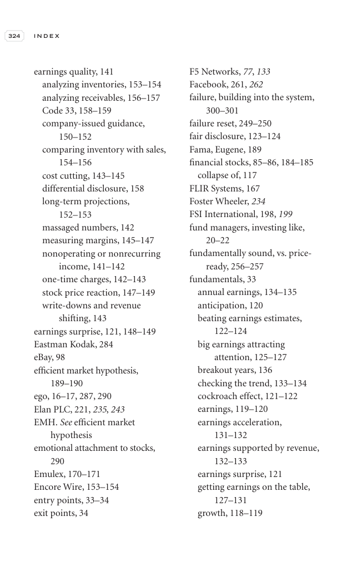

# Trade Like a Stock Market Wizard - Page Image 339

## Source Page

Book: [[Trade Like a Stock Market Wizard]]

## Page Read

Tags: pivot-or-entry, sell-or-failure, visual-concept-page

Concepts: [[Mental Discipline]], [[Pivot and Entry]], [[Sell Rules and Failure Signals]]

This is a visual teaching page without a clean ticker/date case. The useful work is to read the image as a concept illustration rather than forcing a market-data reconstruction.

## Linked Stock Figures

- No extracted stock-figure case on this page.

## Extracted Page Text Signal

324 I N D E X earnings quality, 141 analyzing inventories, 153-154 analyzing receivables, 156-157 Code 33, 158-159 company-issued guidance, 150-152 comparing inventory with sales, 154-156 cost cutting, 143-145 differential disclosure, 158 long-term projections, 152-153 massaged numbers, 142 measuring margins, 145-147 nonoperating or nonrecurring income, 141-142 one-time charges, 142-143 stock price reaction, 147-149 write-downs and revenue shifting, 143 earnings surprise, 121, 148-149 Eastman Ko...

## Manual Study Prompt

- What visual structure is the page trying to make obvious?
- Is the lesson about buying, avoiding, selling, or managing risk?
- If a ticker is not present, what generic behavior does the image teach?
- If a ticker is present, does the linked OHLCV rebuild confirm the same behavior?
