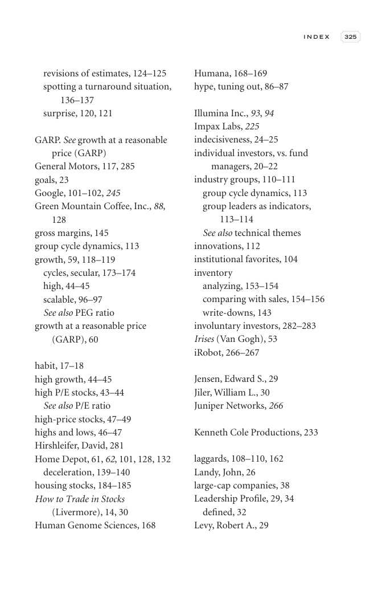

# Trade Like a Stock Market Wizard - Page Image 340

## Source Page

Book: [[Trade Like a Stock Market Wizard]]

## Page Read

Tags: visual-concept-page

Concepts: [[Mental Discipline]]

This is a visual teaching page without a clean ticker/date case. The useful work is to read the image as a concept illustration rather than forcing a market-data reconstruction.

## Linked Stock Figures

- No extracted stock-figure case on this page.

## Extracted Page Text Signal

I N D E X 325 revisions of estimates, 124-125 spotting a turnaround situation, 136-137 surprise, 120, 121 GARP. See growth at a reasonable price (GARP) General Motors, 117, 285 goals, 23 Google, 101-102, 245 Green Mountain Coffee, Inc., 88, 128 gross margins, 145 group cycle dynamics, 113 growth, 59, 118-119 cycles, secular, 173-174 high, 44-45 scalable, 96-97 See also PEG ratio growth at a reasonable price (GARP), 60 habit, 17-18 high growth, 44-45 high P/E stocks, 43-44 See also P/E ratio high...

## Manual Study Prompt

- What visual structure is the page trying to make obvious?
- Is the lesson about buying, avoiding, selling, or managing risk?
- If a ticker is not present, what generic behavior does the image teach?
- If a ticker is present, does the linked OHLCV rebuild confirm the same behavior?
