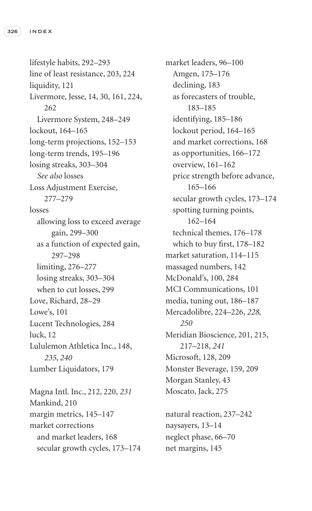

# Trade Like a Stock Market Wizard - Page Image 341

## Source Page

Book: [[Trade Like a Stock Market Wizard]]

## Page Read

Tags: visual-concept-page

Concepts: [[Mental Discipline]]

This is a visual teaching page without a clean ticker/date case. The useful work is to read the image as a concept illustration rather than forcing a market-data reconstruction.

## Linked Stock Figures

- No extracted stock-figure case on this page.

## Extracted Page Text Signal

326 I N D E X lifestyle habits, 292-293 line of least resistance, 203, 224 liquidity, 121 Livermore, Jesse, 14, 30, 161, 224, 262 Livermore System, 248-249 lockout, 164-165 long-term projections, 152-153 long-term trends, 195-196 losing streaks, 303-304 See also losses Loss Adjustment Exercise, 277-279 losses allowing loss to exceed average gain, 299-300 as a function of expected gain, 297-298 limiting, 276-277 losing streaks, 303-304 when to cut losses, 299 Love, Richard, 28-29 Lowe’s, 101 Luce...

## Manual Study Prompt

- What visual structure is the page trying to make obvious?
- Is the lesson about buying, avoiding, selling, or managing risk?
- If a ticker is not present, what generic behavior does the image teach?
- If a ticker is present, does the linked OHLCV rebuild confirm the same behavior?
