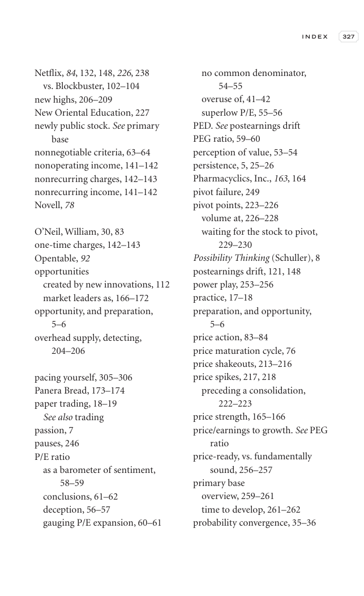

# Trade Like a Stock Market Wizard - Page Image 342

## Source Page

Book: [[Trade Like a Stock Market Wizard]]

## Page Read

Tags: pivot-or-entry, sell-or-failure, visual-concept-page, volume-behavior

Concepts: [[Mental Discipline]], [[Pivot and Entry]], [[Sell Rules and Failure Signals]], [[Volume Dry-Up and Accumulation]]

This is a visual teaching page without a clean ticker/date case. The useful work is to read the image as a concept illustration rather than forcing a market-data reconstruction.

## Linked Stock Figures

- No extracted stock-figure case on this page.

## Extracted Page Text Signal

I N D E X 327 Netflix, 84, 132, 148, 226, 238 vs. Blockbuster, 102-104 new highs, 206-209 New Oriental Education, 227 newly public stock. See primary base nonnegotiable criteria, 63-64 nonoperating income, 141-142 nonrecurring charges, 142-143 nonrecurring income, 141-142 Novell, 78 O’Neil, William, 30, 83 one-time charges, 142-143 Opentable, 92 opportunities created by new innovations, 112 market leaders as, 166-172 opportunity, and preparation, 5-6 overhead supply, detecting, 204-206 pacing you...

## Manual Study Prompt

- What visual structure is the page trying to make obvious?
- Is the lesson about buying, avoiding, selling, or managing risk?
- If a ticker is not present, what generic behavior does the image teach?
- If a ticker is present, does the linked OHLCV rebuild confirm the same behavior?
