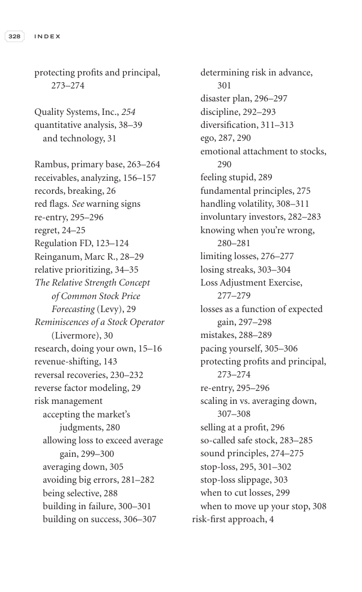

# Trade Like a Stock Market Wizard - Page Image 343

## Source Page

Book: [[Trade Like a Stock Market Wizard]]

## Page Read

Tags: mental-discipline, relative-strength, risk-first, sell-or-failure, visual-concept-page

Concepts: [[Mental Discipline]], [[Relative Strength Leadership]], [[Risk First]], [[Sell Rules and Failure Signals]]

This is a visual teaching page without a clean ticker/date case. The useful work is to read the image as a concept illustration rather than forcing a market-data reconstruction.

## Linked Stock Figures

- No extracted stock-figure case on this page.

## Extracted Page Text Signal

328 I N D E X protecting profits and principal, 273-274 Quality Systems, Inc., 254 quantitative analysis, 38-39 and technology, 31 Rambus, primary base, 263-264 receivables, analyzing, 156-157 records, breaking, 26 red flags. See warning signs re-entry, 295-296 regret, 24-25 Regulation FD, 123-124 Reinganum, Marc R., 28-29 relative prioritizing, 34-35 The Relative Strength Concept of Common Stock Price Forecasting (Levy), 29 Reminiscences of a Stock Operator (Livermore), 30 research, doing your ow...

## Manual Study Prompt

- What visual structure is the page trying to make obvious?
- Is the lesson about buying, avoiding, selling, or managing risk?
- If a ticker is not present, what generic behavior does the image teach?
- If a ticker is present, does the linked OHLCV rebuild confirm the same behavior?
