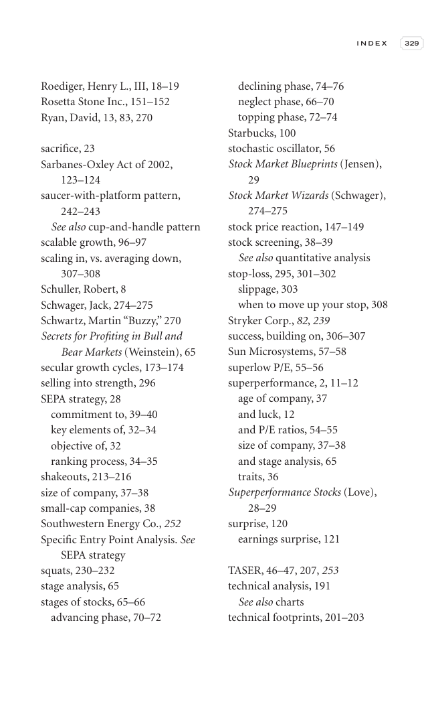

# Trade Like a Stock Market Wizard - Page Image 344

## Source Page

Book: [[Trade Like a Stock Market Wizard]]

## Page Read

Tags: risk-first, sell-or-failure, visual-concept-page

Concepts: [[Mental Discipline]], [[Risk First]], [[Sell Rules and Failure Signals]]

This is a visual teaching page without a clean ticker/date case. The useful work is to read the image as a concept illustration rather than forcing a market-data reconstruction.

## Linked Stock Figures

- No extracted stock-figure case on this page.

## Extracted Page Text Signal

I N D E X 329 Roediger, Henry L., III, 18-19 Rosetta Stone Inc., 151-152 Ryan, David, 13, 83, 270 sacrifice, 23 Sarbanes-Oxley Act of 2002, 123-124 saucer-with-platform pattern, 242-243 See also cup-and-handle pattern scalable growth, 96-97 scaling in, vs. averaging down, 307-308 Schuller, Robert, 8 Schwager, Jack, 274-275 Schwartz, Martin “Buzzy,” 270 Secrets for Profiting in Bull and Bear Markets (Weinstein), 65 secular growth cycles, 173-174 selling into strength, 296 SEPA strategy, 28 commitme...

## Manual Study Prompt

- What visual structure is the page trying to make obvious?
- Is the lesson about buying, avoiding, selling, or managing risk?
- If a ticker is not present, what generic behavior does the image teach?
- If a ticker is present, does the linked OHLCV rebuild confirm the same behavior?
