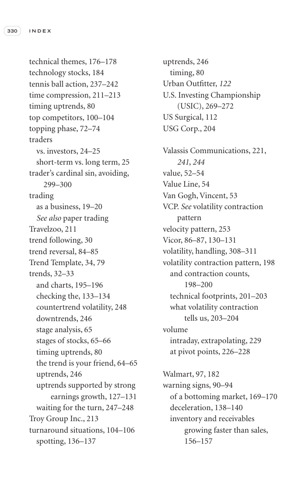

# Trade Like a Stock Market Wizard - Page Image 345

## Source Page

Book: [[Trade Like a Stock Market Wizard]]

## Page Read

Tags: pivot-or-entry, trend-template, vcp-or-tightening, visual-concept-page, volume-behavior

Concepts: [[Mental Discipline]], [[Pivot and Entry]], [[Trend Template]], [[Volatility Contraction Pattern]], [[Volume Dry-Up and Accumulation]]

This is a visual teaching page without a clean ticker/date case. The useful work is to read the image as a concept illustration rather than forcing a market-data reconstruction.

## Linked Stock Figures

- No extracted stock-figure case on this page.

## Extracted Page Text Signal

330 I N D E X technical themes, 176-178 technology stocks, 184 tennis ball action, 237-242 time compression, 211-213 timing uptrends, 80 top competitors, 100-104 topping phase, 72-74 traders vs. investors, 24-25 short-term vs. long term, 25 trader’s cardinal sin, avoiding, 299-300 trading as a business, 19-20 See also paper trading Travelzoo, 211 trend following, 30 trend reversal, 84-85 Trend Template, 34, 79 trends, 32-33 and charts, 195-196 checking the, 133-134 countertrend volatility, 248 d...

## Manual Study Prompt

- What visual structure is the page trying to make obvious?
- Is the lesson about buying, avoiding, selling, or managing risk?
- If a ticker is not present, what generic behavior does the image teach?
- If a ticker is present, does the linked OHLCV rebuild confirm the same behavior?
