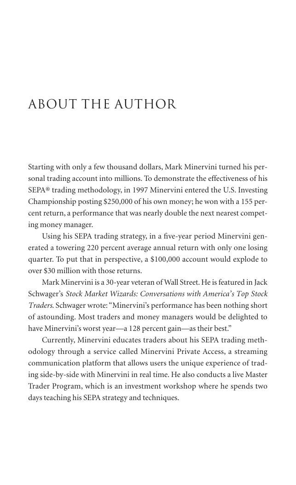

# Trade Like a Stock Market Wizard - Page Image 348

## Source Page

Book: [[Trade Like a Stock Market Wizard]]

## Page Read

Tags: visual-concept-page

Concepts: [[Mental Discipline]]

This is a visual teaching page without a clean ticker/date case. The useful work is to read the image as a concept illustration rather than forcing a market-data reconstruction.

## Linked Stock Figures

- No extracted stock-figure case on this page.

## Extracted Page Text Signal

About the Author Starting with only a few thousand dollars, Mark Minervini turned his per- sonal trading account into millions. To demonstrate the effectiveness of his SEPA® trading methodology, in 1997 Minervini entered the U.S. Investing Championship posting $250,000 of his own money; he won with a 155 per- cent return, a performance that was nearly double the next nearest compet- ing money manager. Using his SEPA trading strategy, in a five-year period Minervini gen- erated a towering 220 perc...

## Manual Study Prompt

- What visual structure is the page trying to make obvious?
- Is the lesson about buying, avoiding, selling, or managing risk?
- If a ticker is not present, what generic behavior does the image teach?
- If a ticker is present, does the linked OHLCV rebuild confirm the same behavior?
