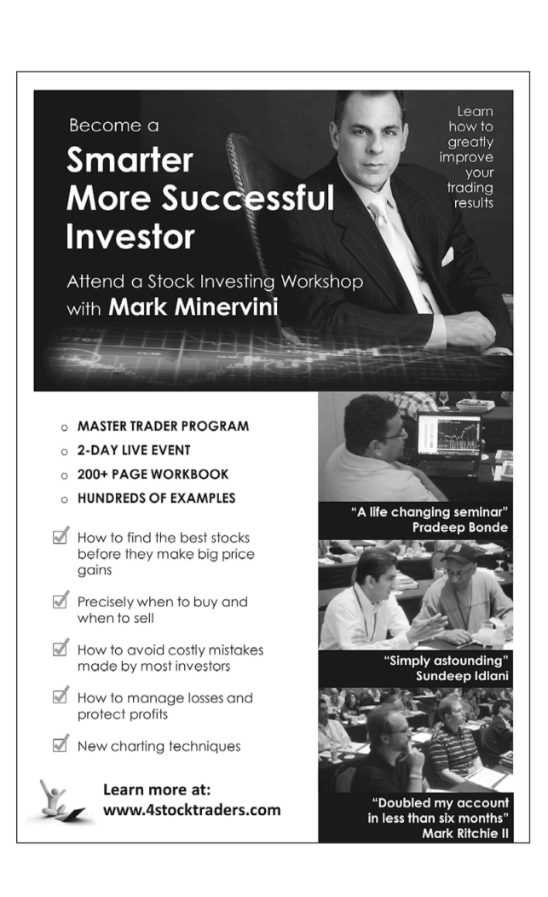

# Trade Like a Stock Market Wizard - Page Image 353

## Source Page

Book: [[Trade Like a Stock Market Wizard]]

## Page Read

Tags: mental-discipline, sell-or-failure, visual-concept-page

Concepts: [[Mental Discipline]], [[Sell Rules and Failure Signals]]

This is a visual teaching page without a clean ticker/date case. The useful work is to read the image as a concept illustration rather than forcing a market-data reconstruction.

## Linked Stock Figures

- No extracted stock-figure case on this page.

## Extracted Page Text Signal

MASTER TRADER PROGRAM 2-DAY LIVE EVENT 200+PAGE WORKBOOK HUNDREDS OF EXAMPLES How lo find the best stocks before they make big price gains Precisely when fo buy and when to sell How to avoid costly mistakes made by most investors How to manage losses and protect profits New charting techniques Learn more at: www.4stoc ktra ders.com BjHJH: ^^J^^^^^^^TJ ls4^Si3'i?:© c BuBBaj^BHL ^^^^^^^&^^^^^ Tiw3?iMB •! ^KV | ^~]^^^E I , ^fl£C ^^^^H ^H ^^H^^tS I^^^^^Hrm^^^^J ^Et ^^^^^Sm wT\\ gwlTTlLwJiifi i@~rW]T...

## Manual Study Prompt

- What visual structure is the page trying to make obvious?
- Is the lesson about buying, avoiding, selling, or managing risk?
- If a ticker is not present, what generic behavior does the image teach?
- If a ticker is present, does the linked OHLCV rebuild confirm the same behavior?
