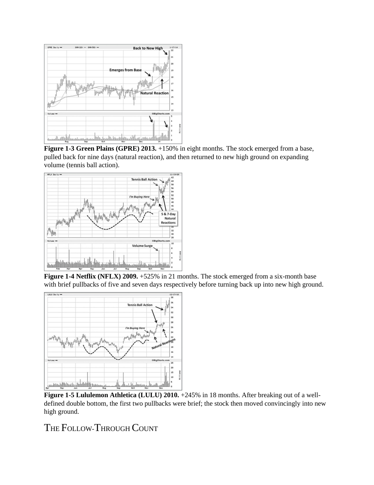
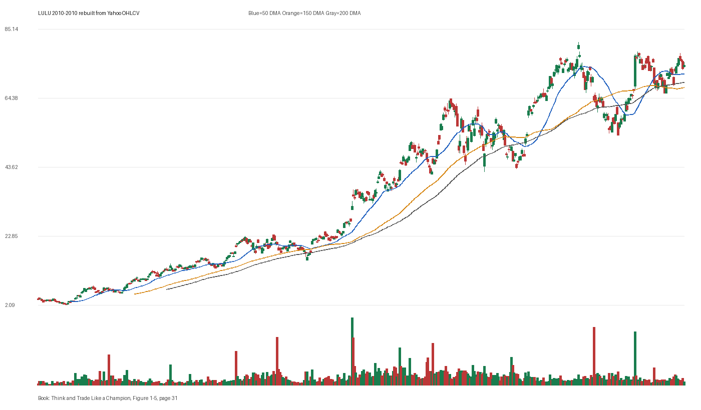

# Figure 1-5 - LULU - Page 31

## Source Image

Book: [[Think and Trade Like a Champion]]

Caption: Lululemon Athletica (LULU) 2010. +245% in 18 months. After breaking out of a well- defined double bottom, the first two pullbacks were brief; the stock then moved convincingly into new high ground. THE FOLLOW-THROUGH COUNT

## Yahoo OHLCV Rebuild

Download status: `OK`

CSV: `data/book_stock_images/think-and-trade-like-a-champion-figure-1-5-lulu-page-31_ohlcv.csv`

## Pattern Read

Tags: vcp-or-tightening, stage-2-leadership

Concepts: [[Pivot and Entry]], [[Relative Strength Leadership]], [[Stage 2 Uptrend]], [[Trend Template]], [[Volatility Contraction Pattern]], [[Volume Dry-Up and Accumulation]]

The useful clue is contraction: the later portion of the window became tighter than the earlier portion.

## Reconciliation Metrics

| Metric | Value |
|---|---:|
| first_close | 3.895 |
| last_close | 74.31 |
| max_gain_pct | 1981.9 |
| max_drawdown_from_period_high_pct | -49.0 |
| first_half_depth_pct | 1622.86 |
| second_half_depth_pct | 148.36 |
| tightening | True |
| volume_dryup | False |
| best_trend_template_score | 5/5 |
| latest_trend_template_score | 4/5 |

## Trend Template Checks

- close > 50 DMA
- close > 150 DMA
- close > 200 DMA
- 50 DMA > 150 DMA

## Study Questions

- Does the rebuilt OHLCV chart confirm the same structure shown in the book image?
- Was the stock close to a definable pivot, or already extended?
- Did volume dry up before the move, or was supply still obvious?
- Was this a buy lesson, a sell lesson, or a failure-avoidance lesson?
- What would invalidate the setup if this were being traded live?

<!-- STAGE_LIFECYCLE_START -->
## Stage Lifecycle & Base Concept Analysis
> This section analyzes the FULL LIFECYCLE of the stock around the inferred entry — Stage 1 (Accumulation), Stage 2 (Advance), Stage 3 (Distribution), Stage 4 (Decline) — plus deep base concept analysis, VCP footprint, tight footprint, supply dynamics, and contraction timeline.
- Status: `ok`
- Entry date: `2010-12-07`
- Entry price: `27.4650`
### Stage Lifecycle Overview
| Stage | Present | Start Date | End Date | Duration | Key Signal |
|---|---|---|---:|---|---|
| Stage 1 — Accumulation | ✅ | `2009-09-10` | `2010-09-10` | 252 days | Base: deep-chaotic |
| Stage 2 — Advance | ✅ | `2010-09-10` | `2011-06-29` | 202 days | Max gain: 181.8% |
| Stage 3 — Distribution | ❌ | — | — | — | Not detected |
| Stage 4 — Decline | ❌ | — | — | — | Not detected |
### Stage 1 — Accumulation / Base Building
- Base type: `deep-chaotic`
- Lowest price in base: `10.5000`
- Volume pattern: `late-supply`
### Stage 2 — Advance / Trend Pivots

- Number of significant pivots during advance: `4`

| Pivot Date | Price |
|---|---:|
| `2010-10-08` | `24.0000` |
| `2010-12-20` | `37.3000` |
| `2011-02-11` | `42.6400` |
| `2011-04-20` | `50.9900` |

#### Trend Template Evolution During Stage 2

| % Through Stage 2 | Date | Score |
|---|---|---:|
| 0% | `2010-09-10` | 7/7 |
| 25% | `2010-11-19` | 7/7 |
| 50% | `2011-02-03` | 7/7 |
| 75% | `2011-04-15` | 7/7 |
| 100% | `2011-06-29` | 7/7 |

### Base Concept Deep-Dive

- Base type: `deep-chaotic`
- Base duration: `63 sessions`
- Base depth: `57.6%`
- Base high: `28.0600`
- Base low: `17.8100`
- Resistance touches at base high: `2`
- Support touches at base low: `1`
- Contraction count: `4`
- Contraction quality: `mixed-or-loose`
- Pivot clarity: `near-pivot`
- Pivot distance at entry: `-2.1%`
- Volume dry-up in base: `neutral`
- Volume dry-up ratio: `0.98`
- Tightness at pivot (10d): `3.5%`
- Weekly tightness: `2.9%`

### VCP Footprint

- VCP present: `True`
- VCP quality: `mixed`
- Total contraction depth: `30.8%`
- Final contraction depth: `20.7%`
- Number of contractions: `4`

| Phase | Date | Depth | Volume | Tightness |
|---|---|---:|---:|---:|
| C? | `2010-09-09` | 30.8% | 1783200.0 | 8.9% |
| C? | `2010-09-30` | 12.9% | 2215200.0 | 9.6% |
| C? | `2010-10-21` | 16.9% | 1758800.0 | 12.3% |
| C? | `2010-11-11` | 20.7% | 1811400.0 | 11.9% |

### Tight Footprint

- 10-session tightness at entry: `3.8%`
- 20-session tightness at entry: `18.3%`
- Weekly tightness: `3.5%`
- ATR20 %: `3.13`
- Tightness progression: `improving`

### Supply Analysis

- Supply label: `neutral`
- Volume dry-up ratio: `1.0`
- Distribution volume detected: `False`
- Accumulation volume detected: `False`
- Climax volume dates: `2010-11-05`

### Contraction Timeline

| Phase | Start Date | Depth | Volume | Tightness |
|---|---|---:|---:|---:|
| C1 | `2010-09-09` | 30.8% | 1783200.0 | 8.9% |
| C2 | `2010-09-30` | 12.9% | 2215200.0 | 9.6% |
| C3 | `2010-10-21` | 16.9% | 1758800.0 | 12.3% |
| C4 | `2010-11-11` | 20.7% | 1811400.0 | 11.9% |

### Concept Tie-Back

- Related concepts: [[Base Concept]], [[Stage 2 Uptrend]], [[Trend Template]], [[Volatility Contraction Pattern]], [[Pivot and Entry]]
- Lesson: Stage 1 base was deep-chaotic with 121.4% depth. Stage 2 advance lasted 203 sessions with 4 significant pivots. VCP footprint shows 4 contractions with mixed quality.

<!-- STAGE_LIFECYCLE_END -->
<!-- PRE_ENTRY_SENSE_CHECK_START -->

## Pre-Entry Sense Check

> This section analyzes the chart structure PRIOR to the inferred entry. It answers: What did the setup look like in the weeks and months before the trade? Which Minervini concepts were already visible?

- Status: `ok`
- Entry date: `2010-12-07`
- Pre-entry history available: `388 sessions`

### Trend Template Evolution

| Lookback | Date | Score | Assessment |
|---|---|---:|:---|
| 60 days before | 2010-09-13 | 7/7 | ✅ Stage 2 confirmed |
| 40 days before | 2010-10-11 | 7/7 | ✅ Stage 2 confirmed |
| 20 days before | 2010-11-08 | 7/7 | ✅ Stage 2 confirmed |

### Pre-Entry Context Window

- Context window (last sessions before entry): `150 sessions`
- Range high: `27.8100`
- Range low: `15.5400`
- Total range depth: `79.0%`
- Contraction phases (rolling 21-bar segments): `24.9% -> 30.0% -> 21.7% -> 31.3% -> 38.0% -> 13.9% -> 24.9%`

### Stage 2 Onset

- First sustained Stage 2 date: `2010-03-11`
- Days in Stage 2 before entry: `188`

### Volume Behavior Before Entry

- Volume dry-up label: `neutral`
- Recent/base volume ratio: `1.0`
- Volume spike dates (2.5x avg) in last 40 days: `2010-11-05`

### Tightness Progression

| Lookback | 10-Session Close Tightness |
|---|---:|
| 40 days before | `9.8%` |
| 20 days before | `9.0%` |
| Final 10 sessions before | `3.8%` |
| Final 3 weekly closes | `3.5%` |

### Moving Average Alignment

- 50/150/200 DMA first aligned (50>150>200): `2010-03-11`

### Shakeouts / Tests Before Entry

- No shakeouts or undercut-recover patterns detected in last 40 sessions before entry.

### 52-Week High Context

| Timing | Distance from 52W High |
|---|---:|
| 60 days before | `-8.3%` |
| 20 days before | `-0.4%` |
| At entry | `-2.1%` |

### Concept Tie-Back

- Related concepts: [[Stage 2 Uptrend]], [[Trend Template]], [[Relative Strength Leadership]]
- Lesson: Stage 2 was established 188 days before entry, confirming leadership context. Total pre-entry range was 79.0% — wide range indicating significant prior movement. Volume did not show clear dry-up — supply may still be present.

<!-- PRE_ENTRY_SENSE_CHECK_END -->
<!-- SEPA_REPLICATION_START -->

## SEPA Trade Replication

> Study note: this reconstructs a likely Minervini-style setup area from the real OHLCV window shown by the book timing. It does not claim to know Minervini's private fill, sizing, or unpublished execution.

- Status: `reconstructed-from-real-ohlcv`
- Setup type: `vcp/contraction-study`
- Confidence: `high`
- Timing source: `2010-2010` from the figure caption and rebuilt OHLCV where available.
- Inferred study entry date: `2010-12-07`
- Inferred study entry price: `27.4650`
- Inferred pivot: `27.8100`
- Inferred stop / invalidation: `22.7300`
- Pivot extension at entry: `-1.2%`
- Stop distance / risk: `20.8%`
- Trend Template score at entry: `7/7`

### Tightness And Supply
- 3-part pre-entry contraction depth: `32.3% -> 13.9% -> 24.0%`
- Contraction quality: `mixed-or-loose`
- 10-session close tightness: `3.8%`
- 3-week close tightness: `3.5%`
- Volume dry-up: `neutral`
- Recent/base median volume ratio: `1.0`
- Leadership proxy: 65-day return 56.5% and 126-day return 40.5%

### Post-Entry Reality Check
- Max gain after 20 sessions: `35.8%`
- Max gain after 60 sessions: `55.3%`
- Max gain after 120 sessions: `87.2%`
- Worst drawdown after 20 sessions: `-0.6%`
- Inferred stop failed within 20 sessions: `False`
- Pivot broadly respected within 20 sessions: `True`

### Concept Tie-Back

- Related concepts: [[Risk First]], [[Volatility Contraction Pattern]], [[Volume Dry-Up and Accumulation]], [[Pivot and Entry]], [[Trend Template]], [[Stage 2 Uptrend]], [[Relative Strength Leadership]]
- Lesson: The reconstructed data suggests the structure still had loose or mixed contraction behavior; risk was wide, so the entry would need smaller size or a better cheat point; the pivot was broadly respected after entry.

<!-- SEPA_REPLICATION_END -->
