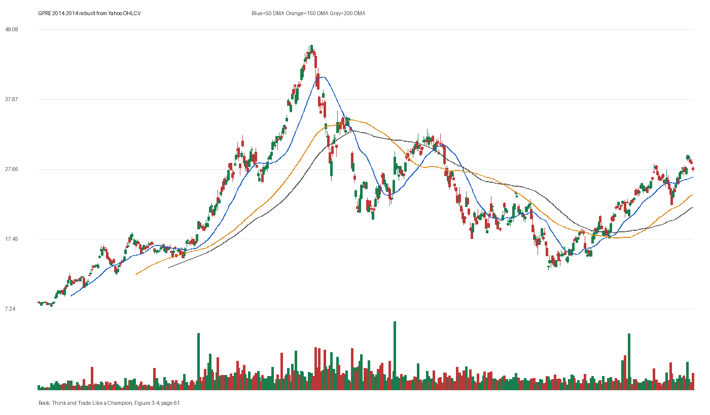

# Figure 3-4 - GPRE - Page 61

## Source Image

Book: [[Think and Trade Like a Champion]]

Caption: Green Plains (GPRE) 2014. +150% in eight months. The stock broke out and then experienced a natural reaction. The price then moved into new high ground, taking out the natural reaction high and attaining a decent profit. That’s a good time to raise your stop. ADDING EXPOSURE WITHOUT ADDING RISK I like to try and make as much as I can on a winning stock position. As a result, I get creative with the ways I pyramid and

## Yahoo OHLCV Rebuild

Download status: `OK`

CSV: `data/book_stock_images/think-and-trade-like-a-champion-figure-3-4-gpre-page-61_ohlcv.csv`

## Pattern Read

Tags: vcp-or-tightening, stage-2-leadership

Concepts: [[Pivot and Entry]], [[Relative Strength Leadership]], [[Stage 2 Uptrend]], [[Trend Template]], [[Volatility Contraction Pattern]], [[Volume Dry-Up and Accumulation]]

The useful clue is contraction: the later portion of the window became tighter than the earlier portion.

## Reconciliation Metrics

| Metric | Value |
|---|---:|
| first_close | 8.22 |
| last_close | 27.85 |
| max_gain_pct | 463.02 |
| max_drawdown_from_period_high_pct | -73.23 |
| first_half_depth_pct | 516.24 |
| second_half_depth_pct | 174.82 |
| tightening | True |
| volume_dryup | False |
| best_trend_template_score | 5/5 |
| latest_trend_template_score | 5/5 |

## Trend Template Checks

- close > 50 DMA
- close > 150 DMA
- close > 200 DMA
- 50 DMA > 150 DMA
- 150 DMA > 200 DMA

## Study Questions

- Does the rebuilt OHLCV chart confirm the same structure shown in the book image?
- Was the stock close to a definable pivot, or already extended?
- Did volume dry up before the move, or was supply still obvious?
- Was this a buy lesson, a sell lesson, or a failure-avoidance lesson?
- What would invalidate the setup if this were being traded live?

<!-- STAGE_LIFECYCLE_START -->
## Stage Lifecycle & Base Concept Analysis
> This section analyzes the FULL LIFECYCLE of the stock around the inferred entry — Stage 1 (Accumulation), Stage 2 (Advance), Stage 3 (Distribution), Stage 4 (Decline) — plus deep base concept analysis, VCP footprint, tight footprint, supply dynamics, and contraction timeline.
- Status: `ok`
- Entry date: `2014-09-04`
- Entry price: `45.0800`
### Stage Lifecycle Overview
| Stage | Present | Start Date | End Date | Duration | Key Signal |
|---|---|---|---:|---|---|
| Stage 1 — Accumulation | ✅ | `2013-05-28` | `2014-03-13` | 200 days | Base: deep-chaotic |
| Stage 2 — Advance | ✅ | `2014-03-13` | `2014-10-01` | 140 days | Max gain: 71.9% |
| Stage 3 — Distribution | ✅ | `2014-11-19` | `2014-11-26` | 5 days | no climax |
| Stage 4 — Decline | ✅ | `2014-11-28` | — | 145 days | Below 200 DMA: False |
### Stage 1 — Accumulation / Base Building
- Base type: `deep-chaotic`
- Lowest price in base: `11.9200`
- Volume pattern: `late-supply`
### Stage 2 — Advance / Trend Pivots

- Number of significant pivots during advance: `1`

| Pivot Date | Price |
|---|---:|
| `2014-04-22` | `30.7500` |

#### Trend Template Evolution During Stage 2

| % Through Stage 2 | Date | Score |
|---|---|---:|
| 0% | `2014-03-13` | 7/7 |
| 25% | `2014-05-02` | 7/7 |
| 50% | `2014-06-23` | 7/7 |
| 75% | `2014-08-12` | 7/7 |
| 100% | `2014-10-01` | 6/7 |

### Base Concept Deep-Dive

- Base type: `deep-chaotic`
- Base duration: `123 sessions`
- Base depth: `80.6%`
- Base high: `46.2800`
- Base low: `25.6200`
- Resistance touches at base high: `4`
- Support touches at base low: `5`
- Contraction count: `5`
- Contraction quality: `mixed-or-loose`
- Pivot clarity: `near-pivot`
- Pivot distance at entry: `-2.6%`
- Volume dry-up in base: `moderate-dry-up`
- Volume dry-up ratio: `0.64`
- Tightness at pivot (10d): `4.4%`
- Weekly tightness: `2.2%`

### VCP Footprint

- VCP present: `False`
- No clear VCP pattern detected in the base.

### Tight Footprint

- 10-session tightness at entry: `4.4%`
- 20-session tightness at entry: `15.1%`
- Weekly tightness: `3.7%`
- ATR20 %: `2.97`
- Tightness progression: `improving`

### Supply Analysis

- Supply label: `diminishing`
- Volume dry-up ratio: `0.66`
- Distribution volume detected: `False`
- Accumulation volume detected: `True`
- Climax volume dates: `2014-07-30`

### Contraction Timeline

| Phase | Start Date | Depth | Volume | Tightness |
|---|---|---:|---:|---:|
| C1 | `2014-03-12` | 25.2% | 1053100.0 | 16.3% |
| C2 | `2014-04-15` | 20.9% | 946900.0 | 7.8% |
| C3 | `2014-05-20` | 21.2% | 783800.0 | 4.5% |
| C4 | `2014-06-24` | 26.0% | 1064900.0 | 10.2% |
| C5 | `2014-07-29` | 23.5% | 1065750.0 | 3.5% |

### Concept Tie-Back

- Related concepts: [[Base Concept]], [[Stage 2 Uptrend]], [[Trend Template]], [[Stage 3 Distribution]], [[Stage 4 Decline]], [[Volume Dry-Up and Accumulation]], [[Supply and Demand]]
- Lesson: Stage 1 base was deep-chaotic with 142.2% depth. Stage 2 advance lasted 141 sessions with 1 significant pivots. Supply was diminishing before entry.

<!-- STAGE_LIFECYCLE_END -->
<!-- PRE_ENTRY_SENSE_CHECK_START -->

## Pre-Entry Sense Check

> This section analyzes the chart structure PRIOR to the inferred entry. It answers: What did the setup look like in the weeks and months before the trade? Which Minervini concepts were already visible?

- Status: `ok`
- Entry date: `2014-09-04`
- Pre-entry history available: `321 sessions`

### Trend Template Evolution

| Lookback | Date | Score | Assessment |
|---|---|---:|:---|
| 60 days before | 2014-06-10 | 7/7 | ✅ Stage 2 confirmed |
| 40 days before | 2014-07-09 | 7/7 | ✅ Stage 2 confirmed |
| 20 days before | 2014-08-06 | 7/7 | ✅ Stage 2 confirmed |

### Pre-Entry Context Window

- Context window (last sessions before entry): `150 sessions`
- Range high: `45.7900`
- Range low: `21.5100`
- Total range depth: `112.9%`
- Contraction phases (rolling 21-bar segments): `24.2% -> 22.2% -> 22.7% -> 19.8% -> 17.6% -> 22.9% -> 22.7%`

### Stage 2 Onset

- First sustained Stage 2 date: `2014-03-13`
- Days in Stage 2 before entry: `121`

### Volume Behavior Before Entry

- Volume dry-up label: `moderate-dry-up`
- Recent/base volume ratio: `0.66`
- No significant volume spikes in last 40 days before entry.

### Tightness Progression

| Lookback | 10-Session Close Tightness |
|---|---:|
| 40 days before | `5.8%` |
| 20 days before | `7.3%` |
| Final 10 sessions before | `4.4%` |
| Final 3 weekly closes | `3.7%` |

### Moving Average Alignment

- 50/150/200 DMA first aligned (50>150>200): `2014-03-13`

### Shakeouts / Tests Before Entry

- No shakeouts or undercut-recover patterns detected in last 40 sessions before entry.

### 52-Week High Context

| Timing | Distance from 52W High |
|---|---:|
| 60 days before | `-4.4%` |
| 20 days before | `-2.3%` |
| At entry | `-2.6%` |

### Concept Tie-Back

- Related concepts: [[Stage 2 Uptrend]], [[Trend Template]], [[Relative Strength Leadership]], [[Volume Dry-Up and Accumulation]]
- Lesson: Stage 2 was established 121 days before entry, confirming leadership context. Total pre-entry range was 112.9% — wide range indicating significant prior movement. Volume dried up before entry, suggesting supply absorption.

<!-- PRE_ENTRY_SENSE_CHECK_END -->
<!-- SEPA_REPLICATION_START -->

## SEPA Trade Replication

> Study note: this reconstructs a likely Minervini-style setup area from the real OHLCV window shown by the book timing. It does not claim to know Minervini's private fill, sizing, or unpublished execution.

- Status: `reconstructed-from-real-ohlcv`
- Setup type: `vcp/contraction-study`
- Confidence: `high`
- Timing source: `2014-2014` from the figure caption and rebuilt OHLCV where available.
- Inferred study entry date: `2014-09-04`
- Inferred study entry price: `45.0800`
- Inferred pivot: `45.7900`
- Inferred stop / invalidation: `41.0100`
- Pivot extension at entry: `-1.6%`
- Stop distance / risk: `9.9%`
- Trend Template score at entry: `7/7`

### Tightness And Supply
- 3-part pre-entry contraction depth: `19.1% -> 24.3% -> 16.4%`
- Contraction quality: `mixed-or-loose`
- 10-session close tightness: `4.4%`
- 3-week close tightness: `3.7%`
- Volume dry-up: `moderate-dry-up`
- Recent/base median volume ratio: `0.66`
- Leadership proxy: 65-day return 52.1% and 126-day return 59.8%

### Post-Entry Reality Check
- Max gain after 20 sessions: `0.6%`
- Max gain after 60 sessions: `0.6%`
- Max gain after 120 sessions: `0.6%`
- Worst drawdown after 20 sessions: `-28.6%`
- Inferred stop failed within 20 sessions: `True`
- Pivot broadly respected within 20 sessions: `False`

### Concept Tie-Back

- Related concepts: [[Risk First]], [[Volatility Contraction Pattern]], [[Volume Dry-Up and Accumulation]], [[Pivot and Entry]], [[Trend Template]], [[Stage 2 Uptrend]], [[Relative Strength Leadership]]
- Lesson: The reconstructed data suggests the structure still had loose or mixed contraction behavior; volume supported the supply-dry-up idea; risk was acceptable but not ideal; post-entry behavior violated the inferred stop within 20 sessions.

<!-- SEPA_REPLICATION_END -->
