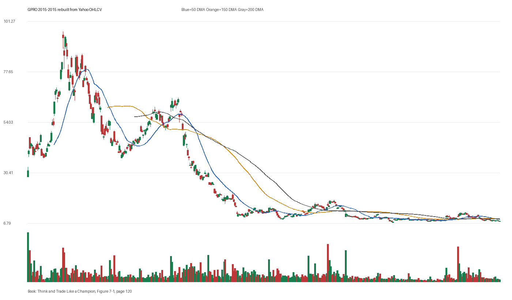

# Figure 7-1 - GPRO - Page 120

## Source Image

Book: [[Think and Trade Like a Champion]]

Caption: GoPro (GPRO) 2015. The stock fell from above $98 a share to under $9. Through the entire decline, the stock was never once in a Stage 2 uptrend. GoPro is a cautionary tale for traders who fall in love with a stock too easily. Everybody loved GoPro when it topped $90 and looked like it was heading to $100 and beyond. And when it went down, everybody loved it even more, thinking it was only a matter of time before it r

## Yahoo OHLCV Rebuild

Download status: `OK`

CSV: `data/book_stock_images/think-and-trade-like-a-champion-figure-7-1-gpro-page-120_ohlcv.csv`

## Pattern Read

Tags: vcp-or-tightening, volume-dry-up, failed-breakout-or-stage-4

Concepts: [[Pivot and Entry]], [[Risk First]], [[Sell Rules and Failure Signals]], [[Trend Template]], [[Volatility Contraction Pattern]], [[Volume Dry-Up and Accumulation]]

The useful clue is contraction: the later portion of the window became tighter than the earlier portion. The sell lesson dominates: when price breaks character, the chart can warn before fundamentals are obvious. Volume contraction supports the idea that supply was drying up near the tight area.

## Reconciliation Metrics

| Metric | Value |
|---|---:|
| first_close | 31.34 |
| last_close | 7.57 |
| max_gain_pct | 214.2 |
| max_drawdown_from_period_high_pct | -92.74 |
| first_half_depth_pct | 992.9 |
| second_half_depth_pct | 147.45 |
| tightening | True |
| volume_dryup | True |
| best_trend_template_score | 5/5 |
| latest_trend_template_score | 1/5 |

## Trend Template Checks

- 150 DMA > 200 DMA

## Study Questions

- Does the rebuilt OHLCV chart confirm the same structure shown in the book image?
- Was the stock close to a definable pivot, or already extended?
- Did volume dry up before the move, or was supply still obvious?
- Was this a buy lesson, a sell lesson, or a failure-avoidance lesson?
- What would invalidate the setup if this were being traded live?

<!-- STAGE_LIFECYCLE_START -->

## Stage Lifecycle & Base Concept Analysis

> This section analyzes the FULL LIFECYCLE of the stock around the inferred entry — Stage 1 (Accumulation), Stage 2 (Advance), Stage 3 (Distribution), Stage 4 (Decline) — plus deep base concept analysis, VCP footprint, tight footprint, supply dynamics, and contraction timeline.

- Status: `ok`
- Entry date: `2015-08-10`
- Entry price: `64.7400`

### Stage Lifecycle Overview

| Stage | Present | Start Date | End Date | Duration | Key Signal |
|---|---|---|---:|---|---|
| Stage 1 — Accumulation | ❌ | — | — | — | Not detected |
| Stage 2 — Advance | ❌ | — | — | — | Not detected |
| Stage 3 — Distribution | ❌ | — | — | — | Not detected |
| Stage 4 — Decline | ❌ | — | — | — | Not detected |

### Base Concept Deep-Dive

- Base type: `deep-chaotic`
- Base duration: `151 sessions`
- Base depth: `84.5%`
- Base high: `68.5000`
- Base low: `37.1300`
- Resistance touches at base high: `2`
- Support touches at base low: `4`
- Contraction count: `5`
- Contraction quality: `constructive-tightening`
- Pivot clarity: `below-pivot-caution`
- Pivot distance at entry: `-5.5%`
- Volume dry-up in base: `neutral`
- Volume dry-up ratio: `1.02`
- Tightness at pivot (10d): `4.9%`
- Weekly tightness: `4.3%`

### VCP Footprint

- VCP present: `True`
- VCP quality: `constructive-tightening`
- Total contraction depth: `60.6%`
- Final contraction depth: `32.1%`
- Number of contractions: `5`

| Phase | Date | Depth | Volume | Tightness |
|---|---|---:|---:|---:|
| C? | `2015-01-05` | 60.6% | 5372350.0 | 24.6% |
| C? | `2015-02-18` | 34.6% | 4937600.0 | 10.2% |
| C? | `2015-04-01` | 33.9% | 4127600.0 | 5.2% |
| C? | `2015-05-14` | 23.5% | 4458550.0 | 7.4% |
| C? | `2015-06-26` | 32.1% | 5095650.0 | 2.9% |

### Tight Footprint

- 10-session tightness at entry: `2.9%`
- 20-session tightness at entry: `22.7%`
- Weekly tightness: `1.5%`
- ATR20 %: `4.01`
- Tightness progression: `improving`

### Supply Analysis

- Supply label: `neutral`
- Volume dry-up ratio: `1.02`
- Distribution volume detected: `False`
- Accumulation volume detected: `False`
- Climax volume dates: `2015-07-21, 2015-07-22, 2015-07-23`

### Contraction Timeline

| Phase | Start Date | Depth | Volume | Tightness |
|---|---|---:|---:|---:|
| C1 | `2015-01-05` | 60.6% | 5372350.0 | 24.6% |
| C2 | `2015-02-18` | 34.6% | 4937600.0 | 10.2% |
| C3 | `2015-04-01` | 33.9% | 4127600.0 | 5.2% |
| C4 | `2015-05-14` | 23.5% | 4458550.0 | 7.4% |
| C5 | `2015-06-26` | 32.1% | 5095650.0 | 2.9% |

### Concept Tie-Back

- Related concepts: [[Volatility Contraction Pattern]], [[Pivot and Entry]]
- Lesson: VCP footprint shows 5 contractions with constructive-tightening quality.

<!-- STAGE_LIFECYCLE_END -->
<!-- PRE_ENTRY_SENSE_CHECK_START -->

## Pre-Entry Sense Check

> This section analyzes the chart structure PRIOR to the inferred entry. It answers: What did the setup look like in the weeks and months before the trade? Which Minervini concepts were already visible?

- Status: `ok`
- Entry date: `2015-08-10`
- Pre-entry history available: `282 sessions`

### Trend Template Evolution

| Lookback | Date | Score | Assessment |
|---|---|---:|:---|
| 60 days before | 2015-05-14 | 3/7 | 🔴 Not yet Stage 2 |
| 40 days before | 2015-06-12 | 4/7 | 🟡 Transitioning |
| 20 days before | 2015-07-13 | 2/7 | 🔴 Not yet Stage 2 |

### Pre-Entry Context Window

- Context window (last sessions before entry): `150 sessions`
- Range high: `68.5000`
- Range low: `37.1300`
- Total range depth: `84.5%`
- Contraction phases (rolling 21-bar segments): `51.0% -> 38.3% -> 19.7% -> 26.4% -> 30.0% -> 23.9% -> 29.6%`

### Stage 2 Onset

- First sustained Stage 2 date: `2015-06-01`
- Days in Stage 2 before entry: `49`

### Volume Behavior Before Entry

- Volume dry-up label: `neutral`
- Recent/base volume ratio: `1.02`
- Volume spike dates (2.5x avg) in last 40 days: `2015-07-20, 2015-07-21, 2015-07-22`

### Tightness Progression

| Lookback | 10-Session Close Tightness |
|---|---:|
| 40 days before | `7.1%` |
| 20 days before | `6.3%` |
| Final 10 sessions before | `2.9%` |
| Final 3 weekly closes | `1.5%` |

### Moving Average Alignment

- 50/150/200 DMA alignment: `not achieved before entry`

### Shakeouts / Tests Before Entry

- No shakeouts or undercut-recover patterns detected in last 40 sessions before entry.

### 52-Week High Context

| Timing | Distance from 52W High |
|---|---:|
| 60 days before | `N/A` |
| 20 days before | `-47.1%` |
| At entry | `-34.3%` |

### Concept Tie-Back

- Related concepts: [[Stage 2 Uptrend]], [[Trend Template]], [[Relative Strength Leadership]], [[Volatility Contraction Pattern]], [[Pivot and Entry]], [[Sell Rules and Failure Signals]]
- Lesson: Stage 2 was established 49 days before entry, confirming leadership context. Total pre-entry range was 84.5% — wide range indicating significant prior movement. Volume did not show clear dry-up — supply may still be present.

<!-- PRE_ENTRY_SENSE_CHECK_END -->
<!-- SEPA_REPLICATION_START -->

## SEPA Trade Replication

> Study note: this reconstructs a likely Minervini-style setup area from the real OHLCV window shown by the book timing. It does not claim to know Minervini's private fill, sizing, or unpublished execution.

- Status: `reconstructed-from-real-ohlcv`
- Setup type: `failure/sell-rule-study`
- Confidence: `high`
- Timing source: `2015-2015` from the figure caption and rebuilt OHLCV where available.
- Inferred study entry date: `2015-08-10`
- Inferred study entry price: `64.7400`
- Inferred pivot: `65.2500`
- Inferred stop / invalidation: `57.9100`
- Pivot extension at entry: `-0.8%`
- Stop distance / risk: `11.8%`
- Trend Template score at entry: `4/7`

### Tightness And Supply
- 3-part pre-entry contraction depth: `28.2% -> 20.9% -> 27.6%`
- Contraction quality: `mixed-or-loose`
- 10-session close tightness: `2.9%`
- 3-week close tightness: `1.5%`
- Volume dry-up: `neutral`
- Recent/base median volume ratio: `1.02`
- Leadership proxy: 65-day return 30.7% and 126-day return 45.5%

### Post-Entry Reality Check
- Max gain after 20 sessions: `-1.0%`
- Max gain after 60 sessions: `-1.0%`
- Max gain after 120 sessions: `-1.0%`
- Worst drawdown after 20 sessions: `-43.8%`
- Inferred stop failed within 20 sessions: `True`
- Pivot broadly respected within 20 sessions: `False`

### Concept Tie-Back

- Related concepts: [[Risk First]], [[Sell Rules and Failure Signals]], [[Trend Template]], [[Stage 2 Uptrend]], [[Relative Strength Leadership]]
- Lesson: Treat this as a sell-rule and failure-recognition study. The important lesson is whether the stock could hold the pivot/base after demand supposedly appeared; a quick loss of the pivot changes the case from entry to defense.

<!-- SEPA_REPLICATION_END -->
