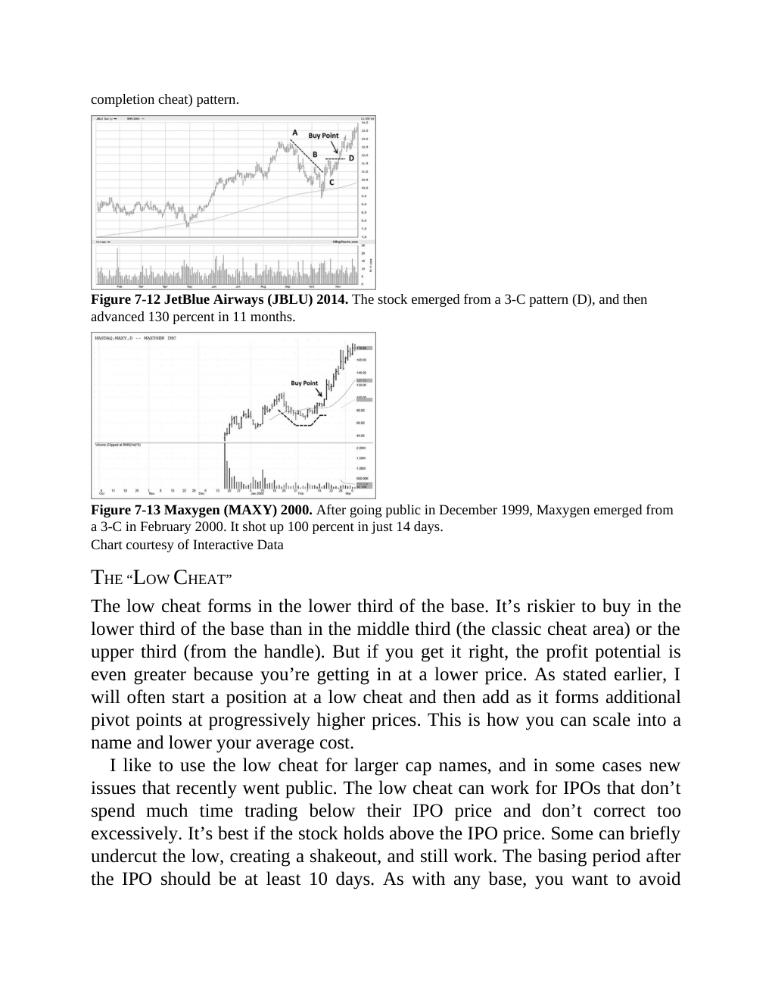
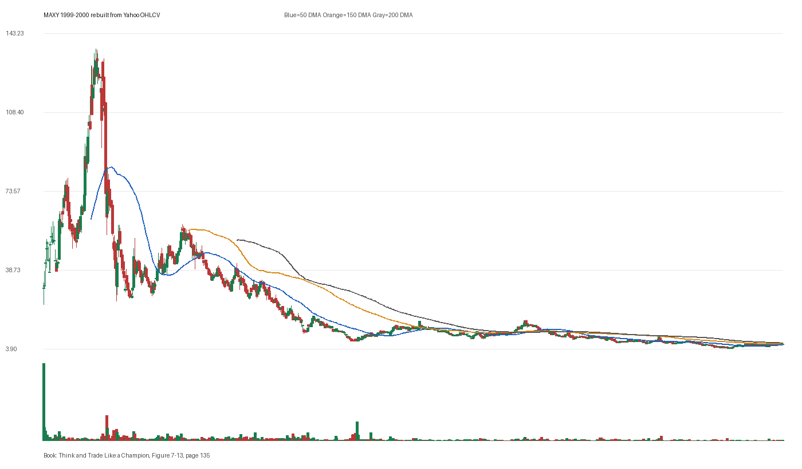

# Figure 7-13 - MAXY - Page 135

## Source Image

Book: [[Think and Trade Like a Champion]]

Caption: Maxygen (MAXY) 2000. After going public in December 1999, Maxygen emerged from a 3-C in February 2000. It shot up 100 percent in just 14 days. Chart courtesy of Interactive Data THE “LOW CHEAT” The low cheat forms in the lower third of the base. It’s riskier to buy in the lower third of the base than in the middle third (the classic cheat area) or the upper third (from the handle). But if you get it right, the profit

## Yahoo OHLCV Rebuild

Download status: `OK`

CSV: `data/book_stock_images/think-and-trade-like-a-champion-figure-7-13-maxy-page-135_ohlcv.csv`

## Pattern Read

Tags: vcp-or-tightening, pivot-breakout, cheat-entry, volume-dry-up, stage-2-leadership

Concepts: [[Pivot and Entry]], [[Relative Strength Leadership]], [[Stage 2 Uptrend]], [[Trend Template]], [[Volatility Contraction Pattern]], [[Volume Dry-Up and Accumulation]]

The useful clue is contraction: the later portion of the window became tighter than the earlier portion. The entry lesson is to define the pivot first, then judge whether the real OHLCV breakout left controllable risk. Volume contraction supports the idea that supply was drying up near the tight area.

## Reconciliation Metrics

| Metric | Value |
|---|---:|
| first_close | 30.8484 |
| last_close | 5.9404 |
| max_gain_pct | 342.19 |
| max_drawdown_from_period_high_pct | -96.99 |
| first_half_depth_pct | 1771.61 |
| second_half_depth_pct | 302.32 |
| tightening | True |
| volume_dryup | True |
| best_trend_template_score | 5/5 |
| latest_trend_template_score | 1/5 |

## Trend Template Checks

- close > 50 DMA

## Study Questions

- Does the rebuilt OHLCV chart confirm the same structure shown in the book image?
- Was the stock close to a definable pivot, or already extended?
- Did volume dry up before the move, or was supply still obvious?
- Was this a buy lesson, a sell lesson, or a failure-avoidance lesson?
- What would invalidate the setup if this were being traded live?

<!-- STAGE_LIFECYCLE_START -->

## Stage Lifecycle & Base Concept Analysis

> This section analyzes the FULL LIFECYCLE of the stock around the inferred entry — Stage 1 (Accumulation), Stage 2 (Advance), Stage 3 (Distribution), Stage 4 (Decline) — plus deep base concept analysis, VCP footprint, tight footprint, supply dynamics, and contraction timeline.

- Status: `ok`
- Entry date: `2000-07-28`
- Entry price: `45.3555`

### Stage Lifecycle Overview

| Stage | Present | Start Date | End Date | Duration | Key Signal |
|---|---|---|---:|---|---|
| Stage 1 — Accumulation | ❌ | — | — | — | Not detected |
| Stage 2 — Advance | ❌ | — | — | — | Not detected |
| Stage 3 — Distribution | ❌ | — | — | — | Not detected |
| Stage 4 — Decline | ❌ | — | — | — | Not detected |

### Base Concept Deep-Dive

- Base type: `deep-chaotic`
- Base duration: `151 sessions`
- Base depth: `447.1%`
- Base high: `136.41`
- Base low: `24.9400`
- Resistance touches at base high: `4`
- Support touches at base low: `1`
- Contraction count: `5`
- Contraction quality: `constructive-tightening`
- Pivot clarity: `below-pivot-caution`
- Pivot distance at entry: `-66.8%`
- Volume dry-up in base: `moderate-dry-up`
- Volume dry-up ratio: `0.75`
- Tightness at pivot (10d): `21.5%`
- Weekly tightness: `19.5%`

### VCP Footprint

- VCP present: `True`
- VCP quality: `constructive-tightening`
- Total contraction depth: `237.5%`
- Final contraction depth: `60.1%`
- Number of contractions: `5`

| Phase | Date | Depth | Volume | Tightness |
|---|---|---:|---:|---:|
| C? | `1999-12-23` | 110.7% | 302978.0 | 27.1% |
| C? | `2000-02-07` | 166.0% | 211826.0 | 80.7% |
| C? | `2000-03-21` | 237.5% | 536008.0 | 65.1% |
| C? | `2000-05-03` | 78.4% | 288798.0 | 38.6% |
| C? | `2000-06-15` | 60.1% | 340953.0 | 12.7% |

### Tight Footprint

- 10-session tightness at entry: `12.7%`
- 20-session tightness at entry: `35.7%`
- Weekly tightness: `10.7%`
- ATR20 %: `8.39`
- Tightness progression: `improving`

### Supply Analysis

- Supply label: `diminishing`
- Volume dry-up ratio: `0.75`
- Distribution volume detected: `False`
- Accumulation volume detected: `True`
- Climax volume dates: `2000-07-11`

### Contraction Timeline

| Phase | Start Date | Depth | Volume | Tightness |
|---|---|---:|---:|---:|
| C1 | `1999-12-23` | 110.7% | 302978.0 | 27.1% |
| C2 | `2000-02-07` | 166.0% | 211826.0 | 80.7% |
| C3 | `2000-03-21` | 237.5% | 536008.0 | 65.1% |
| C4 | `2000-05-03` | 78.4% | 288798.0 | 38.6% |
| C5 | `2000-06-15` | 60.1% | 340953.0 | 12.7% |

### Concept Tie-Back

- Related concepts: [[Volatility Contraction Pattern]], [[Pivot and Entry]], [[Volume Dry-Up and Accumulation]], [[Supply and Demand]]
- Lesson: VCP footprint shows 5 contractions with constructive-tightening quality. Supply was diminishing before entry.

<!-- STAGE_LIFECYCLE_END -->
<!-- PRE_ENTRY_SENSE_CHECK_START -->

## Pre-Entry Sense Check

> This section analyzes the chart structure PRIOR to the inferred entry. It answers: What did the setup look like in the weeks and months before the trade? Which Minervini concepts were already visible?

- Status: `ok`
- Entry date: `2000-07-28`
- Pre-entry history available: `155 sessions`

### Trend Template Evolution

| Lookback | Date | Score | Assessment |
|---|---|---:|:---|
| 60 days before |  | 0/7 | N/A |
| 40 days before |  | 0/7 | N/A |
| 20 days before |  | 0/7 | N/A |

### Pre-Entry Context Window

- Context window (last sessions before entry): `150 sessions`
- Range high: `136.41`
- Range low: `24.9400`
- Total range depth: `447.1%`
- Contraction phases (rolling 21-bar segments): `110.7% -> 109.5% -> 151.6% -> 207.7% -> 101.8% -> 83.8% -> 43.0%`

### Stage 2 Onset

- No sustained Stage 2 was detected before entry.

### Volume Behavior Before Entry

- Volume dry-up label: `moderate-dry-up`
- Recent/base volume ratio: `0.75`
- Volume spike dates (2.5x avg) in last 40 days: `2000-06-20, 2000-07-11`

### Tightness Progression

| Lookback | 10-Session Close Tightness |
|---|---:|
| 40 days before | `39.0%` |
| 20 days before | `20.7%` |
| Final 10 sessions before | `12.7%` |
| Final 3 weekly closes | `10.7%` |

### Moving Average Alignment

- 50/150/200 DMA alignment: `not achieved before entry`

### Shakeouts / Tests Before Entry

- `2000-06-13` — undercut-and-recover of SMA50 (low 37.4, close 41.21)
- `2000-06-19` — undercut-and-recover of SMA50 (low 36.67, close 43.45)

### 52-Week High Context

| Timing | Distance from 52W High |
|---|---:|
| 60 days before | `N/A` |
| 20 days before | `N/A` |
| At entry | `-66.8%` |

### Concept Tie-Back

- Related concepts: [[Volatility Contraction Pattern]], [[Pivot and Entry]], [[Volume Dry-Up and Accumulation]]
- Lesson: No clear Stage 2 uptrend was visible before entry — treat as cautionary. Total pre-entry range was 447.1% — wide range indicating significant prior movement. Volume dried up before entry, suggesting supply absorption. Found 2 shakeout(s) before entry — test of conviction.

<!-- PRE_ENTRY_SENSE_CHECK_END -->
<!-- SEPA_REPLICATION_START -->

## SEPA Trade Replication

> Study note: this reconstructs a likely Minervini-style setup area from the real OHLCV window shown by the book timing. It does not claim to know Minervini's private fill, sizing, or unpublished execution.

- Status: `reconstructed-from-real-ohlcv`
- Setup type: `cheat-entry-study`
- Confidence: `medium`
- Timing source: `1999-2000` from the figure caption and rebuilt OHLCV where available.
- Inferred study entry date: `2000-07-28`
- Inferred study entry price: `45.3555`
- Inferred pivot: `58.7170`
- Inferred stop / invalidation: `43.6364`
- Pivot extension at entry: `-22.8%`
- Stop distance / risk: `3.9%`
- Trend Template score at entry: `2/7`

### Tightness And Supply
- 3-part pre-entry contraction depth: `94.3% -> 78.9% -> 43.0%`
- Contraction quality: `clear-tightening`
- 10-session close tightness: `12.7%`
- 3-week close tightness: `10.7%`
- Volume dry-up: `moderate-dry-up`
- Recent/base median volume ratio: `0.75`
- Leadership proxy: 65-day return 67.7% and 126-day return -19.2%

### Post-Entry Reality Check
- Max gain after 20 sessions: `12.3%`
- Max gain after 60 sessions: `12.3%`
- Max gain after 120 sessions: `12.3%`
- Worst drawdown after 20 sessions: `-24.2%`
- Inferred stop failed within 20 sessions: `True`
- Pivot broadly respected within 20 sessions: `False`

### Concept Tie-Back

- Related concepts: [[Risk First]], [[Volatility Contraction Pattern]], [[Volume Dry-Up and Accumulation]], [[Pivot and Entry]], [[Trend Template]], [[Stage 2 Uptrend]], [[Relative Strength Leadership]]
- Lesson: The reconstructed data suggests price was becoming more controllable before the inferred entry; volume supported the supply-dry-up idea; risk was close enough for a clean SEPA-style test; post-entry behavior violated the inferred stop within 20 sessions.

<!-- SEPA_REPLICATION_END -->
