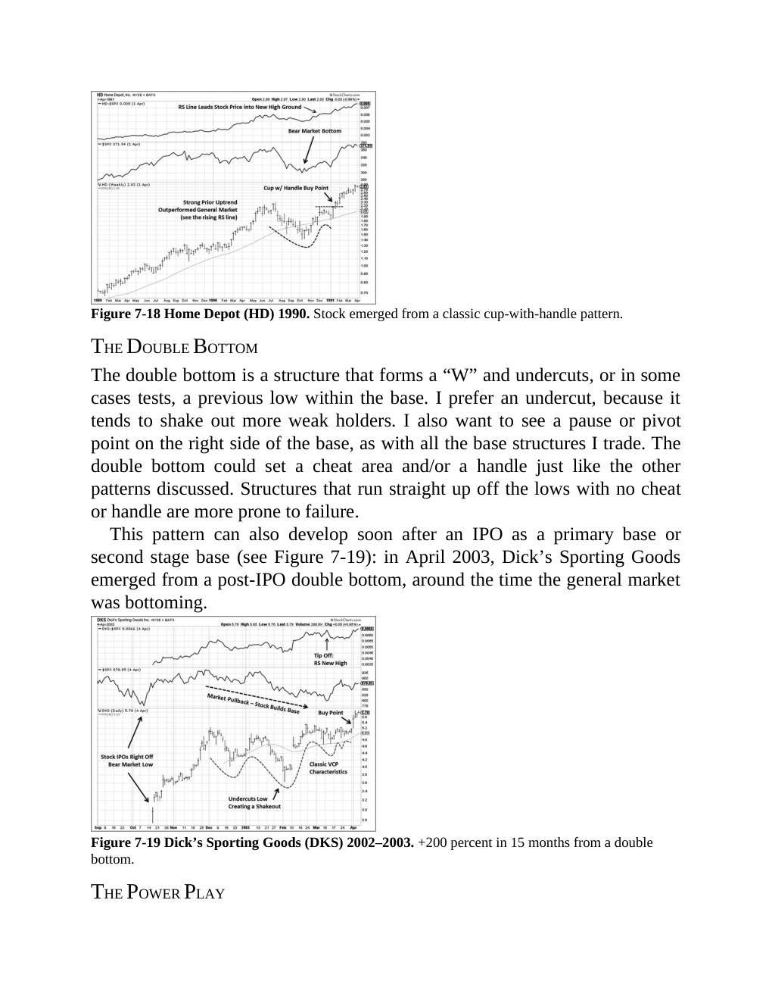
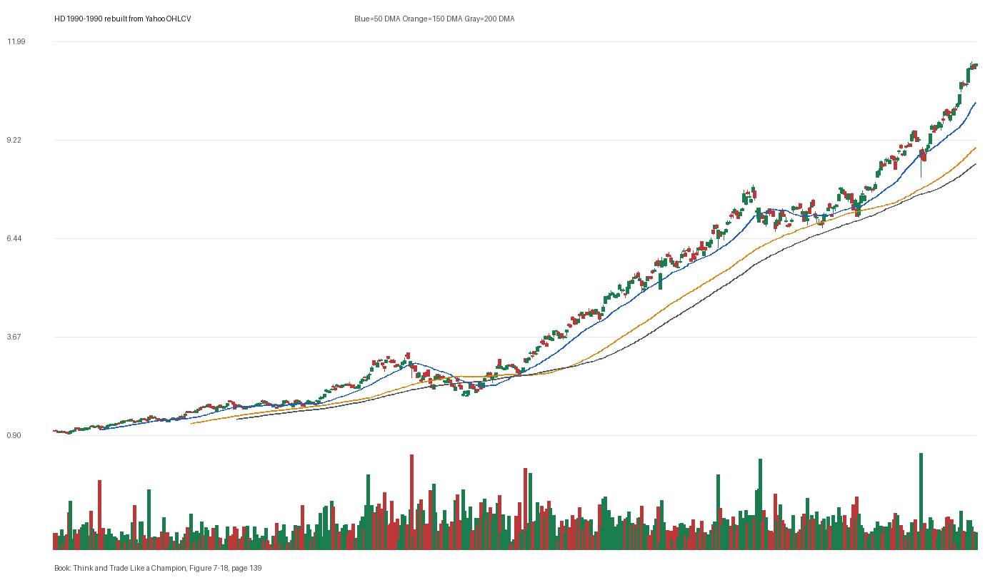

# Figure 7-18 - HD - Page 139

## Source Image

Book: [[Think and Trade Like a Champion]]

Caption: Home Depot (HD) 1990. Stock emerged from a classic cup-with-handle pattern. THE DOUBLE BOTTOM The double bottom is a structure that forms a “W” and undercuts, or in some cases tests, a previous low within the base. I prefer an undercut, because it tends to shake out more weak holders. I also want to see a pause or pivot point on the right side of the base, as with all the base structures I trade. The double bottom co

## Yahoo OHLCV Rebuild

Download status: `OK`

CSV: `data/book_stock_images/think-and-trade-like-a-champion-figure-7-18-hd-page-139_ohlcv.csv`

## Pattern Read

Tags: pivot-breakout, stage-2-leadership

Concepts: [[Pivot and Entry]], [[Relative Strength Leadership]], [[Stage 2 Uptrend]], [[Trend Template]]

The entry lesson is to define the pivot first, then judge whether the real OHLCV breakout left controllable risk.

## Reconciliation Metrics

| Metric | Value |
|---|---:|
| first_close | 1.0247 |
| last_close | 11.3542 |
| max_gain_pct | 1014.16 |
| max_drawdown_from_period_high_pct | -38.68 |
| first_half_depth_pct | 241.41 |
| second_half_depth_pct | 345.13 |
| tightening | False |
| volume_dryup | False |
| best_trend_template_score | 5/5 |
| latest_trend_template_score | 5/5 |

## Trend Template Checks

- close > 50 DMA
- close > 150 DMA
- close > 200 DMA
- 50 DMA > 150 DMA
- 150 DMA > 200 DMA

## Study Questions

- Does the rebuilt OHLCV chart confirm the same structure shown in the book image?
- Was the stock close to a definable pivot, or already extended?
- Did volume dry up before the move, or was supply still obvious?
- Was this a buy lesson, a sell lesson, or a failure-avoidance lesson?
- What would invalidate the setup if this were being traded live?

<!-- STAGE_LIFECYCLE_START -->
## Stage Lifecycle & Base Concept Analysis
> This section analyzes the FULL LIFECYCLE of the stock around the inferred entry — Stage 1 (Accumulation), Stage 2 (Advance), Stage 3 (Distribution), Stage 4 (Decline) — plus deep base concept analysis, VCP footprint, tight footprint, supply dynamics, and contraction timeline.
- Status: `ok`
- Entry date: `1990-04-16`
- Entry price: `2.3148`
### Stage Lifecycle Overview
| Stage | Present | Start Date | End Date | Duration | Key Signal |
|---|---|---|---:|---|---|
| Stage 1 — Accumulation | ✅ | `1989-12-01` | `1990-11-30` | 252 days | Base: deep-chaotic |
| Stage 2 — Advance | ✅ | `1990-11-30` | `1991-06-28` | 145 days | Max gain: 95.1% |
| Stage 3 — Distribution | ❌ | — | — | — | Not detected |
| Stage 4 — Decline | ❌ | — | — | — | Not detected |
### Stage 1 — Accumulation / Base Building
- Base type: `deep-chaotic`
- Lowest price in base: `1.6500`
- Volume pattern: `late-supply`
### Stage 2 — Advance / Trend Pivots

- Number of significant pivots during advance: `3`

| Pivot Date | Price |
|---|---:|
| `1991-03-06` | `3.9100` |
| `1991-04-29` | `4.4600` |
| `1991-05-24` | `4.9400` |

#### Trend Template Evolution During Stage 2

| % Through Stage 2 | Date | Score |
|---|---|---:|
| 0% | `1990-11-30` | 6/7 |
| 25% | `1991-01-23` | 6/7 |
| 50% | `1991-03-15` | 6/7 |
| 75% | `1991-05-07` | 7/7 |
| 100% | `1991-06-28` | 7/7 |

### Base Concept Deep-Dive

- Base type: `N/A`
- Base duration: `0 sessions`
- Base depth: `N/A`
- Base high: `N/A`
- Base low: `N/A`
- Resistance touches at base high: `0`
- Support touches at base low: `0`
- Contraction count: `0`
- Contraction quality: `N/A`
- Pivot clarity: `N/A`
- Pivot distance at entry: `N/A`
- Volume dry-up in base: `N/A`
- Volume dry-up ratio: `N/A`
- Tightness at pivot (10d): `N/A`
- Weekly tightness: `N/A`

### VCP Footprint

- VCP present: `False`
- No clear VCP pattern detected in the base.

### Tight Footprint

- 10-session tightness at entry: `3.3%`
- 20-session tightness at entry: `6.5%`
- Weekly tightness: `3.0%`
- ATR20 %: `2.33`
- Tightness progression: `improving`

### Supply Analysis

- Supply label: `demand-dominant`
- Volume dry-up ratio: `0.91`
- Distribution volume detected: `False`
- Accumulation volume detected: `True`
- Climax volume dates: `1990-03-07, 1990-03-16, 1990-03-19`

### Concept Tie-Back

- Related concepts: [[Base Concept]], [[Stage 2 Uptrend]], [[Trend Template]]
- Lesson: Stage 1 base was deep-chaotic with 96.1% depth. Stage 2 advance lasted 146 sessions with 3 significant pivots.

<!-- STAGE_LIFECYCLE_END -->
<!-- PRE_ENTRY_SENSE_CHECK_START -->

## Pre-Entry Sense Check

> This section analyzes the chart structure PRIOR to the inferred entry. It answers: What did the setup look like in the weeks and months before the trade? Which Minervini concepts were already visible?

- Status: `ok`
- Entry date: `1990-04-16`
- Pre-entry history available: `223 sessions`

### Trend Template Evolution

| Lookback | Date | Score | Assessment |
|---|---|---:|:---|
| 60 days before |  | 0/7 | N/A |
| 40 days before |  | 0/7 | N/A |
| 20 days before | 1990-03-16 | 7/7 | ✅ Stage 2 confirmed |

### Pre-Entry Context Window

- Context window (last sessions before entry): `150 sessions`
- Range high: `2.3600`
- Range low: `1.4900`
- Total range depth: `57.9%`
- Contraction phases (rolling 21-bar segments): `18.2% -> 24.0% -> 11.6% -> 14.6% -> 12.3% -> 26.0% -> 12.0%`

### Stage 2 Onset

- First sustained Stage 2 date: `1990-03-13`
- Days in Stage 2 before entry: `23`

### Volume Behavior Before Entry

- Volume dry-up label: `neutral`
- Recent/base volume ratio: `0.91`
- Volume spike dates (2.5x avg) in last 40 days: `1990-03-07`

### Tightness Progression

| Lookback | 10-Session Close Tightness |
|---|---:|
| 40 days before | `7.8%` |
| 20 days before | `10.3%` |
| Final 10 sessions before | `3.3%` |
| Final 3 weekly closes | `3.0%` |

### Moving Average Alignment

- 50/150/200 DMA first aligned (50>150>200): `1990-03-13`

### Shakeouts / Tests Before Entry

- No shakeouts or undercut-recover patterns detected in last 40 sessions before entry.

### 52-Week High Context

| Timing | Distance from 52W High |
|---|---:|
| 60 days before | `N/A` |
| 20 days before | `N/A` |
| At entry | `-3.1%` |

### Concept Tie-Back

- Related concepts: [[Stage 2 Uptrend]], [[Trend Template]], [[Relative Strength Leadership]], [[Volatility Contraction Pattern]], [[Pivot and Entry]]
- Lesson: Stage 2 was established 23 days before entry, confirming leadership context. Total pre-entry range was 57.9% — wide range indicating significant prior movement. Volume did not show clear dry-up — supply may still be present.

<!-- PRE_ENTRY_SENSE_CHECK_END -->
<!-- SEPA_REPLICATION_START -->

## SEPA Trade Replication

> Study note: this reconstructs a likely Minervini-style setup area from the real OHLCV window shown by the book timing. It does not claim to know Minervini's private fill, sizing, or unpublished execution.

- Status: `reconstructed-from-real-ohlcv`
- Setup type: `pivot-breakout-study`
- Confidence: `high`
- Timing source: `1990-1990` from the figure caption and rebuilt OHLCV where available.
- Inferred study entry date: `1990-04-16`
- Inferred study entry price: `2.3148`
- Inferred pivot: `2.3580`
- Inferred stop / invalidation: `2.2284`
- Pivot extension at entry: `-1.8%`
- Stop distance / risk: `3.9%`
- Trend Template score at entry: `7/7`

### Tightness And Supply
- 3-part pre-entry contraction depth: `12.3% -> 26.0% -> 10.4%`
- Contraction quality: `mixed-or-loose`
- 10-session close tightness: `3.3%`
- 3-week close tightness: `3.0%`
- Volume dry-up: `neutral`
- Recent/base median volume ratio: `0.91`
- Leadership proxy: 65-day return 27.6% and 126-day return 39.9%

### Post-Entry Reality Check
- Max gain after 20 sessions: `13.3%`
- Max gain after 60 sessions: `34.4%`
- Max gain after 120 sessions: `39.6%`
- Worst drawdown after 20 sessions: `-5.1%`
- Inferred stop failed within 20 sessions: `True`
- Pivot broadly respected within 20 sessions: `False`

### Concept Tie-Back

- Related concepts: [[Risk First]], [[Pivot and Entry]], [[Trend Template]], [[Stage 2 Uptrend]], [[Relative Strength Leadership]]
- Lesson: The reconstructed data suggests the structure still had loose or mixed contraction behavior; risk was close enough for a clean SEPA-style test; post-entry behavior violated the inferred stop within 20 sessions.

<!-- SEPA_REPLICATION_END -->
