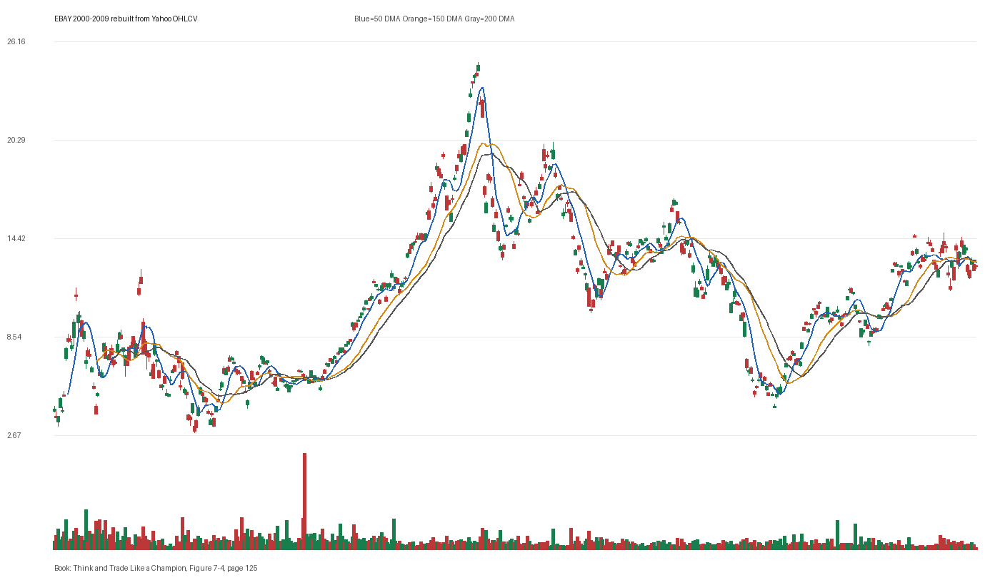

# Figure 7-4 - EBAY - Page 125

## Source Image

Book: [[Think and Trade Like a Champion]]

Caption: eBay (EBAY) 2000-2002. The stock bottomed in 2001 and didn’t form a reliable base until late 2002. It then gained more than 225 percent in 23 months. NETFLIX-2009 Netflix bottomed in October 2008; the S&P 500 Index didn’t bottom until March 2009. In

## Yahoo OHLCV Rebuild

Download status: `OK`

CSV: `data/book_stock_images/think-and-trade-like-a-champion-figure-7-4-ebay-page-125_ohlcv.csv`

## Pattern Read

Tags: vcp-or-tightening, volume-dry-up, stage-2-leadership

Concepts: [[Pivot and Entry]], [[Relative Strength Leadership]], [[Stage 2 Uptrend]], [[Trend Template]], [[Volatility Contraction Pattern]], [[Volume Dry-Up and Accumulation]]

The useful clue is contraction: the later portion of the window became tighter than the earlier portion. Volume contraction supports the idea that supply was drying up near the tight area.

## Reconciliation Metrics

| Metric | Value |
|---|---:|
| first_close | 4.2088 |
| last_close | 12.7652 |
| max_gain_pct | 492.1 |
| max_drawdown_from_period_high_pct | -83.26 |
| first_half_depth_pct | 785.38 |
| second_half_depth_pct | 382.95 |
| tightening | True |
| volume_dryup | True |
| best_trend_template_score | 5/5 |
| latest_trend_template_score | 0/5 |

## Trend Template Checks

- Not available or not applicable.

## Study Questions

- Does the rebuilt OHLCV chart confirm the same structure shown in the book image?
- Was the stock close to a definable pivot, or already extended?
- Did volume dry up before the move, or was supply still obvious?
- Was this a buy lesson, a sell lesson, or a failure-avoidance lesson?
- What would invalidate the setup if this were being traded live?

<!-- STAGE_LIFECYCLE_START -->
## Stage Lifecycle & Base Concept Analysis
> This section analyzes the FULL LIFECYCLE of the stock around the inferred entry — Stage 1 (Accumulation), Stage 2 (Advance), Stage 3 (Distribution), Stage 4 (Decline) — plus deep base concept analysis, VCP footprint, tight footprint, supply dynamics, and contraction timeline.
- Status: `ok`
- Entry date: `2004-06-25`
- Entry price: `19.0909`
### Stage Lifecycle Overview
| Stage | Present | Start Date | End Date | Duration | Key Signal |
|---|---|---|---:|---|---|
| Stage 1 — Accumulation | ✅ | `2001-11-14` | `2002-11-14` | 252 days | Base: deep-chaotic |
| Stage 2 — Advance | ✅ | `2002-11-14` | `2003-11-17` | 253 days | Max gain: 89.1% |
| Stage 3 — Distribution | ✅ | `2003-12-03` | `2005-01-19` | 283 days | climax vol |
| Stage 4 — Decline | ✅ | `2005-01-20` | — | 1369 days | Below 200 DMA: False |
### Stage 1 — Accumulation / Base Building
- Base type: `deep-chaotic`
- Lowest price in base: `5.1400`
- Volume pattern: `neutral`
### Stage 2 — Advance / Trend Pivots

- Number of significant pivots during advance: `5`

| Pivot Date | Price |
|---|---:|
| `2002-12-17` | `7.4300` |
| `2003-02-03` | `8.2900` |
| `2003-03-21` | `9.4700` |
| `2003-04-24` | `10.0000` |
| `2003-05-27` | `10.8700` |

#### Trend Template Evolution During Stage 2

| % Through Stage 2 | Date | Score |
|---|---|---:|
| 0% | `2002-11-14` | 7/7 |
| 25% | `2003-02-18` | 7/7 |
| 50% | `2003-05-19` | 7/7 |
| 75% | `2003-08-18` | 7/7 |
| 100% | `2003-11-17` | 6/7 |

### Base Concept Deep-Dive

- Base type: `deep-chaotic`
- Base duration: `301 sessions`
- Base depth: `109.0%`
- Base high: `19.2600`
- Base low: `9.2200`
- Resistance touches at base high: `4`
- Support touches at base low: `3`
- Contraction count: `5`
- Contraction quality: `mixed-or-loose`
- Pivot clarity: `clear-pivot-at-high`
- Pivot distance at entry: `-0.9%`
- Volume dry-up in base: `neutral`
- Volume dry-up ratio: `0.85`
- Tightness at pivot (10d): `6.0%`
- Weekly tightness: `4.9%`

### VCP Footprint

- VCP present: `False`
- No clear VCP pattern detected in the base.

### Tight Footprint

- 10-session tightness at entry: `3.7%`
- 20-session tightness at entry: `4.8%`
- Weekly tightness: `2.6%`
- ATR20 %: `2.03`
- Tightness progression: `improving`

### Supply Analysis

- Supply label: `neutral`
- Volume dry-up ratio: `0.82`
- Distribution volume detected: `False`
- Accumulation volume detected: `False`

### Contraction Timeline

| Phase | Start Date | Depth | Volume | Tightness |
|---|---|---:|---:|---:|
| C1 | `2003-04-16` | 31.8% | 60874546.0 | 12.2% |
| C2 | `2003-07-14` | 18.2% | 53652932.0 | 7.5% |
| C3 | `2003-10-07` | 28.0% | 37089360.0 | 12.8% |
| C4 | `2004-01-02` | 15.1% | 32211194.0 | 6.2% |
| C5 | `2004-03-30` | 32.8% | 38132662.0 | 3.7% |

### Concept Tie-Back

- Related concepts: [[Base Concept]], [[Stage 2 Uptrend]], [[Trend Template]], [[Stage 3 Distribution]], [[Stage 4 Decline]]
- Lesson: Stage 1 base was deep-chaotic with 48.9% depth. Stage 2 advance lasted 254 sessions with 5 significant pivots.

<!-- STAGE_LIFECYCLE_END -->
<!-- PRE_ENTRY_SENSE_CHECK_START -->

## Pre-Entry Sense Check

> This section analyzes the chart structure PRIOR to the inferred entry. It answers: What did the setup look like in the weeks and months before the trade? Which Minervini concepts were already visible?

- Status: `ok`
- Entry date: `2004-06-25`
- Pre-entry history available: `1277 sessions`

### Trend Template Evolution

| Lookback | Date | Score | Assessment |
|---|---|---:|:---|
| 60 days before | 2004-03-30 | 7/7 | ✅ Stage 2 confirmed |
| 40 days before | 2004-04-28 | 7/7 | ✅ Stage 2 confirmed |
| 20 days before | 2004-05-26 | 7/7 | ✅ Stage 2 confirmed |

### Pre-Entry Context Window

- Context window (last sessions before entry): `150 sessions`
- Range high: `18.9800`
- Range low: `10.6500`
- Total range depth: `78.2%`
- Contraction phases (rolling 21-bar segments): `16.5% -> 17.4% -> 8.9% -> 8.8% -> 18.7% -> 15.5% -> 13.9%`

### Stage 2 Onset

- First sustained Stage 2 date: `2001-11-07`
- Days in Stage 2 before entry: `661`

### Volume Behavior Before Entry

- Volume dry-up label: `neutral`
- Recent/base volume ratio: `0.82`
- No significant volume spikes in last 40 days before entry.

### Tightness Progression

| Lookback | 10-Session Close Tightness |
|---|---:|
| 40 days before | `13.5%` |
| 20 days before | `8.9%` |
| Final 10 sessions before | `3.7%` |
| Final 3 weekly closes | `2.6%` |

### Moving Average Alignment

- 50/150/200 DMA first aligned (50>150>200): `2000-03-10`

### Shakeouts / Tests Before Entry

- No shakeouts or undercut-recover patterns detected in last 40 sessions before entry.

### 52-Week High Context

| Timing | Distance from 52W High |
|---|---:|
| 60 days before | `-3.0%` |
| 20 days before | `-0.3%` |
| At entry | `-0.9%` |

### Concept Tie-Back

- Related concepts: [[Stage 2 Uptrend]], [[Trend Template]], [[Relative Strength Leadership]]
- Lesson: Stage 2 was established 661 days before entry, confirming leadership context. Total pre-entry range was 78.2% — wide range indicating significant prior movement. Volume did not show clear dry-up — supply may still be present.

<!-- PRE_ENTRY_SENSE_CHECK_END -->
<!-- SEPA_REPLICATION_START -->

## SEPA Trade Replication

> Study note: this reconstructs a likely Minervini-style setup area from the real OHLCV window shown by the book timing. It does not claim to know Minervini's private fill, sizing, or unpublished execution.

- Status: `reconstructed-from-real-ohlcv`
- Setup type: `vcp/contraction-study`
- Confidence: `high`
- Timing source: `2000-2009` from the figure caption and rebuilt OHLCV where available.
- Inferred study entry date: `2004-06-25`
- Inferred study entry price: `19.0909`
- Inferred pivot: `18.9815`
- Inferred stop / invalidation: `17.7294`
- Pivot extension at entry: `0.6%`
- Stop distance / risk: `7.7%`
- Trend Template score at entry: `7/7`

### Tightness And Supply
- 3-part pre-entry contraction depth: `25.8% -> 10.3% -> 10.1%`
- Contraction quality: `clear-tightening`
- 10-session close tightness: `3.7%`
- 3-week close tightness: `2.6%`
- Volume dry-up: `neutral`
- Recent/base median volume ratio: `0.82`
- Leadership proxy: 65-day return 38.4% and 126-day return 42.3%

### Post-Entry Reality Check
- Max gain after 20 sessions: `3.8%`
- Max gain after 60 sessions: `5.7%`
- Max gain after 120 sessions: `30.3%`
- Worst drawdown after 20 sessions: `-21.2%`
- Inferred stop failed within 20 sessions: `True`
- Pivot broadly respected within 20 sessions: `False`

### Concept Tie-Back

- Related concepts: [[Risk First]], [[Volatility Contraction Pattern]], [[Volume Dry-Up and Accumulation]], [[Pivot and Entry]], [[Trend Template]], [[Stage 2 Uptrend]], [[Relative Strength Leadership]]
- Lesson: The reconstructed data suggests price was becoming more controllable before the inferred entry; risk was close enough for a clean SEPA-style test; post-entry behavior violated the inferred stop within 20 sessions.

<!-- SEPA_REPLICATION_END -->
