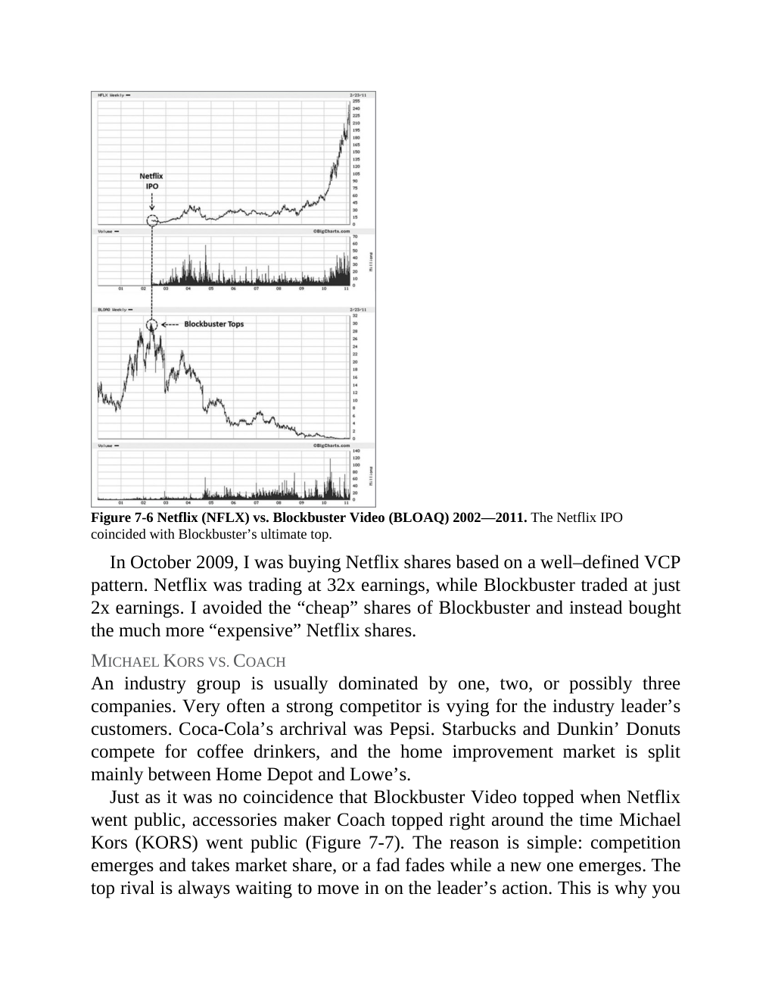
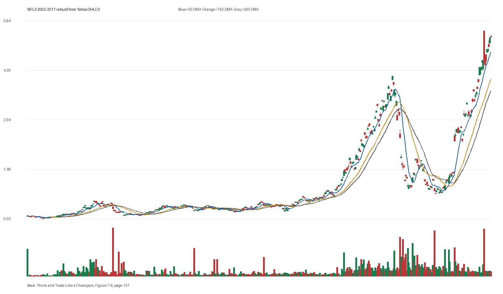

# Figure 7-6 - NFLX - Page 127

## Source Image

Book: [[Think and Trade Like a Champion]]

Caption: Netflix (NFLX) vs. Blockbuster Video (BLOAQ) 2002-2011. The Netflix IPO coincided with Blockbuster’s ultimate top. In October 2009, I was buying Netflix shares based on a well-defined VCP pattern. Netflix was trading at 32x earnings, while Blockbuster traded at just 2x earnings. I avoided the “cheap” shares of Blockbuster and instead bought the much more “expensive” Netflix shares. MICHAEL KORS VS. COACH An industry

## Yahoo OHLCV Rebuild

Download status: `OK`

CSV: `data/book_stock_images/think-and-trade-like-a-champion-figure-7-6-nflx-page-127_ohlcv.csv`

## Pattern Read

Tags: ipo-base, vcp-or-tightening, stage-2-leadership

Concepts: [[IPO Base New Issue Setup|IPO Base / New Issue Setup]], [[Pivot and Entry]], [[Relative Strength Leadership]], [[Stage 2 Uptrend]], [[Trend Template]], [[Volatility Contraction Pattern]], [[Volume Dry-Up and Accumulation]]

Treat the IPO/new-issue label as a demand test: do not buy the story until price creates a controlled structure. The useful clue is contraction: the later portion of the window became tighter than the earlier portion.

## Reconciliation Metrics

| Metric | Value |
|---|---:|
| first_close | 0.1196 |
| last_close | 5.2427 |
| max_gain_pct | 4546.68 |
| max_drawdown_from_period_high_pct | -82.67 |
| first_half_depth_pct | 1539.99 |
| second_half_depth_pct | 2074.08 |
| tightening | False |
| volume_dryup | False |
| best_trend_template_score | 5/5 |
| latest_trend_template_score | 5/5 |

## Trend Template Checks

- close > 50 DMA
- close > 150 DMA
- close > 200 DMA
- 50 DMA > 150 DMA
- 150 DMA > 200 DMA

## Study Questions

- Does the rebuilt OHLCV chart confirm the same structure shown in the book image?
- Was the stock close to a definable pivot, or already extended?
- Did volume dry up before the move, or was supply still obvious?
- Was this a buy lesson, a sell lesson, or a failure-avoidance lesson?
- What would invalidate the setup if this were being traded live?

<!-- STAGE_LIFECYCLE_START -->
## Stage Lifecycle & Base Concept Analysis
> This section analyzes the FULL LIFECYCLE of the stock around the inferred entry — Stage 1 (Accumulation), Stage 2 (Advance), Stage 3 (Distribution), Stage 4 (Decline) — plus deep base concept analysis, VCP footprint, tight footprint, supply dynamics, and contraction timeline.
- Status: `ok`
- Entry date: `2005-07-26`
- Entry price: `0.2716`
### Stage Lifecycle Overview
| Stage | Present | Start Date | End Date | Duration | Key Signal |
|---|---|---|---:|---|---|
| Stage 1 — Accumulation | ✅ | `2008-09-09` | `2009-09-09` | 252 days | Base: deep-chaotic |
| Stage 2 — Advance | ✅ | `2009-09-09` | `2011-08-05` | 481 days | Max gain: 605.0% |
| Stage 3 — Distribution | ✅ | `2012-03-12` | `2012-06-28` | 76 days | climax vol |
| Stage 4 — Decline | ❌ | — | — | — | Not detected |
### Stage 1 — Accumulation / Base Building
- Base type: `deep-chaotic`
- Lowest price in base: `0.2600`
- Volume pattern: `neutral`
### Stage 2 — Advance / Trend Pivots

- Number of significant pivots during advance: `5`

| Pivot Date | Price |
|---|---:|
| `2009-10-23` | `0.8200` |
| `2009-11-18` | `0.8800` |
| `2009-12-24` | `0.8200` |
| `2010-01-29` | `0.9200` |
| `2010-04-26` | `1.5700` |

#### Trend Template Evolution During Stage 2

| % Through Stage 2 | Date | Score |
|---|---|---:|
| 0% | `2009-09-09` | 6/7 |
| 25% | `2010-03-03` | 7/7 |
| 50% | `2010-08-23` | 7/7 |
| 75% | `2011-02-11` | 7/7 |
| 100% | `2011-08-05` | 6/7 |

### Base Concept Deep-Dive

- Base type: `N/A`
- Base duration: `0 sessions`
- Base depth: `N/A`
- Base high: `N/A`
- Base low: `N/A`
- Resistance touches at base high: `0`
- Support touches at base low: `0`
- Contraction count: `0`
- Contraction quality: `N/A`
- Pivot clarity: `N/A`
- Pivot distance at entry: `N/A`
- Volume dry-up in base: `N/A`
- Volume dry-up ratio: `N/A`
- Tightness at pivot (10d): `N/A`
- Weekly tightness: `N/A`

### VCP Footprint

- VCP present: `False`
- No clear VCP pattern detected in the base.

### Tight Footprint

- 10-session tightness at entry: `4.2%`
- 20-session tightness at entry: `7.6%`
- Weekly tightness: `3.4%`
- ATR20 %: `4.0`
- Tightness progression: `improving`

### Supply Analysis

- Supply label: `diminishing`
- Volume dry-up ratio: `0.7`
- Distribution volume detected: `False`
- Accumulation volume detected: `False`
- Climax volume dates: `2005-07-25`

### Concept Tie-Back

- Related concepts: [[Base Concept]], [[Stage 2 Uptrend]], [[Trend Template]], [[Stage 3 Distribution]], [[Volume Dry-Up and Accumulation]], [[Supply and Demand]]
- Lesson: Stage 1 base was deep-chaotic with 180.7% depth. Stage 2 advance lasted 482 sessions with 5 significant pivots. Supply was diminishing before entry.

<!-- STAGE_LIFECYCLE_END -->
<!-- PRE_ENTRY_SENSE_CHECK_START -->

## Pre-Entry Sense Check

> This section analyzes the chart structure PRIOR to the inferred entry. It answers: What did the setup look like in the weeks and months before the trade? Which Minervini concepts were already visible?

- Status: `ok`
- Entry date: `2005-07-26`
- Pre-entry history available: `799 sessions`

### Trend Template Evolution

| Lookback | Date | Score | Assessment |
|---|---|---:|:---|
| 60 days before | 2005-04-29 | 1/7 | 🔴 Not yet Stage 2 |
| 40 days before | 2005-05-27 | 4/7 | 🟡 Transitioning |
| 20 days before | 2005-06-27 | 5/7 | 🟡 Transitioning |

### Pre-Entry Context Window

- Context window (last sessions before entry): `150 sessions`
- Range high: `0.2800`
- Range low: `0.1300`
- Total range depth: `116.3%`
- Contraction phases (rolling 21-bar segments): `28.1% -> 25.7% -> 22.0% -> 45.9% -> 74.7% -> 26.1% -> 18.6%`

### Stage 2 Onset

- First sustained Stage 2 date: `2003-04-07`
- Days in Stage 2 before entry: `580`

### Volume Behavior Before Entry

- Volume dry-up label: `moderate-dry-up`
- Recent/base volume ratio: `0.7`
- Volume spike dates (2.5x avg) in last 40 days: `2005-06-10, 2005-06-13, 2005-06-16`

### Tightness Progression

| Lookback | 10-Session Close Tightness |
|---|---:|
| 40 days before | `13.0%` |
| 20 days before | `11.8%` |
| Final 10 sessions before | `4.2%` |
| Final 3 weekly closes | `3.4%` |

### Moving Average Alignment

- 50/150/200 DMA first aligned (50>150>200): `2003-04-28`

### Shakeouts / Tests Before Entry

- No shakeouts or undercut-recover patterns detected in last 40 sessions before entry.

### 52-Week High Context

| Timing | Distance from 52W High |
|---|---:|
| 60 days before | `-68.4%` |
| 20 days before | `-56.3%` |
| At entry | `-8.6%` |

### Concept Tie-Back

- Related concepts: [[Stage 2 Uptrend]], [[Trend Template]], [[Relative Strength Leadership]], [[Volatility Contraction Pattern]], [[Pivot and Entry]], [[Volume Dry-Up and Accumulation]]
- Lesson: Stage 2 was established 580 days before entry, confirming leadership context. Total pre-entry range was 116.3% — wide range indicating significant prior movement. Volume dried up before entry, suggesting supply absorption.

<!-- PRE_ENTRY_SENSE_CHECK_END -->
<!-- SEPA_REPLICATION_START -->

## SEPA Trade Replication

> Study note: this reconstructs a likely Minervini-style setup area from the real OHLCV window shown by the book timing. It does not claim to know Minervini's private fill, sizing, or unpublished execution.

- Status: `reconstructed-from-real-ohlcv`
- Setup type: `ipo-base-study`
- Confidence: `high`
- Timing source: `2002-2011` from the figure caption and rebuilt OHLCV where available.
- Inferred study entry date: `2005-07-26`
- Inferred study entry price: `0.2716`
- Inferred pivot: `0.2753`
- Inferred stop / invalidation: `0.2286`
- Pivot extension at entry: `-1.3%`
- Stop distance / risk: `18.8%`
- Trend Template score at entry: `6/7`

### Tightness And Supply
- 3-part pre-entry contraction depth: `71.0% -> 26.1% -> 19.2%`
- Contraction quality: `clear-tightening`
- 10-session close tightness: `4.2%`
- 3-week close tightness: `3.4%`
- Volume dry-up: `moderate-dry-up`
- Recent/base median volume ratio: `0.7`
- Leadership proxy: 65-day return 69.7% and 126-day return 67.8%

### Post-Entry Reality Check
- Max gain after 20 sessions: `19.6%`
- Max gain after 60 sessions: `55.1%`
- Max gain after 120 sessions: `59.1%`
- Worst drawdown after 20 sessions: `-4.0%`
- Inferred stop failed within 20 sessions: `False`
- Pivot broadly respected within 20 sessions: `False`

### Concept Tie-Back

- Related concepts: [[Risk First]], [[Volatility Contraction Pattern]], [[Volume Dry-Up and Accumulation]], [[Pivot and Entry]], [[IPO Base New Issue Setup]], [[Trend Template]], [[Stage 2 Uptrend]], [[Relative Strength Leadership]]
- Lesson: The reconstructed data suggests price was becoming more controllable before the inferred entry; volume supported the supply-dry-up idea; risk was wide, so the entry would need smaller size or a better cheat point.

<!-- SEPA_REPLICATION_END -->
