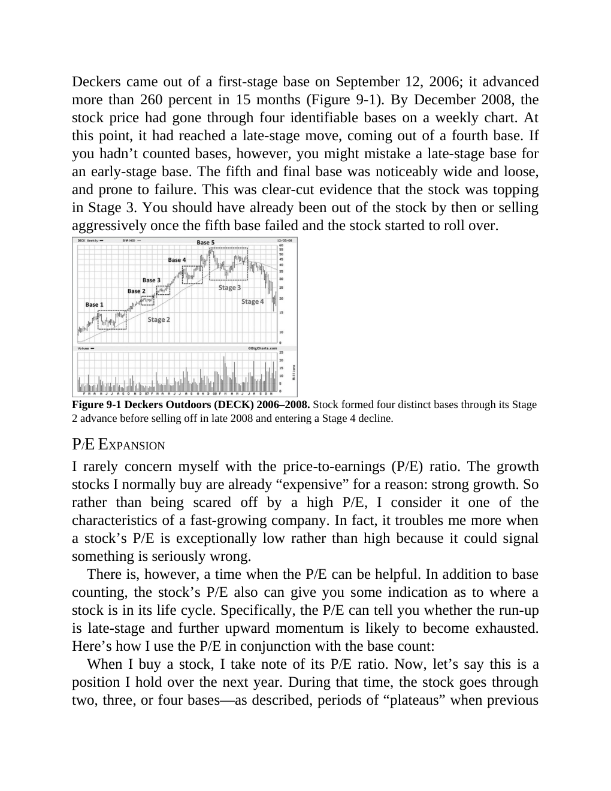
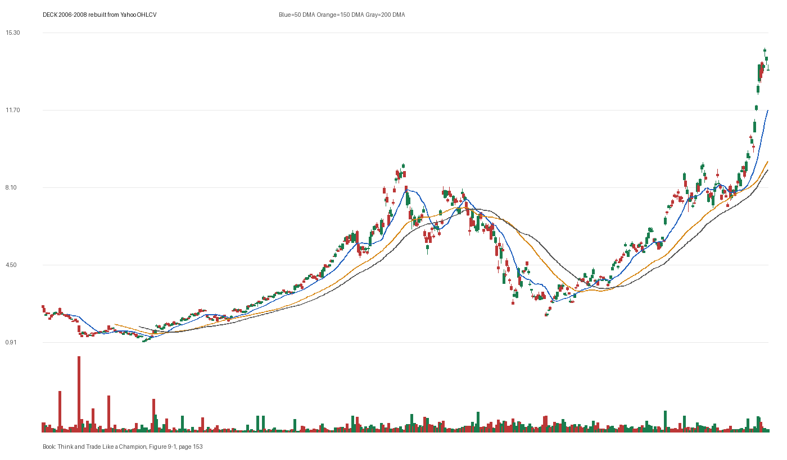

# Figure 9-1 - DECK - Page 153

## Source Image

Book: [[Think and Trade Like a Champion]]

Caption: Deckers Outdoors (DECK) 2006-2008. Stock formed four distinct bases through its Stage 2 advance before selling off in late 2008 and entering a Stage 4 decline. P/E EXPANSION I rarely concern myself with the price-to-earnings (P/E) ratio. The growth stocks I normally buy are already “expensive” for a reason: strong growth. So rather than being scared off by a high P/E, I consider it one of the characteristics of a fas

## Yahoo OHLCV Rebuild

Download status: `OK`

CSV: `data/book_stock_images/think-and-trade-like-a-champion-figure-9-1-deck-page-153_ohlcv.csv`

## Pattern Read

Tags: vcp-or-tightening, failed-breakout-or-stage-4

Concepts: [[Pivot and Entry]], [[Risk First]], [[Sell Rules and Failure Signals]], [[Trend Template]], [[Volatility Contraction Pattern]], [[Volume Dry-Up and Accumulation]]

The useful clue is contraction: the later portion of the window became tighter than the earlier portion. The sell lesson dominates: when price breaks character, the chart can warn before fundamentals are obvious.

## Reconciliation Metrics

| Metric | Value |
|---|---:|
| first_close | 2.5239 |
| last_close | 13.5667 |
| max_gain_pct | 480.32 |
| max_drawdown_from_period_high_pct | -77.63 |
| first_half_depth_pct | 884.04 |
| second_half_depth_pct | 607.95 |
| tightening | True |
| volume_dryup | False |
| best_trend_template_score | 5/5 |
| latest_trend_template_score | 5/5 |

## Trend Template Checks

- close > 50 DMA
- close > 150 DMA
- close > 200 DMA
- 50 DMA > 150 DMA
- 150 DMA > 200 DMA

## Study Questions

- Does the rebuilt OHLCV chart confirm the same structure shown in the book image?
- Was the stock close to a definable pivot, or already extended?
- Did volume dry up before the move, or was supply still obvious?
- Was this a buy lesson, a sell lesson, or a failure-avoidance lesson?
- What would invalidate the setup if this were being traded live?

<!-- STAGE_LIFECYCLE_START -->
## Stage Lifecycle & Base Concept Analysis
> This section analyzes the FULL LIFECYCLE of the stock around the inferred entry — Stage 1 (Accumulation), Stage 2 (Advance), Stage 3 (Distribution), Stage 4 (Decline) — plus deep base concept analysis, VCP footprint, tight footprint, supply dynamics, and contraction timeline.
- Status: `ok`
- Entry date: `2006-02-23`
- Entry price: `1.9217`
### Stage Lifecycle Overview
| Stage | Present | Start Date | End Date | Duration | Key Signal |
|---|---|---|---:|---|---|
| Stage 1 — Accumulation | ✅ | `2005-07-19` | `2006-07-19` | 252 days | Base: deep-chaotic |
| Stage 2 — Advance | ✅ | `2006-07-19` | `2008-01-16` | 376 days | Max gain: 358.6% |
| Stage 3 — Distribution | ✅ | `2008-04-09` | `2008-04-21` | 8 days | no climax |
| Stage 4 — Decline | ✅ | `2008-04-22` | — | 299 days | Below 200 DMA: False |
### Stage 1 — Accumulation / Base Building
- Base type: `deep-chaotic`
- Lowest price in base: `0.9400`
- Volume pattern: `neutral`
### Stage 2 — Advance / Trend Pivots

- Number of significant pivots during advance: `5`

| Pivot Date | Price |
|---|---:|
| `2006-08-17` | `2.5100` |
| `2006-10-27` | `3.0600` |
| `2006-12-05` | `3.2400` |
| `2007-03-21` | `4.0700` |
| `2007-05-04` | `4.5200` |

#### Trend Template Evolution During Stage 2

| % Through Stage 2 | Date | Score |
|---|---|---:|
| 0% | `2006-07-19` | 6/7 |
| 25% | `2006-11-30` | 7/7 |
| 50% | `2007-04-19` | 7/7 |
| 75% | `2007-08-31` | 6/7 |
| 100% | `2008-01-16` | 6/7 |

### Base Concept Deep-Dive

- Base type: `N/A`
- Base duration: `0 sessions`
- Base depth: `N/A`
- Base high: `N/A`
- Base low: `N/A`
- Resistance touches at base high: `0`
- Support touches at base low: `0`
- Contraction count: `0`
- Contraction quality: `N/A`
- Pivot clarity: `N/A`
- Pivot distance at entry: `N/A`
- Volume dry-up in base: `N/A`
- Volume dry-up ratio: `N/A`
- Tightness at pivot (10d): `N/A`
- Weekly tightness: `N/A`

### VCP Footprint

- VCP present: `False`
- No clear VCP pattern detected in the base.

### Tight Footprint

- 10-session tightness at entry: `5.5%`
- 20-session tightness at entry: `8.2%`
- Weekly tightness: `5.0%`
- ATR20 %: `3.32`
- Tightness progression: `improving`

### Supply Analysis

- Supply label: `demand-dominant`
- Volume dry-up ratio: `0.79`
- Distribution volume detected: `False`
- Accumulation volume detected: `True`
- Climax volume dates: `2006-01-11`

### Concept Tie-Back

- Related concepts: [[Base Concept]], [[Stage 2 Uptrend]], [[Trend Template]], [[Stage 3 Distribution]], [[Stage 4 Decline]]
- Lesson: Stage 1 base was deep-chaotic with 164.5% depth. Stage 2 advance lasted 377 sessions with 5 significant pivots.

<!-- STAGE_LIFECYCLE_END -->
<!-- PRE_ENTRY_SENSE_CHECK_START -->

## Pre-Entry Sense Check

> This section analyzes the chart structure PRIOR to the inferred entry. It answers: What did the setup look like in the weeks and months before the trade? Which Minervini concepts were already visible?

- Status: `ok`
- Entry date: `2006-02-23`
- Pre-entry history available: `187 sessions`

### Trend Template Evolution

| Lookback | Date | Score | Assessment |
|---|---|---:|:---|
| 60 days before |  | 0/7 | N/A |
| 40 days before |  | 0/7 | N/A |
| 20 days before |  | 0/7 | N/A |

### Pre-Entry Context Window

- Context window (last sessions before entry): `150 sessions`
- Range high: `1.8800`
- Range low: `0.9400`
- Total range depth: `100.0%`
- Contraction phases (rolling 21-bar segments): `19.4% -> 13.2% -> 24.5% -> 30.0% -> 65.5% -> 24.5% -> 13.9%`

### Stage 2 Onset

- First sustained Stage 2 date: `2006-03-14`
- Days in Stage 2 before entry: `-13`

### Volume Behavior Before Entry

- Volume dry-up label: `neutral`
- Recent/base volume ratio: `0.79`
- Volume spike dates (2.5x avg) in last 40 days: `2006-01-03, 2006-01-11`

### Tightness Progression

| Lookback | 10-Session Close Tightness |
|---|---:|
| 40 days before | `7.9%` |
| 20 days before | `8.9%` |
| Final 10 sessions before | `5.5%` |
| Final 3 weekly closes | `5.0%` |

### Moving Average Alignment

- 50/150/200 DMA alignment: `not achieved before entry`

### Shakeouts / Tests Before Entry

- No shakeouts or undercut-recover patterns detected in last 40 sessions before entry.

### 52-Week High Context

| Timing | Distance from 52W High |
|---|---:|
| 60 days before | `N/A` |
| 20 days before | `N/A` |
| At entry | `-1.1%` |

### Concept Tie-Back

- Related concepts: [[Volatility Contraction Pattern]], [[Pivot and Entry]], [[Sell Rules and Failure Signals]]
- Lesson: No clear Stage 2 uptrend was visible before entry — treat as cautionary. Total pre-entry range was 100.0% — wide range indicating significant prior movement. Volume did not show clear dry-up — supply may still be present.

<!-- PRE_ENTRY_SENSE_CHECK_END -->
<!-- SEPA_REPLICATION_START -->

## SEPA Trade Replication

> Study note: this reconstructs a likely Minervini-style setup area from the real OHLCV window shown by the book timing. It does not claim to know Minervini's private fill, sizing, or unpublished execution.

- Status: `reconstructed-from-real-ohlcv`
- Setup type: `failure/sell-rule-study`
- Confidence: `high`
- Timing source: `2006-2008` from the figure caption and rebuilt OHLCV where available.
- Inferred study entry date: `2006-02-23`
- Inferred study entry price: `1.9217`
- Inferred pivot: `1.8800`
- Inferred stop / invalidation: `1.7222`
- Pivot extension at entry: `2.2%`
- Stop distance / risk: `11.6%`
- Trend Template score at entry: `7/7`

### Tightness And Supply
- 3-part pre-entry contraction depth: `57.2% -> 24.5% -> 12.4%`
- Contraction quality: `clear-tightening`
- 10-session close tightness: `5.5%`
- 3-week close tightness: `5.0%`
- Volume dry-up: `neutral`
- Recent/base median volume ratio: `0.79`
- Leadership proxy: 65-day return 79.7% and 126-day return 38.6%

### Post-Entry Reality Check
- Max gain after 20 sessions: `12.7%`
- Max gain after 60 sessions: `29.4%`
- Max gain after 120 sessions: `30.6%`
- Worst drawdown after 20 sessions: `-3.2%`
- Inferred stop failed within 20 sessions: `False`
- Pivot broadly respected within 20 sessions: `True`

### Concept Tie-Back

- Related concepts: [[Risk First]], [[Volatility Contraction Pattern]], [[Volume Dry-Up and Accumulation]], [[Pivot and Entry]], [[Sell Rules and Failure Signals]], [[Trend Template]], [[Stage 2 Uptrend]], [[Relative Strength Leadership]]
- Lesson: Treat this as a sell-rule and failure-recognition study. The important lesson is whether the stock could hold the pivot/base after demand supposedly appeared; a quick loss of the pivot changes the case from entry to defense.

<!-- SEPA_REPLICATION_END -->
