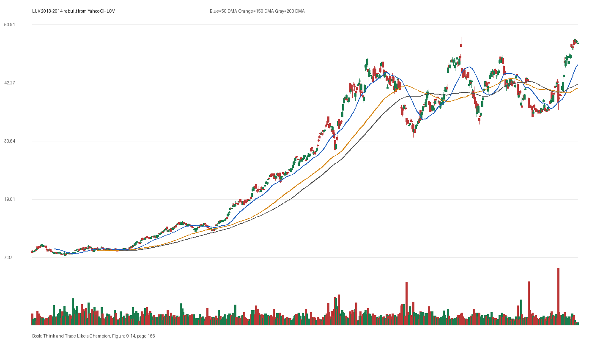

# Figure 9-14 - LUV - Page 166

## Source Image

Book: [[Think and Trade Like a Champion]]

Caption: Southwest Airlines (LUV) 2013-2014. +127% in 11 months

## Yahoo OHLCV Rebuild

Download status: `OK`

CSV: `data/book_stock_images/think-and-trade-like-a-champion-figure-9-14-luv-page-166_ohlcv.csv`

## Pattern Read

Tags: vcp-or-tightening, stage-2-leadership

Concepts: [[Pivot and Entry]], [[Relative Strength Leadership]], [[Stage 2 Uptrend]], [[Trend Template]], [[Volatility Contraction Pattern]], [[Volume Dry-Up and Accumulation]]

The useful clue is contraction: the later portion of the window became tighter than the earlier portion.

## Reconciliation Metrics

| Metric | Value |
|---|---:|
| first_close | 8.41 |
| last_close | 49.84 |
| max_gain_pct | 510.46 |
| max_drawdown_from_period_high_pct | -33.85 |
| first_half_depth_pct | 258.63 |
| second_half_depth_pct | 98.53 |
| tightening | True |
| volume_dryup | False |
| best_trend_template_score | 5/5 |
| latest_trend_template_score | 4/5 |

## Trend Template Checks

- close > 50 DMA
- close > 150 DMA
- close > 200 DMA
- 50 DMA > 150 DMA

## Study Questions

- Does the rebuilt OHLCV chart confirm the same structure shown in the book image?
- Was the stock close to a definable pivot, or already extended?
- Did volume dry up before the move, or was supply still obvious?
- Was this a buy lesson, a sell lesson, or a failure-avoidance lesson?
- What would invalidate the setup if this were being traded live?

<!-- STAGE_LIFECYCLE_START -->
## Stage Lifecycle & Base Concept Analysis
> This section analyzes the FULL LIFECYCLE of the stock around the inferred entry — Stage 1 (Accumulation), Stage 2 (Advance), Stage 3 (Distribution), Stage 4 (Decline) — plus deep base concept analysis, VCP footprint, tight footprint, supply dynamics, and contraction timeline.
- Status: `ok`
- Entry date: `2014-01-02`
- Entry price: `18.8800`
### Stage Lifecycle Overview
| Stage | Present | Start Date | End Date | Duration | Key Signal |
|---|---|---|---:|---|---|
| Stage 1 — Accumulation | ✅ | `2012-09-05` | `2013-09-09` | 252 days | Base: deep-chaotic |
| Stage 2 — Advance | ✅ | `2013-09-09` | `2015-05-04` | 415 days | Max gain: 255.5% |
| Stage 3 — Distribution | ❌ | — | — | — | Not detected |
| Stage 4 — Decline | ❌ | — | — | — | Not detected |
### Stage 1 — Accumulation / Base Building
- Base type: `deep-chaotic`
- Lowest price in base: `8.6800`
- Volume pattern: `neutral`
### Stage 2 — Advance / Trend Pivots

- Number of significant pivots during advance: `5`

| Pivot Date | Price |
|---|---:|
| `2013-11-25` | `18.8000` |
| `2014-01-15` | `21.9800` |
| `2014-03-11` | `24.0300` |
| `2014-06-05` | `27.6500` |
| `2014-07-24` | `29.5000` |

#### Trend Template Evolution During Stage 2

| % Through Stage 2 | Date | Score |
|---|---|---:|
| 0% | `2013-09-09` | 6/7 |
| 25% | `2014-02-05` | 7/7 |
| 50% | `2014-07-07` | 7/7 |
| 75% | `2014-12-02` | 7/7 |
| 100% | `2015-05-04` | 6/7 |

### Base Concept Deep-Dive

- Base type: `deep-chaotic`
- Base duration: `82 sessions`
- Base depth: `47.5%`
- Base high: `19.0900`
- Base low: `12.9400`
- Resistance touches at base high: `19`
- Support touches at base low: `2`
- Contraction count: `5`
- Contraction quality: `constructive-tightening`
- Pivot clarity: `clear-pivot-at-high`
- Pivot distance at entry: `-1.1%`
- Volume dry-up in base: `moderate-dry-up`
- Volume dry-up ratio: `0.58`
- Tightness at pivot (10d): `1.7%`
- Weekly tightness: `0.7%`

### VCP Footprint

- VCP present: `True`
- VCP quality: `constructive-tightening`
- Total contraction depth: `14.7%`
- Final contraction depth: `5.8%`
- Number of contractions: `5`

| Phase | Date | Depth | Volume | Tightness |
|---|---|---:|---:|---:|
| C? | `2013-09-06` | 14.5% | 6465050.0 | 4.3% |
| C? | `2013-09-30` | 14.7% | 5613700.0 | 8.6% |
| C? | `2013-10-22` | 14.7% | 8594800.0 | 5.3% |
| C? | `2013-11-13` | 7.1% | 6603650.0 | 5.9% |
| C? | `2013-12-06` | 5.8% | 5498850.0 | 3.3% |

### Tight Footprint

- 10-session tightness at entry: `3.3%`
- 20-session tightness at entry: `5.8%`
- Weekly tightness: `0.6%`
- ATR20 %: `2.04`
- Tightness progression: `improving`

### Supply Analysis

- Supply label: `diminishing`
- Volume dry-up ratio: `0.59`
- Distribution volume detected: `False`
- Accumulation volume detected: `False`

### Contraction Timeline

| Phase | Start Date | Depth | Volume | Tightness |
|---|---|---:|---:|---:|
| C1 | `2013-09-06` | 14.5% | 6465050.0 | 4.3% |
| C2 | `2013-09-30` | 14.7% | 5613700.0 | 8.6% |
| C3 | `2013-10-22` | 14.7% | 8594800.0 | 5.3% |
| C4 | `2013-11-13` | 7.1% | 6603650.0 | 5.9% |
| C5 | `2013-12-06` | 5.8% | 5498850.0 | 3.3% |

### Concept Tie-Back

- Related concepts: [[Base Concept]], [[Stage 2 Uptrend]], [[Trend Template]], [[Volatility Contraction Pattern]], [[Pivot and Entry]], [[Volume Dry-Up and Accumulation]], [[Supply and Demand]]
- Lesson: Stage 1 base was deep-chaotic with 67.7% depth. Stage 2 advance lasted 416 sessions with 5 significant pivots. VCP footprint shows 5 contractions with constructive-tightening quality. Supply was diminishing before entry.

<!-- STAGE_LIFECYCLE_END -->
<!-- PRE_ENTRY_SENSE_CHECK_START -->

## Pre-Entry Sense Check

> This section analyzes the chart structure PRIOR to the inferred entry. It answers: What did the setup look like in the weeks and months before the trade? Which Minervini concepts were already visible?

- Status: `ok`
- Entry date: `2014-01-02`
- Pre-entry history available: `401 sessions`

### Trend Template Evolution

| Lookback | Date | Score | Assessment |
|---|---|---:|:---|
| 60 days before | 2013-10-07 | 7/7 | ✅ Stage 2 confirmed |
| 40 days before | 2013-11-04 | 7/7 | ✅ Stage 2 confirmed |
| 20 days before | 2013-12-03 | 7/7 | ✅ Stage 2 confirmed |

### Pre-Entry Context Window

- Context window (last sessions before entry): `150 sessions`
- Range high: `19.0000`
- Range low: `12.5800`
- Total range depth: `51.0%`
- Contraction phases (rolling 21-bar segments): `12.4% -> 11.4% -> 11.8% -> 17.2% -> 22.9% -> 11.1% -> 7.1%`

### Stage 2 Onset

- First sustained Stage 2 date: `2013-03-18`
- Days in Stage 2 before entry: `201`

### Volume Behavior Before Entry

- Volume dry-up label: `moderate-dry-up`
- Recent/base volume ratio: `0.59`
- Volume spike dates (2.5x avg) in last 40 days: `2013-11-12`

### Tightness Progression

| Lookback | 10-Session Close Tightness |
|---|---:|
| 40 days before | `8.6%` |
| 20 days before | `5.2%` |
| Final 10 sessions before | `3.3%` |
| Final 3 weekly closes | `0.6%` |

### Moving Average Alignment

- 50/150/200 DMA first aligned (50>150>200): `2013-03-18`

### Shakeouts / Tests Before Entry

- No shakeouts or undercut-recover patterns detected in last 40 sessions before entry.

### 52-Week High Context

| Timing | Distance from 52W High |
|---|---:|
| 60 days before | `-0.9%` |
| 20 days before | `-3.7%` |
| At entry | `-1.1%` |

### Concept Tie-Back

- Related concepts: [[Stage 2 Uptrend]], [[Trend Template]], [[Relative Strength Leadership]], [[Volatility Contraction Pattern]], [[Pivot and Entry]], [[Volume Dry-Up and Accumulation]]
- Lesson: Stage 2 was established 201 days before entry, confirming leadership context. Total pre-entry range was 51.0% — wide range indicating significant prior movement. Volume dried up before entry, suggesting supply absorption.

<!-- PRE_ENTRY_SENSE_CHECK_END -->
<!-- SEPA_REPLICATION_START -->

## SEPA Trade Replication

> Study note: this reconstructs a likely Minervini-style setup area from the real OHLCV window shown by the book timing. It does not claim to know Minervini's private fill, sizing, or unpublished execution.

- Status: `reconstructed-from-real-ohlcv`
- Setup type: `vcp/contraction-study`
- Confidence: `high`
- Timing source: `2013-2014` from the figure caption and rebuilt OHLCV where available.
- Inferred study entry date: `2014-01-02`
- Inferred study entry price: `18.8800`
- Inferred pivot: `19.0000`
- Inferred stop / invalidation: `17.9500`
- Pivot extension at entry: `-0.6%`
- Stop distance / risk: `5.2%`
- Trend Template score at entry: `7/7`

### Tightness And Supply
- 3-part pre-entry contraction depth: `19.8% -> 11.1% -> 7.2%`
- Contraction quality: `clear-tightening`
- 10-session close tightness: `3.3%`
- 3-week close tightness: `0.6%`
- Volume dry-up: `moderate-dry-up`
- Recent/base median volume ratio: `0.59`
- Leadership proxy: 65-day return 29.7% and 126-day return 48.5%

### Post-Entry Reality Check
- Max gain after 20 sessions: `17.1%`
- Max gain after 60 sessions: `28.0%`
- Max gain after 120 sessions: `46.7%`
- Worst drawdown after 20 sessions: `0.4%`
- Inferred stop failed within 20 sessions: `False`
- Pivot broadly respected within 20 sessions: `True`

### Concept Tie-Back

- Related concepts: [[Risk First]], [[Volatility Contraction Pattern]], [[Volume Dry-Up and Accumulation]], [[Pivot and Entry]], [[Trend Template]], [[Stage 2 Uptrend]], [[Relative Strength Leadership]]
- Lesson: The reconstructed data suggests price was becoming more controllable before the inferred entry; volume supported the supply-dry-up idea; risk was close enough for a clean SEPA-style test; the pivot was broadly respected after entry.

<!-- SEPA_REPLICATION_END -->
