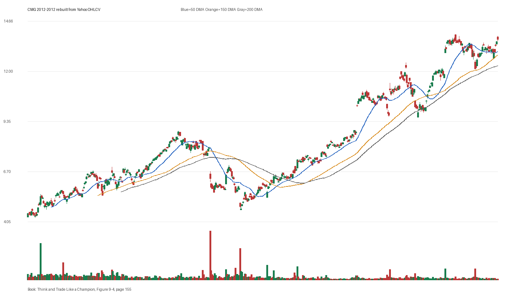

# Figure 9-4 - CMG - Page 155

## Source Image

Book: [[Think and Trade Like a Champion]]

Caption: Chipotle Mexican Grill (CMG) October 2012. The numerator of the P/E is the stock’s current price. The denominator is earnings. With a growth stock, we would expect that the price would be multiples of its earnings because people are buying the stock now in anticipation of future earnings growth. But as a stock becomes more popular -now it’s on everybody’s radar-the price can get too far ahead of the reality of what t

## Yahoo OHLCV Rebuild

Download status: `OK`

CSV: `data/book_stock_images/think-and-trade-like-a-champion-figure-9-4-cmg-page-155_ohlcv.csv`

## Pattern Read

Tags: volume-dry-up, stage-2-leadership

Concepts: [[Relative Strength Leadership]], [[Stage 2 Uptrend]], [[Trend Template]], [[Volume Dry-Up and Accumulation]]

Volume contraction supports the idea that supply was drying up near the tight area.

## Reconciliation Metrics

| Metric | Value |
|---|---:|
| first_close | 4.4726 |
| last_close | 13.6982 |
| max_gain_pct | 212.09 |
| max_drawdown_from_period_high_pct | -47.15 |
| first_half_depth_pct | 107.64 |
| second_half_depth_pct | 162.36 |
| tightening | False |
| volume_dryup | True |
| best_trend_template_score | 5/5 |
| latest_trend_template_score | 5/5 |

## Trend Template Checks

- close > 50 DMA
- close > 150 DMA
- close > 200 DMA
- 50 DMA > 150 DMA
- 150 DMA > 200 DMA

## Study Questions

- Does the rebuilt OHLCV chart confirm the same structure shown in the book image?
- Was the stock close to a definable pivot, or already extended?
- Did volume dry up before the move, or was supply still obvious?
- Was this a buy lesson, a sell lesson, or a failure-avoidance lesson?
- What would invalidate the setup if this were being traded live?

<!-- STAGE_LIFECYCLE_START -->
## Stage Lifecycle & Base Concept Analysis
> This section analyzes the FULL LIFECYCLE of the stock around the inferred entry — Stage 1 (Accumulation), Stage 2 (Advance), Stage 3 (Distribution), Stage 4 (Decline) — plus deep base concept analysis, VCP footprint, tight footprint, supply dynamics, and contraction timeline.
- Status: `ok`
- Entry date: `2012-02-27`
- Entry price: `7.7778`
### Stage Lifecycle Overview
| Stage | Present | Start Date | End Date | Duration | Key Signal |
|---|---|---|---:|---|---|
| Stage 1 — Accumulation | ✅ | `2011-05-26` | `2012-03-13` | 200 days | Base: deep-chaotic |
| Stage 2 — Advance | ✅ | `2012-03-13` | `2012-06-27` | 74 days | Max gain: 10.6% |
| Stage 3 — Distribution | ✅ | `2012-06-27` | `2012-07-19` | 15 days | climax vol |
| Stage 4 — Decline | ✅ | `2012-07-20` | — | 235 days | Below 200 DMA: False |
### Stage 1 — Accumulation / Base Building
- Base type: `deep-chaotic`
- Lowest price in base: `5.3500`
- Volume pattern: `accumulation-dryup`
### Stage 2 — Advance / Trend Pivots

- Number of significant pivots during advance: `2`

| Pivot Date | Price |
|---|---:|
| `2012-04-13` | `8.8500` |
| `2012-05-29` | `8.3600` |

#### Trend Template Evolution During Stage 2

| % Through Stage 2 | Date | Score |
|---|---|---:|
| 0% | `2012-03-13` | 7/7 |
| 25% | `2012-04-09` | 7/7 |
| 50% | `2012-05-04` | 6/7 |
| 75% | `2012-05-31` | 6/7 |
| 100% | `2012-06-27` | 6/7 |

### Base Concept Deep-Dive

- Base type: `N/A`
- Base duration: `0 sessions`
- Base depth: `N/A`
- Base high: `N/A`
- Base low: `N/A`
- Resistance touches at base high: `0`
- Support touches at base low: `0`
- Contraction count: `0`
- Contraction quality: `N/A`
- Pivot clarity: `N/A`
- Pivot distance at entry: `N/A`
- Volume dry-up in base: `N/A`
- Volume dry-up ratio: `N/A`
- Tightness at pivot (10d): `N/A`
- Weekly tightness: `N/A`

### VCP Footprint

- VCP present: `False`
- No clear VCP pattern detected in the base.

### Tight Footprint

- 10-session tightness at entry: `3.1%`
- 20-session tightness at entry: `6.8%`
- Weekly tightness: `2.9%`
- ATR20 %: `1.57`
- Tightness progression: `improving`

### Supply Analysis

- Supply label: `neutral`
- Volume dry-up ratio: `0.98`
- Distribution volume detected: `False`
- Accumulation volume detected: `False`

### Concept Tie-Back

- Related concepts: [[Base Concept]], [[Stage 2 Uptrend]], [[Trend Template]], [[Stage 3 Distribution]], [[Stage 4 Decline]]
- Lesson: Stage 1 base was deep-chaotic with 50.1% depth. Stage 2 advance lasted 75 sessions with 2 significant pivots.

<!-- STAGE_LIFECYCLE_END -->
<!-- PRE_ENTRY_SENSE_CHECK_START -->

## Pre-Entry Sense Check

> This section analyzes the chart structure PRIOR to the inferred entry. It answers: What did the setup look like in the weeks and months before the trade? Which Minervini concepts were already visible?

- Status: `ok`
- Entry date: `2012-02-27`
- Pre-entry history available: `189 sessions`

### Trend Template Evolution

| Lookback | Date | Score | Assessment |
|---|---|---:|:---|
| 60 days before |  | 0/7 | N/A |
| 40 days before |  | 0/7 | N/A |
| 20 days before |  | 0/7 | N/A |

### Pre-Entry Context Window

- Context window (last sessions before entry): `150 sessions`
- Range high: `7.7600`
- Range low: `5.4300`
- Total range depth: `42.9%`
- Contraction phases (rolling 21-bar segments): `21.8% -> 27.7% -> 20.4% -> 13.7% -> 13.8% -> 11.8% -> 8.6%`

### Stage 2 Onset

- First sustained Stage 2 date: `2012-03-13`
- Days in Stage 2 before entry: `-11`

### Volume Behavior Before Entry

- Volume dry-up label: `neutral`
- Recent/base volume ratio: `0.98`
- Volume spike dates (2.5x avg) in last 40 days: `2012-02-02`

### Tightness Progression

| Lookback | 10-Session Close Tightness |
|---|---:|
| 40 days before | `6.7%` |
| 20 days before | `5.2%` |
| Final 10 sessions before | `3.1%` |
| Final 3 weekly closes | `2.9%` |

### Moving Average Alignment

- 50/150/200 DMA alignment: `not achieved before entry`

### Shakeouts / Tests Before Entry

- No shakeouts or undercut-recover patterns detected in last 40 sessions before entry.

### 52-Week High Context

| Timing | Distance from 52W High |
|---|---:|
| 60 days before | `N/A` |
| 20 days before | `N/A` |
| At entry | `-0.4%` |

### Concept Tie-Back

- Related concepts: [[Volatility Contraction Pattern]], [[Pivot and Entry]]
- Lesson: No clear Stage 2 uptrend was visible before entry — treat as cautionary. Total pre-entry range was 42.9% — wide range indicating significant prior movement. Volume did not show clear dry-up — supply may still be present.

<!-- PRE_ENTRY_SENSE_CHECK_END -->
<!-- SEPA_REPLICATION_START -->

## SEPA Trade Replication

> Study note: this reconstructs a likely Minervini-style setup area from the real OHLCV window shown by the book timing. It does not claim to know Minervini's private fill, sizing, or unpublished execution.

- Status: `reconstructed-from-real-ohlcv`
- Setup type: `vcp/contraction-study`
- Confidence: `high`
- Timing source: `2012-2012` from the figure caption and rebuilt OHLCV where available.
- Inferred study entry date: `2012-02-27`
- Inferred study entry price: `7.7778`
- Inferred pivot: `7.7598`
- Inferred stop / invalidation: `7.3206`
- Pivot extension at entry: `0.2%`
- Stop distance / risk: `6.2%`
- Trend Template score at entry: `7/7`

### Tightness And Supply
- 3-part pre-entry contraction depth: `13.8% -> 10.1% -> 8.2%`
- Contraction quality: `clear-tightening`
- 10-session close tightness: `3.1%`
- 3-week close tightness: `2.9%`
- Volume dry-up: `neutral`
- Recent/base median volume ratio: `0.98`
- Leadership proxy: 65-day return 27.3% and 126-day return 34.5%

### Post-Entry Reality Check
- Max gain after 20 sessions: `9.4%`
- Max gain after 60 sessions: `13.8%`
- Max gain after 120 sessions: `13.8%`
- Worst drawdown after 20 sessions: `-0.6%`
- Inferred stop failed within 20 sessions: `False`
- Pivot broadly respected within 20 sessions: `True`

### Concept Tie-Back

- Related concepts: [[Risk First]], [[Volatility Contraction Pattern]], [[Volume Dry-Up and Accumulation]], [[Pivot and Entry]], [[Trend Template]], [[Stage 2 Uptrend]], [[Relative Strength Leadership]]
- Lesson: The reconstructed data suggests price was becoming more controllable before the inferred entry; risk was close enough for a clean SEPA-style test; the pivot was broadly respected after entry.

<!-- SEPA_REPLICATION_END -->
