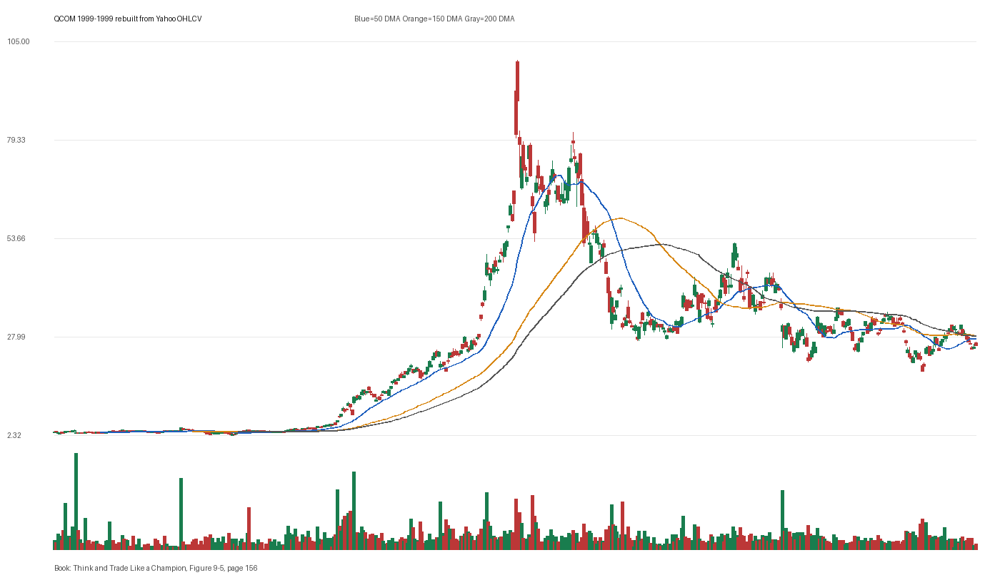

# Figure 9-5 - QCOM - Page 156

## Source Image

Book: [[Think and Trade Like a Champion]]

Caption: Qualcomm (QCOM) 1999. Stock staged a climax top. +260% in two months

## Yahoo OHLCV Rebuild

Download status: `OK`

CSV: `data/book_stock_images/think-and-trade-like-a-champion-figure-9-5-qcom-page-156_ohlcv.csv`

## Pattern Read

Tags: vcp-or-tightening, volume-dry-up, climax-or-exhaustion, stage-2-leadership

Concepts: [[Pivot and Entry]], [[Relative Strength Leadership]], [[Sell Rules and Failure Signals]], [[Stage 2 Uptrend]], [[Trend Template]], [[Volatility Contraction Pattern]], [[Volume Dry-Up and Accumulation]]

The useful clue is contraction: the later portion of the window became tighter than the earlier portion. Volume contraction supports the idea that supply was drying up near the tight area.

## Reconciliation Metrics

| Metric | Value |
|---|---:|
| first_close | 3.2383 |
| last_close | 25.9 |
| max_gain_pct | 2988.06 |
| max_drawdown_from_period_high_pct | -80.84 |
| first_half_depth_pct | 2700.0 |
| second_half_depth_pct | 422.06 |
| tightening | True |
| volume_dryup | True |
| best_trend_template_score | 5/5 |
| latest_trend_template_score | 1/5 |

## Trend Template Checks

- 150 DMA > 200 DMA

## Study Questions

- Does the rebuilt OHLCV chart confirm the same structure shown in the book image?
- Was the stock close to a definable pivot, or already extended?
- Did volume dry up before the move, or was supply still obvious?
- Was this a buy lesson, a sell lesson, or a failure-avoidance lesson?
- What would invalidate the setup if this were being traded live?

<!-- STAGE_LIFECYCLE_START -->
## Stage Lifecycle & Base Concept Analysis
> This section analyzes the FULL LIFECYCLE of the stock around the inferred entry — Stage 1 (Accumulation), Stage 2 (Advance), Stage 3 (Distribution), Stage 4 (Decline) — plus deep base concept analysis, VCP footprint, tight footprint, supply dynamics, and contraction timeline.
- Status: `ok`
- Entry date: `1999-06-17`
- Entry price: `14.9922`
### Stage Lifecycle Overview
| Stage | Present | Start Date | End Date | Duration | Key Signal |
|---|---|---|---:|---|---|
| Stage 1 — Accumulation | ✅ | `1998-05-26` | `1999-03-11` | 200 days | Base: deep-chaotic |
| Stage 2 — Advance | ✅ | `1999-03-11` | `2000-01-26` | 222 days | Max gain: 1890.7% |
| Stage 3 — Distribution | ✅ | `2000-01-27` | `2000-05-17` | 77 days | no climax |
| Stage 4 — Decline | ✅ | `2000-05-18` | — | 28 days | Below 200 DMA: True |
### Stage 1 — Accumulation / Base Building
- Base type: `deep-chaotic`
- Lowest price in base: `2.3600`
- Volume pattern: `late-supply`
### Stage 2 — Advance / Trend Pivots

- Number of significant pivots during advance: `5`

| Pivot Date | Price |
|---|---:|
| `1999-05-13` | `14.9700` |
| `1999-07-20` | `20.9100` |
| `1999-08-26` | `24.8300` |
| `1999-10-11` | `28.0900` |
| `1999-11-15` | `50.7700` |

#### Trend Template Evolution During Stage 2

| % Through Stage 2 | Date | Score |
|---|---|---:|
| 0% | `1999-03-11` | 7/7 |
| 25% | `1999-05-28` | 7/7 |
| 50% | `1999-08-18` | 7/7 |
| 75% | `1999-11-04` | 7/7 |
| 100% | `2000-01-26` | 6/7 |

### Base Concept Deep-Dive

- Base type: `deep-chaotic`
- Base duration: `70 sessions`
- Base depth: `215.3%`
- Base high: `15.0000`
- Base low: `4.7600`
- Resistance touches at base high: `4`
- Support touches at base low: `2`
- Contraction count: `4`
- Contraction quality: `mixed-or-loose`
- Pivot clarity: `clear-pivot-at-high`
- Pivot distance at entry: `-0.1%`
- Volume dry-up in base: `moderate-dry-up`
- Volume dry-up ratio: `0.56`
- Tightness at pivot (10d): `16.7%`
- Weekly tightness: `10.3%`

### VCP Footprint

- VCP present: `True`
- VCP quality: `mixed`
- Total contraction depth: `67.7%`
- Final contraction depth: `39.1%`
- Number of contractions: `4`

| Phase | Date | Depth | Volume | Tightness |
|---|---|---:|---:|---:|
| C? | `1999-03-10` | 59.2% | 29947200.0 | 46.0% |
| C? | `1999-03-31` | 67.7% | 67347200.0 | 56.5% |
| C? | `1999-04-22` | 29.2% | 44038400.0 | 17.6% |
| C? | `1999-05-13` | 39.1% | 29304000.0 | 11.7% |

### Tight Footprint

- 10-session tightness at entry: `16.0%`
- 20-session tightness at entry: `29.4%`
- Weekly tightness: `8.9%`
- ATR20 %: `5.71`
- Tightness progression: `worsening`

### Supply Analysis

- Supply label: `diminishing`
- Volume dry-up ratio: `0.58`
- Distribution volume detected: `False`
- Accumulation volume detected: `True`
- Climax volume dates: `1999-04-21, 1999-04-22, 1999-04-26`

### Contraction Timeline

| Phase | Start Date | Depth | Volume | Tightness |
|---|---|---:|---:|---:|
| C1 | `1999-03-10` | 59.2% | 29947200.0 | 46.0% |
| C2 | `1999-03-31` | 67.7% | 67347200.0 | 56.5% |
| C3 | `1999-04-22` | 29.2% | 44038400.0 | 17.6% |
| C4 | `1999-05-13` | 39.1% | 29304000.0 | 11.7% |

### Concept Tie-Back

- Related concepts: [[Base Concept]], [[Stage 2 Uptrend]], [[Trend Template]], [[Stage 3 Distribution]], [[Stage 4 Decline]], [[Volatility Contraction Pattern]], [[Pivot and Entry]], [[Volume Dry-Up and Accumulation]], [[Supply and Demand]]
- Lesson: Stage 1 base was deep-chaotic with 113.1% depth. Stage 2 advance lasted 223 sessions with 5 significant pivots. VCP footprint shows 4 contractions with mixed quality. Supply was diminishing before entry.

<!-- STAGE_LIFECYCLE_END -->
<!-- PRE_ENTRY_SENSE_CHECK_START -->

## Pre-Entry Sense Check

> This section analyzes the chart structure PRIOR to the inferred entry. It answers: What did the setup look like in the weeks and months before the trade? Which Minervini concepts were already visible?

- Status: `ok`
- Entry date: `1999-06-17`
- Pre-entry history available: `268 sessions`

### Trend Template Evolution

| Lookback | Date | Score | Assessment |
|---|---|---:|:---|
| 60 days before | 1999-03-23 | 7/7 | ✅ Stage 2 confirmed |
| 40 days before | 1999-04-21 | 7/7 | ✅ Stage 2 confirmed |
| 20 days before | 1999-05-19 | 7/7 | ✅ Stage 2 confirmed |

### Pre-Entry Context Window

- Context window (last sessions before entry): `150 sessions`
- Range high: `14.9700`
- Range low: `3.0600`
- Total range depth: `388.8%`
- Contraction phases (rolling 21-bar segments): `16.2% -> 27.0% -> 23.0% -> 28.3% -> 128.2% -> 91.7% -> 39.1%`

### Stage 2 Onset

- First sustained Stage 2 date: `1999-03-11`
- Days in Stage 2 before entry: `68`

### Volume Behavior Before Entry

- Volume dry-up label: `moderate-dry-up`
- Recent/base volume ratio: `0.58`
- Volume spike dates (2.5x avg) in last 40 days: `1999-04-21`

### Tightness Progression

| Lookback | 10-Session Close Tightness |
|---|---:|
| 40 days before | `36.2%` |
| 20 days before | `13.0%` |
| Final 10 sessions before | `16.0%` |
| Final 3 weekly closes | `8.9%` |

### Moving Average Alignment

- 50/150/200 DMA first aligned (50>150>200): `1999-03-11`

### Shakeouts / Tests Before Entry

- No shakeouts or undercut-recover patterns detected in last 40 sessions before entry.

### 52-Week High Context

| Timing | Distance from 52W High |
|---|---:|
| 60 days before | `N/A` |
| 20 days before | `N/A` |
| At entry | `-0.1%` |

### Concept Tie-Back

- Related concepts: [[Stage 2 Uptrend]], [[Trend Template]], [[Relative Strength Leadership]], [[Volume Dry-Up and Accumulation]]
- Lesson: Stage 2 was established 68 days before entry, confirming leadership context. Total pre-entry range was 388.8% — wide range indicating significant prior movement. Volume dried up before entry, suggesting supply absorption.

<!-- PRE_ENTRY_SENSE_CHECK_END -->
<!-- SEPA_REPLICATION_START -->

## SEPA Trade Replication

> Study note: this reconstructs a likely Minervini-style setup area from the real OHLCV window shown by the book timing. It does not claim to know Minervini's private fill, sizing, or unpublished execution.

- Status: `reconstructed-from-real-ohlcv`
- Setup type: `climax-risk-study`
- Confidence: `high`
- Timing source: `1999-1999` from the figure caption and rebuilt OHLCV where available.
- Inferred study entry date: `1999-06-17`
- Inferred study entry price: `14.9922`
- Inferred pivot: `14.9688`
- Inferred stop / invalidation: `10.7578`
- Pivot extension at entry: `0.2%`
- Stop distance / risk: `39.4%`
- Trend Template score at entry: `7/7`

### Tightness And Supply
- 3-part pre-entry contraction depth: `123.0% -> 94.7% -> 38.0%`
- Contraction quality: `clear-tightening`
- 10-session close tightness: `16.0%`
- 3-week close tightness: `8.9%`
- Volume dry-up: `moderate-dry-up`
- Recent/base median volume ratio: `0.58`
- Leadership proxy: 65-day return 196.6% and 126-day return 364.1%

### Post-Entry Reality Check
- Max gain after 20 sessions: `33.3%`
- Max gain after 60 sessions: `65.6%`
- Max gain after 120 sessions: `239.8%`
- Worst drawdown after 20 sessions: `-2.7%`
- Inferred stop failed within 20 sessions: `False`
- Pivot broadly respected within 20 sessions: `True`

### Concept Tie-Back

- Related concepts: [[Risk First]], [[Volatility Contraction Pattern]], [[Volume Dry-Up and Accumulation]], [[Pivot and Entry]], [[Sell Rules and Failure Signals]], [[Trend Template]], [[Stage 2 Uptrend]], [[Relative Strength Leadership]]
- Lesson: Treat this as an exhaustion study, not a fresh buy setup. The Minervini lesson is to recognize when a leader has become too vertical or emotionally obvious and risk should be reduced.

<!-- SEPA_REPLICATION_END -->
