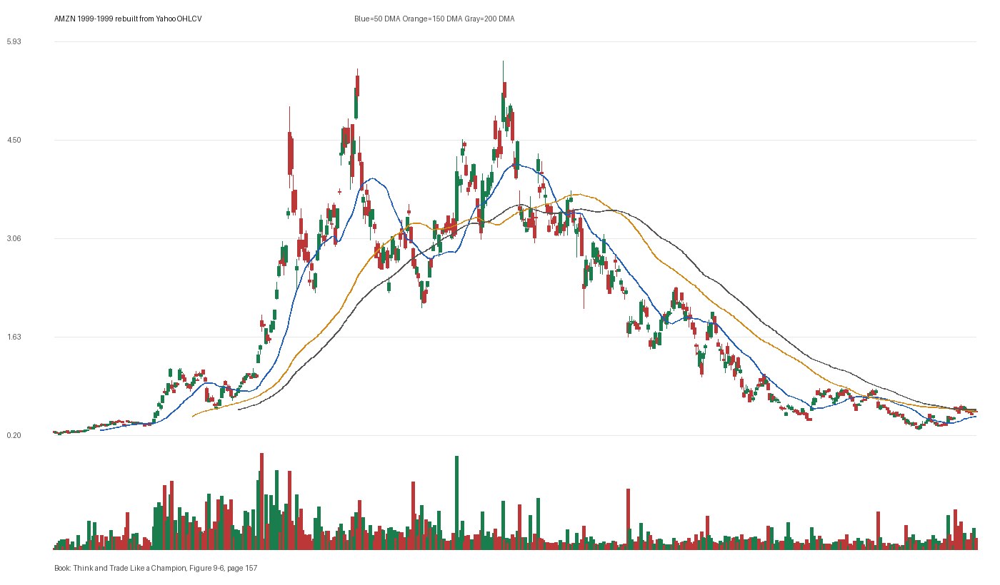

# Figure 9-6 - AMZN - Page 157

## Source Image

Book: [[Think and Trade Like a Champion]]

Caption: Amazon.com (AMZN) 1999. Stock topped in epic fashion: it ran up 97 percent in just six days. The stock price then fell 95 percent-from above $100 to $5.51 a share, and took 10 years to get back to its previous level. SELLING INTO STRENGTH-SPECIFIC THINGS TO WATCH Let’s say the stock you bought some time ago is now in a late stage, as you confirm by counting bases. You can tell by the P/E expansion that the stock appr

## Yahoo OHLCV Rebuild

Download status: `OK`

CSV: `data/book_stock_images/think-and-trade-like-a-champion-figure-9-6-amzn-page-157_ohlcv.csv`

## Pattern Read

Tags: vcp-or-tightening, stage-2-leadership

Concepts: [[Pivot and Entry]], [[Relative Strength Leadership]], [[Stage 2 Uptrend]], [[Trend Template]], [[Volatility Contraction Pattern]], [[Volume Dry-Up and Accumulation]]

The useful clue is contraction: the later portion of the window became tighter than the earlier portion.

## Reconciliation Metrics

| Metric | Value |
|---|---:|
| first_close | 0.2479 |
| last_close | 0.545 |
| max_gain_pct | 2178.99 |
| max_drawdown_from_period_high_pct | -95.12 |
| first_half_depth_pct | 2625.62 |
| second_half_depth_pct | 1560.62 |
| tightening | True |
| volume_dryup | False |
| best_trend_template_score | 5/5 |
| latest_trend_template_score | 1/5 |

## Trend Template Checks

- close > 50 DMA

## Study Questions

- Does the rebuilt OHLCV chart confirm the same structure shown in the book image?
- Was the stock close to a definable pivot, or already extended?
- Did volume dry up before the move, or was supply still obvious?
- Was this a buy lesson, a sell lesson, or a failure-avoidance lesson?
- What would invalidate the setup if this were being traded live?

<!-- STAGE_LIFECYCLE_START -->
## Stage Lifecycle & Base Concept Analysis
> This section analyzes the FULL LIFECYCLE of the stock around the inferred entry — Stage 1 (Accumulation), Stage 2 (Advance), Stage 3 (Distribution), Stage 4 (Decline) — plus deep base concept analysis, VCP footprint, tight footprint, supply dynamics, and contraction timeline.
- Status: `ok`
- Entry date: `1999-10-07`
- Entry price: `4.3656`
### Stage Lifecycle Overview
| Stage | Present | Start Date | End Date | Duration | Key Signal |
|---|---|---|---:|---|---|
| Stage 1 — Accumulation | ✅ | `1998-05-26` | `1999-03-24` | 209 days | Base: deep-chaotic |
| Stage 2 — Advance | ✅ | `1999-03-24` | `1999-04-30` | 26 days | Max gain: 78.9% |
| Stage 3 — Distribution | ✅ | `1999-05-03` | `1999-06-11` | 28 days | no climax |
| Stage 4 — Decline | ✅ | `1999-06-14` | — | 264 days | Below 200 DMA: False |
### Stage 1 — Accumulation / Base Building
- Base type: `deep-chaotic`
- Lowest price in base: `0.3300`
- Volume pattern: `neutral`
### Base Concept Deep-Dive

- Base type: `deep-chaotic`
- Base duration: `139 sessions`
- Base depth: `169.8%`
- Base high: `5.5300`
- Base low: `2.0500`
- Resistance touches at base high: `1`
- Support touches at base low: `2`
- Contraction count: `5`
- Contraction quality: `constructive-tightening`
- Pivot clarity: `below-pivot-caution`
- Pivot distance at entry: `-21.1%`
- Volume dry-up in base: `neutral`
- Volume dry-up ratio: `1.0`
- Tightness at pivot (10d): `39.6%`
- Weekly tightness: `34.3%`

### VCP Footprint

- VCP present: `True`
- VCP quality: `constructive-tightening`
- Total contraction depth: `94.1%`
- Final contraction depth: `51.5%`
- Number of contractions: `5`

| Phase | Date | Depth | Volume | Tightness |
|---|---|---:|---:|---:|
| C? | `1999-03-23` | 94.1% | 318336000.0 | 32.2% |
| C? | `1999-04-30` | 85.3% | 310204000.0 | 15.1% |
| C? | `1999-06-09` | 58.8% | 297724000.0 | 18.9% |
| C? | `1999-07-19` | 66.6% | 424376000.0 | 32.0% |
| C? | `1999-08-25` | 51.5% | 248418000.0 | 29.7% |

### Tight Footprint

- 10-session tightness at entry: `32.4%`
- 20-session tightness at entry: `32.4%`
- Weekly tightness: `26.8%`
- ATR20 %: `6.03`
- Tightness progression: `worsening`

### Supply Analysis

- Supply label: `demand-dominant`
- Volume dry-up ratio: `0.96`
- Distribution volume detected: `False`
- Accumulation volume detected: `True`
- Climax volume dates: `1999-09-29`

### Contraction Timeline

| Phase | Start Date | Depth | Volume | Tightness |
|---|---|---:|---:|---:|
| C1 | `1999-03-23` | 94.1% | 318336000.0 | 32.2% |
| C2 | `1999-04-30` | 85.3% | 310204000.0 | 15.1% |
| C3 | `1999-06-09` | 58.8% | 297724000.0 | 18.9% |
| C4 | `1999-07-19` | 66.6% | 424376000.0 | 32.0% |
| C5 | `1999-08-25` | 51.5% | 248418000.0 | 29.7% |

### Concept Tie-Back

- Related concepts: [[Base Concept]], [[Stage 2 Uptrend]], [[Trend Template]], [[Stage 3 Distribution]], [[Stage 4 Decline]], [[Volatility Contraction Pattern]], [[Pivot and Entry]]
- Lesson: Stage 1 base was deep-chaotic with 1398.1% depth. Stage 2 advance lasted 27 sessions with 0 significant pivots. VCP footprint shows 5 contractions with constructive-tightening quality.

<!-- STAGE_LIFECYCLE_END -->
<!-- PRE_ENTRY_SENSE_CHECK_START -->

## Pre-Entry Sense Check

> This section analyzes the chart structure PRIOR to the inferred entry. It answers: What did the setup look like in the weeks and months before the trade? Which Minervini concepts were already visible?

- Status: `ok`
- Entry date: `1999-10-07`
- Pre-entry history available: `346 sessions`

### Trend Template Evolution

| Lookback | Date | Score | Assessment |
|---|---|---:|:---|
| 60 days before | 1999-07-14 | 5/7 | 🟡 Transitioning |
| 40 days before | 1999-08-11 | 2/7 | 🔴 Not yet Stage 2 |
| 20 days before | 1999-09-09 | 4/7 | 🟡 Transitioning |

### Pre-Entry Context Window

- Context window (last sessions before entry): `150 sessions`
- Range high: `5.5300`
- Range low: `2.0500`
- Total range depth: `169.8%`
- Contraction phases (rolling 21-bar segments): `64.5% -> 57.5% -> 58.4% -> 44.3% -> 59.0% -> 65.3% -> 48.1%`

### Stage 2 Onset

- First sustained Stage 2 date: `1999-03-11`
- Days in Stage 2 before entry: `146`

### Volume Behavior Before Entry

- Volume dry-up label: `neutral`
- Recent/base volume ratio: `0.96`
- Volume spike dates (2.5x avg) in last 40 days: `1999-09-29`

### Tightness Progression

| Lookback | 10-Session Close Tightness |
|---|---:|
| 40 days before | `23.7%` |
| 20 days before | `11.6%` |
| Final 10 sessions before | `32.4%` |
| Final 3 weekly closes | `26.8%` |

### Moving Average Alignment

- 50/150/200 DMA first aligned (50>150>200): `1999-03-11`

### Shakeouts / Tests Before Entry

- No shakeouts or undercut-recover patterns detected in last 40 sessions before entry.

### 52-Week High Context

| Timing | Distance from 52W High |
|---|---:|
| 60 days before | `-39.0%` |
| 20 days before | `-42.5%` |
| At entry | `-21.1%` |

### Concept Tie-Back

- Related concepts: [[Stage 2 Uptrend]], [[Trend Template]], [[Relative Strength Leadership]], [[Volatility Contraction Pattern]], [[Pivot and Entry]]
- Lesson: Stage 2 was established 146 days before entry, confirming leadership context. Total pre-entry range was 169.8% — wide range indicating significant prior movement. Volume did not show clear dry-up — supply may still be present.

<!-- PRE_ENTRY_SENSE_CHECK_END -->
<!-- SEPA_REPLICATION_START -->

## SEPA Trade Replication

> Study note: this reconstructs a likely Minervini-style setup area from the real OHLCV window shown by the book timing. It does not claim to know Minervini's private fill, sizing, or unpublished execution.

- Status: `reconstructed-from-real-ohlcv`
- Setup type: `vcp/contraction-study`
- Confidence: `high`
- Timing source: `1999-1999` from the figure caption and rebuilt OHLCV where available.
- Inferred study entry date: `1999-10-07`
- Inferred study entry price: `4.3656`
- Inferred pivot: `4.2500`
- Inferred stop / invalidation: `3.0344`
- Pivot extension at entry: `2.7%`
- Stop distance / risk: `43.9%`
- Trend Template score at entry: `6/7`

### Tightness And Supply
- 3-part pre-entry contraction depth: `73.8% -> 65.3% -> 40.1%`
- Contraction quality: `clear-tightening`
- 10-session close tightness: `32.4%`
- 3-week close tightness: `26.8%`
- Volume dry-up: `neutral`
- Recent/base median volume ratio: `0.96`
- Leadership proxy: 65-day return 43.3% and 126-day return -4.5%

### Post-Entry Reality Check
- Max gain after 20 sessions: `2.5%`
- Max gain after 60 sessions: `29.4%`
- Max gain after 120 sessions: `29.4%`
- Worst drawdown after 20 sessions: `-30.1%`
- Inferred stop failed within 20 sessions: `False`
- Pivot broadly respected within 20 sessions: `False`

### Concept Tie-Back

- Related concepts: [[Risk First]], [[Volatility Contraction Pattern]], [[Volume Dry-Up and Accumulation]], [[Pivot and Entry]], [[Trend Template]], [[Stage 2 Uptrend]], [[Relative Strength Leadership]]
- Lesson: The reconstructed data suggests price was becoming more controllable before the inferred entry; risk was wide, so the entry would need smaller size or a better cheat point.

<!-- SEPA_REPLICATION_END -->
