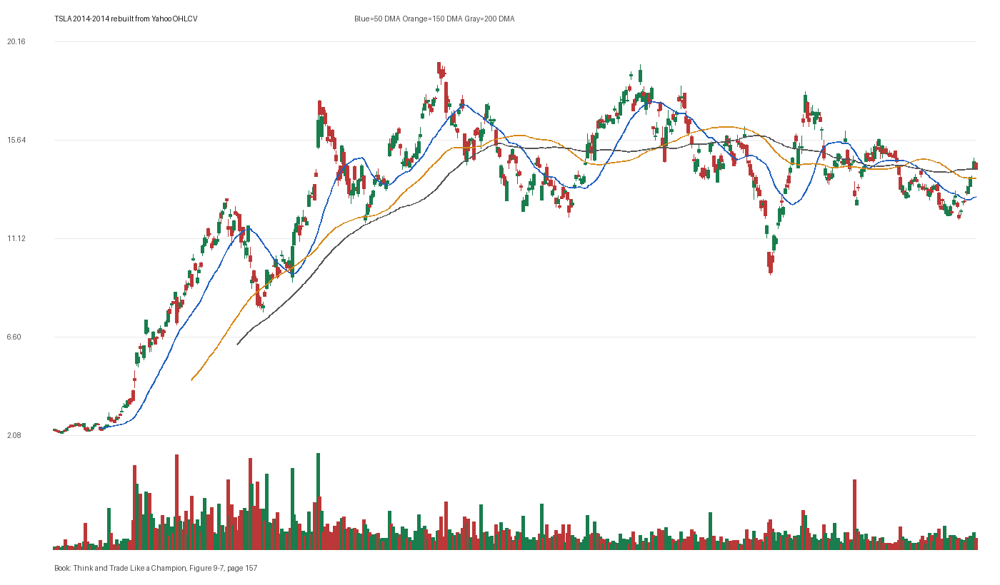

# Figure 9-7 - TSLA - Page 157

## Source Image

Book: [[Think and Trade Like a Champion]]

Caption: Tesla Motors (TSLA) 2014. After making a more than ninefold move in 16 months, Tesla Motors experienced a climax run; the stock doubled in just 30 days. During the last 14 days, the stock ran up 51 percent on three gaps; 10 of 14 days were up

## Yahoo OHLCV Rebuild

Download status: `OK`

CSV: `data/book_stock_images/think-and-trade-like-a-champion-figure-9-7-tsla-page-157_ohlcv.csv`

## Pattern Read

Tags: vcp-or-tightening, climax-or-exhaustion, stage-2-leadership

Concepts: [[Pivot and Entry]], [[Relative Strength Leadership]], [[Sell Rules and Failure Signals]], [[Stage 2 Uptrend]], [[Trend Template]], [[Volatility Contraction Pattern]], [[Volume Dry-Up and Accumulation]]

The useful clue is contraction: the later portion of the window became tighter than the earlier portion.

## Reconciliation Metrics

| Metric | Value |
|---|---:|
| first_close | 2.3573 |
| last_close | 14.246 |
| max_gain_pct | 724.15 |
| max_drawdown_from_period_high_pct | -51.6 |
| first_half_depth_pct | 807.57 |
| second_half_depth_pct | 103.23 |
| tightening | True |
| volume_dryup | False |
| best_trend_template_score | 5/5 |
| latest_trend_template_score | 2/5 |

## Trend Template Checks

- close > 50 DMA
- close > 150 DMA

## Study Questions

- Does the rebuilt OHLCV chart confirm the same structure shown in the book image?
- Was the stock close to a definable pivot, or already extended?
- Did volume dry up before the move, or was supply still obvious?
- Was this a buy lesson, a sell lesson, or a failure-avoidance lesson?
- What would invalidate the setup if this were being traded live?

<!-- STAGE_LIFECYCLE_START -->
## Stage Lifecycle & Base Concept Analysis
> This section analyzes the FULL LIFECYCLE of the stock around the inferred entry — Stage 1 (Accumulation), Stage 2 (Advance), Stage 3 (Distribution), Stage 4 (Decline) — plus deep base concept analysis, VCP footprint, tight footprint, supply dynamics, and contraction timeline.
- Status: `ok`
- Entry date: `2014-08-29`
- Entry price: `17.9800`
### Stage Lifecycle Overview
| Stage | Present | Start Date | End Date | Duration | Key Signal |
|---|---|---|---:|---|---|
| Stage 1 — Accumulation | ✅ | `2013-05-28` | `2014-05-21` | 248 days | Base: deep-chaotic |
| Stage 2 — Advance | ✅ | `2014-05-21` | `2014-10-10` | 99 days | Max gain: 46.1% |
| Stage 3 — Distribution | ✅ | `2014-11-21` | `2014-11-28` | 4 days | no climax |
| Stage 4 — Decline | ✅ | `2014-12-01` | — | 144 days | Below 200 DMA: False |
### Stage 1 — Accumulation / Base Building
- Base type: `deep-chaotic`
- Lowest price in base: `5.8800`
- Volume pattern: `neutral`
### Stage 2 — Advance / Trend Pivots

- Number of significant pivots during advance: `3`

| Pivot Date | Price |
|---|---:|
| `2014-06-30` | `16.3000` |
| `2014-08-13` | `17.7100` |
| `2014-09-04` | `19.4300` |

#### Trend Template Evolution During Stage 2

| % Through Stage 2 | Date | Score |
|---|---|---:|
| 0% | `2014-05-21` | 6/7 |
| 25% | `2014-06-25` | 7/7 |
| 50% | `2014-07-31` | 7/7 |
| 75% | `2014-09-05` | 7/7 |
| 100% | `2014-10-10` | 6/7 |

### Base Concept Deep-Dive

- Base type: `deep-chaotic`
- Base duration: `72 sessions`
- Base depth: `40.9%`
- Base high: `18.1300`
- Base low: `12.8700`
- Resistance touches at base high: `2`
- Support touches at base low: `2`
- Contraction count: `4`
- Contraction quality: `mixed-or-loose`
- Pivot clarity: `clear-pivot-at-high`
- Pivot distance at entry: `-0.8%`
- Volume dry-up in base: `moderate-dry-up`
- Volume dry-up ratio: `0.68`
- Tightness at pivot (10d): `6.0%`
- Weekly tightness: `5.0%`

### VCP Footprint

- VCP present: `False`
- No clear VCP pattern detected in the base.

### Tight Footprint

- 10-session tightness at entry: `3.7%`
- 20-session tightness at entry: `13.1%`
- Weekly tightness: `2.8%`
- ATR20 %: `2.52`
- Tightness progression: `stable`

### Supply Analysis

- Supply label: `diminishing`
- Volume dry-up ratio: `0.68`
- Distribution volume detected: `False`
- Accumulation volume detected: `False`

### Contraction Timeline

| Phase | Start Date | Depth | Volume | Tightness |
|---|---|---:|---:|---:|
| C1 | `2014-05-20` | 11.3% | 60819000.0 | 3.9% |
| C2 | `2014-06-11` | 22.7% | 87024000.0 | 5.7% |
| C3 | `2014-07-02` | 13.5% | 69741000.0 | 5.2% |
| C4 | `2014-07-24` | 20.3% | 95734500.0 | 16.6% |

### Concept Tie-Back

- Related concepts: [[Base Concept]], [[Stage 2 Uptrend]], [[Trend Template]], [[Stage 3 Distribution]], [[Stage 4 Decline]], [[Volume Dry-Up and Accumulation]], [[Supply and Demand]]
- Lesson: Stage 1 base was deep-chaotic with 200.3% depth. Stage 2 advance lasted 100 sessions with 3 significant pivots. Supply was diminishing before entry.

<!-- STAGE_LIFECYCLE_END -->
<!-- PRE_ENTRY_SENSE_CHECK_START -->

## Pre-Entry Sense Check

> This section analyzes the chart structure PRIOR to the inferred entry. It answers: What did the setup look like in the weeks and months before the trade? Which Minervini concepts were already visible?

- Status: `ok`
- Entry date: `2014-08-29`
- Pre-entry history available: `318 sessions`

### Trend Template Evolution

| Lookback | Date | Score | Assessment |
|---|---|---:|:---|
| 60 days before | 2014-06-05 | 7/7 | ✅ Stage 2 confirmed |
| 40 days before | 2014-07-03 | 7/7 | ✅ Stage 2 confirmed |
| 20 days before | 2014-08-01 | 7/7 | ✅ Stage 2 confirmed |

### Pre-Entry Context Window

- Context window (last sessions before entry): `150 sessions`
- Range high: `17.8200`
- Range low: `10.9800`
- Total range depth: `62.3%`
- Contraction phases (rolling 21-bar segments): `57.4% -> 26.0% -> 27.9% -> 23.4% -> 21.4% -> 14.5% -> 20.9%`

### Stage 2 Onset

- First sustained Stage 2 date: `2014-03-13`
- Days in Stage 2 before entry: `118`

### Volume Behavior Before Entry

- Volume dry-up label: `moderate-dry-up`
- Recent/base volume ratio: `0.68`
- Volume spike dates (2.5x avg) in last 40 days: `2014-08-01`

### Tightness Progression

| Lookback | 10-Session Close Tightness |
|---|---:|
| 40 days before | `5.4%` |
| 20 days before | `4.3%` |
| Final 10 sessions before | `3.7%` |
| Final 3 weekly closes | `2.8%` |

### Moving Average Alignment

- 50/150/200 DMA first aligned (50>150>200): `2014-03-13`

### Shakeouts / Tests Before Entry

- No shakeouts or undercut-recover patterns detected in last 40 sessions before entry.

### 52-Week High Context

| Timing | Distance from 52W High |
|---|---:|
| 60 days before | `-21.9%` |
| 20 days before | `-12.0%` |
| At entry | `-0.8%` |

### Concept Tie-Back

- Related concepts: [[Stage 2 Uptrend]], [[Trend Template]], [[Relative Strength Leadership]], [[Volatility Contraction Pattern]], [[Pivot and Entry]], [[Volume Dry-Up and Accumulation]]
- Lesson: Stage 2 was established 118 days before entry, confirming leadership context. Total pre-entry range was 62.3% — wide range indicating significant prior movement. Volume dried up before entry, suggesting supply absorption.

<!-- PRE_ENTRY_SENSE_CHECK_END -->
<!-- SEPA_REPLICATION_START -->

## SEPA Trade Replication

> Study note: this reconstructs a likely Minervini-style setup area from the real OHLCV window shown by the book timing. It does not claim to know Minervini's private fill, sizing, or unpublished execution.

- Status: `reconstructed-from-real-ohlcv`
- Setup type: `climax-risk-study`
- Confidence: `high`
- Timing source: `2014-2014` from the figure caption and rebuilt OHLCV where available.
- Inferred study entry date: `2014-08-29`
- Inferred study entry price: `17.9800`
- Inferred pivot: `17.8173`
- Inferred stop / invalidation: `16.4333`
- Pivot extension at entry: `0.9%`
- Stop distance / risk: `9.4%`
- Trend Template score at entry: `7/7`

### Tightness And Supply
- 3-part pre-entry contraction depth: `22.7% -> 14.0% -> 20.7%`
- Contraction quality: `mixed-or-loose`
- 10-session close tightness: `3.7%`
- 3-week close tightness: `2.8%`
- Volume dry-up: `moderate-dry-up`
- Recent/base median volume ratio: `0.68`
- Leadership proxy: 65-day return 28.3% and 126-day return 7.6%

### Post-Entry Reality Check
- Max gain after 20 sessions: `8.1%`
- Max gain after 60 sessions: `8.1%`
- Max gain after 120 sessions: `8.1%`
- Worst drawdown after 20 sessions: `-10.5%`
- Inferred stop failed within 20 sessions: `True`
- Pivot broadly respected within 20 sessions: `False`

### Concept Tie-Back

- Related concepts: [[Risk First]], [[Sell Rules and Failure Signals]], [[Trend Template]], [[Stage 2 Uptrend]], [[Relative Strength Leadership]]
- Lesson: Treat this as an exhaustion study, not a fresh buy setup. The Minervini lesson is to recognize when a leader has become too vertical or emotionally obvious and risk should be reduced.

<!-- SEPA_REPLICATION_END -->
