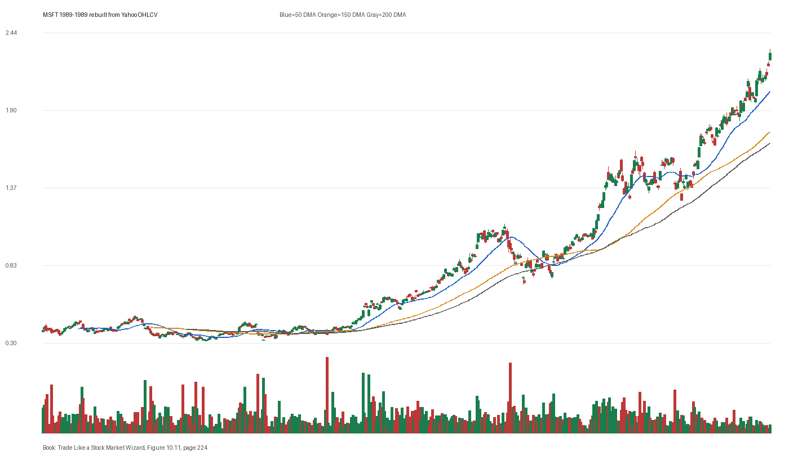

# Figure 10.11 - MSFT - Page 224

## Source Image

Book: [[Trade Like a Stock Market Wizard]]

Caption: Microsoft (MSFT) From the point Microsoft hit an all-time high in 1989, it advanced 54-fold. Chart courtesy of Longboard Asset Management

## Yahoo OHLCV Rebuild

Download status: `OK`

CSV: `data/book_stock_images/trade-like-a-stock-market-wizard-figure-10-11-msft-page-224_ohlcv.csv`

## Pattern Read

Tags: volume-dry-up, stage-2-leadership

Concepts: [[Relative Strength Leadership]], [[Stage 2 Uptrend]], [[Trend Template]], [[Volume Dry-Up and Accumulation]]

Volume contraction supports the idea that supply was drying up near the tight area.

## Reconciliation Metrics

| Metric | Value |
|---|---:|
| first_close | 0.3889 |
| last_close | 2.3073 |
| max_gain_pct | 497.32 |
| max_drawdown_from_period_high_pct | -37.15 |
| first_half_depth_pct | 97.24 |
| second_half_depth_pct | 298.21 |
| tightening | False |
| volume_dryup | True |
| best_trend_template_score | 5/5 |
| latest_trend_template_score | 5/5 |

## Trend Template Checks

- close > 50 DMA
- close > 150 DMA
- close > 200 DMA
- 50 DMA > 150 DMA
- 150 DMA > 200 DMA

## Study Questions

- Does the rebuilt OHLCV chart confirm the same structure shown in the book image?
- Was the stock close to a definable pivot, or already extended?
- Did volume dry up before the move, or was supply still obvious?
- Was this a buy lesson, a sell lesson, or a failure-avoidance lesson?
- What would invalidate the setup if this were being traded live?

<!-- STAGE_LIFECYCLE_START -->
## Stage Lifecycle & Base Concept Analysis
> This section analyzes the FULL LIFECYCLE of the stock around the inferred entry — Stage 1 (Accumulation), Stage 2 (Advance), Stage 3 (Distribution), Stage 4 (Decline) — plus deep base concept analysis, VCP footprint, tight footprint, supply dynamics, and contraction timeline.
- Status: `ok`
- Entry date: `1989-12-05`
- Entry price: `0.6024`
### Stage Lifecycle Overview
| Stage | Present | Start Date | End Date | Duration | Key Signal |
|---|---|---|---:|---|---|
| Stage 1 — Accumulation | ✅ | `1988-09-02` | `1989-09-01` | 252 days | Base: deep-chaotic |
| Stage 2 — Advance | ✅ | `1989-09-01` | `1990-06-29` | 208 days | Max gain: 163.0% |
| Stage 3 — Distribution | ❌ | — | — | — | Not detected |
| Stage 4 — Decline | ❌ | — | — | — | Not detected |
### Stage 1 — Accumulation / Base Building
- Base type: `deep-chaotic`
- Lowest price in base: `0.3100`
- Volume pattern: `neutral`
### Stage 2 — Advance / Trend Pivots

- Number of significant pivots during advance: `5`

| Pivot Date | Price |
|---|---:|
| `1989-10-05` | `0.5700` |
| `1989-10-19` | `0.6000` |
| `1990-01-04` | `0.6400` |
| `1990-03-19` | `0.8100` |
| `1990-04-17` | `0.8800` |

#### Trend Template Evolution During Stage 2

| % Through Stage 2 | Date | Score |
|---|---|---:|
| 0% | `1989-09-01` | 6/7 |
| 25% | `1989-11-15` | 7/7 |
| 50% | `1990-01-31` | 7/7 |
| 75% | `1990-04-17` | 7/7 |
| 100% | `1990-06-29` | 7/7 |

### Base Concept Deep-Dive

- Base type: `deep-chaotic`
- Base duration: `67 sessions`
- Base depth: `54.5%`
- Base high: `0.6200`
- Base low: `0.4000`
- Resistance touches at base high: `12`
- Support touches at base low: `6`
- Contraction count: `4`
- Contraction quality: `mixed-or-loose`
- Pivot clarity: `near-pivot`
- Pivot distance at entry: `-2.8%`
- Volume dry-up in base: `moderate-dry-up`
- Volume dry-up ratio: `0.66`
- Tightness at pivot (10d): `3.8%`
- Weekly tightness: `3.1%`

### VCP Footprint

- VCP present: `True`
- VCP quality: `widening-risk`
- Total contraction depth: `28.2%`
- Final contraction depth: `17.0%`
- Number of contractions: `4`

| Phase | Date | Depth | Volume | Tightness |
|---|---|---:|---:|---:|
| C? | `1989-08-31` | 15.6% | 49204800.0 | 11.0% |
| C? | `1989-09-22` | 28.2% | 68299200.0 | 19.3% |
| C? | `1989-10-13` | 24.6% | 102643200.0 | 11.8% |
| C? | `1989-11-03` | 17.0% | 88027200.0 | 4.7% |

### Tight Footprint

- 10-session tightness at entry: `3.8%`
- 20-session tightness at entry: `14.6%`
- Weekly tightness: `3.1%`
- ATR20 %: `3.01`
- Tightness progression: `improving`

### Supply Analysis

- Supply label: `diminishing`
- Volume dry-up ratio: `0.74`
- Distribution volume detected: `False`
- Accumulation volume detected: `False`
- Climax volume dates: `1989-10-16, 1989-10-17, 1989-10-19`

### Contraction Timeline

| Phase | Start Date | Depth | Volume | Tightness |
|---|---|---:|---:|---:|
| C1 | `1989-08-31` | 15.6% | 49204800.0 | 11.0% |
| C2 | `1989-09-22` | 28.2% | 68299200.0 | 19.3% |
| C3 | `1989-10-13` | 24.6% | 102643200.0 | 11.8% |
| C4 | `1989-11-03` | 17.0% | 88027200.0 | 4.7% |

### Concept Tie-Back

- Related concepts: [[Base Concept]], [[Stage 2 Uptrend]], [[Trend Template]], [[Volatility Contraction Pattern]], [[Pivot and Entry]], [[Volume Dry-Up and Accumulation]], [[Supply and Demand]]
- Lesson: Stage 1 base was deep-chaotic with 43.1% depth. Stage 2 advance lasted 209 sessions with 5 significant pivots. VCP footprint shows 4 contractions with widening-risk quality. Supply was diminishing before entry.

<!-- STAGE_LIFECYCLE_END -->
<!-- PRE_ENTRY_SENSE_CHECK_START -->

## Pre-Entry Sense Check

> This section analyzes the chart structure PRIOR to the inferred entry. It answers: What did the setup look like in the weeks and months before the trade? Which Minervini concepts were already visible?

- Status: `ok`
- Entry date: `1989-12-05`
- Pre-entry history available: `386 sessions`

### Trend Template Evolution

| Lookback | Date | Score | Assessment |
|---|---|---:|:---|
| 60 days before | 1989-09-11 | 7/7 | ✅ Stage 2 confirmed |
| 40 days before | 1989-10-09 | 6/7 | ✅ Stage 2 confirmed |
| 20 days before | 1989-11-06 | 7/7 | ✅ Stage 2 confirmed |

### Pre-Entry Context Window

- Context window (last sessions before entry): `150 sessions`
- Range high: `0.6200`
- Range low: `0.3500`
- Total range depth: `75.0%`
- Contraction phases (rolling 21-bar segments): `19.6% -> 17.6% -> 10.7% -> 12.0% -> 20.3% -> 26.5% -> 17.4%`

### Stage 2 Onset

- First sustained Stage 2 date: `1989-05-30`
- Days in Stage 2 before entry: `132`

### Volume Behavior Before Entry

- Volume dry-up label: `moderate-dry-up`
- Recent/base volume ratio: `0.74`
- Volume spike dates (2.5x avg) in last 40 days: `1989-10-16, 1989-11-02`

### Tightness Progression

| Lookback | 10-Session Close Tightness |
|---|---:|
| 40 days before | `19.7%` |
| 20 days before | `9.0%` |
| Final 10 sessions before | `3.8%` |
| Final 3 weekly closes | `3.1%` |

### Moving Average Alignment

- 50/150/200 DMA first aligned (50>150>200): `1989-05-30`

### Shakeouts / Tests Before Entry

- No shakeouts or undercut-recover patterns detected in last 40 sessions before entry.

### 52-Week High Context

| Timing | Distance from 52W High |
|---|---:|
| 60 days before | `-8.3%` |
| 20 days before | `-10.2%` |
| At entry | `-2.8%` |

### Concept Tie-Back

- Related concepts: [[Stage 2 Uptrend]], [[Trend Template]], [[Relative Strength Leadership]], [[Volume Dry-Up and Accumulation]]
- Lesson: Stage 2 was established 132 days before entry, confirming leadership context. Total pre-entry range was 75.0% — wide range indicating significant prior movement. Volume dried up before entry, suggesting supply absorption.

<!-- PRE_ENTRY_SENSE_CHECK_END -->
<!-- SEPA_REPLICATION_START -->

## SEPA Trade Replication

> Study note: this reconstructs a likely Minervini-style setup area from the real OHLCV window shown by the book timing. It does not claim to know Minervini's private fill, sizing, or unpublished execution.

- Status: `reconstructed-from-real-ohlcv`
- Setup type: `vcp/contraction-study`
- Confidence: `high`
- Timing source: `1989-1989` from the figure caption and rebuilt OHLCV where available.
- Inferred study entry date: `1989-12-05`
- Inferred study entry price: `0.6024`
- Inferred pivot: `0.6198`
- Inferred stop / invalidation: `0.5816`
- Pivot extension at entry: `-2.8%`
- Stop distance / risk: `3.6%`
- Trend Template score at entry: `7/7`

### Tightness And Supply
- 3-part pre-entry contraction depth: `31.2% -> 24.6% -> 17.0%`
- Contraction quality: `clear-tightening`
- 10-session close tightness: `3.8%`
- 3-week close tightness: `3.1%`
- Volume dry-up: `moderate-dry-up`
- Recent/base median volume ratio: `0.74`
- Leadership proxy: 65-day return 44.9% and 126-day return 45.2%

### Post-Entry Reality Check
- Max gain after 20 sessions: `6.1%`
- Max gain after 60 sessions: `20.3%`
- Max gain after 120 sessions: `81.6%`
- Worst drawdown after 20 sessions: `-13.5%`
- Inferred stop failed within 20 sessions: `True`
- Pivot broadly respected within 20 sessions: `False`

### Concept Tie-Back

- Related concepts: [[Risk First]], [[Volatility Contraction Pattern]], [[Volume Dry-Up and Accumulation]], [[Pivot and Entry]], [[Trend Template]], [[Stage 2 Uptrend]], [[Relative Strength Leadership]]
- Lesson: The reconstructed data suggests price was becoming more controllable before the inferred entry; volume supported the supply-dry-up idea; risk was close enough for a clean SEPA-style test; post-entry behavior violated the inferred stop within 20 sessions.

<!-- SEPA_REPLICATION_END -->
