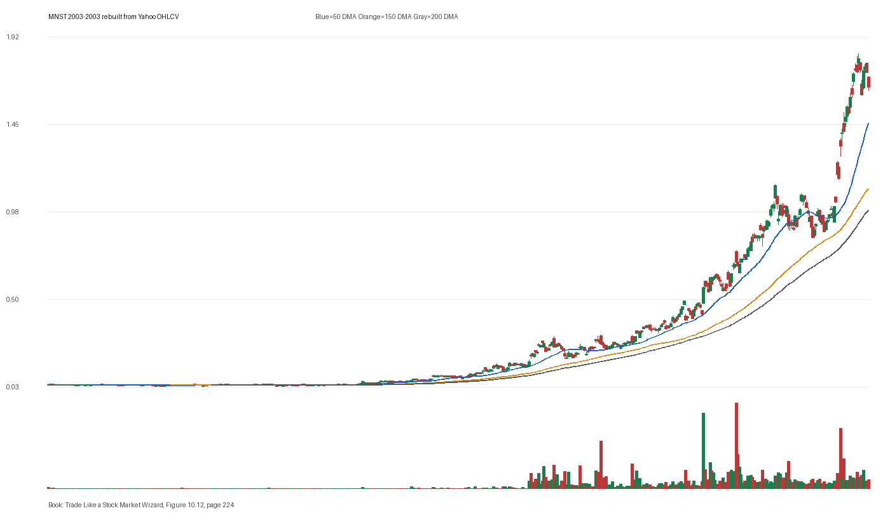

# Figure 10.12 - MNST - Page 224

## Source Image

Book: [[Trade Like a Stock Market Wizard]]

Caption: Monster Beverage (MNST) Monster Beverage rallied more than 8,000 percent from its all-time high registered in August 2003. Chart courtesy of Longboard Asset Management

## Yahoo OHLCV Rebuild

Download status: `OK`

CSV: `data/book_stock_images/trade-like-a-stock-market-wizard-figure-10-12-mnst-page-224_ohlcv.csv`

## Pattern Read

Tags: stage-2-leadership

Concepts: [[Relative Strength Leadership]], [[Stage 2 Uptrend]], [[Trend Template]]

Use this as a visual pattern drill and compare the private book image against the rebuilt Yahoo chart.

## Reconciliation Metrics

| Metric | Value |
|---|---:|
| first_close | 0.0427 |
| last_close | 1.6419 |
| max_gain_pct | 4206.86 |
| max_drawdown_from_period_high_pct | -39.0 |
| first_half_depth_pct | 213.33 |
| second_half_depth_pct | 2235.71 |
| tightening | False |
| volume_dryup | False |
| best_trend_template_score | 5/5 |
| latest_trend_template_score | 5/5 |

## Trend Template Checks

- close > 50 DMA
- close > 150 DMA
- close > 200 DMA
- 50 DMA > 150 DMA
- 150 DMA > 200 DMA

## Study Questions

- Does the rebuilt OHLCV chart confirm the same structure shown in the book image?
- Was the stock close to a definable pivot, or already extended?
- Did volume dry up before the move, or was supply still obvious?
- Was this a buy lesson, a sell lesson, or a failure-avoidance lesson?
- What would invalidate the setup if this were being traded live?

<!-- STAGE_LIFECYCLE_START -->
## Stage Lifecycle & Base Concept Analysis
> This section analyzes the FULL LIFECYCLE of the stock around the inferred entry — Stage 1 (Accumulation), Stage 2 (Advance), Stage 3 (Distribution), Stage 4 (Decline) — plus deep base concept analysis, VCP footprint, tight footprint, supply dynamics, and contraction timeline.
- Status: `ok`
- Entry date: `2003-07-08`
- Entry price: `0.0473`
### Stage Lifecycle Overview
| Stage | Present | Start Date | End Date | Duration | Key Signal |
|---|---|---|---:|---|---|
| Stage 1 — Accumulation | ✅ | `2002-05-28` | `2003-05-16` | 245 days | Base: deep-chaotic |
| Stage 2 — Advance | ✅ | `2003-05-16` | `2004-03-23` | 214 days | Max gain: 256.3% |
| Stage 3 — Distribution | ✅ | `2004-03-24` | `2004-06-28` | 65 days | climax vol |
| Stage 4 — Decline | ❌ | — | — | — | Not detected |
### Stage 1 — Accumulation / Base Building
- Base type: `deep-chaotic`
- Lowest price in base: `0.0300`
- Volume pattern: `accumulation-dryup`
### Stage 2 — Advance / Trend Pivots

- Number of significant pivots during advance: `5`

| Pivot Date | Price |
|---|---:|
| `2003-07-16` | `0.0600` |
| `2003-10-14` | `0.0800` |
| `2003-11-13` | `0.1000` |
| `2003-12-16` | `0.0900` |
| `2004-02-18` | `0.1400` |

#### Trend Template Evolution During Stage 2

| % Through Stage 2 | Date | Score |
|---|---|---:|
| 0% | `2003-05-16` | 6/7 |
| 25% | `2003-08-01` | 6/7 |
| 50% | `2003-10-17` | 7/7 |
| 75% | `2004-01-05` | 7/7 |
| 100% | `2004-03-23` | 6/7 |

### Base Concept Deep-Dive

- Base type: `flat-base`
- Base duration: `37 sessions`
- Base depth: `12.3%`
- Base high: `0.0500`
- Base low: `0.0400`
- Resistance touches at base high: `3`
- Support touches at base low: `4`
- Contraction count: `2`
- Contraction quality: `clear-tightening`
- Pivot clarity: `clear-pivot-at-high`
- Pivot distance at entry: `-0.2%`
- Volume dry-up in base: `active-supply`
- Volume dry-up ratio: `1.11`
- Tightness at pivot (10d): `8.1%`
- Weekly tightness: `8.1%`

### VCP Footprint

- VCP present: `True`
- VCP quality: `constructive-tightening`
- Total contraction depth: `10.4%`
- Final contraction depth: `6.4%`
- Number of contractions: `2`

| Phase | Date | Depth | Volume | Tightness |
|---|---|---:|---:|---:|
| C? | `2003-05-15` | 10.4% | 307200.0 | 6.4% |
| C? | `2003-06-06` | 6.4% | 96000.0 | 5.2% |

### Tight Footprint

- 10-session tightness at entry: `3.6%`
- 20-session tightness at entry: `5.2%`
- Weekly tightness: `3.6%`
- ATR20 %: `2.78`
- Tightness progression: `improving`

### Supply Analysis

- Supply label: `demand-dominant`
- Volume dry-up ratio: `0.91`
- Distribution volume detected: `False`
- Accumulation volume detected: `True`
- Climax volume dates: `2003-05-12, 2003-05-16, 2003-05-27`

### Contraction Timeline

| Phase | Start Date | Depth | Volume | Tightness |
|---|---|---:|---:|---:|
| C1 | `2003-05-15` | 10.4% | 307200.0 | 6.4% |
| C2 | `2003-06-06` | 6.4% | 96000.0 | 5.2% |

### Concept Tie-Back

- Related concepts: [[Base Concept]], [[Stage 2 Uptrend]], [[Trend Template]], [[Stage 3 Distribution]], [[Volatility Contraction Pattern]], [[Pivot and Entry]]
- Lesson: Stage 1 base was deep-chaotic with 55.0% depth. Stage 2 advance lasted 215 sessions with 5 significant pivots. VCP footprint shows 2 contractions with constructive-tightening quality.

<!-- STAGE_LIFECYCLE_END -->
<!-- PRE_ENTRY_SENSE_CHECK_START -->

## Pre-Entry Sense Check

> This section analyzes the chart structure PRIOR to the inferred entry. It answers: What did the setup look like in the weeks and months before the trade? Which Minervini concepts were already visible?

- Status: `ok`
- Entry date: `2003-07-08`
- Pre-entry history available: `280 sessions`

### Trend Template Evolution

| Lookback | Date | Score | Assessment |
|---|---|---:|:---|
| 60 days before | 2003-04-10 | 2/7 | 🔴 Not yet Stage 2 |
| 40 days before | 2003-05-09 | 3/7 | 🔴 Not yet Stage 2 |
| 20 days before | 2003-06-09 | 6/7 | ✅ Stage 2 confirmed |

### Pre-Entry Context Window

- Context window (last sessions before entry): `150 sessions`
- Range high: `0.0500`
- Range low: `0.0300`
- Total range depth: `42.0%`
- Contraction phases (rolling 21-bar segments): `4.6% -> 5.7% -> 37.2% -> 25.3% -> 15.7% -> 13.4% -> 7.2%`

### Stage 2 Onset

- First sustained Stage 2 date: `2003-05-12`
- Days in Stage 2 before entry: `39`

### Volume Behavior Before Entry

- Volume dry-up label: `neutral`
- Recent/base volume ratio: `0.91`
- Volume spike dates (2.5x avg) in last 40 days: `2003-05-12, 2003-05-16, 2003-05-27`

### Tightness Progression

| Lookback | 10-Session Close Tightness |
|---|---:|
| 40 days before | `3.8%` |
| 20 days before | `6.4%` |
| Final 10 sessions before | `3.6%` |
| Final 3 weekly closes | `3.6%` |

### Moving Average Alignment

- 50/150/200 DMA alignment: `not achieved before entry`

### Shakeouts / Tests Before Entry

- `2003-05-12` — undercut-and-recover of SMA50 (low 0.04, close 0.05)
- `2003-05-13` — undercut-and-recover of SMA50 (low 0.04, close 0.04)

### 52-Week High Context

| Timing | Distance from 52W High |
|---|---:|
| 60 days before | `N/A` |
| 20 days before | `-8.4%` |
| At entry | `-2.4%` |

### Concept Tie-Back

- Related concepts: [[Stage 2 Uptrend]], [[Trend Template]], [[Relative Strength Leadership]], [[Pivot and Entry]]
- Lesson: Stage 2 was established 39 days before entry, confirming leadership context. Total pre-entry range was 42.0% — wide range indicating significant prior movement. Volume did not show clear dry-up — supply may still be present. Found 2 shakeout(s) before entry — test of conviction.

<!-- PRE_ENTRY_SENSE_CHECK_END -->
<!-- SEPA_REPLICATION_START -->

## SEPA Trade Replication

> Study note: this reconstructs a likely Minervini-style setup area from the real OHLCV window shown by the book timing. It does not claim to know Minervini's private fill, sizing, or unpublished execution.

- Status: `reconstructed-from-real-ohlcv`
- Setup type: `vcp/contraction-study`
- Confidence: `high`
- Timing source: `2003-2003` from the figure caption and rebuilt OHLCV where available.
- Inferred study entry date: `2003-07-08`
- Inferred study entry price: `0.0473`
- Inferred pivot: `0.0467`
- Inferred stop / invalidation: `0.0434`
- Pivot extension at entry: `1.3%`
- Stop distance / risk: `8.9%`
- Trend Template score at entry: `6/7`

### Tightness And Supply
- 3-part pre-entry contraction depth: `9.3% -> 13.4% -> 7.2%`
- Contraction quality: `constructive-tightening`
- 10-session close tightness: `3.6%`
- 3-week close tightness: `3.6%`
- Volume dry-up: `neutral`
- Recent/base median volume ratio: `0.91`
- Leadership proxy: 65-day return 12.7% and 126-day return 5.3%

### Post-Entry Reality Check
- Max gain after 20 sessions: `31.9%`
- Max gain after 60 sessions: `37.4%`
- Max gain after 120 sessions: `107.0%`
- Worst drawdown after 20 sessions: `-2.4%`
- Inferred stop failed within 20 sessions: `False`
- Pivot broadly respected within 20 sessions: `True`

### Concept Tie-Back

- Related concepts: [[Risk First]], [[Volatility Contraction Pattern]], [[Volume Dry-Up and Accumulation]], [[Pivot and Entry]], [[Trend Template]], [[Stage 2 Uptrend]], [[Relative Strength Leadership]]
- Lesson: The reconstructed data suggests price was becoming more controllable before the inferred entry; risk was acceptable but not ideal; the pivot was broadly respected after entry.

<!-- SEPA_REPLICATION_END -->
