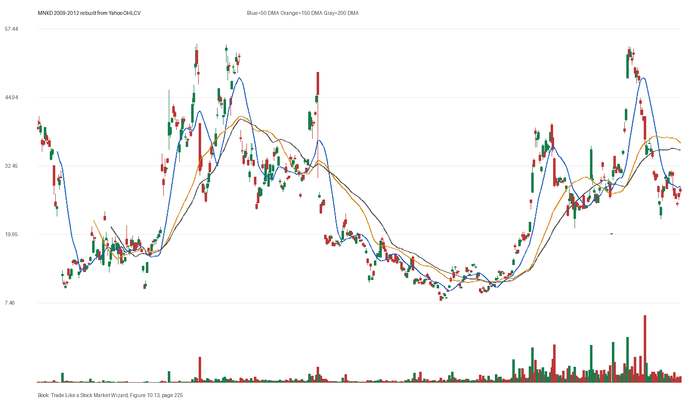

# Figure 10.13 - MNKD - Page 225

## Source Image

Book: [[Trade Like a Stock Market Wizard]]

Caption: Mankind (MNKD) 2009-2012 Mankind (MNKD) rallied back near its old highs into overhead supply where selling took the stock down precipitously. The following year the same scenario repeated

## Yahoo OHLCV Rebuild

Download status: `OK`

CSV: `data/book_stock_images/trade-like-a-stock-market-wizard-figure-10-13-mnkd-page-225_ohlcv.csv`

## Pattern Read

Tags: stage-2-leadership

Concepts: [[Relative Strength Leadership]], [[Stage 2 Uptrend]], [[Trend Template]]

Use this as a visual pattern drill and compare the private book image against the rebuilt Yahoo chart.

## Reconciliation Metrics

| Metric | Value |
|---|---:|
| first_close | 39.3 |
| last_close | 26.75 |
| max_gain_pct | 56.49 |
| max_drawdown_from_period_high_pct | -87.24 |
| first_half_depth_pct | 561.29 |
| second_half_depth_pct | 631.21 |
| tightening | False |
| volume_dryup | False |
| best_trend_template_score | 5/5 |
| latest_trend_template_score | 1/5 |

## Trend Template Checks

- 150 DMA > 200 DMA

## Study Questions

- Does the rebuilt OHLCV chart confirm the same structure shown in the book image?
- Was the stock close to a definable pivot, or already extended?
- Did volume dry up before the move, or was supply still obvious?
- Was this a buy lesson, a sell lesson, or a failure-avoidance lesson?
- What would invalidate the setup if this were being traded live?

<!-- STAGE_LIFECYCLE_START -->
## Stage Lifecycle & Base Concept Analysis
> This section analyzes the FULL LIFECYCLE of the stock around the inferred entry — Stage 1 (Accumulation), Stage 2 (Advance), Stage 3 (Distribution), Stage 4 (Decline) — plus deep base concept analysis, VCP footprint, tight footprint, supply dynamics, and contraction timeline.
- Status: `ok`
- Entry date: `2010-03-11`
- Entry price: `52.5000`
### Stage Lifecycle Overview
| Stage | Present | Start Date | End Date | Duration | Key Signal |
|---|---|---|---:|---|---|
| Stage 1 — Accumulation | ✅ | `2012-02-07` | `2013-02-08` | 252 days | Base: deep-chaotic |
| Stage 2 — Advance | ✅ | `2013-02-08` | `2013-06-28` | 97 days | Max gain: 208.8% |
| Stage 3 — Distribution | ❌ | — | — | — | Not detected |
| Stage 4 — Decline | ❌ | — | — | — | Not detected |
### Stage 1 — Accumulation / Base Building
- Base type: `deep-chaotic`
- Lowest price in base: `7.8500`
- Volume pattern: `neutral`
### Stage 2 — Advance / Trend Pivots

- Number of significant pivots during advance: `2`

| Pivot Date | Price |
|---|---:|
| `2013-03-12` | `18.3500` |
| `2013-04-10` | `22.4500` |

#### Trend Template Evolution During Stage 2

| % Through Stage 2 | Date | Score |
|---|---|---:|
| 0% | `2013-02-08` | 6/7 |
| 25% | `2013-03-15` | 7/7 |
| 50% | `2013-04-19` | 7/7 |
| 75% | `2013-05-23` | 7/7 |
| 100% | `2013-06-28` | 7/7 |

### Base Concept Deep-Dive

- Base type: `N/A`
- Base duration: `0 sessions`
- Base depth: `N/A`
- Base high: `N/A`
- Base low: `N/A`
- Resistance touches at base high: `0`
- Support touches at base low: `0`
- Contraction count: `0`
- Contraction quality: `N/A`
- Pivot clarity: `N/A`
- Pivot distance at entry: `N/A`
- Volume dry-up in base: `N/A`
- Volume dry-up ratio: `N/A`
- Tightness at pivot (10d): `N/A`
- Weekly tightness: `N/A`

### VCP Footprint

- VCP present: `False`
- No clear VCP pattern detected in the base.

### Tight Footprint

- 10-session tightness at entry: `5.3%`
- 20-session tightness at entry: `12.1%`
- Weekly tightness: `4.9%`
- ATR20 %: `2.92`
- Tightness progression: `improving`

### Supply Analysis

- Supply label: `exhausted`
- Volume dry-up ratio: `0.49`
- Distribution volume detected: `False`
- Accumulation volume detected: `False`
- Climax volume dates: `2010-01-12, 2010-01-13, 2010-01-14`

### Concept Tie-Back

- Related concepts: [[Base Concept]], [[Stage 2 Uptrend]], [[Trend Template]], [[Volume Dry-Up and Accumulation]], [[Supply and Demand]]
- Lesson: Stage 1 base was deep-chaotic with 98.1% depth. Stage 2 advance lasted 98 sessions with 2 significant pivots. Supply was exhausted before entry with strong volume dry-up.

<!-- STAGE_LIFECYCLE_END -->
<!-- PRE_ENTRY_SENSE_CHECK_START -->

## Pre-Entry Sense Check

> This section analyzes the chart structure PRIOR to the inferred entry. It answers: What did the setup look like in the weeks and months before the trade? Which Minervini concepts were already visible?

- Status: `ok`
- Entry date: `2010-03-11`
- Pre-entry history available: `451 sessions`

### Trend Template Evolution

| Lookback | Date | Score | Assessment |
|---|---|---:|:---|
| 60 days before | 2009-12-11 | 5/7 | 🟡 Transitioning |
| 40 days before | 2010-01-12 | 5/7 | 🟡 Transitioning |
| 20 days before | 2010-02-10 | 7/7 | ✅ Stage 2 confirmed |

### Pre-Entry Context Window

- Context window (last sessions before entry): `150 sessions`
- Range high: `61.5000`
- Range low: `25.1000`
- Total range depth: `145.0%`
- Contraction phases (rolling 21-bar segments): `18.2% -> 63.8% -> 95.2% -> 37.8% -> 36.9% -> 52.3% -> 28.8%`

### Stage 2 Onset

- First sustained Stage 2 date: `2009-04-17`
- Days in Stage 2 before entry: `226`

### Volume Behavior Before Entry

- Volume dry-up label: `strong-dry-up`
- Recent/base volume ratio: `0.49`
- Volume spike dates (2.5x avg) in last 40 days: `2010-01-14, 2010-01-15`

### Tightness Progression

| Lookback | 10-Session Close Tightness |
|---|---:|
| 40 days before | `13.5%` |
| 20 days before | `18.6%` |
| Final 10 sessions before | `5.3%` |
| Final 3 weekly closes | `4.9%` |

### Moving Average Alignment

- 50/150/200 DMA first aligned (50>150>200): `2009-05-15`

### Shakeouts / Tests Before Entry

- `2010-01-13` — undercut-and-recover of SMA50 (low 41.5, close 44.5)
- `2010-02-08` — undercut-and-recover of SMA50 (low 42.6, close 44.95)

### 52-Week High Context

| Timing | Distance from 52W High |
|---|---:|
| 60 days before | `-33.3%` |
| 20 days before | `-24.0%` |
| At entry | `-14.6%` |

### Concept Tie-Back

- Related concepts: [[Stage 2 Uptrend]], [[Trend Template]], [[Relative Strength Leadership]], [[Volume Dry-Up and Accumulation]], [[Pivot and Entry]]
- Lesson: Stage 2 was established 226 days before entry, confirming leadership context. Total pre-entry range was 145.0% — wide range indicating significant prior movement. Volume dried up before entry, suggesting supply absorption. Found 2 shakeout(s) before entry — test of conviction.

<!-- PRE_ENTRY_SENSE_CHECK_END -->
<!-- SEPA_REPLICATION_START -->

## SEPA Trade Replication

> Study note: this reconstructs a likely Minervini-style setup area from the real OHLCV window shown by the book timing. It does not claim to know Minervini's private fill, sizing, or unpublished execution.

- Status: `reconstructed-from-real-ohlcv`
- Setup type: `volume-dry-up-study`
- Confidence: `high`
- Timing source: `2009-2012` from the figure caption and rebuilt OHLCV where available.
- Inferred study entry date: `2010-03-11`
- Inferred study entry price: `52.5000`
- Inferred pivot: `55.6000`
- Inferred stop / invalidation: `48.2500`
- Pivot extension at entry: `-5.6%`
- Stop distance / risk: `8.8%`
- Trend Template score at entry: `7/7`

### Tightness And Supply
- 3-part pre-entry contraction depth: `36.5% -> 48.7% -> 20.4%`
- Contraction quality: `mixed-or-loose`
- 10-session close tightness: `5.3%`
- 3-week close tightness: `4.9%`
- Volume dry-up: `strong-dry-up`
- Recent/base median volume ratio: `0.49`
- Leadership proxy: 65-day return 44.6% and 126-day return 17.4%

### Post-Entry Reality Check
- Max gain after 20 sessions: `0.9%`
- Max gain after 60 sessions: `0.9%`
- Max gain after 120 sessions: `0.9%`
- Worst drawdown after 20 sessions: `-39.5%`
- Inferred stop failed within 20 sessions: `True`
- Pivot broadly respected within 20 sessions: `False`

### Concept Tie-Back

- Related concepts: [[Risk First]], [[Trend Template]], [[Stage 2 Uptrend]], [[Relative Strength Leadership]]
- Lesson: The reconstructed data suggests the structure still had loose or mixed contraction behavior; volume supported the supply-dry-up idea; risk was acceptable but not ideal; post-entry behavior violated the inferred stop within 20 sessions.

<!-- SEPA_REPLICATION_END -->
