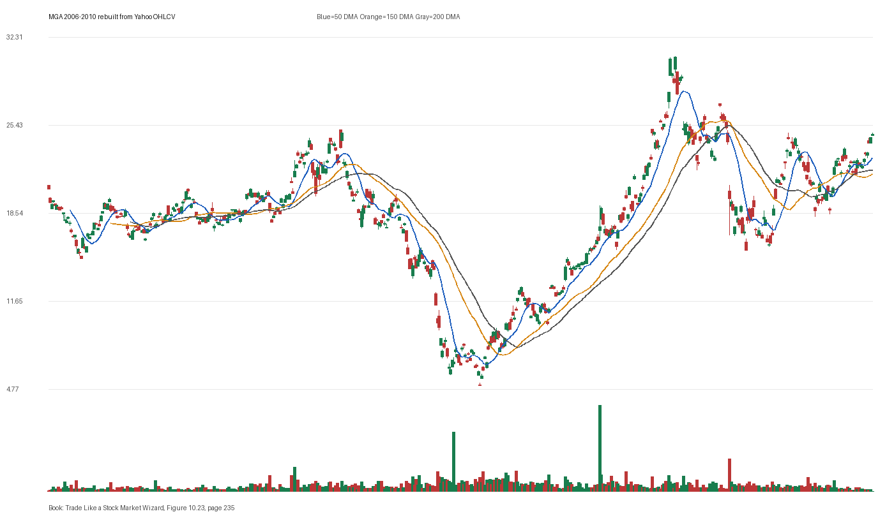

# Figure 10.23 - MGA - Page 235

## Source Image

Book: [[Trade Like a Stock Market Wizard]]

Caption: Magna Intl. Inc. (MGA) 2010 After a shakeout occurred in November 2006, a price surge on overwhelming volume was the tip off that Magna Intl. Inc. was under institutional accumulation. It rose 140 percent in three months

## Yahoo OHLCV Rebuild

Download status: `OK`

CSV: `data/book_stock_images/trade-like-a-stock-market-wizard-figure-10-23-mga-page-235_ohlcv.csv`

## Pattern Read

Tags: shakeout, stage-2-leadership

Concepts: [[Relative Strength Leadership]], [[Risk First]], [[Stage 2 Uptrend]], [[Trend Template]], [[Volatility Contraction Pattern]]

Use this as a visual pattern drill and compare the private book image against the rebuilt Yahoo chart.

## Reconciliation Metrics

| Metric | Value |
|---|---:|
| first_close | 20.4825 |
| last_close | 24.72 |
| max_gain_pct | 51.84 |
| max_drawdown_from_period_high_pct | -80.43 |
| first_half_depth_pct | 339.91 |
| second_half_depth_pct | 533.72 |
| tightening | False |
| volume_dryup | False |
| best_trend_template_score | 5/5 |
| latest_trend_template_score | 4/5 |

## Trend Template Checks

- close > 50 DMA
- close > 150 DMA
- close > 200 DMA
- 50 DMA > 150 DMA

## Study Questions

- Does the rebuilt OHLCV chart confirm the same structure shown in the book image?
- Was the stock close to a definable pivot, or already extended?
- Did volume dry up before the move, or was supply still obvious?
- Was this a buy lesson, a sell lesson, or a failure-avoidance lesson?
- What would invalidate the setup if this were being traded live?

<!-- STAGE_LIFECYCLE_START -->
## Stage Lifecycle & Base Concept Analysis
> This section analyzes the FULL LIFECYCLE of the stock around the inferred entry — Stage 1 (Accumulation), Stage 2 (Advance), Stage 3 (Distribution), Stage 4 (Decline) — plus deep base concept analysis, VCP footprint, tight footprint, supply dynamics, and contraction timeline.
- Status: `ok`
- Entry date: `2010-11-04`
- Entry price: `23.4025`
### Stage Lifecycle Overview
| Stage | Present | Start Date | End Date | Duration | Key Signal |
|---|---|---|---:|---|---|
| Stage 1 — Accumulation | ✅ | `2008-11-04` | `2009-11-04` | 252 days | Base: deep-chaotic |
| Stage 2 — Advance | ✅ | `2009-11-04` | `2011-03-24` | 348 days | Max gain: 185.5% |
| Stage 3 — Distribution | ✅ | `2011-05-17` | `2011-05-23` | 4 days | no climax |
| Stage 4 — Decline | ✅ | `2011-05-24` | — | 25 days | Below 200 DMA: False |
### Stage 1 — Accumulation / Base Building
- Base type: `deep-chaotic`
- Lowest price in base: `4.9100`
- Volume pattern: `neutral`
### Stage 2 — Advance / Trend Pivots

- Number of significant pivots during advance: `5`

| Pivot Date | Price |
|---|---:|
| `2010-01-06` | `15.2700` |
| `2010-05-06` | `19.1100` |
| `2010-06-03` | `17.9100` |
| `2010-07-23` | `18.9000` |
| `2010-08-19` | `21.0000` |

#### Trend Template Evolution During Stage 2

| % Through Stage 2 | Date | Score |
|---|---|---:|
| 0% | `2009-11-04` | 7/7 |
| 25% | `2010-03-12` | 7/7 |
| 50% | `2010-07-16` | 7/7 |
| 75% | `2010-11-17` | 7/7 |
| 100% | `2011-03-24` | 6/7 |

### Base Concept Deep-Dive

- Base type: `deep-chaotic`
- Base duration: `254 sessions`
- Base depth: `142.5%`
- Base high: `23.6500`
- Base low: `9.7500`
- Resistance touches at base high: `2`
- Support touches at base low: `1`
- Contraction count: `5`
- Contraction quality: `constructive-tightening`
- Pivot clarity: `clear-pivot-at-high`
- Pivot distance at entry: `-1.0%`
- Volume dry-up in base: `moderate-dry-up`
- Volume dry-up ratio: `0.7`
- Tightness at pivot (10d): `5.4%`
- Weekly tightness: `5.4%`

### VCP Footprint

- VCP present: `True`
- VCP quality: `constructive-tightening`
- Total contraction depth: `56.7%`
- Final contraction depth: `24.3%`
- Number of contractions: `5`

| Phase | Date | Depth | Volume | Tightness |
|---|---|---:|---:|---:|
| C? | `2009-11-03` | 56.7% | 2059200.0 | 18.6% |
| C? | `2010-01-15` | 14.9% | 2044200.0 | 6.4% |
| C? | `2010-03-30` | 25.1% | 2952000.0 | 6.0% |
| C? | `2010-06-10` | 35.6% | 2858000.0 | 11.6% |
| C? | `2010-08-20` | 24.3% | 1958200.0 | 6.2% |

### Tight Footprint

- 10-session tightness at entry: `3.1%`
- 20-session tightness at entry: `8.3%`
- Weekly tightness: `2.3%`
- ATR20 %: `2.31`
- Tightness progression: `improving`

### Supply Analysis

- Supply label: `diminishing`
- Volume dry-up ratio: `0.65`
- Distribution volume detected: `False`
- Accumulation volume detected: `False`

### Contraction Timeline

| Phase | Start Date | Depth | Volume | Tightness |
|---|---|---:|---:|---:|
| C1 | `2009-11-03` | 56.7% | 2059200.0 | 18.6% |
| C2 | `2010-01-15` | 14.9% | 2044200.0 | 6.4% |
| C3 | `2010-03-30` | 25.1% | 2952000.0 | 6.0% |
| C4 | `2010-06-10` | 35.6% | 2858000.0 | 11.6% |
| C5 | `2010-08-20` | 24.3% | 1958200.0 | 6.2% |

### Concept Tie-Back

- Related concepts: [[Base Concept]], [[Stage 2 Uptrend]], [[Trend Template]], [[Stage 3 Distribution]], [[Stage 4 Decline]], [[Volatility Contraction Pattern]], [[Pivot and Entry]], [[Volume Dry-Up and Accumulation]], [[Supply and Demand]]
- Lesson: Stage 1 base was deep-chaotic with 164.7% depth. Stage 2 advance lasted 349 sessions with 5 significant pivots. VCP footprint shows 5 contractions with constructive-tightening quality. Supply was diminishing before entry.

<!-- STAGE_LIFECYCLE_END -->
<!-- PRE_ENTRY_SENSE_CHECK_START -->

## Pre-Entry Sense Check

> This section analyzes the chart structure PRIOR to the inferred entry. It answers: What did the setup look like in the weeks and months before the trade? Which Minervini concepts were already visible?

- Status: `ok`
- Entry date: `2010-11-04`
- Pre-entry history available: `1371 sessions`

### Trend Template Evolution

| Lookback | Date | Score | Assessment |
|---|---|---:|:---|
| 60 days before | 2010-08-11 | 7/7 | ✅ Stage 2 confirmed |
| 40 days before | 2010-09-09 | 7/7 | ✅ Stage 2 confirmed |
| 20 days before | 2010-10-07 | 7/7 | ✅ Stage 2 confirmed |

### Pre-Entry Context Window

- Context window (last sessions before entry): `150 sessions`
- Range high: `23.2100`
- Range low: `15.4200`
- Total range depth: `50.5%`
- Contraction phases (rolling 21-bar segments): `9.8% -> 25.1% -> 13.4% -> 22.7% -> 17.2% -> 13.6% -> 13.7%`

### Stage 2 Onset

- First sustained Stage 2 date: `2007-05-16`
- Days in Stage 2 before entry: `876`

### Volume Behavior Before Entry

- Volume dry-up label: `moderate-dry-up`
- Recent/base volume ratio: `0.65`
- No significant volume spikes in last 40 days before entry.

### Tightness Progression

| Lookback | 10-Session Close Tightness |
|---|---:|
| 40 days before | `14.0%` |
| 20 days before | `8.2%` |
| Final 10 sessions before | `3.1%` |
| Final 3 weekly closes | `2.3%` |

### Moving Average Alignment

- 50/150/200 DMA first aligned (50>150>200): `2006-05-25`

### Shakeouts / Tests Before Entry

- No shakeouts or undercut-recover patterns detected in last 40 sessions before entry.

### 52-Week High Context

| Timing | Distance from 52W High |
|---|---:|
| 60 days before | `-8.0%` |
| 20 days before | `-1.9%` |
| At entry | `-1.0%` |

### Concept Tie-Back

- Related concepts: [[Stage 2 Uptrend]], [[Trend Template]], [[Relative Strength Leadership]], [[Volume Dry-Up and Accumulation]]
- Lesson: Stage 2 was established 876 days before entry, confirming leadership context. Total pre-entry range was 50.5% — wide range indicating significant prior movement. Volume dried up before entry, suggesting supply absorption.

<!-- PRE_ENTRY_SENSE_CHECK_END -->
<!-- SEPA_REPLICATION_START -->

## SEPA Trade Replication

> Study note: this reconstructs a likely Minervini-style setup area from the real OHLCV window shown by the book timing. It does not claim to know Minervini's private fill, sizing, or unpublished execution.

- Status: `reconstructed-from-real-ohlcv`
- Setup type: `shakeout-reclaim-study`
- Confidence: `high`
- Timing source: `2006-2010` from the figure caption and rebuilt OHLCV where available.
- Inferred study entry date: `2010-11-04`
- Inferred study entry price: `23.4025`
- Inferred pivot: `23.2100`
- Inferred stop / invalidation: `21.1350`
- Pivot extension at entry: `0.8%`
- Stop distance / risk: `10.7%`
- Trend Template score at entry: `7/7`

### Tightness And Supply
- 3-part pre-entry contraction depth: `20.3% -> 13.0% -> 11.3%`
- Contraction quality: `clear-tightening`
- 10-session close tightness: `3.1%`
- 3-week close tightness: `2.3%`
- Volume dry-up: `moderate-dry-up`
- Recent/base median volume ratio: `0.65`
- Leadership proxy: 65-day return 26.2% and 126-day return 35.4%

### Post-Entry Reality Check
- Max gain after 20 sessions: `11.2%`
- Max gain after 60 sessions: `32.9%`
- Max gain after 120 sessions: `32.9%`
- Worst drawdown after 20 sessions: `-0.5%`
- Inferred stop failed within 20 sessions: `False`
- Pivot broadly respected within 20 sessions: `True`

### Concept Tie-Back

- Related concepts: [[Risk First]], [[Volatility Contraction Pattern]], [[Volume Dry-Up and Accumulation]], [[Pivot and Entry]], [[Trend Template]], [[Stage 2 Uptrend]], [[Relative Strength Leadership]]
- Lesson: The reconstructed data suggests price was becoming more controllable before the inferred entry; volume supported the supply-dry-up idea; risk was acceptable but not ideal; the pivot was broadly respected after entry.

<!-- SEPA_REPLICATION_END -->
