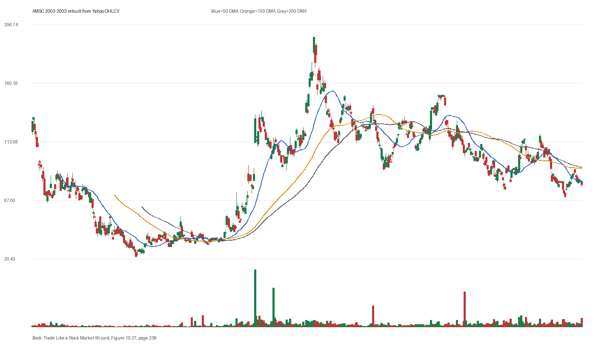

# Figure 10.27 - AMSC - Page 238

## Source Image

Book: [[Trade Like a Stock Market Wizard]]

Caption: American Superconductor (AMSC) American Superconductor digest news and sets up for a powerfull rally by developing a classic VCP pattern from mid-August through mid-December 2003

## Yahoo OHLCV Rebuild

Download status: `OK`

CSV: `data/book_stock_images/trade-like-a-stock-market-wizard-figure-10-27-amsc-page-238_ohlcv.csv`

## Pattern Read

Tags: vcp-or-tightening, stage-2-leadership

Concepts: [[Pivot and Entry]], [[Relative Strength Leadership]], [[Stage 2 Uptrend]], [[Trend Template]], [[Volatility Contraction Pattern]], [[Volume Dry-Up and Accumulation]]

The useful clue is contraction: the later portion of the window became tighter than the earlier portion.

## Reconciliation Metrics

| Metric | Value |
|---|---:|
| first_close | 130.0 |
| last_close | 78.7 |
| max_gain_pct | 53.46 |
| max_drawdown_from_period_high_pct | -84.61 |
| first_half_depth_pct | 601.91 |
| second_half_depth_pct | 188.71 |
| tightening | True |
| volume_dryup | False |
| best_trend_template_score | 5/5 |
| latest_trend_template_score | 0/5 |

## Trend Template Checks

- Not available or not applicable.

## Study Questions

- Does the rebuilt OHLCV chart confirm the same structure shown in the book image?
- Was the stock close to a definable pivot, or already extended?
- Did volume dry up before the move, or was supply still obvious?
- Was this a buy lesson, a sell lesson, or a failure-avoidance lesson?
- What would invalidate the setup if this were being traded live?

<!-- STAGE_LIFECYCLE_START -->
## Stage Lifecycle & Base Concept Analysis
> This section analyzes the FULL LIFECYCLE of the stock around the inferred entry — Stage 1 (Accumulation), Stage 2 (Advance), Stage 3 (Distribution), Stage 4 (Decline) — plus deep base concept analysis, VCP footprint, tight footprint, supply dynamics, and contraction timeline.
- Status: `ok`
- Entry date: `2003-07-30`
- Entry price: `82.6000`
### Stage Lifecycle Overview
| Stage | Present | Start Date | End Date | Duration | Key Signal |
|---|---|---|---:|---|---|
| Stage 1 — Accumulation | ✅ | `2002-06-12` | `2003-06-12` | 252 days | Base: deep-chaotic |
| Stage 2 — Advance | ✅ | `2003-06-12` | `2003-09-25` | 73 days | Max gain: 224.4% |
| Stage 3 — Distribution | ✅ | `2003-09-26` | `2004-05-07` | 154 days | climax vol |
| Stage 4 — Decline | ✅ | `2004-05-10` | — | 33 days | Below 200 DMA: False |
### Stage 1 — Accumulation / Base Building
- Base type: `deep-chaotic`
- Lowest price in base: `20.9000`
- Volume pattern: `neutral`
### Stage 2 — Advance / Trend Pivots

- Number of significant pivots during advance: `2`

| Pivot Date | Price |
|---|---:|
| `2003-07-30` | `95.0000` |
| `2003-08-26` | `137.60` |

#### Trend Template Evolution During Stage 2

| % Through Stage 2 | Date | Score |
|---|---|---:|
| 0% | `2003-06-12` | 6/7 |
| 25% | `2003-07-09` | 6/7 |
| 50% | `2003-08-04` | 7/7 |
| 75% | `2003-08-28` | 7/7 |
| 100% | `2003-09-25` | 7/7 |

### Base Concept Deep-Dive

- Base type: `deep-chaotic`
- Base duration: `35 sessions`
- Base depth: `126.2%`
- Base high: `95.0000`
- Base low: `42.0000`
- Resistance touches at base high: `1`
- Support touches at base low: `5`
- Contraction count: `2`
- Contraction quality: `clear-tightening`
- Pivot clarity: `below-pivot-caution`
- Pivot distance at entry: `-13.1%`
- Volume dry-up in base: `neutral`
- Volume dry-up ratio: `0.9`
- Tightness at pivot (10d): `46.3%`
- Weekly tightness: `36.8%`

### VCP Footprint

- VCP present: `True`
- VCP quality: `constructive-tightening`
- Total contraction depth: `75.0%`
- Final contraction depth: `30.9%`
- Number of contractions: `2`

| Phase | Date | Depth | Volume | Tightness |
|---|---|---:|---:|---:|
| C? | `2003-06-11` | 75.0% | 9150.0 | 47.5% |
| C? | `2003-07-02` | 30.9% | 18010.0 | 20.7% |

### Tight Footprint

- 10-session tightness at entry: `46.3%`
- 20-session tightness at entry: `71.0%`
- Weekly tightness: `40.7%`
- ATR20 %: `7.21`
- Tightness progression: `stable`

### Supply Analysis

- Supply label: `neutral`
- Volume dry-up ratio: `0.96`
- Distribution volume detected: `False`
- Accumulation volume detected: `False`
- Climax volume dates: `2003-06-13, 2003-06-26, 2003-06-27`

### Contraction Timeline

| Phase | Start Date | Depth | Volume | Tightness |
|---|---|---:|---:|---:|
| C1 | `2003-06-11` | 75.0% | 9150.0 | 47.5% |
| C2 | `2003-07-02` | 30.9% | 18010.0 | 20.7% |

### Concept Tie-Back

- Related concepts: [[Base Concept]], [[Stage 2 Uptrend]], [[Trend Template]], [[Stage 3 Distribution]], [[Stage 4 Decline]], [[Volatility Contraction Pattern]], [[Pivot and Entry]]
- Lesson: Stage 1 base was deep-chaotic with 196.2% depth. Stage 2 advance lasted 74 sessions with 2 significant pivots. VCP footprint shows 2 contractions with constructive-tightening quality.

<!-- STAGE_LIFECYCLE_END -->
<!-- PRE_ENTRY_SENSE_CHECK_START -->

## Pre-Entry Sense Check

> This section analyzes the chart structure PRIOR to the inferred entry. It answers: What did the setup look like in the weeks and months before the trade? Which Minervini concepts were already visible?

- Status: `ok`
- Entry date: `2003-07-30`
- Pre-entry history available: `296 sessions`

### Trend Template Evolution

| Lookback | Date | Score | Assessment |
|---|---|---:|:---|
| 60 days before | 2003-05-05 | 4/7 | 🟡 Transitioning |
| 40 days before | 2003-06-03 | 5/7 | 🟡 Transitioning |
| 20 days before | 2003-07-01 | 7/7 | ✅ Stage 2 confirmed |

### Pre-Entry Context Window

- Context window (last sessions before entry): `150 sessions`
- Range high: `86.0000`
- Range low: `29.4000`
- Total range depth: `192.5%`
- Contraction phases (rolling 21-bar segments): `41.2% -> 69.1% -> 41.4% -> 31.4% -> 14.2% -> 63.4% -> 65.9%`

### Stage 2 Onset

- First sustained Stage 2 date: `2003-06-12`
- Days in Stage 2 before entry: `33`

### Volume Behavior Before Entry

- Volume dry-up label: `neutral`
- Recent/base volume ratio: `0.96`
- Volume spike dates (2.5x avg) in last 40 days: `2003-06-27, 2003-06-30, 2003-07-07`

### Tightness Progression

| Lookback | 10-Session Close Tightness |
|---|---:|
| 40 days before | `34.3%` |
| 20 days before | `45.6%` |
| Final 10 sessions before | `46.3%` |
| Final 3 weekly closes | `40.7%` |

### Moving Average Alignment

- 50/150/200 DMA first aligned (50>150>200): `2003-05-15`

### Shakeouts / Tests Before Entry

- No shakeouts or undercut-recover patterns detected in last 40 sessions before entry.

### 52-Week High Context

| Timing | Distance from 52W High |
|---|---:|
| 60 days before | `N/A` |
| 20 days before | `-15.5%` |
| At entry | `-13.1%` |

### Concept Tie-Back

- Related concepts: [[Stage 2 Uptrend]], [[Trend Template]], [[Relative Strength Leadership]]
- Lesson: Stage 2 was established 33 days before entry, confirming leadership context. Total pre-entry range was 192.5% — wide range indicating significant prior movement. Volume did not show clear dry-up — supply may still be present.

<!-- PRE_ENTRY_SENSE_CHECK_END -->
<!-- SEPA_REPLICATION_START -->

## SEPA Trade Replication

> Study note: this reconstructs a likely Minervini-style setup area from the real OHLCV window shown by the book timing. It does not claim to know Minervini's private fill, sizing, or unpublished execution.

- Status: `reconstructed-from-real-ohlcv`
- Setup type: `vcp/contraction-study`
- Confidence: `high`
- Timing source: `2003-2003` from the figure caption and rebuilt OHLCV where available.
- Inferred study entry date: `2003-07-30`
- Inferred study entry price: `82.6000`
- Inferred pivot: `86.0000`
- Inferred stop / invalidation: `50.3000`
- Pivot extension at entry: `-4.0%`
- Stop distance / risk: `64.2%`
- Trend Template score at entry: `7/7`

### Tightness And Supply
- 3-part pre-entry contraction depth: `30.3% -> 83.3% -> 73.7%`
- Contraction quality: `mixed-or-loose`
- 10-session close tightness: `46.3%`
- 3-week close tightness: `40.7%`
- Volume dry-up: `neutral`
- Recent/base median volume ratio: `0.96`
- Leadership proxy: 65-day return 124.5% and 126-day return 95.7%

### Post-Entry Reality Check
- Max gain after 20 sessions: `66.6%`
- Max gain after 60 sessions: `67.7%`
- Max gain after 120 sessions: `138.4%`
- Worst drawdown after 20 sessions: `-12.1%`
- Inferred stop failed within 20 sessions: `False`
- Pivot broadly respected within 20 sessions: `False`

### Concept Tie-Back

- Related concepts: [[Risk First]], [[Volatility Contraction Pattern]], [[Volume Dry-Up and Accumulation]], [[Pivot and Entry]], [[Trend Template]], [[Stage 2 Uptrend]], [[Relative Strength Leadership]]
- Lesson: The reconstructed data suggests the structure still had loose or mixed contraction behavior; risk was wide, so the entry would need smaller size or a better cheat point.

<!-- SEPA_REPLICATION_END -->
