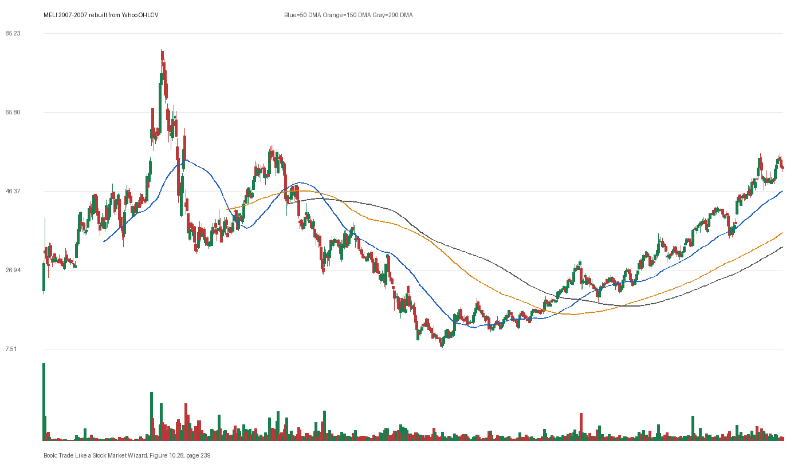

# Figure 10.28 - MELI - Page 239

## Source Image

Book: [[Trade Like a Stock Market Wizard]]

Caption: Mercadolibre Inc. (MELI) 2007 In early December 2007, Mercadolibre Inc. emerges from a proper pivot point. It rose 75 percent in 13 days

## Yahoo OHLCV Rebuild

Download status: `OK`

CSV: `data/book_stock_images/trade-like-a-stock-market-wizard-figure-10-28-meli-page-239_ohlcv.csv`

## Pattern Read

Tags: pivot-breakout, stage-2-leadership

Concepts: [[Pivot and Entry]], [[Relative Strength Leadership]], [[Stage 2 Uptrend]], [[Trend Template]]

The entry lesson is to define the pivot first, then judge whether the real OHLCV breakout left controllable risk.

## Reconciliation Metrics

| Metric | Value |
|---|---:|
| first_close | 28.5 |
| last_close | 52.04 |
| max_gain_pct | 184.81 |
| max_drawdown_from_period_high_pct | -90.26 |
| first_half_depth_pct | 437.19 |
| second_half_depth_pct | 604.8 |
| tightening | False |
| volume_dryup | False |
| best_trend_template_score | 5/5 |
| latest_trend_template_score | 5/5 |

## Trend Template Checks

- close > 50 DMA
- close > 150 DMA
- close > 200 DMA
- 50 DMA > 150 DMA
- 150 DMA > 200 DMA

## Study Questions

- Does the rebuilt OHLCV chart confirm the same structure shown in the book image?
- Was the stock close to a definable pivot, or already extended?
- Did volume dry up before the move, or was supply still obvious?
- Was this a buy lesson, a sell lesson, or a failure-avoidance lesson?
- What would invalidate the setup if this were being traded live?

<!-- STAGE_LIFECYCLE_START -->

## Stage Lifecycle & Base Concept Analysis

> This section analyzes the FULL LIFECYCLE of the stock around the inferred entry — Stage 1 (Accumulation), Stage 2 (Advance), Stage 3 (Distribution), Stage 4 (Decline) — plus deep base concept analysis, VCP footprint, tight footprint, supply dynamics, and contraction timeline.

- Status: `ok`
- Entry date: `2007-12-10`
- Entry price: `49.9700`

### Stage Lifecycle Overview

| Stage | Present | Start Date | End Date | Duration | Key Signal |
|---|---|---|---:|---|---|
| Stage 1 — Accumulation | ❌ | — | — | — | Not detected |
| Stage 2 — Advance | ❌ | — | — | — | Not detected |
| Stage 3 — Distribution | ❌ | — | — | — | Not detected |
| Stage 4 — Decline | ❌ | — | — | — | Not detected |

### Base Concept Deep-Dive

- Base type: `deep-chaotic`
- Base duration: `85 sessions`
- Base depth: `140.4%`
- Base high: `50.4900`
- Base low: `21.0000`
- Resistance touches at base high: `1`
- Support touches at base low: `1`
- Contraction count: `4`
- Contraction quality: `constructive-tightening`
- Pivot clarity: `clear-pivot-at-high`
- Pivot distance at entry: `-1.0%`
- Volume dry-up in base: `neutral`
- Volume dry-up ratio: `1.02`
- Tightness at pivot (10d): `21.5%`
- Weekly tightness: `17.8%`

### VCP Footprint

- VCP present: `True`
- VCP quality: `constructive-tightening`
- Total contraction depth: `88.9%`
- Final contraction depth: `47.4%`
- Number of contractions: `4`

| Phase | Date | Depth | Volume | Tightness |
|---|---|---:|---:|---:|
| C? | `2007-08-10` | 88.9% | 244700.0 | 7.1% |
| C? | `2007-09-05` | 53.0% | 179300.0 | 48.0% |
| C? | `2007-09-28` | 28.8% | 234200.0 | 22.9% |
| C? | `2007-10-23` | 47.4% | 329600.0 | 29.3% |

### Tight Footprint

- 10-session tightness at entry: `8.7%`
- 20-session tightness at entry: `32.2%`
- Weekly tightness: `3.3%`
- ATR20 %: `6.62`
- Tightness progression: `improving`

### Supply Analysis

- Supply label: `demand-dominant`
- Volume dry-up ratio: `0.89`
- Distribution volume detected: `False`
- Accumulation volume detected: `True`

### Contraction Timeline

| Phase | Start Date | Depth | Volume | Tightness |
|---|---|---:|---:|---:|
| C1 | `2007-08-10` | 88.9% | 244700.0 | 7.1% |
| C2 | `2007-09-05` | 53.0% | 179300.0 | 48.0% |
| C3 | `2007-09-28` | 28.8% | 234200.0 | 22.9% |
| C4 | `2007-10-23` | 47.4% | 329600.0 | 29.3% |

### Concept Tie-Back

- Related concepts: [[Volatility Contraction Pattern]], [[Pivot and Entry]]
- Lesson: VCP footprint shows 4 contractions with constructive-tightening quality.

<!-- STAGE_LIFECYCLE_END -->
<!-- PRE_ENTRY_SENSE_CHECK_START -->

## Pre-Entry Sense Check

> This section analyzes the chart structure PRIOR to the inferred entry. It answers: What did the setup look like in the weeks and months before the trade? Which Minervini concepts were already visible?

- Status: `ok`
- Entry date: `2007-12-10`
- Pre-entry history available: `84 sessions`

### Trend Template Evolution

| Lookback | Date | Score | Assessment |
|---|---|---:|:---|
| 60 days before |  | 0/7 | N/A |
| 40 days before |  | 0/7 | N/A |
| 20 days before |  | 0/7 | N/A |

### Pre-Entry Context Window

- Context window (last sessions before entry): `84 sessions`
- Range high: `48.1600`
- Range low: `21.0000`
- Total range depth: `129.3%`
- Contraction phases (rolling 21-bar segments): `88.9% -> 65.4% -> 35.8%`

### Stage 2 Onset

- No sustained Stage 2 was detected before entry.

### Volume Behavior Before Entry

- Volume dry-up label: `neutral`
- Recent/base volume ratio: `0.89`
- No significant volume spikes in last 40 days before entry.

### Tightness Progression

| Lookback | 10-Session Close Tightness |
|---|---:|
| 40 days before | `25.2%` |
| 20 days before | `22.2%` |
| Final 10 sessions before | `8.7%` |
| Final 3 weekly closes | `3.3%` |

### Moving Average Alignment

- 50/150/200 DMA alignment: `not achieved before entry`

### Shakeouts / Tests Before Entry

- `2007-10-22` — undercut-and-recover of SMA50 (low 36.48, close 38.64)
- `2007-11-13` — undercut-and-recover of SMA50 (low 35.35, close 41.06)

### 52-Week High Context

| Timing | Distance from 52W High |
|---|---:|
| 60 days before | `N/A` |
| 20 days before | `N/A` |
| At entry | `-1.0%` |

### Concept Tie-Back

- Related concepts: [[Volatility Contraction Pattern]], [[Pivot and Entry]]
- Lesson: No clear Stage 2 uptrend was visible before entry — treat as cautionary. Total pre-entry range was 129.3% — wide range indicating significant prior movement. Volume did not show clear dry-up — supply may still be present. Found 2 shakeout(s) before entry — test of conviction.

<!-- PRE_ENTRY_SENSE_CHECK_END -->
<!-- SEPA_REPLICATION_START -->

## SEPA Trade Replication

> Study note: this reconstructs a likely Minervini-style setup area from the real OHLCV window shown by the book timing. It does not claim to know Minervini's private fill, sizing, or unpublished execution.

- Status: `reconstructed-from-real-ohlcv`
- Setup type: `pivot-breakout-study`
- Confidence: `medium`
- Timing source: `2007-2007` from the figure caption and rebuilt OHLCV where available.
- Inferred study entry date: `2007-12-10`
- Inferred study entry price: `49.9700`
- Inferred pivot: `48.1600`
- Inferred stop / invalidation: `40.0100`
- Pivot extension at entry: `3.8%`
- Stop distance / risk: `24.9%`
- Trend Template score at entry: `3/7`

### Tightness And Supply
- 3-part pre-entry contraction depth: `65.4% -> 35.8% -> 46.0%`
- Contraction quality: `mixed-or-loose`
- 10-session close tightness: `8.7%`
- 3-week close tightness: `3.3%`
- Volume dry-up: `neutral`
- Recent/base median volume ratio: `0.89`
- Leadership proxy: relative leadership needs manual market/index comparison

### Post-Entry Reality Check
- Max gain after 20 sessions: `62.4%`
- Max gain after 60 sessions: `62.4%`
- Max gain after 120 sessions: `62.4%`
- Worst drawdown after 20 sessions: `-5.9%`
- Inferred stop failed within 20 sessions: `False`
- Pivot broadly respected within 20 sessions: `True`

### Concept Tie-Back

- Related concepts: [[Risk First]], [[Pivot and Entry]], [[Trend Template]], [[Stage 2 Uptrend]], [[Relative Strength Leadership]]
- Lesson: The reconstructed data suggests the structure still had loose or mixed contraction behavior; risk was wide, so the entry would need smaller size or a better cheat point; the pivot was broadly respected after entry.

<!-- SEPA_REPLICATION_END -->
