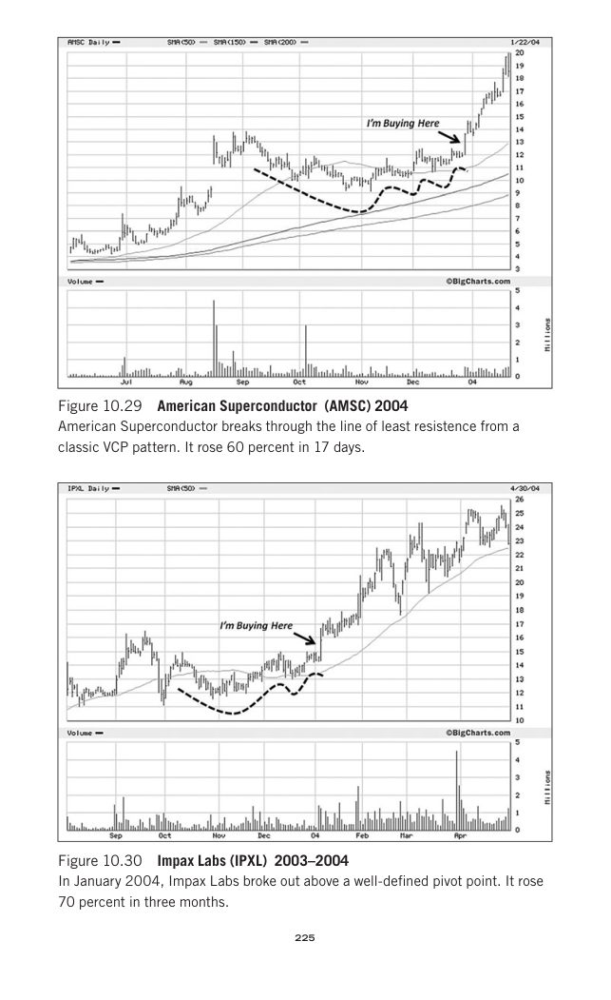
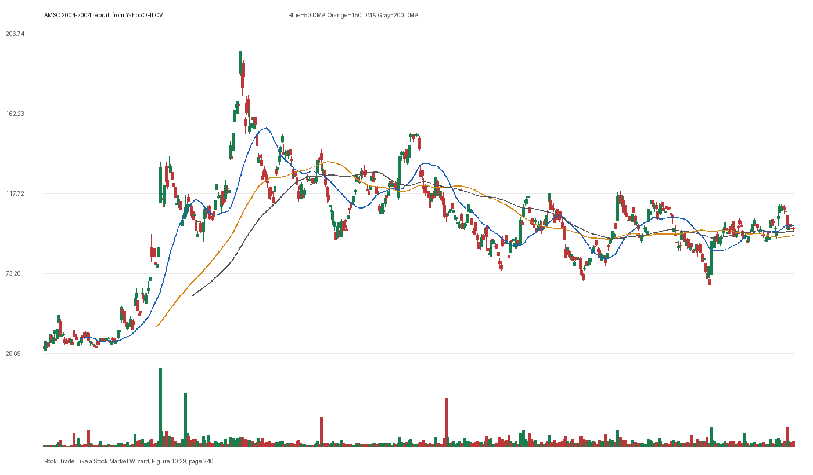

# Figure 10.29 - AMSC - Page 240

## Source Image

Book: [[Trade Like a Stock Market Wizard]]

Caption: American Superconductor (AMSC) 2004 American Superconductor breaks through the line of least resistence from a classic VCP pattern. It rose 60 percent in 17 days

## Yahoo OHLCV Rebuild

Download status: `OK`

CSV: `data/book_stock_images/trade-like-a-stock-market-wizard-figure-10-29-amsc-page-240_ohlcv.csv`

## Pattern Read

Tags: vcp-or-tightening, stage-2-leadership

Concepts: [[Pivot and Entry]], [[Relative Strength Leadership]], [[Stage 2 Uptrend]], [[Trend Template]], [[Volatility Contraction Pattern]], [[Volume Dry-Up and Accumulation]]

The useful clue is contraction: the later portion of the window became tighter than the earlier portion.

## Reconciliation Metrics

| Metric | Value |
|---|---:|
| first_close | 31.6 |
| last_close | 98.1 |
| max_gain_pct | 531.33 |
| max_drawdown_from_period_high_pct | -66.27 |
| first_half_depth_pct | 560.6 |
| second_half_depth_pct | 122.59 |
| tightening | True |
| volume_dryup | False |
| best_trend_template_score | 5/5 |
| latest_trend_template_score | 3/5 |

## Trend Template Checks

- close > 150 DMA
- close > 200 DMA
- 50 DMA > 150 DMA

## Study Questions

- Does the rebuilt OHLCV chart confirm the same structure shown in the book image?
- Was the stock close to a definable pivot, or already extended?
- Did volume dry up before the move, or was supply still obvious?
- Was this a buy lesson, a sell lesson, or a failure-avoidance lesson?
- What would invalidate the setup if this were being traded live?

<!-- STAGE_LIFECYCLE_START -->
## Stage Lifecycle & Base Concept Analysis
> This section analyzes the FULL LIFECYCLE of the stock around the inferred entry — Stage 1 (Accumulation), Stage 2 (Advance), Stage 3 (Distribution), Stage 4 (Decline) — plus deep base concept analysis, VCP footprint, tight footprint, supply dynamics, and contraction timeline.
- Status: `ok`
- Entry date: `2004-12-29`
- Entry price: `149.90`
### Stage Lifecycle Overview
| Stage | Present | Start Date | End Date | Duration | Key Signal |
|---|---|---|---:|---|---|
| Stage 1 — Accumulation | ✅ | `2003-05-27` | `2004-04-06` | 218 days | Base: deep-chaotic |
| Stage 2 — Advance | ✅ | `2004-04-06` | `2004-04-28` | 15 days | Max gain: 7.3% |
| Stage 3 — Distribution | ✅ | `2004-04-29` | `2004-05-07` | 6 days | no climax |
| Stage 4 — Decline | ✅ | `2004-05-10` | — | 287 days | Below 200 DMA: False |
### Stage 1 — Accumulation / Base Building
- Base type: `deep-chaotic`
- Lowest price in base: `35.2000`
- Volume pattern: `neutral`
### Base Concept Deep-Dive

- Base type: `deep-chaotic`
- Base duration: `186 sessions`
- Base depth: `67.9%`
- Base high: `151.30`
- Base low: `90.1000`
- Resistance touches at base high: `13`
- Support touches at base low: `4`
- Contraction count: `5`
- Contraction quality: `mixed-or-loose`
- Pivot clarity: `clear-pivot-at-high`
- Pivot distance at entry: `-0.9%`
- Volume dry-up in base: `neutral`
- Volume dry-up ratio: `0.84`
- Tightness at pivot (10d): `1.5%`
- Weekly tightness: `0.3%`

### VCP Footprint

- VCP present: `True`
- VCP quality: `mixed`
- Total contraction depth: `46.9%`
- Final contraction depth: `32.5%`
- Number of contractions: `5`

| Phase | Date | Depth | Volume | Tightness |
|---|---|---:|---:|---:|
| C? | `2004-04-05` | 38.3% | 15040.0 | 10.2% |
| C? | `2004-05-27` | 46.1% | 12360.0 | 17.2% |
| C? | `2004-07-22` | 46.9% | 15470.0 | 10.2% |
| C? | `2004-09-14` | 27.0% | 13670.0 | 12.9% |
| C? | `2004-11-04` | 32.5% | 13440.0 | 1.5% |

### Tight Footprint

- 10-session tightness at entry: `1.5%`
- 20-session tightness at entry: `10.5%`
- Weekly tightness: `0.5%`
- ATR20 %: `2.77`
- Tightness progression: `improving`

### Supply Analysis

- Supply label: `demand-dominant`
- Volume dry-up ratio: `0.94`
- Distribution volume detected: `False`
- Accumulation volume detected: `True`

### Contraction Timeline

| Phase | Start Date | Depth | Volume | Tightness |
|---|---|---:|---:|---:|
| C1 | `2004-04-05` | 38.3% | 15040.0 | 10.2% |
| C2 | `2004-05-27` | 46.1% | 12360.0 | 17.2% |
| C3 | `2004-07-22` | 46.9% | 15470.0 | 10.2% |
| C4 | `2004-09-14` | 27.0% | 13670.0 | 12.9% |
| C5 | `2004-11-04` | 32.5% | 13440.0 | 1.5% |

### Concept Tie-Back

- Related concepts: [[Base Concept]], [[Stage 2 Uptrend]], [[Trend Template]], [[Stage 3 Distribution]], [[Stage 4 Decline]], [[Volatility Contraction Pattern]], [[Pivot and Entry]]
- Lesson: Stage 1 base was deep-chaotic with 466.8% depth. Stage 2 advance lasted 16 sessions with 0 significant pivots. VCP footprint shows 5 contractions with mixed quality.

<!-- STAGE_LIFECYCLE_END -->
<!-- PRE_ENTRY_SENSE_CHECK_START -->

## Pre-Entry Sense Check

> This section analyzes the chart structure PRIOR to the inferred entry. It answers: What did the setup look like in the weeks and months before the trade? Which Minervini concepts were already visible?

- Status: `ok`
- Entry date: `2004-12-29`
- Pre-entry history available: `402 sessions`

### Trend Template Evolution

| Lookback | Date | Score | Assessment |
|---|---|---:|:---|
| 60 days before | 2004-10-04 | 4/7 | 🟡 Transitioning |
| 40 days before | 2004-11-01 | 0/7 | N/A |
| 20 days before | 2004-11-30 | 4/7 | 🟡 Transitioning |

### Pre-Entry Context Window

- Context window (last sessions before entry): `150 sessions`
- Range high: `151.30`
- Range low: `90.1000`
- Total range depth: `67.9%`
- Contraction phases (rolling 21-bar segments): `20.1% -> 57.2% -> 24.3% -> 21.3% -> 25.8% -> 18.0% -> 26.9%`

### Stage 2 Onset

- First sustained Stage 2 date: `2004-04-06`
- Days in Stage 2 before entry: `184`

### Volume Behavior Before Entry

- Volume dry-up label: `neutral`
- Recent/base volume ratio: `0.94`
- Volume spike dates (2.5x avg) in last 40 days: `2004-11-24, 2004-12-13, 2004-12-14`

### Tightness Progression

| Lookback | 10-Session Close Tightness |
|---|---:|
| 40 days before | `8.2%` |
| 20 days before | `20.8%` |
| Final 10 sessions before | `1.5%` |
| Final 3 weekly closes | `0.5%` |

### Moving Average Alignment

- 50/150/200 DMA first aligned (50>150>200): `2004-03-11`

### Shakeouts / Tests Before Entry

- `2004-11-04` — undercut-and-recover of SMA50 (low 117.5, close 123.5)
- `2004-11-22` — undercut-and-recover of SMA50 (low 114.2, close 126.1)

### 52-Week High Context

| Timing | Distance from 52W High |
|---|---:|
| 60 days before | `-35.4%` |
| 20 days before | `-30.6%` |
| At entry | `-24.9%` |

### Concept Tie-Back

- Related concepts: [[Stage 2 Uptrend]], [[Trend Template]], [[Relative Strength Leadership]], [[Pivot and Entry]]
- Lesson: Stage 2 was established 184 days before entry, confirming leadership context. Total pre-entry range was 67.9% — wide range indicating significant prior movement. Volume did not show clear dry-up — supply may still be present. Found 2 shakeout(s) before entry — test of conviction.

<!-- PRE_ENTRY_SENSE_CHECK_END -->
<!-- SEPA_REPLICATION_START -->

## SEPA Trade Replication

> Study note: this reconstructs a likely Minervini-style setup area from the real OHLCV window shown by the book timing. It does not claim to know Minervini's private fill, sizing, or unpublished execution.

- Status: `reconstructed-from-real-ohlcv`
- Setup type: `vcp/contraction-study`
- Confidence: `high`
- Timing source: `2004-2004` from the figure caption and rebuilt OHLCV where available.
- Inferred study entry date: `2004-12-29`
- Inferred study entry price: `149.90`
- Inferred pivot: `151.30`
- Inferred stop / invalidation: `134.10`
- Pivot extension at entry: `-0.9%`
- Stop distance / risk: `11.8%`
- Trend Template score at entry: `6/7`

### Tightness And Supply
- 3-part pre-entry contraction depth: `25.8% -> 25.4% -> 12.8%`
- Contraction quality: `clear-tightening`
- 10-session close tightness: `1.5%`
- 3-week close tightness: `0.5%`
- Volume dry-up: `neutral`
- Recent/base median volume ratio: `0.94`
- Leadership proxy: 65-day return 28.0% and 126-day return 14.6%

### Post-Entry Reality Check
- Max gain after 20 sessions: `0.4%`
- Max gain after 60 sessions: `0.4%`
- Max gain after 120 sessions: `0.4%`
- Worst drawdown after 20 sessions: `-28.3%`
- Inferred stop failed within 20 sessions: `True`
- Pivot broadly respected within 20 sessions: `False`

### Concept Tie-Back

- Related concepts: [[Risk First]], [[Volatility Contraction Pattern]], [[Volume Dry-Up and Accumulation]], [[Pivot and Entry]], [[Trend Template]], [[Stage 2 Uptrend]], [[Relative Strength Leadership]]
- Lesson: The reconstructed data suggests price was becoming more controllable before the inferred entry; risk was acceptable but not ideal; post-entry behavior violated the inferred stop within 20 sessions.

<!-- SEPA_REPLICATION_END -->
