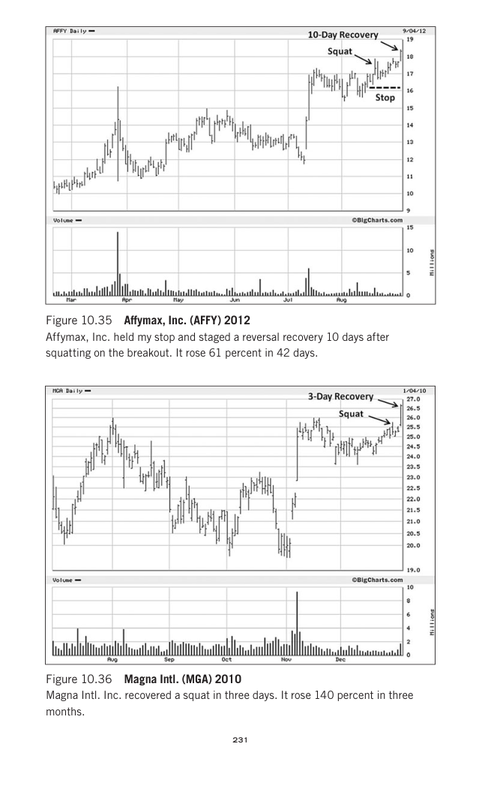
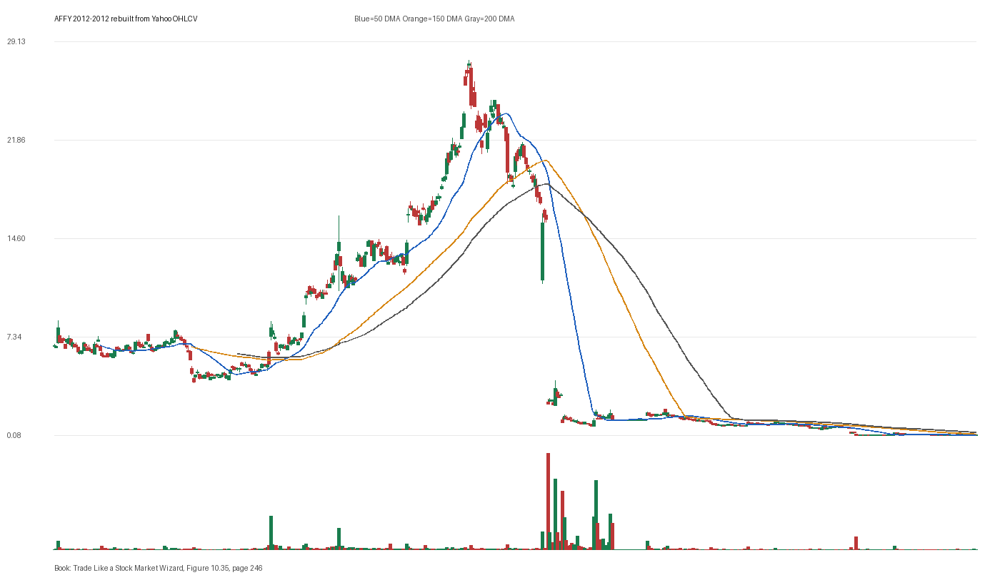

# Figure 10.35 - AFFY - Page 246

## Source Image

Book: [[Trade Like a Stock Market Wizard]]

Caption: Affymax, Inc. (AFFY) 2012 Affymax, Inc. held my stop and staged a reversal recovery 10 days after squatting on the breakout. It rose 61 percent in 42 days

## Yahoo OHLCV Rebuild

Download status: `OK`

CSV: `data/book_stock_images/trade-like-a-stock-market-wizard-figure-10-35-affy-page-246_ohlcv.csv`

## Pattern Read

Tags: pivot-breakout, volume-dry-up, stage-2-leadership

Concepts: [[Pivot and Entry]], [[Relative Strength Leadership]], [[Stage 2 Uptrend]], [[Trend Template]], [[Volume Dry-Up and Accumulation]]

The entry lesson is to define the pivot first, then judge whether the real OHLCV breakout left controllable risk. Volume contraction supports the idea that supply was drying up near the tight area.

## Reconciliation Metrics

| Metric | Value |
|---|---:|
| first_close | 6.69 |
| last_close | 0.1034 |
| max_gain_pct | 314.65 |
| max_drawdown_from_period_high_pct | -99.71 |
| first_half_depth_pct | 605.85 |
| second_half_depth_pct | 27087.5 |
| tightening | False |
| volume_dryup | True |
| best_trend_template_score | 5/5 |
| latest_trend_template_score | 0/5 |

## Trend Template Checks

- Not available or not applicable.

## Study Questions

- Does the rebuilt OHLCV chart confirm the same structure shown in the book image?
- Was the stock close to a definable pivot, or already extended?
- Did volume dry up before the move, or was supply still obvious?
- Was this a buy lesson, a sell lesson, or a failure-avoidance lesson?
- What would invalidate the setup if this were being traded live?

<!-- STAGE_LIFECYCLE_START -->
## Stage Lifecycle & Base Concept Analysis
> This section analyzes the FULL LIFECYCLE of the stock around the inferred entry — Stage 1 (Accumulation), Stage 2 (Advance), Stage 3 (Distribution), Stage 4 (Decline) — plus deep base concept analysis, VCP footprint, tight footprint, supply dynamics, and contraction timeline.
- Status: `ok`
- Entry date: `2012-10-05`
- Entry price: `22.7700`
### Stage Lifecycle Overview
| Stage | Present | Start Date | End Date | Duration | Key Signal |
|---|---|---|---:|---|---|
| Stage 1 — Accumulation | ✅ | `2011-07-13` | `2012-07-12` | 252 days | Base: deep-chaotic |
| Stage 2 — Advance | ✅ | `2012-07-12` | `2012-12-18` | 109 days | Max gain: 94.8% |
| Stage 3 — Distribution | ✅ | `2013-05-10` | `2013-06-28` | 34 days | climax vol |
| Stage 4 — Decline | ❌ | — | — | — | Not detected |
### Stage 1 — Accumulation / Base Building
- Base type: `deep-chaotic`
- Lowest price in base: `3.9300`
- Volume pattern: `late-supply`
### Stage 2 — Advance / Trend Pivots

- Number of significant pivots during advance: `3`

| Pivot Date | Price |
|---|---:|
| `2012-08-20` | `17.8800` |
| `2012-09-21` | `22.0000` |
| `2012-10-16` | `27.4800` |

#### Trend Template Evolution During Stage 2

| % Through Stage 2 | Date | Score |
|---|---|---:|
| 0% | `2012-07-12` | 7/7 |
| 25% | `2012-08-20` | 7/7 |
| 50% | `2012-09-27` | 7/7 |
| 75% | `2012-11-07` | 6/7 |
| 100% | `2012-12-18` | 6/7 |

### Base Concept Deep-Dive

- Base type: `deep-chaotic`
- Base duration: `62 sessions`
- Base depth: `94.8%`
- Base high: `22.8600`
- Base low: `11.7300`
- Resistance touches at base high: `1`
- Support touches at base low: `1`
- Contraction count: `4`
- Contraction quality: `constructive-tightening`
- Pivot clarity: `clear-pivot-at-high`
- Pivot distance at entry: `-0.4%`
- Volume dry-up in base: `neutral`
- Volume dry-up ratio: `0.9`
- Tightness at pivot (10d): `10.6%`
- Weekly tightness: `8.1%`

### VCP Footprint

- VCP present: `True`
- VCP quality: `constructive-tightening`
- Total contraction depth: `47.7%`
- Final contraction depth: `14.2%`
- Number of contractions: `4`

| Phase | Date | Depth | Volume | Tightness |
|---|---|---:|---:|---:|
| C? | `2012-07-11` | 47.7% | 736873.0 | 4.4% |
| C? | `2012-08-01` | 16.1% | 869575.0 | 8.3% |
| C? | `2012-08-22` | 17.2% | 554819.0 | 10.8% |
| C? | `2012-09-13` | 14.2% | 607323.0 | 4.5% |

### Tight Footprint

- 10-session tightness at entry: `6.6%`
- 20-session tightness at entry: `16.0%`
- Weekly tightness: `4.2%`
- ATR20 %: `3.18`
- Tightness progression: `improving`

### Supply Analysis

- Supply label: `neutral`
- Volume dry-up ratio: `0.91`
- Distribution volume detected: `False`
- Accumulation volume detected: `False`
- Climax volume dates: `2012-08-09`

### Contraction Timeline

| Phase | Start Date | Depth | Volume | Tightness |
|---|---|---:|---:|---:|
| C1 | `2012-07-11` | 47.7% | 736873.0 | 4.4% |
| C2 | `2012-08-01` | 16.1% | 869575.0 | 8.3% |
| C3 | `2012-08-22` | 17.2% | 554819.0 | 10.8% |
| C4 | `2012-09-13` | 14.2% | 607323.0 | 4.5% |

### Concept Tie-Back

- Related concepts: [[Base Concept]], [[Stage 2 Uptrend]], [[Trend Template]], [[Stage 3 Distribution]], [[Volatility Contraction Pattern]], [[Pivot and Entry]]
- Lesson: Stage 1 base was deep-chaotic with 313.5% depth. Stage 2 advance lasted 110 sessions with 3 significant pivots. VCP footprint shows 4 contractions with constructive-tightening quality.

<!-- STAGE_LIFECYCLE_END -->
<!-- PRE_ENTRY_SENSE_CHECK_START -->

## Pre-Entry Sense Check

> This section analyzes the chart structure PRIOR to the inferred entry. It answers: What did the setup look like in the weeks and months before the trade? Which Minervini concepts were already visible?

- Status: `ok`
- Entry date: `2012-10-05`
- Pre-entry history available: `344 sessions`

### Trend Template Evolution

| Lookback | Date | Score | Assessment |
|---|---|---:|:---|
| 60 days before | 2012-07-12 | 7/7 | ✅ Stage 2 confirmed |
| 40 days before | 2012-08-09 | 7/7 | ✅ Stage 2 confirmed |
| 20 days before | 2012-09-07 | 7/7 | ✅ Stage 2 confirmed |

### Pre-Entry Context Window

- Context window (last sessions before entry): `150 sessions`
- Range high: `22.0000`
- Range low: `10.3700`
- Total range depth: `112.2%`
- Contraction phases (rolling 21-bar segments): `56.7% -> 24.8% -> 20.1% -> 13.3% -> 47.7% -> 16.2% -> 26.5%`

### Stage 2 Onset

- First sustained Stage 2 date: `2012-03-13`
- Days in Stage 2 before entry: `144`

### Volume Behavior Before Entry

- Volume dry-up label: `neutral`
- Recent/base volume ratio: `0.91`
- Volume spike dates (2.5x avg) in last 40 days: `2012-08-09, 2012-08-20, 2012-09-13`

### Tightness Progression

| Lookback | 10-Session Close Tightness |
|---|---:|
| 40 days before | `8.7%` |
| 20 days before | `11.6%` |
| Final 10 sessions before | `6.6%` |
| Final 3 weekly closes | `4.2%` |

### Moving Average Alignment

- 50/150/200 DMA first aligned (50>150>200): `2012-03-19`

### Shakeouts / Tests Before Entry

- `2012-08-13` — undercut-and-recover of SMA50 (low 15.64, close 16.32)

### 52-Week High Context

| Timing | Distance from 52W High |
|---|---:|
| 60 days before | `-12.4%` |
| 20 days before | `-0.8%` |
| At entry | `-0.4%` |

### Concept Tie-Back

- Related concepts: [[Stage 2 Uptrend]], [[Trend Template]], [[Relative Strength Leadership]], [[Volatility Contraction Pattern]], [[Pivot and Entry]]
- Lesson: Stage 2 was established 144 days before entry, confirming leadership context. Total pre-entry range was 112.2% — wide range indicating significant prior movement. Volume did not show clear dry-up — supply may still be present. Found 1 shakeout(s) before entry — test of conviction.

<!-- PRE_ENTRY_SENSE_CHECK_END -->
<!-- SEPA_REPLICATION_START -->

## SEPA Trade Replication

> Study note: this reconstructs a likely Minervini-style setup area from the real OHLCV window shown by the book timing. It does not claim to know Minervini's private fill, sizing, or unpublished execution.

- Status: `reconstructed-from-real-ohlcv`
- Setup type: `pivot-breakout-study`
- Confidence: `high`
- Timing source: `2012-2012` from the figure caption and rebuilt OHLCV where available.
- Inferred study entry date: `2012-10-05`
- Inferred study entry price: `22.7700`
- Inferred pivot: `22.0000`
- Inferred stop / invalidation: `20.0200`
- Pivot extension at entry: `3.5%`
- Stop distance / risk: `13.7%`
- Trend Template score at entry: `7/7`

### Tightness And Supply
- 3-part pre-entry contraction depth: `47.7% -> 18.9% -> 18.5%`
- Contraction quality: `clear-tightening`
- 10-session close tightness: `6.6%`
- 3-week close tightness: `4.2%`
- Volume dry-up: `neutral`
- Recent/base median volume ratio: `0.91`
- Leadership proxy: 65-day return 71.1% and 126-day return 106.2%

### Post-Entry Reality Check
- Max gain after 20 sessions: `21.8%`
- Max gain after 60 sessions: `21.8%`
- Max gain after 120 sessions: `21.8%`
- Worst drawdown after 20 sessions: `-2.9%`
- Inferred stop failed within 20 sessions: `False`
- Pivot broadly respected within 20 sessions: `True`

### Concept Tie-Back

- Related concepts: [[Risk First]], [[Volatility Contraction Pattern]], [[Volume Dry-Up and Accumulation]], [[Pivot and Entry]], [[Trend Template]], [[Stage 2 Uptrend]], [[Relative Strength Leadership]]
- Lesson: The reconstructed data suggests price was becoming more controllable before the inferred entry; risk was wide, so the entry would need smaller size or a better cheat point; the pivot was broadly respected after entry.

<!-- SEPA_REPLICATION_END -->
