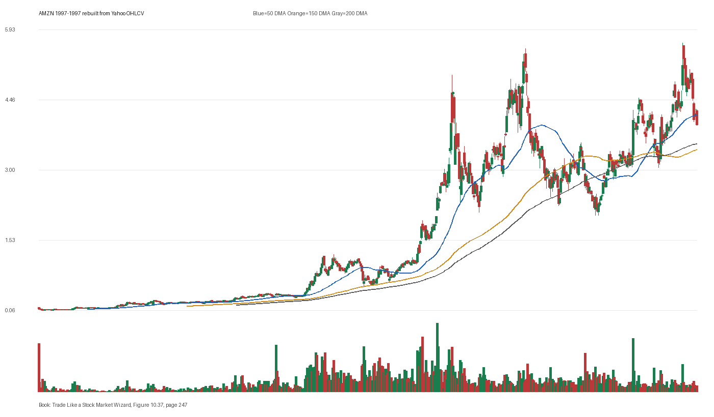

# Figure 10.37 - AMZN - Page 247

## Source Image

Book: [[Trade Like a Stock Market Wizard]]

Caption: Amazon (AMZN) 1997 Amazon displayed a series of reversal recoveries as it emerged into new high ground after going public less than four months earlier. It rose 1,700 percent in 16 months

## Yahoo OHLCV Rebuild

Download status: `OK`

CSV: `data/book_stock_images/trade-like-a-stock-market-wizard-figure-10-37-amzn-page-247_ohlcv.csv`

## Pattern Read

Tags: vcp-or-tightening, pivot-breakout, stage-2-leadership

Concepts: [[Pivot and Entry]], [[Relative Strength Leadership]], [[Stage 2 Uptrend]], [[Trend Template]], [[Volatility Contraction Pattern]], [[Volume Dry-Up and Accumulation]]

The useful clue is contraction: the later portion of the window became tighter than the earlier portion. The entry lesson is to define the pivot first, then judge whether the real OHLCV breakout left controllable risk.

## Reconciliation Metrics

| Metric | Value |
|---|---:|
| first_close | 0.0979 |
| last_close | 3.9531 |
| max_gain_pct | 5670.19 |
| max_drawdown_from_period_high_pct | -62.94 |
| first_half_depth_pct | 1766.67 |
| second_half_depth_pct | 863.41 |
| tightening | True |
| volume_dryup | False |
| best_trend_template_score | 5/5 |
| latest_trend_template_score | 3/5 |

## Trend Template Checks

- close > 150 DMA
- close > 200 DMA
- 50 DMA > 150 DMA

## Study Questions

- Does the rebuilt OHLCV chart confirm the same structure shown in the book image?
- Was the stock close to a definable pivot, or already extended?
- Did volume dry up before the move, or was supply still obvious?
- Was this a buy lesson, a sell lesson, or a failure-avoidance lesson?
- What would invalidate the setup if this were being traded live?

<!-- STAGE_LIFECYCLE_START -->

## Stage Lifecycle & Base Concept Analysis

> This section analyzes the FULL LIFECYCLE of the stock around the inferred entry — Stage 1 (Accumulation), Stage 2 (Advance), Stage 3 (Distribution), Stage 4 (Decline) — plus deep base concept analysis, VCP footprint, tight footprint, supply dynamics, and contraction timeline.

- Status: `ok`
- Entry date: `1997-09-05`
- Entry price: `0.1250`

### Stage Lifecycle Overview

| Stage | Present | Start Date | End Date | Duration | Key Signal |
|---|---|---|---:|---|---|
| Stage 1 — Accumulation | ❌ | — | — | — | Not detected |
| Stage 2 — Advance | ❌ | — | — | — | Not detected |
| Stage 3 — Distribution | ❌ | — | — | — | Not detected |
| Stage 4 — Decline | ❌ | — | — | — | Not detected |

### Base Concept Deep-Dive

- Base type: `deep-chaotic`
- Base duration: `79 sessions`
- Base depth: `103.2%`
- Base high: `0.1300`
- Base low: `0.0700`
- Resistance touches at base high: `1`
- Support touches at base low: `2`
- Contraction count: `5`
- Contraction quality: `constructive-tightening`
- Pivot clarity: `below-pivot-caution`
- Pivot distance at entry: `-6.2%`
- Volume dry-up in base: `moderate-dry-up`
- Volume dry-up ratio: `0.66`
- Tightness at pivot (10d): `20.1%`
- Weekly tightness: `17.6%`

### VCP Footprint

- VCP present: `True`
- VCP quality: `constructive-tightening`
- Total contraction depth: `90.5%`
- Final contraction depth: `23.7%`
- Number of contractions: `5`

| Phase | Date | Depth | Volume | Tightness |
|---|---|---:|---:|---:|
| C? | `1997-05-15` | 90.5% | 113448000.0 | 13.4% |
| C? | `1997-06-06` | 15.5% | 42120000.0 | 5.6% |
| C? | `1997-06-27` | 73.9% | 92088000.0 | 28.1% |
| C? | `1997-07-21` | 21.5% | 44232000.0 | 13.9% |
| C? | `1997-08-11` | 23.7% | 20832000.0 | 16.3% |

### Tight Footprint

- 10-session tightness at entry: `20.7%`
- 20-session tightness at entry: `25.0%`
- Weekly tightness: `20.1%`
- ATR20 %: `5.01`
- Tightness progression: `worsening`

### Supply Analysis

- Supply label: `diminishing`
- Volume dry-up ratio: `0.57`
- Distribution volume detected: `False`
- Accumulation volume detected: `False`
- Climax volume dates: `1997-07-10, 1997-07-11, 1997-07-15`

### Contraction Timeline

| Phase | Start Date | Depth | Volume | Tightness |
|---|---|---:|---:|---:|
| C1 | `1997-05-15` | 90.5% | 113448000.0 | 13.4% |
| C2 | `1997-06-06` | 15.5% | 42120000.0 | 5.6% |
| C3 | `1997-06-27` | 73.9% | 92088000.0 | 28.1% |
| C4 | `1997-07-21` | 21.5% | 44232000.0 | 13.9% |
| C5 | `1997-08-11` | 23.7% | 20832000.0 | 16.3% |

### Concept Tie-Back

- Related concepts: [[Volatility Contraction Pattern]], [[Pivot and Entry]], [[Volume Dry-Up and Accumulation]], [[Supply and Demand]]
- Lesson: VCP footprint shows 5 contractions with constructive-tightening quality. Supply was diminishing before entry.

<!-- STAGE_LIFECYCLE_END -->
<!-- PRE_ENTRY_SENSE_CHECK_START -->

## Pre-Entry Sense Check

> This section analyzes the chart structure PRIOR to the inferred entry. It answers: What did the setup look like in the weeks and months before the trade? Which Minervini concepts were already visible?

- Status: `ok`
- Entry date: `1997-09-05`
- Pre-entry history available: `78 sessions`

### Trend Template Evolution

| Lookback | Date | Score | Assessment |
|---|---|---:|:---|
| 60 days before |  | 0/7 | N/A |
| 40 days before |  | 0/7 | N/A |
| 20 days before |  | 0/7 | N/A |

### Pre-Entry Context Window

- Context window (last sessions before entry): `78 sessions`
- Range high: `0.1300`
- Range low: `0.0700`
- Total range depth: `96.0%`
- Contraction phases (rolling 21-bar segments): `90.5% -> 73.9% -> 21.5%`

### Stage 2 Onset

- First sustained Stage 2 date: `1998-03-03`
- Days in Stage 2 before entry: `-122`

### Volume Behavior Before Entry

- Volume dry-up label: `moderate-dry-up`
- Recent/base volume ratio: `0.57`
- Volume spike dates (2.5x avg) in last 40 days: `1997-07-10, 1997-07-11, 1997-07-14`

### Tightness Progression

| Lookback | 10-Session Close Tightness |
|---|---:|
| 40 days before | `55.9%` |
| 20 days before | `12.3%` |
| Final 10 sessions before | `20.7%` |
| Final 3 weekly closes | `20.1%` |

### Moving Average Alignment

- 50/150/200 DMA alignment: `not achieved before entry`

### Shakeouts / Tests Before Entry

- No shakeouts or undercut-recover patterns detected in last 40 sessions before entry.

### 52-Week High Context

| Timing | Distance from 52W High |
|---|---:|
| 60 days before | `N/A` |
| 20 days before | `N/A` |
| At entry | `-6.2%` |

### Concept Tie-Back

- Related concepts: [[Volatility Contraction Pattern]], [[Pivot and Entry]], [[Volume Dry-Up and Accumulation]]
- Lesson: No clear Stage 2 uptrend was visible before entry — treat as cautionary. Total pre-entry range was 96.0% — wide range indicating significant prior movement. Volume dried up before entry, suggesting supply absorption.

<!-- PRE_ENTRY_SENSE_CHECK_END -->
<!-- SEPA_REPLICATION_START -->

## SEPA Trade Replication

> Study note: this reconstructs a likely Minervini-style setup area from the real OHLCV window shown by the book timing. It does not claim to know Minervini's private fill, sizing, or unpublished execution.

- Status: `reconstructed-from-real-ohlcv`
- Setup type: `pivot-breakout-study`
- Confidence: `high`
- Timing source: `1997-1997` from the figure caption and rebuilt OHLCV where available.
- Inferred study entry date: `1997-09-05`
- Inferred study entry price: `0.1250`
- Inferred pivot: `0.1286`
- Inferred stop / invalidation: `0.0969`
- Pivot extension at entry: `-2.8%`
- Stop distance / risk: `29.0%`
- Trend Template score at entry: `3/7`

### Tightness And Supply
- 3-part pre-entry contraction depth: `36.6% -> 26.0% -> 31.7%`
- Contraction quality: `mixed-or-loose`
- 10-session close tightness: `20.7%`
- 3-week close tightness: `20.1%`
- Volume dry-up: `moderate-dry-up`
- Recent/base median volume ratio: `0.57`
- Leadership proxy: relative leadership needs manual market/index comparison

### Post-Entry Reality Check
- Max gain after 20 sessions: `92.5%`
- Max gain after 60 sessions: `120.0%`
- Max gain after 120 sessions: `165.4%`
- Worst drawdown after 20 sessions: `0.0%`
- Inferred stop failed within 20 sessions: `False`
- Pivot broadly respected within 20 sessions: `True`

### Concept Tie-Back

- Related concepts: [[Risk First]], [[Pivot and Entry]], [[Trend Template]], [[Stage 2 Uptrend]], [[Relative Strength Leadership]]
- Lesson: The reconstructed data suggests the structure still had loose or mixed contraction behavior; volume supported the supply-dry-up idea; risk was wide, so the entry would need smaller size or a better cheat point; the pivot was broadly respected after entry.

<!-- SEPA_REPLICATION_END -->
