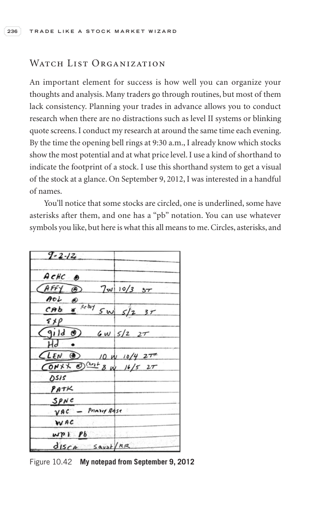

# Figure 10.42 - Manual Review - Page 251

## Source Image

Book: [[Trade Like a Stock Market Wizard]]

Caption: My notepad from September 9, 2012

## Yahoo OHLCV Rebuild

Download status: `SKIPPED: no ticker/year range in caption`

_No rebuilt Yahoo chart available for this ticker/range._

CSV: _No CSV generated._

## Pattern Read

Tags: manual-review-needed

Concepts: [[Mental Discipline]], [[Notepad and Trade Journal]]

Yahoo reconciliation was unavailable, so treat this as an image-only review case.

## Reconciliation Metrics

| Metric | Value |
|---|---:|
| Reconciliation | Not available |

## Trend Template Checks

- Not available or not applicable.

## Study Questions

- Does the rebuilt OHLCV chart confirm the same structure shown in the book image?
- Was the stock close to a definable pivot, or already extended?
- Did volume dry up before the move, or was supply still obvious?
- Was this a buy lesson, a sell lesson, or a failure-avoidance lesson?
- What would invalidate the setup if this were being traded live?

<!-- SEPA_REPLICATION_START -->

## SEPA Trade Replication

> Study note: this reconstructs a likely Minervini-style setup area from the real OHLCV window shown by the book timing. It does not claim to know Minervini's private fill, sizing, or unpublished execution.

- Status: `manual-data-limited`
- Setup type: `manual image-only study`
- Confidence: `low`
- Timing source: `2012-2012` from the figure caption and rebuilt OHLCV where available.

### Tightness And Supply
- 3-part pre-entry contraction depth: `not available`
- Contraction quality: ``
- 10-session close tightness: ``
- 3-week close tightness: ``
- Volume dry-up: ``
- Recent/base median volume ratio: ``
- Leadership proxy: manual review required

### Post-Entry Reality Check
- Post-entry check: `not available without reconstructed OHLCV`

### Concept Tie-Back

- Related concepts: [[Risk First]]
- Lesson: No reliable reconstructed OHLCV is available for this case. Use the source image as a visual pattern-memory example, but do not infer exact entry price, stop, or follow-through from data.

<!-- SEPA_REPLICATION_END -->

<!-- MANUAL_ANALYSIS_FRAMEWORK_START -->

## Manual Analysis Framework

> This case lacks reconstructed OHLCV data (ticker may be delisted, acquired, or the caption lacked sufficient timing). This framework provides structured guidance for manual review of the source image.

- Status: `manual-review-needed`
- Download status: `SKIPPED: no ticker/year range in caption`
- Inferred stage from tags: `uncertain-manual-review`
- Likely base type: `unknown-manual-review`

### Source Page Metadata

- Page kind: `stock-chart-page`
- Drawing count (annotations): `18`
- Chapter context: `picture-study`

### Annotation Reading Guide

Moderately annotated page (18 drawing elements). Look for: key pivot points, entry markers, and trend lines. Annotations likely highlight the main teaching point.

### Inferred Pattern Characteristics

- VCP indicators: `unclear`
- Supply label: `uncertain`
- Supply confidence: `low`

### Extracted Page Text

> 236 T R A D E L I K E A S T O C K M A R K E T W I Z A R D Watch List Organization An important element for success is how well you can organize your thoughts and analysis. Many traders go through routines, but most of them lack consistency. Planning your trades in advance allows you to conduct resea...

### Manual Review Questions

1. What Stage is the stock in at the time of the chart? (1 accumulation, 2 advance, 3 distribution, 4 decline)
2. Is there a definable base visible? What type? (flat, cup, VCP, IPO, extended)
3. Are there annotations on the chart (arrows, circles, lines)? What do they point to?
4. Is the stock near a pivot point or already extended?
5. Does volume show dry-up near any tight area, or is supply still obvious?
6. What is the chapter teaching — buy setup, sell rule, failure example, or concept illustration?
7. If this were a buy setup, where would the stop be? Is the risk controllable?
8. What fundamental clues (if any) are shown alongside the chart?

### Concept Tie-Back

- Related concepts: None inferred — review manually
- Lesson: This case lacks OHLCV reconstruction. Use the source image and chapter context (picture-study) for manual analysis. Inferred stage from tags: uncertain-manual-review. Likely base type: unknown-manual-review.

<!-- MANUAL_ANALYSIS_FRAMEWORK_END -->
