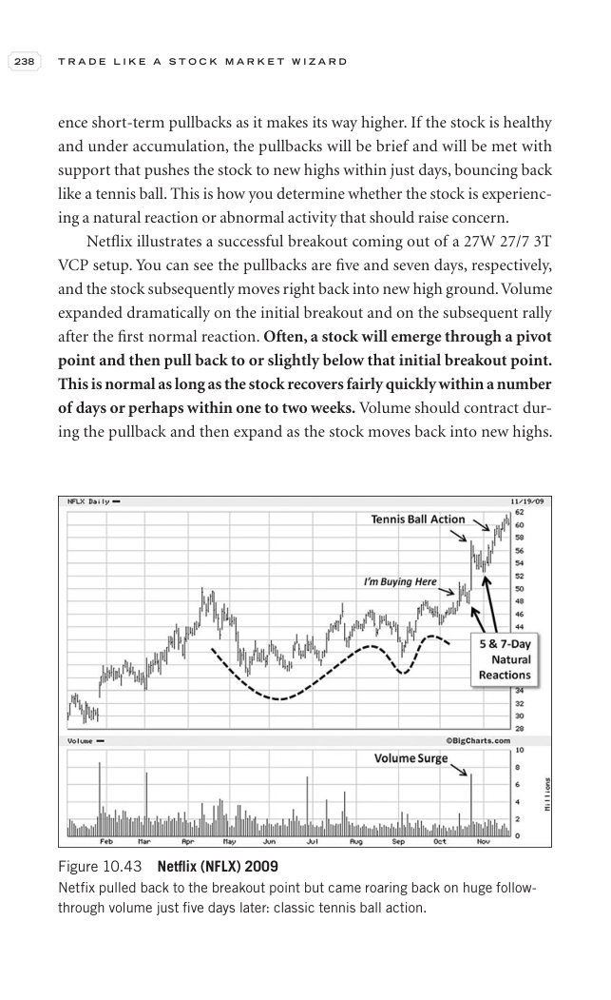
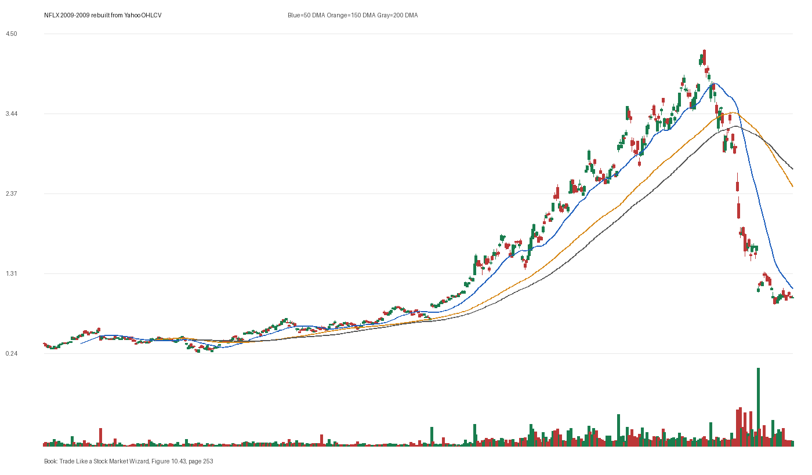

# Figure 10.43 - NFLX - Page 253

## Source Image

Book: [[Trade Like a Stock Market Wizard]]

Caption: Netflix (NFLX) 2009 Netfix pulled back to the breakout point but came roaring back on huge follow- through volume just five days later: classic tennis ball action

## Yahoo OHLCV Rebuild

Download status: `OK`

CSV: `data/book_stock_images/trade-like-a-stock-market-wizard-figure-10-43-nflx-page-253_ohlcv.csv`

## Pattern Read

Tags: pivot-breakout, stage-2-leadership

Concepts: [[Pivot and Entry]], [[Relative Strength Leadership]], [[Stage 2 Uptrend]], [[Trend Template]]

The entry lesson is to define the pivot first, then judge whether the real OHLCV breakout left controllable risk.

## Reconciliation Metrics

| Metric | Value |
|---|---:|
| first_close | 0.3764 |
| last_close | 0.9899 |
| max_gain_pct | 1056.7 |
| max_drawdown_from_period_high_pct | -79.54 |
| first_half_depth_pct | 244.41 |
| second_half_depth_pct | 528.17 |
| tightening | False |
| volume_dryup | False |
| best_trend_template_score | 5/5 |
| latest_trend_template_score | 0/5 |

## Trend Template Checks

- Not available or not applicable.

## Study Questions

- Does the rebuilt OHLCV chart confirm the same structure shown in the book image?
- Was the stock close to a definable pivot, or already extended?
- Did volume dry up before the move, or was supply still obvious?
- Was this a buy lesson, a sell lesson, or a failure-avoidance lesson?
- What would invalidate the setup if this were being traded live?

<!-- STAGE_LIFECYCLE_START -->
## Stage Lifecycle & Base Concept Analysis
> This section analyzes the FULL LIFECYCLE of the stock around the inferred entry — Stage 1 (Accumulation), Stage 2 (Advance), Stage 3 (Distribution), Stage 4 (Decline) — plus deep base concept analysis, VCP footprint, tight footprint, supply dynamics, and contraction timeline.
- Status: `ok`
- Entry date: `2009-03-12`
- Entry price: `0.5709`
### Stage Lifecycle Overview
| Stage | Present | Start Date | End Date | Duration | Key Signal |
|---|---|---|---:|---|---|
| Stage 1 — Accumulation | ✅ | `2008-09-09` | `2009-09-09` | 252 days | Base: deep-chaotic |
| Stage 2 — Advance | ✅ | `2009-09-09` | `2010-06-29` | 202 days | Max gain: 196.0% |
| Stage 3 — Distribution | ❌ | — | — | — | Not detected |
| Stage 4 — Decline | ❌ | — | — | — | Not detected |
### Stage 1 — Accumulation / Base Building
- Base type: `deep-chaotic`
- Lowest price in base: `0.2600`
- Volume pattern: `neutral`
### Stage 2 — Advance / Trend Pivots

- Number of significant pivots during advance: `5`

| Pivot Date | Price |
|---|---:|
| `2009-10-23` | `0.8200` |
| `2009-11-18` | `0.8800` |
| `2009-12-24` | `0.8200` |
| `2010-01-29` | `0.9200` |
| `2010-04-26` | `1.5700` |

#### Trend Template Evolution During Stage 2

| % Through Stage 2 | Date | Score |
|---|---|---:|
| 0% | `2009-09-09` | 6/7 |
| 25% | `2009-11-18` | 7/7 |
| 50% | `2010-02-03` | 7/7 |
| 75% | `2010-04-16` | 7/7 |
| 100% | `2010-06-29` | 7/7 |

### Base Concept Deep-Dive

- Base type: `N/A`
- Base duration: `0 sessions`
- Base depth: `N/A`
- Base high: `N/A`
- Base low: `N/A`
- Resistance touches at base high: `0`
- Support touches at base low: `0`
- Contraction count: `0`
- Contraction quality: `N/A`
- Pivot clarity: `N/A`
- Pivot distance at entry: `N/A`
- Volume dry-up in base: `N/A`
- Volume dry-up ratio: `N/A`
- Tightness at pivot (10d): `N/A`
- Weekly tightness: `N/A`

### VCP Footprint

- VCP present: `False`
- No clear VCP pattern detected in the base.

### Tight Footprint

- 10-session tightness at entry: `12.1%`
- 20-session tightness at entry: `12.2%`
- Weekly tightness: `5.4%`
- ATR20 %: `4.81`
- Tightness progression: `worsening`

### Supply Analysis

- Supply label: `neutral`
- Volume dry-up ratio: `0.92`
- Distribution volume detected: `False`
- Accumulation volume detected: `False`
- Climax volume dates: `2009-01-27, 2009-03-03`

### Concept Tie-Back

- Related concepts: [[Base Concept]], [[Stage 2 Uptrend]], [[Trend Template]]
- Lesson: Stage 1 base was deep-chaotic with 180.7% depth. Stage 2 advance lasted 203 sessions with 5 significant pivots.

<!-- STAGE_LIFECYCLE_END -->
<!-- PRE_ENTRY_SENSE_CHECK_START -->

## Pre-Entry Sense Check

> This section analyzes the chart structure PRIOR to the inferred entry. It answers: What did the setup look like in the weeks and months before the trade? Which Minervini concepts were already visible?

- Status: `ok`
- Entry date: `2009-03-12`
- Pre-entry history available: `200 sessions`

### Trend Template Evolution

| Lookback | Date | Score | Assessment |
|---|---|---:|:---|
| 60 days before |  | 0/7 | N/A |
| 40 days before |  | 0/7 | N/A |
| 20 days before |  | 0/7 | N/A |

### Pre-Entry Context Window

- Context window (last sessions before entry): `150 sessions`
- Range high: `0.5700`
- Range low: `0.2600`
- Total range depth: `122.7%`
- Contraction phases (rolling 21-bar segments): `9.8% -> 23.7% -> 50.1% -> 34.3% -> 41.5% -> 31.9% -> 15.0%`

### Stage 2 Onset

- First sustained Stage 2 date: `2009-03-12`
- Days in Stage 2 before entry: `0`

### Volume Behavior Before Entry

- Volume dry-up label: `neutral`
- Recent/base volume ratio: `0.92`
- Volume spike dates (2.5x avg) in last 40 days: `2009-01-27, 2009-03-03`

### Tightness Progression

| Lookback | 10-Session Close Tightness |
|---|---:|
| 40 days before | `18.7%` |
| 20 days before | `3.7%` |
| Final 10 sessions before | `12.1%` |
| Final 3 weekly closes | `5.4%` |

### Moving Average Alignment

- 50/150/200 DMA alignment: `not achieved before entry`

### Shakeouts / Tests Before Entry

- `2009-01-15` — undercut-and-recover of SMA50 (low 0.41, close 0.45)
- `2009-01-21` — undercut-and-recover of SMA50 (low 0.42, close 0.44)

### 52-Week High Context

| Timing | Distance from 52W High |
|---|---:|
| 60 days before | `N/A` |
| 20 days before | `N/A` |
| At entry | `-0.1%` |

### Concept Tie-Back

- Related concepts: [[Pivot and Entry]]
- Lesson: No clear Stage 2 uptrend was visible before entry — treat as cautionary. Total pre-entry range was 122.7% — wide range indicating significant prior movement. Volume did not show clear dry-up — supply may still be present. Found 2 shakeout(s) before entry — test of conviction.

<!-- PRE_ENTRY_SENSE_CHECK_END -->
<!-- SEPA_REPLICATION_START -->

## SEPA Trade Replication

> Study note: this reconstructs a likely Minervini-style setup area from the real OHLCV window shown by the book timing. It does not claim to know Minervini's private fill, sizing, or unpublished execution.

- Status: `reconstructed-from-real-ohlcv`
- Setup type: `pivot-breakout-study`
- Confidence: `high`
- Timing source: `2009-2009` from the figure caption and rebuilt OHLCV where available.
- Inferred study entry date: `2009-03-12`
- Inferred study entry price: `0.5709`
- Inferred pivot: `0.5696`
- Inferred stop / invalidation: `0.4859`
- Pivot extension at entry: `0.2%`
- Stop distance / risk: `17.5%`
- Trend Template score at entry: `6/7`

### Tightness And Supply
- 3-part pre-entry contraction depth: `34.3% -> 31.9% -> 17.2%`
- Contraction quality: `clear-tightening`
- 10-session close tightness: `12.1%`
- 3-week close tightness: `5.4%`
- Volume dry-up: `neutral`
- Recent/base median volume ratio: `0.92`
- Leadership proxy: 65-day return 58.1% and 126-day return 39.0%

### Post-Entry Reality Check
- Max gain after 20 sessions: `17.6%`
- Max gain after 60 sessions: `25.7%`
- Max gain after 120 sessions: `25.7%`
- Worst drawdown after 20 sessions: `-4.6%`
- Inferred stop failed within 20 sessions: `False`
- Pivot broadly respected within 20 sessions: `False`

### Concept Tie-Back

- Related concepts: [[Risk First]], [[Volatility Contraction Pattern]], [[Volume Dry-Up and Accumulation]], [[Pivot and Entry]], [[Trend Template]], [[Stage 2 Uptrend]], [[Relative Strength Leadership]]
- Lesson: The reconstructed data suggests price was becoming more controllable before the inferred entry; risk was wide, so the entry would need smaller size or a better cheat point.

<!-- SEPA_REPLICATION_END -->
