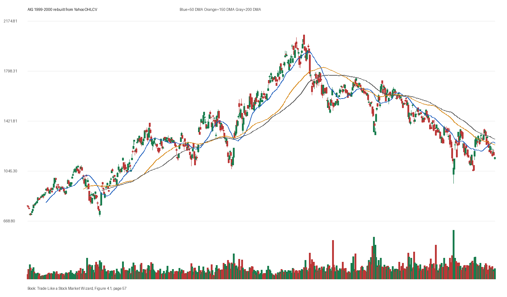

# Figure 4.1 - AIG - Page 57

## Source Image

Book: [[Trade Like a Stock Market Wizard]]

Caption: American Intl Group (AIG) 1999-2000

## Yahoo OHLCV Rebuild

Download status: `OK`

CSV: `data/book_stock_images/trade-like-a-stock-market-wizard-figure-4-1-aig-page-57_ohlcv.csv`

## Pattern Read

Tags: vcp-or-tightening, stage-2-leadership

Concepts: [[Pivot and Entry]], [[Relative Strength Leadership]], [[Stage 2 Uptrend]], [[Trend Template]], [[Volatility Contraction Pattern]], [[Volume Dry-Up and Accumulation]]

The useful clue is contraction: the later portion of the window became tighter than the earlier portion.

## Reconciliation Metrics

| Metric | Value |
|---|---:|
| first_close | 783.1111 |
| last_close | 1148.2 |
| max_gain_pct | 164.97 |
| max_drawdown_from_period_high_pct | -54.11 |
| first_half_depth_pct | 139.04 |
| second_half_depth_pct | 117.92 |
| tightening | True |
| volume_dryup | False |
| best_trend_template_score | 5/5 |
| latest_trend_template_score | 1/5 |

## Trend Template Checks

- 50 DMA > 150 DMA

## Study Questions

- Does the rebuilt OHLCV chart confirm the same structure shown in the book image?
- Was the stock close to a definable pivot, or already extended?
- Did volume dry up before the move, or was supply still obvious?
- Was this a buy lesson, a sell lesson, or a failure-avoidance lesson?
- What would invalidate the setup if this were being traded live?

<!-- STAGE_LIFECYCLE_START -->
## Stage Lifecycle & Base Concept Analysis
> This section analyzes the FULL LIFECYCLE of the stock around the inferred entry — Stage 1 (Accumulation), Stage 2 (Advance), Stage 3 (Distribution), Stage 4 (Decline) — plus deep base concept analysis, VCP footprint, tight footprint, supply dynamics, and contraction timeline.
- Status: `ok`
- Entry date: `2000-06-15`
- Entry price: `1643.33`
### Stage Lifecycle Overview
| Stage | Present | Start Date | End Date | Duration | Key Signal |
|---|---|---|---:|---|---|
| Stage 1 — Accumulation | ✅ | `1999-04-21` | `2000-04-18` | 252 days | Base: deep-chaotic |
| Stage 2 — Advance | ✅ | `2000-04-18` | `2001-01-03` | 179 days | Max gain: 48.0% |
| Stage 3 — Distribution | ✅ | `2001-04-03` | `2001-06-29` | 61 days | climax vol |
| Stage 4 — Decline | ❌ | — | — | — | Not detected |
### Stage 1 — Accumulation / Base Building
- Base type: `deep-chaotic`
- Lowest price in base: `1047.50`
- Volume pattern: `neutral`
### Stage 2 — Advance / Trend Pivots

- Number of significant pivots during advance: `4`

| Pivot Date | Price |
|---|---:|
| `2000-06-15` | `1654.17` |
| `2000-08-07` | `1790.00` |
| `2000-09-29` | `1950.00` |
| `2000-11-10` | `2051.25` |

#### Trend Template Evolution During Stage 2

| % Through Stage 2 | Date | Score |
|---|---|---:|
| 0% | `2000-04-18` | 6/7 |
| 25% | `2000-06-21` | 7/7 |
| 50% | `2000-08-24` | 7/7 |
| 75% | `2000-10-27` | 7/7 |
| 100% | `2001-01-03` | 6/7 |

### Base Concept Deep-Dive

- Base type: `shallow-vcp`
- Base duration: `42 sessions`
- Base depth: `24.0%`
- Base high: `1654.17`
- Base low: `1334.17`
- Resistance touches at base high: `5`
- Support touches at base low: `2`
- Contraction count: `2`
- Contraction quality: `clear-tightening`
- Pivot clarity: `clear-pivot-at-high`
- Pivot distance at entry: `-0.7%`
- Volume dry-up in base: `moderate-dry-up`
- Volume dry-up ratio: `0.75`
- Tightness at pivot (10d): `6.5%`
- Weekly tightness: `4.8%`

### VCP Footprint

- VCP present: `True`
- VCP quality: `constructive-tightening`
- Total contraction depth: `16.5%`
- Final contraction depth: `10.5%`
- Number of contractions: `2`

| Phase | Date | Depth | Volume | Tightness |
|---|---|---:|---:|---:|
| C? | `2000-04-17` | 16.5% | 197370.0 | 5.5% |
| C? | `2000-05-09` | 10.5% | 192345.0 | 8.0% |

### Tight Footprint

- 10-session tightness at entry: `5.7%`
- 20-session tightness at entry: `8.7%`
- Weekly tightness: `3.3%`
- ATR20 %: `2.69`
- Tightness progression: `improving`

### Supply Analysis

- Supply label: `diminishing`
- Volume dry-up ratio: `0.73`
- Distribution volume detected: `False`
- Accumulation volume detected: `False`

### Contraction Timeline

| Phase | Start Date | Depth | Volume | Tightness |
|---|---|---:|---:|---:|
| C1 | `2000-04-17` | 16.5% | 197370.0 | 5.5% |
| C2 | `2000-05-09` | 10.5% | 192345.0 | 8.0% |

### Concept Tie-Back

- Related concepts: [[Base Concept]], [[Stage 2 Uptrend]], [[Trend Template]], [[Stage 3 Distribution]], [[Volatility Contraction Pattern]], [[Pivot and Entry]], [[Volume Dry-Up and Accumulation]], [[Supply and Demand]]
- Lesson: Stage 1 base was deep-chaotic with 51.8% depth. Stage 2 advance lasted 180 sessions with 4 significant pivots. VCP footprint shows 2 contractions with constructive-tightening quality. Supply was diminishing before entry.

<!-- STAGE_LIFECYCLE_END -->
<!-- PRE_ENTRY_SENSE_CHECK_START -->

## Pre-Entry Sense Check

> This section analyzes the chart structure PRIOR to the inferred entry. It answers: What did the setup look like in the weeks and months before the trade? Which Minervini concepts were already visible?

- Status: `ok`
- Entry date: `2000-06-15`
- Pre-entry history available: `520 sessions`

### Trend Template Evolution

| Lookback | Date | Score | Assessment |
|---|---|---:|:---|
| 60 days before | 2000-03-21 | 4/7 | 🟡 Transitioning |
| 40 days before | 2000-04-18 | 6/7 | ✅ Stage 2 confirmed |
| 20 days before | 2000-05-17 | 7/7 | ✅ Stage 2 confirmed |

### Pre-Entry Context Window

- Context window (last sessions before entry): `150 sessions`
- Range high: `1652.50`
- Range low: `1047.50`
- Total range depth: `57.8%`
- Contraction phases (rolling 21-bar segments): `9.7% -> 16.8% -> 23.0% -> 25.5% -> 45.6% -> 19.2% -> 10.7%`

### Stage 2 Onset

- First sustained Stage 2 date: `1999-03-11`
- Days in Stage 2 before entry: `320`

### Volume Behavior Before Entry

- Volume dry-up label: `moderate-dry-up`
- Recent/base volume ratio: `0.73`
- No significant volume spikes in last 40 days before entry.

### Tightness Progression

| Lookback | 10-Session Close Tightness |
|---|---:|
| 40 days before | `14.1%` |
| 20 days before | `12.0%` |
| Final 10 sessions before | `5.7%` |
| Final 3 weekly closes | `3.3%` |

### Moving Average Alignment

- 50/150/200 DMA first aligned (50>150>200): `1999-03-26`

### Shakeouts / Tests Before Entry

- No shakeouts or undercut-recover patterns detected in last 40 sessions before entry.

### 52-Week High Context

| Timing | Distance from 52W High |
|---|---:|
| 60 days before | `-12.2%` |
| 20 days before | `-4.7%` |
| At entry | `-0.7%` |

### Concept Tie-Back

- Related concepts: [[Stage 2 Uptrend]], [[Trend Template]], [[Relative Strength Leadership]], [[Volume Dry-Up and Accumulation]]
- Lesson: Stage 2 was established 320 days before entry, confirming leadership context. Total pre-entry range was 57.8% — wide range indicating significant prior movement. Volume dried up before entry, suggesting supply absorption.

<!-- PRE_ENTRY_SENSE_CHECK_END -->
<!-- SEPA_REPLICATION_START -->

## SEPA Trade Replication

> Study note: this reconstructs a likely Minervini-style setup area from the real OHLCV window shown by the book timing. It does not claim to know Minervini's private fill, sizing, or unpublished execution.

- Status: `reconstructed-from-real-ohlcv`
- Setup type: `vcp/contraction-study`
- Confidence: `high`
- Timing source: `1999-2000` from the figure caption and rebuilt OHLCV where available.
- Inferred study entry date: `2000-06-15`
- Inferred study entry price: `1643.33`
- Inferred pivot: `1652.50`
- Inferred stop / invalidation: `1493.33`
- Pivot extension at entry: `-0.6%`
- Stop distance / risk: `10.0%`
- Trend Template score at entry: `7/7`

### Tightness And Supply
- 3-part pre-entry contraction depth: `29.3% -> 20.4% -> 10.7%`
- Contraction quality: `clear-tightening`
- 10-session close tightness: `5.7%`
- 3-week close tightness: `3.3%`
- Volume dry-up: `moderate-dry-up`
- Recent/base median volume ratio: `0.73`
- Leadership proxy: 65-day return 43.7% and 126-day return 13.3%

### Post-Entry Reality Check
- Max gain after 20 sessions: `0.3%`
- Max gain after 60 sessions: `11.7%`
- Max gain after 120 sessions: `24.8%`
- Worst drawdown after 20 sessions: `-8.7%`
- Inferred stop failed within 20 sessions: `False`
- Pivot broadly respected within 20 sessions: `False`

### Concept Tie-Back

- Related concepts: [[Risk First]], [[Volatility Contraction Pattern]], [[Volume Dry-Up and Accumulation]], [[Pivot and Entry]], [[Trend Template]], [[Stage 2 Uptrend]], [[Relative Strength Leadership]]
- Lesson: The reconstructed data suggests price was becoming more controllable before the inferred entry; volume supported the supply-dry-up idea; risk was acceptable but not ideal.

<!-- SEPA_REPLICATION_END -->
