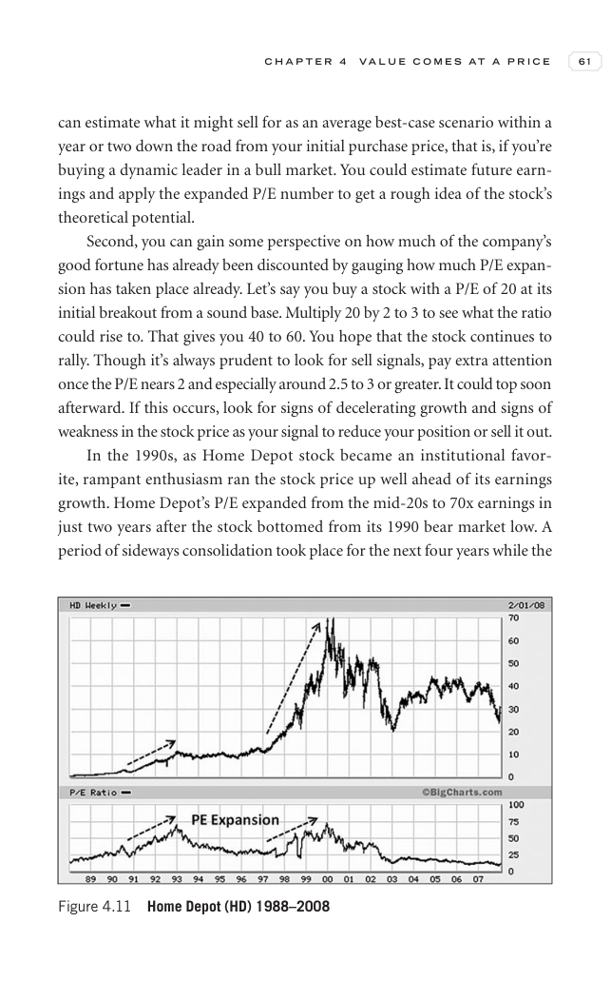
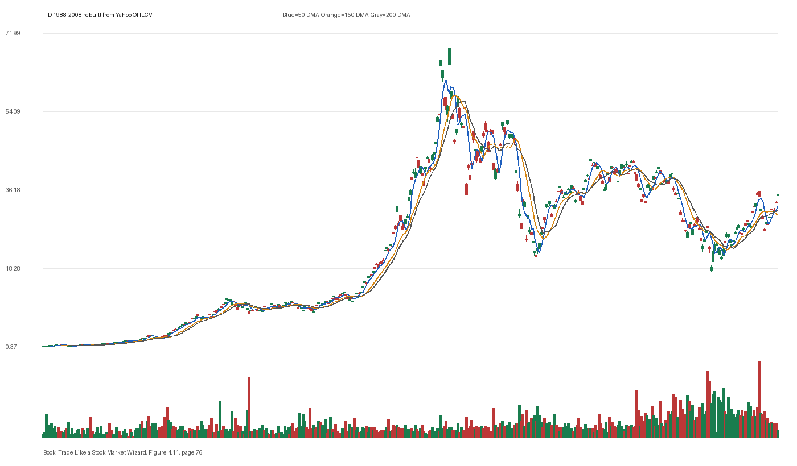

# Figure 4.11 - HD - Page 76

## Source Image

Book: [[Trade Like a Stock Market Wizard]]

Caption: Home Depot (HD) 1988-2008

## Yahoo OHLCV Rebuild

Download status: `OK`

CSV: `data/book_stock_images/trade-like-a-stock-market-wizard-figure-4-11-hd-page-76_ohlcv.csv`

## Pattern Read

Tags: vcp-or-tightening, stage-2-leadership

Concepts: [[Pivot and Entry]], [[Relative Strength Leadership]], [[Stage 2 Uptrend]], [[Trend Template]], [[Volatility Contraction Pattern]], [[Volume Dry-Up and Accumulation]]

The useful clue is contraction: the later portion of the window became tighter than the earlier portion.

## Reconciliation Metrics

| Metric | Value |
|---|---:|
| first_close | 0.3951 |
| last_close | 34.86 |
| max_gain_pct | 17618.74 |
| max_drawdown_from_period_high_pct | -75.64 |
| first_half_depth_pct | 9798.43 |
| second_half_depth_pct | 310.56 |
| tightening | True |
| volume_dryup | False |
| best_trend_template_score | 5/5 |
| latest_trend_template_score | 4/5 |

## Trend Template Checks

- close > 50 DMA
- close > 150 DMA
- close > 200 DMA
- 50 DMA > 150 DMA

## Study Questions

- Does the rebuilt OHLCV chart confirm the same structure shown in the book image?
- Was the stock close to a definable pivot, or already extended?
- Did volume dry up before the move, or was supply still obvious?
- Was this a buy lesson, a sell lesson, or a failure-avoidance lesson?
- What would invalidate the setup if this were being traded live?

<!-- STAGE_LIFECYCLE_START -->
## Stage Lifecycle & Base Concept Analysis
> This section analyzes the FULL LIFECYCLE of the stock around the inferred entry — Stage 1 (Accumulation), Stage 2 (Advance), Stage 3 (Distribution), Stage 4 (Decline) — plus deep base concept analysis, VCP footprint, tight footprint, supply dynamics, and contraction timeline.
- Status: `ok`
- Entry date: `1991-05-02`
- Entry price: `4.4167`
### Stage Lifecycle Overview
| Stage | Present | Start Date | End Date | Duration | Key Signal |
|---|---|---|---:|---|---|
| Stage 1 — Accumulation | ✅ | `1987-09-09` | `1988-09-07` | 252 days | Base: deep-chaotic |
| Stage 2 — Advance | ✅ | `1988-09-07` | `1990-08-17` | 492 days | Max gain: 281.2% |
| Stage 3 — Distribution | ✅ | `1990-11-06` | `1993-04-05` | 609 days | climax vol |
| Stage 4 — Decline | ✅ | `1993-04-06` | — | 4088 days | Below 200 DMA: False |
### Stage 1 — Accumulation / Base Building
- Base type: `deep-chaotic`
- Lowest price in base: `0.4000`
- Volume pattern: `neutral`
### Stage 2 — Advance / Trend Pivots

- Number of significant pivots during advance: `5`

| Pivot Date | Price |
|---|---:|
| `1988-10-10` | `0.9900` |
| `1988-12-30` | `1.0500` |
| `1989-02-03` | `1.1200` |
| `1989-03-13` | `1.1800` |
| `1989-05-02` | `1.3700` |

#### Trend Template Evolution During Stage 2

| % Through Stage 2 | Date | Score |
|---|---|---:|
| 0% | `1988-09-07` | 6/7 |
| 25% | `1989-03-03` | 7/7 |
| 50% | `1989-08-28` | 7/7 |
| 75% | `1990-02-22` | 7/7 |
| 100% | `1990-08-17` | 6/7 |

### Base Concept Deep-Dive

- Base type: `deep-chaotic`
- Base duration: `301 sessions`
- Base depth: `151.2%`
- Base high: `4.4800`
- Base low: `1.7800`
- Resistance touches at base high: `5`
- Support touches at base low: `2`
- Contraction count: `5`
- Contraction quality: `mixed-or-loose`
- Pivot clarity: `clear-pivot-at-high`
- Pivot distance at entry: `-1.4%`
- Volume dry-up in base: `active-supply`
- Volume dry-up ratio: `1.11`
- Tightness at pivot (10d): `5.1%`
- Weekly tightness: `5.1%`

### VCP Footprint

- VCP present: `True`
- VCP quality: `mixed`
- Total contraction depth: `59.5%`
- Final contraction depth: `40.1%`
- Number of contractions: `5`

| Phase | Date | Depth | Volume | Tightness |
|---|---|---:|---:|---:|
| C? | `1990-02-23` | 59.5% | 5941350.0 | 13.3% |
| C? | `1990-05-21` | 36.3% | 7337588.0 | 11.0% |
| C? | `1990-08-15` | 40.2% | 7728075.0 | 10.3% |
| C? | `1990-11-08` | 49.8% | 7154325.0 | 8.9% |
| C? | `1991-02-05` | 40.1% | 7223175.0 | 4.8% |

### Tight Footprint

- 10-session tightness at entry: `4.8%`
- 20-session tightness at entry: `9.2%`
- Weekly tightness: `4.4%`
- ATR20 %: `2.54`
- Tightness progression: `improving`

### Supply Analysis

- Supply label: `neutral`
- Volume dry-up ratio: `1.05`
- Distribution volume detected: `False`
- Accumulation volume detected: `False`
- Climax volume dates: `1991-04-12`

### Contraction Timeline

| Phase | Start Date | Depth | Volume | Tightness |
|---|---|---:|---:|---:|
| C1 | `1990-02-23` | 59.5% | 5941350.0 | 13.3% |
| C2 | `1990-05-21` | 36.3% | 7337588.0 | 11.0% |
| C3 | `1990-08-15` | 40.2% | 7728075.0 | 10.3% |
| C4 | `1990-11-08` | 49.8% | 7154325.0 | 8.9% |
| C5 | `1991-02-05` | 40.1% | 7223175.0 | 4.8% |

### Concept Tie-Back

- Related concepts: [[Base Concept]], [[Stage 2 Uptrend]], [[Trend Template]], [[Stage 3 Distribution]], [[Stage 4 Decline]], [[Volatility Contraction Pattern]], [[Pivot and Entry]]
- Lesson: Stage 1 base was deep-chaotic with 145.4% depth. Stage 2 advance lasted 493 sessions with 5 significant pivots. VCP footprint shows 5 contractions with mixed quality.

<!-- STAGE_LIFECYCLE_END -->
<!-- PRE_ENTRY_SENSE_CHECK_START -->

## Pre-Entry Sense Check

> This section analyzes the chart structure PRIOR to the inferred entry. It answers: What did the setup look like in the weeks and months before the trade? Which Minervini concepts were already visible?

- Status: `ok`
- Entry date: `1991-05-02`
- Pre-entry history available: `996 sessions`

### Trend Template Evolution

| Lookback | Date | Score | Assessment |
|---|---|---:|:---|
| 60 days before | 1991-02-05 | 6/7 | ✅ Stage 2 confirmed |
| 40 days before | 1991-03-06 | 6/7 | ✅ Stage 2 confirmed |
| 20 days before | 1991-04-04 | 7/7 | ✅ Stage 2 confirmed |

### Pre-Entry Context Window

- Context window (last sessions before entry): `150 sessions`
- Range high: `4.4600`
- Range low: `1.9800`
- Total range depth: `125.2%`
- Contraction phases (rolling 21-bar segments): `27.6% -> 28.8% -> 21.0% -> 27.4% -> 21.9% -> 13.2% -> 12.7%`

### Stage 2 Onset

- First sustained Stage 2 date: `1988-09-07`
- Days in Stage 2 before entry: `670`

### Volume Behavior Before Entry

- Volume dry-up label: `neutral`
- Recent/base volume ratio: `1.05`
- Volume spike dates (2.5x avg) in last 40 days: `1991-04-12`

### Tightness Progression

| Lookback | 10-Session Close Tightness |
|---|---:|
| 40 days before | `11.9%` |
| 20 days before | `15.1%` |
| Final 10 sessions before | `4.8%` |
| Final 3 weekly closes | `4.4%` |

### Moving Average Alignment

- 50/150/200 DMA first aligned (50>150>200): `1988-06-13`

### Shakeouts / Tests Before Entry

- No shakeouts or undercut-recover patterns detected in last 40 sessions before entry.

### 52-Week High Context

| Timing | Distance from 52W High |
|---|---:|
| 60 days before | `0.0%` |
| 20 days before | `-2.2%` |
| At entry | `-1.4%` |

### Concept Tie-Back

- Related concepts: [[Stage 2 Uptrend]], [[Trend Template]], [[Relative Strength Leadership]], [[Volatility Contraction Pattern]], [[Pivot and Entry]]
- Lesson: Stage 2 was established 670 days before entry, confirming leadership context. Total pre-entry range was 125.2% — wide range indicating significant prior movement. Volume did not show clear dry-up — supply may still be present.

<!-- PRE_ENTRY_SENSE_CHECK_END -->
<!-- SEPA_REPLICATION_START -->

## SEPA Trade Replication

> Study note: this reconstructs a likely Minervini-style setup area from the real OHLCV window shown by the book timing. It does not claim to know Minervini's private fill, sizing, or unpublished execution.

- Status: `reconstructed-from-real-ohlcv`
- Setup type: `vcp/contraction-study`
- Confidence: `high`
- Timing source: `1988-2008` from the figure caption and rebuilt OHLCV where available.
- Inferred study entry date: `1991-05-02`
- Inferred study entry price: `4.4167`
- Inferred pivot: `4.4630`
- Inferred stop / invalidation: `4.0741`
- Pivot extension at entry: `-1.0%`
- Stop distance / risk: `8.4%`
- Trend Template score at entry: `7/7`

### Tightness And Supply
- 3-part pre-entry contraction depth: `20.5% -> 15.0% -> 11.6%`
- Contraction quality: `clear-tightening`
- 10-session close tightness: `4.8%`
- 3-week close tightness: `4.4%`
- Volume dry-up: `neutral`
- Recent/base median volume ratio: `1.05`
- Leadership proxy: 65-day return 41.1% and 126-day return 103.0%

### Post-Entry Reality Check
- Max gain after 20 sessions: `11.9%`
- Max gain after 60 sessions: `24.8%`
- Max gain after 120 sessions: `42.8%`
- Worst drawdown after 20 sessions: `-7.3%`
- Inferred stop failed within 20 sessions: `False`
- Pivot broadly respected within 20 sessions: `False`

### Concept Tie-Back

- Related concepts: [[Risk First]], [[Volatility Contraction Pattern]], [[Volume Dry-Up and Accumulation]], [[Pivot and Entry]], [[Trend Template]], [[Stage 2 Uptrend]], [[Relative Strength Leadership]]
- Lesson: The reconstructed data suggests price was becoming more controllable before the inferred entry; risk was acceptable but not ideal.

<!-- SEPA_REPLICATION_END -->
