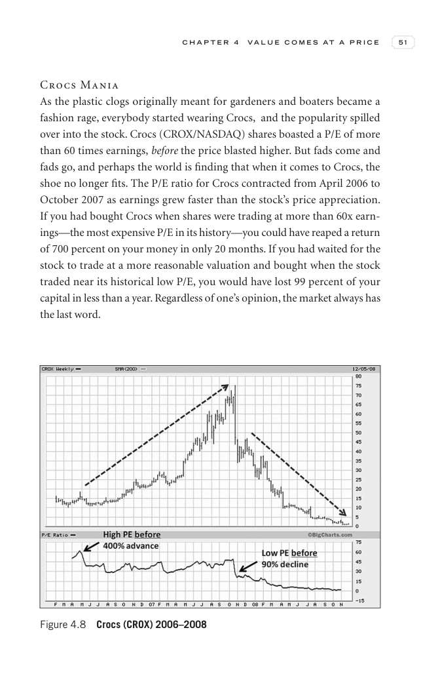
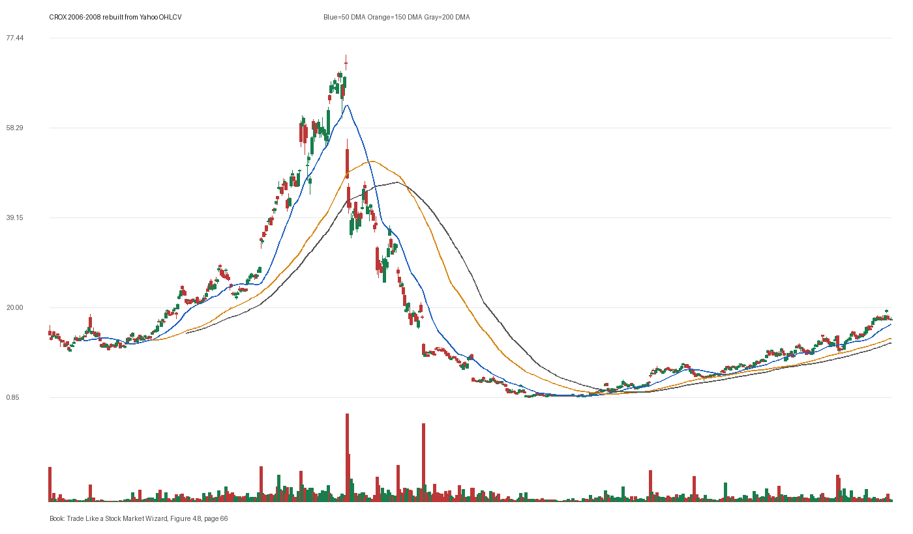

# Figure 4.8 - CROX - Page 66

## Source Image

Book: [[Trade Like a Stock Market Wizard]]

Caption: Crocs (CROX) 2006-2008

## Yahoo OHLCV Rebuild

Download status: `OK`

CSV: `data/book_stock_images/trade-like-a-stock-market-wizard-figure-4-8-crox-page-66_ohlcv.csv`

## Pattern Read

Tags: stage-2-leadership

Concepts: [[Relative Strength Leadership]], [[Stage 2 Uptrend]], [[Trend Template]]

Use this as a visual pattern drill and compare the private book image against the rebuilt Yahoo chart.

## Reconciliation Metrics

| Metric | Value |
|---|---:|
| first_close | 14.275 |
| last_close | 17.46 |
| max_gain_pct | 426.87 |
| max_drawdown_from_period_high_pct | -98.95 |
| first_half_depth_pct | 1014.22 |
| second_half_depth_pct | 2373.42 |
| tightening | False |
| volume_dryup | False |
| best_trend_template_score | 5/5 |
| latest_trend_template_score | 5/5 |

## Trend Template Checks

- close > 50 DMA
- close > 150 DMA
- close > 200 DMA
- 50 DMA > 150 DMA
- 150 DMA > 200 DMA

## Study Questions

- Does the rebuilt OHLCV chart confirm the same structure shown in the book image?
- Was the stock close to a definable pivot, or already extended?
- Did volume dry up before the move, or was supply still obvious?
- Was this a buy lesson, a sell lesson, or a failure-avoidance lesson?
- What would invalidate the setup if this were being traded live?

<!-- STAGE_LIFECYCLE_START -->
## Stage Lifecycle & Base Concept Analysis
> This section analyzes the FULL LIFECYCLE of the stock around the inferred entry — Stage 1 (Accumulation), Stage 2 (Advance), Stage 3 (Distribution), Stage 4 (Decline) — plus deep base concept analysis, VCP footprint, tight footprint, supply dynamics, and contraction timeline.
- Status: `ok`
- Entry date: `2007-07-26`
- Entry price: `50.5900`
### Stage Lifecycle Overview
| Stage | Present | Start Date | End Date | Duration | Key Signal |
|---|---|---|---:|---|---|
| Stage 1 — Accumulation | ✅ | `2006-02-08` | `2006-11-22` | 200 days | Base: deep-chaotic |
| Stage 2 — Advance | ✅ | `2006-11-22` | `2007-10-31` | 235 days | Max gain: 254.2% |
| Stage 3 — Distribution | ✅ | `2007-11-01` | `2007-11-02` | 1 days | no climax |
| Stage 4 — Decline | ✅ | `2007-11-05` | — | 414 days | Below 200 DMA: False |
### Stage 1 — Accumulation / Base Building
- Base type: `deep-chaotic`
- Lowest price in base: `10.1600`
- Volume pattern: `late-supply`
### Stage 2 — Advance / Trend Pivots

- Number of significant pivots during advance: `4`

| Pivot Date | Price |
|---|---:|
| `2007-02-07` | `29.2800` |
| `2007-03-20` | `24.5700` |
| `2007-06-20` | `47.4000` |
| `2007-07-31` | `60.8300` |

#### Trend Template Evolution During Stage 2

| % Through Stage 2 | Date | Score |
|---|---|---:|
| 0% | `2006-11-22` | 6/7 |
| 25% | `2007-02-20` | 7/7 |
| 50% | `2007-05-15` | 7/7 |
| 75% | `2007-08-08` | 7/7 |
| 100% | `2007-10-31` | 7/7 |

### Base Concept Deep-Dive

- Base type: `deep-chaotic`
- Base duration: `169 sessions`
- Base depth: `153.4%`
- Base high: `51.8100`
- Base low: `20.4400`
- Resistance touches at base high: `1`
- Support touches at base low: `6`
- Contraction count: `5`
- Contraction quality: `mixed-or-loose`
- Pivot clarity: `near-pivot`
- Pivot distance at entry: `-2.4%`
- Volume dry-up in base: `moderate-dry-up`
- Volume dry-up ratio: `0.72`
- Tightness at pivot (10d): `11.9%`
- Weekly tightness: `11.9%`

### VCP Footprint

- VCP present: `True`
- VCP quality: `widening-risk`
- Total contraction depth: `59.1%`
- Final contraction depth: `23.1%`
- Number of contractions: `5`

| Phase | Date | Depth | Volume | Tightness |
|---|---|---:|---:|---:|
| C? | `2006-11-21` | 18.6% | 1940400.0 | 12.6% |
| C? | `2007-01-11` | 25.6% | 3618000.0 | 15.5% |
| C? | `2007-03-01` | 25.9% | 3388400.0 | 14.4% |
| C? | `2007-04-18` | 59.1% | 4840200.0 | 8.9% |
| C? | `2007-06-05` | 23.1% | 6181400.0 | 7.5% |

### Tight Footprint

- 10-session tightness at entry: `9.0%`
- 20-session tightness at entry: `19.4%`
- Weekly tightness: `9.0%`
- ATR20 %: `4.15`
- Tightness progression: `worsening`

### Supply Analysis

- Supply label: `diminishing`
- Volume dry-up ratio: `0.72`
- Distribution volume detected: `False`
- Accumulation volume detected: `True`
- Climax volume dates: `2007-06-05, 2007-06-07, 2007-06-08`

### Contraction Timeline

| Phase | Start Date | Depth | Volume | Tightness |
|---|---|---:|---:|---:|
| C1 | `2006-11-21` | 18.6% | 1940400.0 | 12.6% |
| C2 | `2007-01-11` | 25.6% | 3618000.0 | 15.5% |
| C3 | `2007-03-01` | 25.9% | 3388400.0 | 14.4% |
| C4 | `2007-04-18` | 59.1% | 4840200.0 | 8.9% |
| C5 | `2007-06-05` | 23.1% | 6181400.0 | 7.5% |

### Concept Tie-Back

- Related concepts: [[Base Concept]], [[Stage 2 Uptrend]], [[Trend Template]], [[Stage 3 Distribution]], [[Stage 4 Decline]], [[Volatility Contraction Pattern]], [[Pivot and Entry]], [[Volume Dry-Up and Accumulation]], [[Supply and Demand]]
- Lesson: Stage 1 base was deep-chaotic with 147.3% depth. Stage 2 advance lasted 236 sessions with 4 significant pivots. VCP footprint shows 5 contractions with widening-risk quality. Supply was diminishing before entry.

<!-- STAGE_LIFECYCLE_END -->
<!-- PRE_ENTRY_SENSE_CHECK_START -->

## Pre-Entry Sense Check

> This section analyzes the chart structure PRIOR to the inferred entry. It answers: What did the setup look like in the weeks and months before the trade? Which Minervini concepts were already visible?

- Status: `ok`
- Entry date: `2007-07-26`
- Pre-entry history available: `367 sessions`

### Trend Template Evolution

| Lookback | Date | Score | Assessment |
|---|---|---:|:---|
| 60 days before | 2007-05-01 | 7/7 | ✅ Stage 2 confirmed |
| 40 days before | 2007-05-30 | 7/7 | ✅ Stage 2 confirmed |
| 20 days before | 2007-06-27 | 7/7 | ✅ Stage 2 confirmed |

### Pre-Entry Context Window

- Context window (last sessions before entry): `150 sessions`
- Range high: `49.7000`
- Range low: `20.6800`
- Total range depth: `140.3%`
- Contraction phases (rolling 21-bar segments): `25.7% -> 24.2% -> 33.8% -> 17.7% -> 49.8% -> 26.0% -> 23.1%`

### Stage 2 Onset

- First sustained Stage 2 date: `2006-11-22`
- Days in Stage 2 before entry: `167`

### Volume Behavior Before Entry

- Volume dry-up label: `moderate-dry-up`
- Recent/base volume ratio: `0.72`
- Volume spike dates (2.5x avg) in last 40 days: `2007-06-07, 2007-06-12, 2007-06-13`

### Tightness Progression

| Lookback | 10-Session Close Tightness |
|---|---:|
| 40 days before | `7.0%` |
| 20 days before | `5.8%` |
| Final 10 sessions before | `9.0%` |
| Final 3 weekly closes | `9.0%` |

### Moving Average Alignment

- 50/150/200 DMA first aligned (50>150>200): `2006-11-22`

### Shakeouts / Tests Before Entry

- No shakeouts or undercut-recover patterns detected in last 40 sessions before entry.

### 52-Week High Context

| Timing | Distance from 52W High |
|---|---:|
| 60 days before | `-5.9%` |
| 20 days before | `-9.2%` |
| At entry | `-2.4%` |

### Concept Tie-Back

- Related concepts: [[Stage 2 Uptrend]], [[Trend Template]], [[Relative Strength Leadership]], [[Volume Dry-Up and Accumulation]]
- Lesson: Stage 2 was established 167 days before entry, confirming leadership context. Total pre-entry range was 140.3% — wide range indicating significant prior movement. Volume dried up before entry, suggesting supply absorption.

<!-- PRE_ENTRY_SENSE_CHECK_END -->
<!-- SEPA_REPLICATION_START -->

## SEPA Trade Replication

> Study note: this reconstructs a likely Minervini-style setup area from the real OHLCV window shown by the book timing. It does not claim to know Minervini's private fill, sizing, or unpublished execution.

- Status: `reconstructed-from-real-ohlcv`
- Setup type: `vcp/contraction-study`
- Confidence: `high`
- Timing source: `2006-2008` from the figure caption and rebuilt OHLCV where available.
- Inferred study entry date: `2007-07-26`
- Inferred study entry price: `50.5900`
- Inferred pivot: `49.7000`
- Inferred stop / invalidation: `41.5500`
- Pivot extension at entry: `1.8%`
- Stop distance / risk: `21.8%`
- Trend Template score at entry: `7/7`

### Tightness And Supply
- 3-part pre-entry contraction depth: `51.2% -> 24.9% -> 23.1%`
- Contraction quality: `clear-tightening`
- 10-session close tightness: `9.0%`
- 3-week close tightness: `9.0%`
- Volume dry-up: `moderate-dry-up`
- Recent/base median volume ratio: `0.72`
- Leadership proxy: 65-day return 92.1% and 126-day return 111.5%

### Post-Entry Reality Check
- Max gain after 20 sessions: `21.3%`
- Max gain after 60 sessions: `43.1%`
- Max gain after 120 sessions: `48.7%`
- Worst drawdown after 20 sessions: `-12.8%`
- Inferred stop failed within 20 sessions: `False`
- Pivot broadly respected within 20 sessions: `False`

### Concept Tie-Back

- Related concepts: [[Risk First]], [[Volatility Contraction Pattern]], [[Volume Dry-Up and Accumulation]], [[Pivot and Entry]], [[Trend Template]], [[Stage 2 Uptrend]], [[Relative Strength Leadership]]
- Lesson: The reconstructed data suggests price was becoming more controllable before the inferred entry; volume supported the supply-dry-up idea; risk was wide, so the entry would need smaller size or a better cheat point.

<!-- SEPA_REPLICATION_END -->
