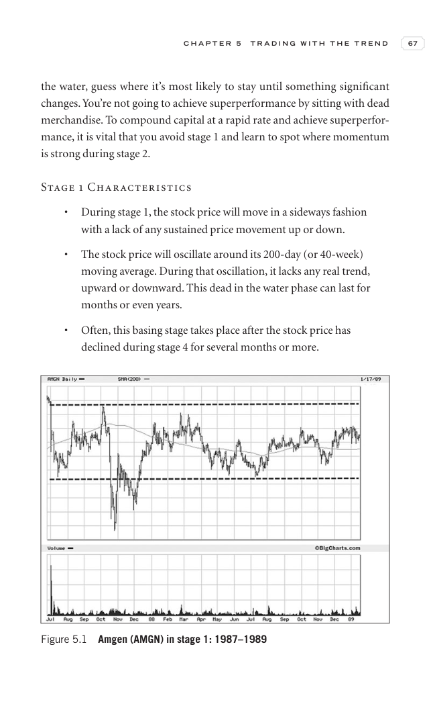
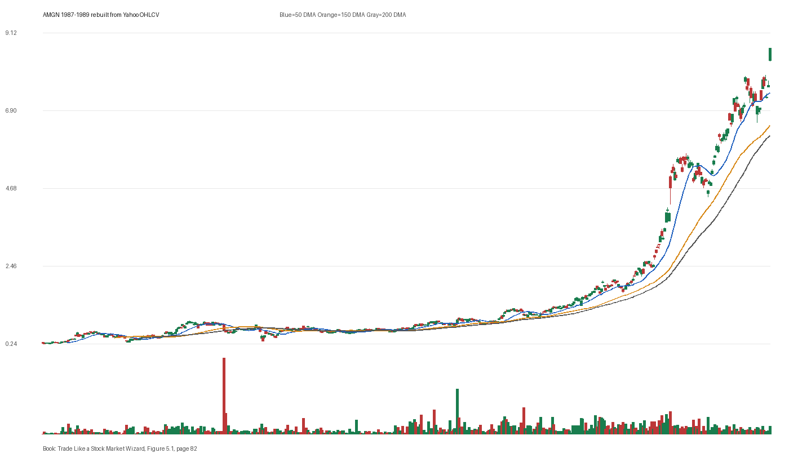

# Figure 5.1 - AMGN - Page 82

## Source Image

Book: [[Trade Like a Stock Market Wizard]]

Caption: Amgen (AMGN) in stage 1: 1987-1989

## Yahoo OHLCV Rebuild

Download status: `OK`

CSV: `data/book_stock_images/trade-like-a-stock-market-wizard-figure-5-1-amgn-page-82_ohlcv.csv`

## Pattern Read

Tags: stage-2-leadership

Concepts: [[Relative Strength Leadership]], [[Stage 2 Uptrend]], [[Trend Template]]

Use this as a visual pattern drill and compare the private book image against the rebuilt Yahoo chart.

## Reconciliation Metrics

| Metric | Value |
|---|---:|
| first_close | 0.263 |
| last_close | 8.6719 |
| max_gain_pct | 3202.97 |
| max_drawdown_from_period_high_pct | -64.15 |
| first_half_depth_pct | 260.61 |
| second_half_depth_pct | 1245.16 |
| tightening | False |
| volume_dryup | False |
| best_trend_template_score | 5/5 |
| latest_trend_template_score | 5/5 |

## Trend Template Checks

- close > 50 DMA
- close > 150 DMA
- close > 200 DMA
- 50 DMA > 150 DMA
- 150 DMA > 200 DMA

## Study Questions

- Does the rebuilt OHLCV chart confirm the same structure shown in the book image?
- Was the stock close to a definable pivot, or already extended?
- Did volume dry up before the move, or was supply still obvious?
- Was this a buy lesson, a sell lesson, or a failure-avoidance lesson?
- What would invalidate the setup if this were being traded live?

<!-- STAGE_LIFECYCLE_START -->
## Stage Lifecycle & Base Concept Analysis
> This section analyzes the FULL LIFECYCLE of the stock around the inferred entry — Stage 1 (Accumulation), Stage 2 (Advance), Stage 3 (Distribution), Stage 4 (Decline) — plus deep base concept analysis, VCP footprint, tight footprint, supply dynamics, and contraction timeline.
- Status: `ok`
- Entry date: `1988-09-29`
- Entry price: `0.6771`
### Stage Lifecycle Overview
| Stage | Present | Start Date | End Date | Duration | Key Signal |
|---|---|---|---:|---|---|
| Stage 1 — Accumulation | ✅ | `1988-01-21` | `1989-01-19` | 252 days | Base: deep-chaotic |
| Stage 2 — Advance | ✅ | `1989-01-19` | `1989-08-08` | 139 days | Max gain: 41.2% |
| Stage 3 — Distribution | ✅ | `1989-09-13` | `1990-01-30` | 96 days | climax vol |
| Stage 4 — Decline | ✅ | `1990-01-31` | — | 104 days | Below 200 DMA: False |
### Stage 1 — Accumulation / Base Building
- Base type: `deep-chaotic`
- Lowest price in base: `0.5300`
- Volume pattern: `accumulation-dryup`
### Stage 2 — Advance / Trend Pivots

- Number of significant pivots during advance: `4`

| Pivot Date | Price |
|---|---:|
| `1989-02-21` | `0.8200` |
| `1989-03-23` | `0.9200` |
| `1989-05-12` | `0.8600` |
| `1989-06-05` | `1.0000` |

#### Trend Template Evolution During Stage 2

| % Through Stage 2 | Date | Score |
|---|---|---:|
| 0% | `1989-01-19` | 7/7 |
| 25% | `1989-03-09` | 7/7 |
| 50% | `1989-04-28` | 6/7 |
| 75% | `1989-06-19` | 7/7 |
| 100% | `1989-08-08` | 6/7 |

### Base Concept Deep-Dive

- Base type: `N/A`
- Base duration: `0 sessions`
- Base depth: `N/A`
- Base high: `N/A`
- Base low: `N/A`
- Resistance touches at base high: `0`
- Support touches at base low: `0`
- Contraction count: `0`
- Contraction quality: `N/A`
- Pivot clarity: `N/A`
- Pivot distance at entry: `N/A`
- Volume dry-up in base: `N/A`
- Volume dry-up ratio: `N/A`
- Tightness at pivot (10d): `N/A`
- Weekly tightness: `N/A`

### VCP Footprint

- VCP present: `False`
- No clear VCP pattern detected in the base.

### Tight Footprint

- 10-session tightness at entry: `3.3%`
- 20-session tightness at entry: `5.0%`
- Weekly tightness: `0.8%`
- ATR20 %: `2.37`
- Tightness progression: `improving`

### Supply Analysis

- Supply label: `diminishing`
- Volume dry-up ratio: `0.71`
- Distribution volume detected: `False`
- Accumulation volume detected: `False`
- Climax volume dates: `1988-08-03, 1988-08-04`

### Concept Tie-Back

- Related concepts: [[Base Concept]], [[Stage 2 Uptrend]], [[Trend Template]], [[Stage 3 Distribution]], [[Stage 4 Decline]], [[Volume Dry-Up and Accumulation]], [[Supply and Demand]]
- Lesson: Stage 1 base was deep-chaotic with 43.6% depth. Stage 2 advance lasted 140 sessions with 4 significant pivots. Supply was diminishing before entry.

<!-- STAGE_LIFECYCLE_END -->
<!-- PRE_ENTRY_SENSE_CHECK_START -->

## Pre-Entry Sense Check

> This section analyzes the chart structure PRIOR to the inferred entry. It answers: What did the setup look like in the weeks and months before the trade? Which Minervini concepts were already visible?

- Status: `ok`
- Entry date: `1988-09-29`
- Pre-entry history available: `594 sessions`

### Trend Template Evolution

| Lookback | Date | Score | Assessment |
|---|---|---:|:---|
| 60 days before | 1988-07-06 | 1/7 | 🔴 Not yet Stage 2 |
| 40 days before | 1988-08-03 | 4/7 | 🟡 Transitioning |
| 20 days before | 1988-08-31 | 6/7 | ✅ Stage 2 confirmed |

### Pre-Entry Context Window

- Context window (last sessions before entry): `150 sessions`
- Range high: `0.7500`
- Range low: `0.5300`
- Total range depth: `42.6%`
- Contraction phases (rolling 21-bar segments): `16.1% -> 27.4% -> 18.6% -> 16.5% -> 13.9% -> 19.6% -> 9.7%`

### Stage 2 Onset

- First sustained Stage 2 date: `1987-03-11`
- Days in Stage 2 before entry: `394`

### Volume Behavior Before Entry

- Volume dry-up label: `moderate-dry-up`
- Recent/base volume ratio: `0.71`
- Volume spike dates (2.5x avg) in last 40 days: `1988-08-03, 1988-08-04, 1988-08-05`

### Tightness Progression

| Lookback | 10-Session Close Tightness |
|---|---:|
| 40 days before | `6.5%` |
| 20 days before | `6.7%` |
| Final 10 sessions before | `3.3%` |
| Final 3 weekly closes | `0.8%` |

### Moving Average Alignment

- 50/150/200 DMA first aligned (50>150>200): `1987-03-19`

### Shakeouts / Tests Before Entry

- `1988-08-03` — undercut-and-recover of SMA50 (low 0.58, close 0.62)

### 52-Week High Context

| Timing | Distance from 52W High |
|---|---:|
| 60 days before | `-28.0%` |
| 20 days before | `-16.0%` |
| At entry | `-13.3%` |

### Concept Tie-Back

- Related concepts: [[Stage 2 Uptrend]], [[Trend Template]], [[Relative Strength Leadership]], [[Volatility Contraction Pattern]], [[Pivot and Entry]], [[Volume Dry-Up and Accumulation]]
- Lesson: Stage 2 was established 394 days before entry, confirming leadership context. Total pre-entry range was 42.6% — wide range indicating significant prior movement. Volume dried up before entry, suggesting supply absorption. Found 1 shakeout(s) before entry — test of conviction.

<!-- PRE_ENTRY_SENSE_CHECK_END -->
<!-- SEPA_REPLICATION_START -->

## SEPA Trade Replication

> Study note: this reconstructs a likely Minervini-style setup area from the real OHLCV window shown by the book timing. It does not claim to know Minervini's private fill, sizing, or unpublished execution.

- Status: `reconstructed-from-real-ohlcv`
- Setup type: `vcp/contraction-study`
- Confidence: `high`
- Timing source: `1987-1989` from the figure caption and rebuilt OHLCV where available.
- Inferred study entry date: `1988-09-29`
- Inferred study entry price: `0.6771`
- Inferred pivot: `0.6745`
- Inferred stop / invalidation: `0.6146`
- Pivot extension at entry: `0.4%`
- Stop distance / risk: `10.2%`
- Trend Template score at entry: `6/7`

### Tightness And Supply
- 3-part pre-entry contraction depth: `13.9% -> 17.4% -> 9.7%`
- Contraction quality: `constructive-tightening`
- 10-session close tightness: `3.3%`
- 3-week close tightness: `0.8%`
- Volume dry-up: `moderate-dry-up`
- Recent/base median volume ratio: `0.71`
- Leadership proxy: 65-day return 17.1% and 126-day return 0.8%

### Post-Entry Reality Check
- Max gain after 20 sessions: `3.8%`
- Max gain after 60 sessions: `3.8%`
- Max gain after 120 sessions: `32.3%`
- Worst drawdown after 20 sessions: `-6.2%`
- Inferred stop failed within 20 sessions: `False`
- Pivot broadly respected within 20 sessions: `False`

### Concept Tie-Back

- Related concepts: [[Risk First]], [[Volatility Contraction Pattern]], [[Volume Dry-Up and Accumulation]], [[Pivot and Entry]], [[Trend Template]], [[Stage 2 Uptrend]], [[Relative Strength Leadership]]
- Lesson: The reconstructed data suggests price was becoming more controllable before the inferred entry; volume supported the supply-dry-up idea; risk was acceptable but not ideal.

<!-- SEPA_REPLICATION_END -->
