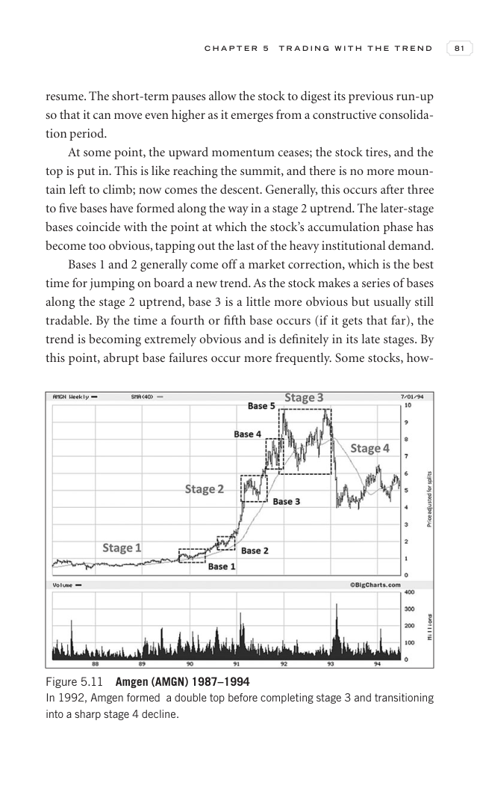
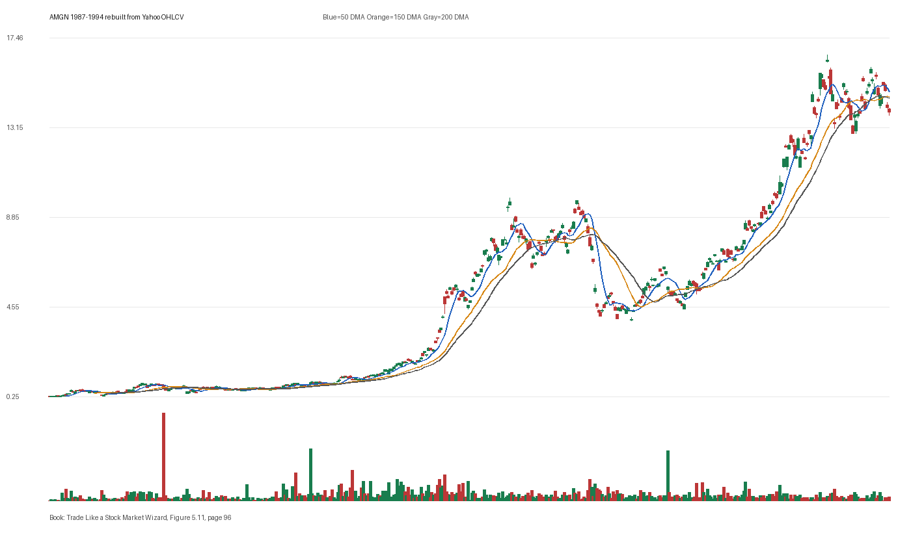

# Figure 5.11 - AMGN - Page 96

## Source Image

Book: [[Trade Like a Stock Market Wizard]]

Caption: Amgen (AMGN) 1987-1994 In 1992, Amgen formed a double top before completing stage 3 and transitioning into a sharp stage 4 decline

## Yahoo OHLCV Rebuild

Download status: `OK`

CSV: `data/book_stock_images/trade-like-a-stock-market-wizard-figure-5-11-amgn-page-96_ohlcv.csv`

## Pattern Read

Tags: vcp-or-tightening, failed-breakout-or-stage-4

Concepts: [[Pivot and Entry]], [[Risk First]], [[Sell Rules and Failure Signals]], [[Trend Template]], [[Volatility Contraction Pattern]], [[Volume Dry-Up and Accumulation]]

The useful clue is contraction: the later portion of the window became tighter than the earlier portion. The sell lesson dominates: when price breaks character, the chart can warn before fundamentals are obvious.

## Reconciliation Metrics

| Metric | Value |
|---|---:|
| first_close | 0.263 |
| last_close | 13.7812 |
| max_gain_pct | 6220.79 |
| max_drawdown_from_period_high_pct | -64.15 |
| first_half_depth_pct | 2114.14 |
| second_half_depth_pct | 329.03 |
| tightening | True |
| volume_dryup | False |
| best_trend_template_score | 5/5 |
| latest_trend_template_score | 2/5 |

## Trend Template Checks

- 50 DMA > 150 DMA
- 150 DMA > 200 DMA

## Study Questions

- Does the rebuilt OHLCV chart confirm the same structure shown in the book image?
- Was the stock close to a definable pivot, or already extended?
- Did volume dry up before the move, or was supply still obvious?
- Was this a buy lesson, a sell lesson, or a failure-avoidance lesson?
- What would invalidate the setup if this were being traded live?

<!-- STAGE_LIFECYCLE_START -->
## Stage Lifecycle & Base Concept Analysis
> This section analyzes the FULL LIFECYCLE of the stock around the inferred entry — Stage 1 (Accumulation), Stage 2 (Advance), Stage 3 (Distribution), Stage 4 (Decline) — plus deep base concept analysis, VCP footprint, tight footprint, supply dynamics, and contraction timeline.
- Status: `ok`
- Entry date: `1991-05-02`
- Entry price: `5.5729`
### Stage Lifecycle Overview
| Stage | Present | Start Date | End Date | Duration | Key Signal |
|---|---|---|---:|---|---|
| Stage 1 — Accumulation | ✅ | `1989-02-08` | `1990-02-07` | 252 days | Base: deep-chaotic |
| Stage 2 — Advance | ✅ | `1990-02-07` | `1992-03-26` | 539 days | Max gain: 816.1% |
| Stage 3 — Distribution | ✅ | `1992-05-26` | `1992-06-01` | 4 days | no climax |
| Stage 4 — Decline | ✅ | `1992-06-02` | — | 778 days | Below 200 DMA: False |
### Stage 1 — Accumulation / Base Building
- Base type: `deep-chaotic`
- Lowest price in base: `0.7400`
- Volume pattern: `neutral`
### Stage 2 — Advance / Trend Pivots

- Number of significant pivots during advance: `5`

| Pivot Date | Price |
|---|---:|
| `1990-03-20` | `1.3200` |
| `1990-05-25` | `1.5700` |
| `1990-07-26` | `1.9200` |
| `1990-08-15` | `2.0500` |
| `1990-11-30` | `2.4300` |

#### Trend Template Evolution During Stage 2

| % Through Stage 2 | Date | Score |
|---|---|---:|
| 0% | `1990-02-07` | 6/7 |
| 25% | `1990-08-20` | 7/7 |
| 50% | `1991-03-04` | 7/7 |
| 75% | `1991-09-13` | 7/7 |
| 100% | `1992-03-26` | 6/7 |

### Base Concept Deep-Dive

- Base type: `deep-chaotic`
- Base duration: `301 sessions`
- Base depth: `405.1%`
- Base high: `5.7100`
- Base low: `1.1300`
- Resistance touches at base high: `7`
- Support touches at base low: `5`
- Contraction count: `5`
- Contraction quality: `mixed-or-loose`
- Pivot clarity: `near-pivot`
- Pivot distance at entry: `-2.4%`
- Volume dry-up in base: `neutral`
- Volume dry-up ratio: `0.79`
- Tightness at pivot (10d): `6.1%`
- Weekly tightness: `5.1%`

### VCP Footprint

- VCP present: `False`
- No clear VCP pattern detected in the base.

### Tight Footprint

- 10-session tightness at entry: `6.1%`
- 20-session tightness at entry: `8.2%`
- Weekly tightness: `5.1%`
- ATR20 %: `3.52`
- Tightness progression: `improving`

### Supply Analysis

- Supply label: `diminishing`
- Volume dry-up ratio: `0.73`
- Distribution volume detected: `False`
- Accumulation volume detected: `False`
- Climax volume dates: `1991-03-06, 1991-03-07, 1991-03-08`

### Contraction Timeline

| Phase | Start Date | Depth | Volume | Tightness |
|---|---|---:|---:|---:|
| C1 | `1990-02-23` | 28.1% | 10658400.0 | 8.6% |
| C2 | `1990-05-21` | 50.0% | 17930400.0 | 19.6% |
| C3 | `1990-08-15` | 27.0% | 15254400.0 | 9.2% |
| C4 | `1990-11-08` | 68.5% | 14136000.0 | 15.6% |
| C5 | `1991-02-05` | 80.7% | 18202800.0 | 6.1% |

### Concept Tie-Back

- Related concepts: [[Base Concept]], [[Stage 2 Uptrend]], [[Trend Template]], [[Stage 3 Distribution]], [[Stage 4 Decline]], [[Volume Dry-Up and Accumulation]], [[Supply and Demand]]
- Lesson: Stage 1 base was deep-chaotic with 68.5% depth. Stage 2 advance lasted 540 sessions with 5 significant pivots. Supply was diminishing before entry.

<!-- STAGE_LIFECYCLE_END -->
<!-- PRE_ENTRY_SENSE_CHECK_START -->

## Pre-Entry Sense Check

> This section analyzes the chart structure PRIOR to the inferred entry. It answers: What did the setup look like in the weeks and months before the trade? Which Minervini concepts were already visible?

- Status: `ok`
- Entry date: `1991-05-02`
- Pre-entry history available: `1248 sessions`

### Trend Template Evolution

| Lookback | Date | Score | Assessment |
|---|---|---:|:---|
| 60 days before | 1991-02-05 | 7/7 | ✅ Stage 2 confirmed |
| 40 days before | 1991-03-06 | 7/7 | ✅ Stage 2 confirmed |
| 20 days before | 1991-04-04 | 7/7 | ✅ Stage 2 confirmed |

### Pre-Entry Context Window

- Context window (last sessions before entry): `150 sessions`
- Range high: `5.6700`
- Range low: `1.6900`
- Total range depth: `234.8%`
- Contraction phases (rolling 21-bar segments): `21.8% -> 26.7% -> 22.1% -> 30.8% -> 48.8% -> 49.7% -> 10.3%`

### Stage 2 Onset

- First sustained Stage 2 date: `1989-01-19`
- Days in Stage 2 before entry: `577`

### Volume Behavior Before Entry

- Volume dry-up label: `moderate-dry-up`
- Recent/base volume ratio: `0.73`
- Volume spike dates (2.5x avg) in last 40 days: `1991-03-06, 1991-03-07, 1991-03-08`

### Tightness Progression

| Lookback | 10-Session Close Tightness |
|---|---:|
| 40 days before | `14.6%` |
| 20 days before | `10.2%` |
| Final 10 sessions before | `6.1%` |
| Final 3 weekly closes | `5.1%` |

### Moving Average Alignment

- 50/150/200 DMA first aligned (50>150>200): `1987-03-19`

### Shakeouts / Tests Before Entry

- No shakeouts or undercut-recover patterns detected in last 40 sessions before entry.

### 52-Week High Context

| Timing | Distance from 52W High |
|---|---:|
| 60 days before | `-1.2%` |
| 20 days before | `-1.9%` |
| At entry | `-2.4%` |

### Concept Tie-Back

- Related concepts: [[Stage 2 Uptrend]], [[Trend Template]], [[Relative Strength Leadership]], [[Volatility Contraction Pattern]], [[Pivot and Entry]], [[Volume Dry-Up and Accumulation]], [[Sell Rules and Failure Signals]]
- Lesson: Stage 2 was established 577 days before entry, confirming leadership context. Total pre-entry range was 234.8% — wide range indicating significant prior movement. Volume dried up before entry, suggesting supply absorption.

<!-- PRE_ENTRY_SENSE_CHECK_END -->
<!-- SEPA_REPLICATION_START -->

## SEPA Trade Replication

> Study note: this reconstructs a likely Minervini-style setup area from the real OHLCV window shown by the book timing. It does not claim to know Minervini's private fill, sizing, or unpublished execution.

- Status: `reconstructed-from-real-ohlcv`
- Setup type: `failure/sell-rule-study`
- Confidence: `high`
- Timing source: `1987-1994` from the figure caption and rebuilt OHLCV where available.
- Inferred study entry date: `1991-05-02`
- Inferred study entry price: `5.5729`
- Inferred pivot: `5.6667`
- Inferred stop / invalidation: `5.1250`
- Pivot extension at entry: `-1.7%`
- Stop distance / risk: `8.7%`
- Trend Template score at entry: `7/7`

### Tightness And Supply
- 3-part pre-entry contraction depth: `44.7% -> 39.5% -> 10.6%`
- Contraction quality: `clear-tightening`
- 10-session close tightness: `6.1%`
- 3-week close tightness: `5.1%`
- Volume dry-up: `moderate-dry-up`
- Recent/base median volume ratio: `0.73`
- Leadership proxy: 65-day return 81.0% and 126-day return 183.1%

### Post-Entry Reality Check
- Max gain after 20 sessions: `0.4%`
- Max gain after 60 sessions: `8.4%`
- Max gain after 120 sessions: `41.3%`
- Worst drawdown after 20 sessions: `-15.1%`
- Inferred stop failed within 20 sessions: `True`
- Pivot broadly respected within 20 sessions: `False`

### Concept Tie-Back

- Related concepts: [[Risk First]], [[Volatility Contraction Pattern]], [[Volume Dry-Up and Accumulation]], [[Pivot and Entry]], [[Sell Rules and Failure Signals]], [[Trend Template]], [[Stage 2 Uptrend]], [[Relative Strength Leadership]]
- Lesson: Treat this as a sell-rule and failure-recognition study. The important lesson is whether the stock could hold the pivot/base after demand supposedly appeared; a quick loss of the pivot changes the case from entry to defense.

<!-- SEPA_REPLICATION_END -->
