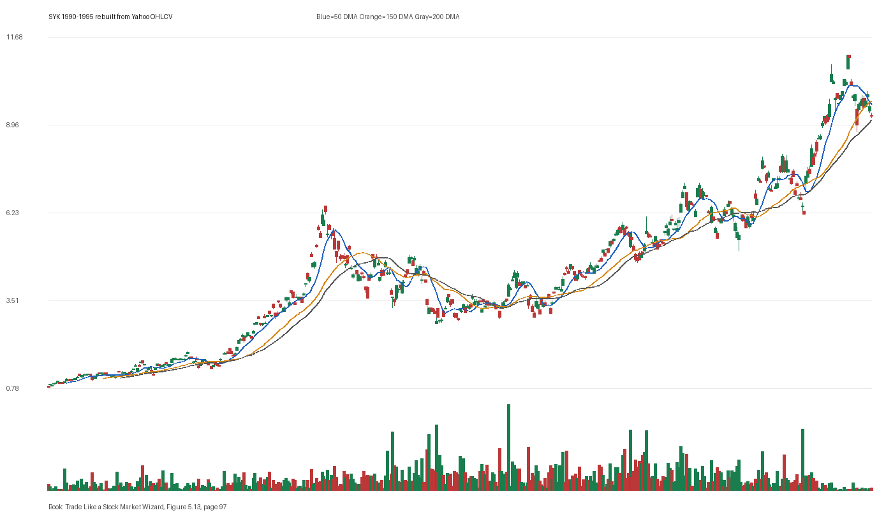

# Figure 5.13 - SYK - Page 97

## Source Image

Book: [[Trade Like a Stock Market Wizard]]

Caption: Stryker Corp. (SYK) 1990-1995 In 1991, Stryker topped after a climax run. Five years later a new base developed during a renewed stage 2 uptrend

## Yahoo OHLCV Rebuild

Download status: `OK`

CSV: `data/book_stock_images/trade-like-a-stock-market-wizard-figure-5-13-syk-page-97_ohlcv.csv`

## Pattern Read

Tags: vcp-or-tightening, volume-dry-up, climax-or-exhaustion, stage-2-leadership

Concepts: [[Pivot and Entry]], [[Relative Strength Leadership]], [[Sell Rules and Failure Signals]], [[Stage 2 Uptrend]], [[Trend Template]], [[Volatility Contraction Pattern]], [[Volume Dry-Up and Accumulation]]

The useful clue is contraction: the later portion of the window became tighter than the earlier portion. Volume contraction supports the idea that supply was drying up near the tight area.

## Reconciliation Metrics

| Metric | Value |
|---|---:|
| first_close | 0.8229 |
| last_close | 9.5625 |
| max_gain_pct | 1276.58 |
| max_drawdown_from_period_high_pct | -59.81 |
| first_half_depth_pct | 703.85 |
| second_half_depth_pct | 289.78 |
| tightening | True |
| volume_dryup | True |
| best_trend_template_score | 5/5 |
| latest_trend_template_score | 2/5 |

## Trend Template Checks

- close > 200 DMA
- 150 DMA > 200 DMA

## Study Questions

- Does the rebuilt OHLCV chart confirm the same structure shown in the book image?
- Was the stock close to a definable pivot, or already extended?
- Did volume dry up before the move, or was supply still obvious?
- Was this a buy lesson, a sell lesson, or a failure-avoidance lesson?
- What would invalidate the setup if this were being traded live?

<!-- STAGE_LIFECYCLE_START -->
## Stage Lifecycle & Base Concept Analysis
> This section analyzes the FULL LIFECYCLE of the stock around the inferred entry — Stage 1 (Accumulation), Stage 2 (Advance), Stage 3 (Distribution), Stage 4 (Decline) — plus deep base concept analysis, VCP footprint, tight footprint, supply dynamics, and contraction timeline.
- Status: `ok`
- Entry date: `1991-03-28`
- Entry price: `2.5469`
### Stage Lifecycle Overview
| Stage | Present | Start Date | End Date | Duration | Key Signal |
|---|---|---|---:|---|---|
| Stage 1 — Accumulation | ✅ | `1989-11-28` | `1990-11-27` | 252 days | Base: deep-chaotic |
| Stage 2 — Advance | ✅ | `1990-11-27` | `1992-02-24` | 313 days | Max gain: 283.5% |
| Stage 3 — Distribution | ✅ | `1992-04-16` | `1992-04-20` | 1 days | no climax |
| Stage 4 — Decline | ✅ | `1992-04-21` | — | 1060 days | Below 200 DMA: False |
### Stage 1 — Accumulation / Base Building
- Base type: `deep-chaotic`
- Lowest price in base: `1.2000`
- Volume pattern: `neutral`
### Stage 2 — Advance / Trend Pivots

- Number of significant pivots during advance: `5`

| Pivot Date | Price |
|---|---:|
| `1991-02-14` | `2.5300` |
| `1991-04-17` | `3.0900` |
| `1991-05-29` | `3.2800` |
| `1991-06-14` | `3.4700` |
| `1991-08-08` | `3.7800` |

#### Trend Template Evolution During Stage 2

| % Through Stage 2 | Date | Score |
|---|---|---:|
| 0% | `1990-11-27` | 6/7 |
| 25% | `1991-03-20` | 7/7 |
| 50% | `1991-07-11` | 7/7 |
| 75% | `1991-10-30` | 7/7 |
| 100% | `1992-02-24` | 6/7 |

### Base Concept Deep-Dive

- Base type: `deep-chaotic`
- Base duration: `86 sessions`
- Base depth: `61.8%`
- Base high: `2.5800`
- Base low: `1.5900`
- Resistance touches at base high: `3`
- Support touches at base low: `2`
- Contraction count: `5`
- Contraction quality: `constructive-tightening`
- Pivot clarity: `clear-pivot-at-high`
- Pivot distance at entry: `-1.2%`
- Volume dry-up in base: `moderate-dry-up`
- Volume dry-up ratio: `0.56`
- Tightness at pivot (10d): `10.1%`
- Weekly tightness: `7.9%`

### VCP Footprint

- VCP present: `True`
- VCP quality: `constructive-tightening`
- Total contraction depth: `27.7%`
- Final contraction depth: `10.3%`
- Number of contractions: `5`

| Phase | Date | Depth | Volume | Tightness |
|---|---|---:|---:|---:|
| C? | `1990-11-26` | 21.6% | 1275200.0 | 4.3% |
| C? | `1990-12-19` | 22.7% | 1174400.0 | 10.6% |
| C? | `1991-01-15` | 27.7% | 1480000.0 | 8.7% |
| C? | `1991-02-07` | 14.9% | 1283200.0 | 11.2% |
| C? | `1991-03-05` | 10.3% | 584000.0 | 7.4% |

### Tight Footprint

- 10-session tightness at entry: `7.4%`
- 20-session tightness at entry: `8.1%`
- Weekly tightness: `5.3%`
- ATR20 %: `2.55`
- Tightness progression: `improving`

### Supply Analysis

- Supply label: `diminishing`
- Volume dry-up ratio: `0.56`
- Distribution volume detected: `False`
- Accumulation volume detected: `True`
- Climax volume dates: `1991-02-05, 1991-02-08, 1991-02-19`

### Contraction Timeline

| Phase | Start Date | Depth | Volume | Tightness |
|---|---|---:|---:|---:|
| C1 | `1990-11-26` | 21.6% | 1275200.0 | 4.3% |
| C2 | `1990-12-19` | 22.7% | 1174400.0 | 10.6% |
| C3 | `1991-01-15` | 27.7% | 1480000.0 | 8.7% |
| C4 | `1991-02-07` | 14.9% | 1283200.0 | 11.2% |
| C5 | `1991-03-05` | 10.3% | 584000.0 | 7.4% |

### Concept Tie-Back

- Related concepts: [[Base Concept]], [[Stage 2 Uptrend]], [[Trend Template]], [[Stage 3 Distribution]], [[Stage 4 Decline]], [[Volatility Contraction Pattern]], [[Pivot and Entry]], [[Volume Dry-Up and Accumulation]], [[Supply and Demand]]
- Lesson: Stage 1 base was deep-chaotic with 59.7% depth. Stage 2 advance lasted 314 sessions with 5 significant pivots. VCP footprint shows 5 contractions with constructive-tightening quality. Supply was diminishing before entry.

<!-- STAGE_LIFECYCLE_END -->
<!-- PRE_ENTRY_SENSE_CHECK_START -->

## Pre-Entry Sense Check

> This section analyzes the chart structure PRIOR to the inferred entry. It answers: What did the setup look like in the weeks and months before the trade? Which Minervini concepts were already visible?

- Status: `ok`
- Entry date: `1991-03-28`
- Pre-entry history available: `464 sessions`

### Trend Template Evolution

| Lookback | Date | Score | Assessment |
|---|---|---:|:---|
| 60 days before | 1991-01-02 | 7/7 | ✅ Stage 2 confirmed |
| 40 days before | 1991-01-30 | 7/7 | ✅ Stage 2 confirmed |
| 20 days before | 1991-02-28 | 7/7 | ✅ Stage 2 confirmed |

### Pre-Entry Context Window

- Context window (last sessions before entry): `150 sessions`
- Range high: `2.5300`
- Range low: `1.3600`
- Total range depth: `86.2%`
- Contraction phases (rolling 21-bar segments): `20.7% -> 23.0% -> 16.0% -> 26.5% -> 22.7% -> 27.6% -> 12.6%`

### Stage 2 Onset

- First sustained Stage 2 date: `1990-03-13`
- Days in Stage 2 before entry: `264`

### Volume Behavior Before Entry

- Volume dry-up label: `moderate-dry-up`
- Recent/base volume ratio: `0.56`
- Volume spike dates (2.5x avg) in last 40 days: `1991-02-19`

### Tightness Progression

| Lookback | 10-Session Close Tightness |
|---|---:|
| 40 days before | `19.3%` |
| 20 days before | `11.2%` |
| Final 10 sessions before | `7.4%` |
| Final 3 weekly closes | `5.3%` |

### Moving Average Alignment

- 50/150/200 DMA first aligned (50>150>200): `1990-03-13`

### Shakeouts / Tests Before Entry

- No shakeouts or undercut-recover patterns detected in last 40 sessions before entry.

### 52-Week High Context

| Timing | Distance from 52W High |
|---|---:|
| 60 days before | `-11.1%` |
| 20 days before | `-4.9%` |
| At entry | `-1.2%` |

### Concept Tie-Back

- Related concepts: [[Stage 2 Uptrend]], [[Trend Template]], [[Relative Strength Leadership]], [[Volatility Contraction Pattern]], [[Pivot and Entry]], [[Volume Dry-Up and Accumulation]]
- Lesson: Stage 2 was established 264 days before entry, confirming leadership context. Total pre-entry range was 86.2% — wide range indicating significant prior movement. Volume dried up before entry, suggesting supply absorption.

<!-- PRE_ENTRY_SENSE_CHECK_END -->
<!-- SEPA_REPLICATION_START -->

## SEPA Trade Replication

> Study note: this reconstructs a likely Minervini-style setup area from the real OHLCV window shown by the book timing. It does not claim to know Minervini's private fill, sizing, or unpublished execution.

- Status: `reconstructed-from-real-ohlcv`
- Setup type: `climax-risk-study`
- Confidence: `high`
- Timing source: `1990-1995` from the figure caption and rebuilt OHLCV where available.
- Inferred study entry date: `1991-03-28`
- Inferred study entry price: `2.5469`
- Inferred pivot: `2.5312`
- Inferred stop / invalidation: `2.2812`
- Pivot extension at entry: `0.6%`
- Stop distance / risk: `11.6%`
- Trend Template score at entry: `7/7`

### Tightness And Supply
- 3-part pre-entry contraction depth: `29.1% -> 19.1% -> 10.3%`
- Contraction quality: `clear-tightening`
- 10-session close tightness: `7.4%`
- 3-week close tightness: `5.3%`
- Volume dry-up: `moderate-dry-up`
- Recent/base median volume ratio: `0.56`
- Leadership proxy: 65-day return 28.3% and 126-day return 59.8%

### Post-Entry Reality Check
- Max gain after 20 sessions: `21.5%`
- Max gain after 60 sessions: `36.2%`
- Max gain after 120 sessions: `52.1%`
- Worst drawdown after 20 sessions: `-2.5%`
- Inferred stop failed within 20 sessions: `False`
- Pivot broadly respected within 20 sessions: `True`

### Concept Tie-Back

- Related concepts: [[Risk First]], [[Volatility Contraction Pattern]], [[Volume Dry-Up and Accumulation]], [[Pivot and Entry]], [[Sell Rules and Failure Signals]], [[Trend Template]], [[Stage 2 Uptrend]], [[Relative Strength Leadership]]
- Lesson: Treat this as an exhaustion study, not a fresh buy setup. The Minervini lesson is to recognize when a leader has become too vertical or emotionally obvious and risk should be reduced.

<!-- SEPA_REPLICATION_END -->
