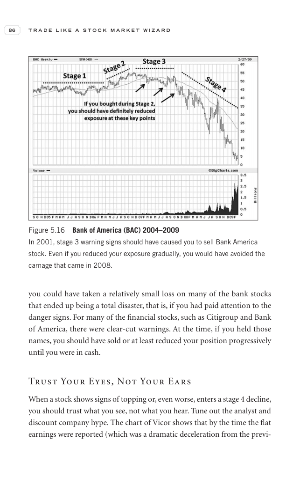
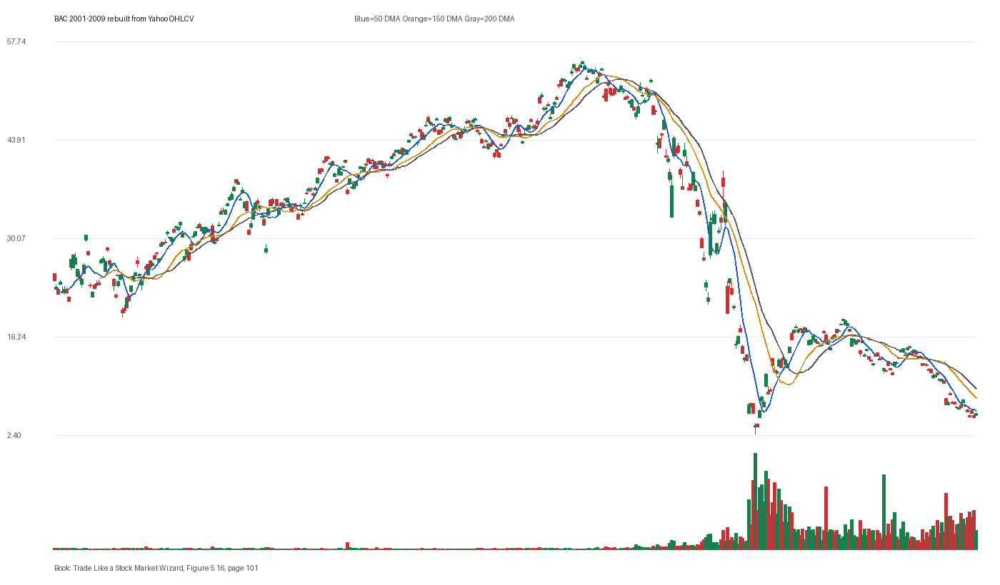

# Figure 5.16 - BAC - Page 101

## Source Image

Book: [[Trade Like a Stock Market Wizard]]

Caption: Bank of America (BAC) 2004-2009 In 2001, stage 3 warning signs should have caused you to sell Bank America stock. Even if you reduced your exposure gradually, you would have avoided the carnage that came in 2008

## Yahoo OHLCV Rebuild

Download status: `OK`

CSV: `data/book_stock_images/trade-like-a-stock-market-wizard-figure-5-16-bac-page-101_ohlcv.csv`

## Pattern Read

Tags: failed-breakout-or-stage-4

Concepts: [[Risk First]], [[Sell Rules and Failure Signals]], [[Trend Template]]

The sell lesson dominates: when price breaks character, the chart can warn before fundamentals are obvious.

## Reconciliation Metrics

| Metric | Value |
|---|---:|
| first_close | 24.2188 |
| last_close | 5.56 |
| max_gain_pct | 127.43 |
| max_drawdown_from_period_high_pct | -95.41 |
| first_half_depth_pct | 161.45 |
| second_half_depth_pct | 2077.08 |
| tightening | False |
| volume_dryup | False |
| best_trend_template_score | 5/5 |
| latest_trend_template_score | 0/5 |

## Trend Template Checks

- Not available or not applicable.

## Study Questions

- Does the rebuilt OHLCV chart confirm the same structure shown in the book image?
- Was the stock close to a definable pivot, or already extended?
- Did volume dry up before the move, or was supply still obvious?
- Was this a buy lesson, a sell lesson, or a failure-avoidance lesson?
- What would invalidate the setup if this were being traded live?

<!-- STAGE_LIFECYCLE_START -->
## Stage Lifecycle & Base Concept Analysis
> This section analyzes the FULL LIFECYCLE of the stock around the inferred entry — Stage 1 (Accumulation), Stage 2 (Advance), Stage 3 (Distribution), Stage 4 (Decline) — plus deep base concept analysis, VCP footprint, tight footprint, supply dynamics, and contraction timeline.
- Status: `ok`
- Entry date: `2003-01-09`
- Entry price: `36.0000`
### Stage Lifecycle Overview
| Stage | Present | Start Date | End Date | Duration | Key Signal |
|---|---|---|---:|---|---|
| Stage 1 — Accumulation | ✅ | `2002-04-09` | `2003-04-08` | 252 days | Base: deep-chaotic |
| Stage 2 — Advance | ✅ | `2003-04-08` | `2003-09-09` | 106 days | Max gain: 19.8% |
| Stage 3 — Distribution | ✅ | `2003-10-27` | `2003-10-24` | -1 days | no climax |
| Stage 4 — Decline | ✅ | `2003-10-27` | — | 1679 days | Below 200 DMA: False |
### Stage 1 — Accumulation / Base Building
- Base type: `deep-chaotic`
- Lowest price in base: `26.9800`
- Volume pattern: `neutral`
### Stage 2 — Advance / Trend Pivots

- Number of significant pivots during advance: `3`

| Pivot Date | Price |
|---|---:|
| `2003-05-07` | `37.3800` |
| `2003-06-16` | `39.9400` |
| `2003-07-14` | `42.4500` |

#### Trend Template Evolution During Stage 2

| % Through Stage 2 | Date | Score |
|---|---|---:|
| 0% | `2003-04-08` | 6/7 |
| 25% | `2003-05-15` | 7/7 |
| 50% | `2003-06-24` | 7/7 |
| 75% | `2003-07-31` | 7/7 |
| 100% | `2003-09-09` | 6/7 |

### Base Concept Deep-Dive

- Base type: `N/A`
- Base duration: `0 sessions`
- Base depth: `N/A`
- Base high: `N/A`
- Base low: `N/A`
- Resistance touches at base high: `0`
- Support touches at base low: `0`
- Contraction count: `0`
- Contraction quality: `N/A`
- Pivot clarity: `N/A`
- Pivot distance at entry: `N/A`
- Volume dry-up in base: `N/A`
- Volume dry-up ratio: `N/A`
- Tightness at pivot (10d): `N/A`
- Weekly tightness: `N/A`

### VCP Footprint

- VCP present: `False`
- No clear VCP pattern detected in the base.

### Tight Footprint

- 10-session tightness at entry: `3.2%`
- 20-session tightness at entry: `4.6%`
- Weekly tightness: `2.7%`
- ATR20 %: `1.83`
- Tightness progression: `improving`

### Supply Analysis

- Supply label: `diminishing`
- Volume dry-up ratio: `0.74`
- Distribution volume detected: `False`
- Accumulation volume detected: `True`

### Concept Tie-Back

- Related concepts: [[Base Concept]], [[Stage 2 Uptrend]], [[Trend Template]], [[Stage 3 Distribution]], [[Stage 4 Decline]], [[Volume Dry-Up and Accumulation]], [[Supply and Demand]]
- Lesson: Stage 1 base was deep-chaotic with 42.9% depth. Stage 2 advance lasted 107 sessions with 3 significant pivots. Supply was diminishing before entry.

<!-- STAGE_LIFECYCLE_END -->
<!-- PRE_ENTRY_SENSE_CHECK_START -->

## Pre-Entry Sense Check

> This section analyzes the chart structure PRIOR to the inferred entry. It answers: What did the setup look like in the weeks and months before the trade? Which Minervini concepts were already visible?

- Status: `ok`
- Entry date: `2003-01-09`
- Pre-entry history available: `656 sessions`

### Trend Template Evolution

| Lookback | Date | Score | Assessment |
|---|---|---:|:---|
| 60 days before | 2002-10-14 | 1/7 | 🔴 Not yet Stage 2 |
| 40 days before | 2002-11-11 | 3/7 | 🔴 Not yet Stage 2 |
| 20 days before | 2002-12-10 | 5/7 | 🟡 Transitioning |

### Pre-Entry Context Window

- Context window (last sessions before entry): `150 sessions`
- Range high: `37.2200`
- Range low: `26.9800`
- Total range depth: `38.0%`
- Contraction phases (rolling 21-bar segments): `11.4% -> 31.9% -> 14.2% -> 17.2% -> 32.0% -> 8.7% -> 5.7%`

### Stage 2 Onset

- First sustained Stage 2 date: `2002-02-11`
- Days in Stage 2 before entry: `230`

### Volume Behavior Before Entry

- Volume dry-up label: `moderate-dry-up`
- Recent/base volume ratio: `0.74`
- No significant volume spikes in last 40 days before entry.

### Tightness Progression

| Lookback | 10-Session Close Tightness |
|---|---:|
| 40 days before | `5.8%` |
| 20 days before | `5.3%` |
| Final 10 sessions before | `3.2%` |
| Final 3 weekly closes | `2.7%` |

### Moving Average Alignment

- 50/150/200 DMA first aligned (50>150>200): `2001-06-12`

### Shakeouts / Tests Before Entry

- No shakeouts or undercut-recover patterns detected in last 40 sessions before entry.

### 52-Week High Context

| Timing | Distance from 52W High |
|---|---:|
| 60 days before | `-21.2%` |
| 20 days before | `-10.0%` |
| At entry | `-6.6%` |

### Concept Tie-Back

- Related concepts: [[Stage 2 Uptrend]], [[Trend Template]], [[Relative Strength Leadership]], [[Volatility Contraction Pattern]], [[Pivot and Entry]], [[Volume Dry-Up and Accumulation]], [[Sell Rules and Failure Signals]]
- Lesson: Stage 2 was established 230 days before entry, confirming leadership context. Total pre-entry range was 38.0% — wide range indicating significant prior movement. Volume dried up before entry, suggesting supply absorption.

<!-- PRE_ENTRY_SENSE_CHECK_END -->
<!-- SEPA_REPLICATION_START -->

## SEPA Trade Replication

> Study note: this reconstructs a likely Minervini-style setup area from the real OHLCV window shown by the book timing. It does not claim to know Minervini's private fill, sizing, or unpublished execution.

- Status: `reconstructed-from-real-ohlcv`
- Setup type: `failure/sell-rule-study`
- Confidence: `high`
- Timing source: `2001-2009` from the figure caption and rebuilt OHLCV where available.
- Inferred study entry date: `2003-01-09`
- Inferred study entry price: `36.0000`
- Inferred pivot: `36.0000`
- Inferred stop / invalidation: `33.9500`
- Pivot extension at entry: `0.0%`
- Stop distance / risk: `6.0%`
- Trend Template score at entry: `6/7`

### Tightness And Supply
- 3-part pre-entry contraction depth: `33.5% -> 8.7% -> 6.0%`
- Contraction quality: `clear-tightening`
- 10-session close tightness: `3.2%`
- 3-week close tightness: `2.7%`
- Volume dry-up: `moderate-dry-up`
- Recent/base median volume ratio: `0.74`
- Leadership proxy: 65-day return 29.5% and 126-day return 4.1%

### Post-Entry Reality Check
- Max gain after 20 sessions: `0.7%`
- Max gain after 60 sessions: `0.7%`
- Max gain after 120 sessions: `12.0%`
- Worst drawdown after 20 sessions: `-6.1%`
- Inferred stop failed within 20 sessions: `True`
- Pivot broadly respected within 20 sessions: `False`

### Concept Tie-Back

- Related concepts: [[Risk First]], [[Volatility Contraction Pattern]], [[Volume Dry-Up and Accumulation]], [[Pivot and Entry]], [[Sell Rules and Failure Signals]], [[Trend Template]], [[Stage 2 Uptrend]], [[Relative Strength Leadership]]
- Lesson: Treat this as a sell-rule and failure-recognition study. The important lesson is whether the stock could hold the pivot/base after demand supposedly appeared; a quick loss of the pivot changes the case from entry to defense.

<!-- SEPA_REPLICATION_END -->
