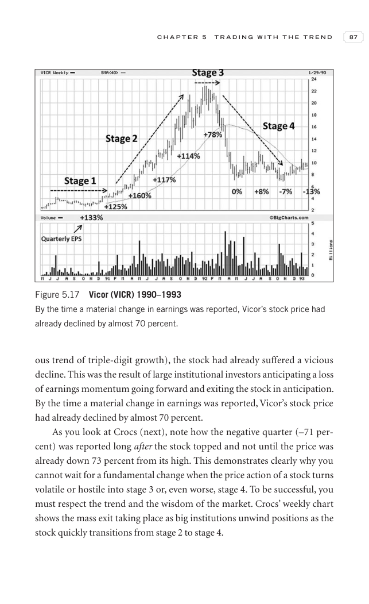
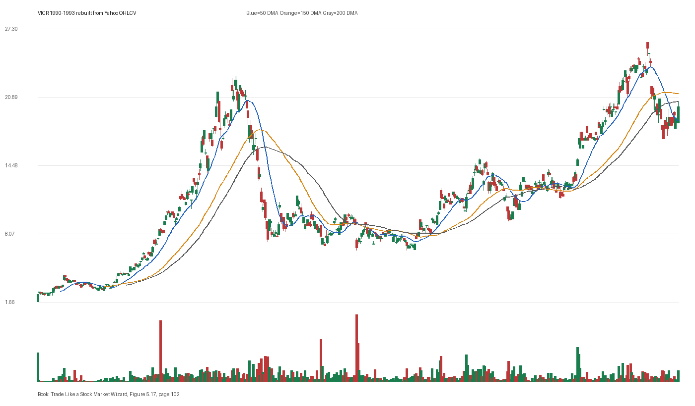

# Figure 5.17 - VICR - Page 102

## Source Image

Book: [[Trade Like a Stock Market Wizard]]

Caption: Vicor (VICR) 1990-1993 By the time a material change in earnings was reported, Vicor’s stock price had already declined by almost 70 percent

## Yahoo OHLCV Rebuild

Download status: `OK`

CSV: `data/book_stock_images/trade-like-a-stock-market-wizard-figure-5-17-vicr-page-102_ohlcv.csv`

## Pattern Read

Tags: vcp-or-tightening, failed-breakout-or-stage-4

Concepts: [[Pivot and Entry]], [[Risk First]], [[Sell Rules and Failure Signals]], [[Trend Template]], [[Volatility Contraction Pattern]], [[Volume Dry-Up and Accumulation]]

The useful clue is contraction: the later portion of the window became tighter than the earlier portion. The sell lesson dominates: when price breaks character, the chart can warn before fundamentals are obvious.

## Reconciliation Metrics

| Metric | Value |
|---|---:|
| first_close | 2.375 |
| last_close | 20.0 |
| max_gain_pct | 994.74 |
| max_drawdown_from_period_high_pct | -71.58 |
| first_half_depth_pct | 1207.14 |
| second_half_depth_pct | 300.0 |
| tightening | True |
| volume_dryup | False |
| best_trend_template_score | 5/5 |
| latest_trend_template_score | 2/5 |

## Trend Template Checks

- close > 50 DMA
- 150 DMA > 200 DMA

## Study Questions

- Does the rebuilt OHLCV chart confirm the same structure shown in the book image?
- Was the stock close to a definable pivot, or already extended?
- Did volume dry up before the move, or was supply still obvious?
- Was this a buy lesson, a sell lesson, or a failure-avoidance lesson?
- What would invalidate the setup if this were being traded live?

<!-- STAGE_LIFECYCLE_START -->
## Stage Lifecycle & Base Concept Analysis
> This section analyzes the FULL LIFECYCLE of the stock around the inferred entry — Stage 1 (Accumulation), Stage 2 (Advance), Stage 3 (Distribution), Stage 4 (Decline) — plus deep base concept analysis, VCP footprint, tight footprint, supply dynamics, and contraction timeline.
- Status: `ok`
- Entry date: `1991-06-21`
- Entry price: `10.0625`
### Stage Lifecycle Overview
| Stage | Present | Start Date | End Date | Duration | Key Signal |
|---|---|---|---:|---|---|
| Stage 1 — Accumulation | ✅ | `1990-04-03` | `1991-01-17` | 200 days | Base: deep-chaotic |
| Stage 2 — Advance | ✅ | `1991-01-17` | `1992-03-04` | 285 days | Max gain: 401.4% |
| Stage 3 — Distribution | ✅ | `1992-06-09` | `1993-02-04` | 167 days | climax vol |
| Stage 4 — Decline | ✅ | `1993-02-05` | — | 352 days | Below 200 DMA: False |
### Stage 1 — Accumulation / Base Building
- Base type: `deep-chaotic`
- Lowest price in base: `1.7500`
- Volume pattern: `neutral`
### Stage 2 — Advance / Trend Pivots

- Number of significant pivots during advance: `5`

| Pivot Date | Price |
|---|---:|
| `1991-02-14` | `5.2500` |
| `1991-03-14` | `6.3100` |
| `1991-04-18` | `8.0000` |
| `1991-05-08` | `8.8800` |
| `1991-06-05` | `10.4400` |

#### Trend Template Evolution During Stage 2

| % Through Stage 2 | Date | Score |
|---|---|---:|
| 0% | `1991-01-17` | 6/7 |
| 25% | `1991-04-30` | 7/7 |
| 50% | `1991-08-09` | 7/7 |
| 75% | `1991-11-19` | 7/7 |
| 100% | `1992-03-04` | 6/7 |

### Base Concept Deep-Dive

- Base type: `deep-chaotic`
- Base duration: `110 sessions`
- Base depth: `149.3%`
- Base high: `10.4400`
- Base low: `4.1900`
- Resistance touches at base high: `7`
- Support touches at base low: `9`
- Contraction count: `4`
- Contraction quality: `mixed-or-loose`
- Pivot clarity: `near-pivot`
- Pivot distance at entry: `-3.6%`
- Volume dry-up in base: `strong-dry-up`
- Volume dry-up ratio: `0.45`
- Tightness at pivot (10d): `6.9%`
- Weekly tightness: `3.2%`

### VCP Footprint

- VCP present: `True`
- VCP quality: `widening-risk`
- Total contraction depth: `43.8%`
- Final contraction depth: `30.0%`
- Number of contractions: `4`

| Phase | Date | Depth | Volume | Tightness |
|---|---|---:|---:|---:|
| C? | `1991-01-16` | 25.4% | 172800.0 | 10.7% |
| C? | `1991-02-15` | 29.5% | 122400.0 | 13.6% |
| C? | `1991-03-20` | 43.8% | 179400.0 | 33.0% |
| C? | `1991-04-22` | 30.0% | 258600.0 | 8.4% |

### Tight Footprint

- 10-session tightness at entry: `6.9%`
- 20-session tightness at entry: `11.6%`
- Weekly tightness: `2.6%`
- ATR20 %: `3.57`
- Tightness progression: `improving`

### Supply Analysis

- Supply label: `exhausted`
- Volume dry-up ratio: `0.54`
- Distribution volume detected: `False`
- Accumulation volume detected: `True`
- Climax volume dates: `1991-05-01, 1991-05-02, 1991-05-06`

### Contraction Timeline

| Phase | Start Date | Depth | Volume | Tightness |
|---|---|---:|---:|---:|
| C1 | `1991-01-16` | 25.4% | 172800.0 | 10.7% |
| C2 | `1991-02-15` | 29.5% | 122400.0 | 13.6% |
| C3 | `1991-03-20` | 43.8% | 179400.0 | 33.0% |
| C4 | `1991-04-22` | 30.0% | 258600.0 | 8.4% |

### Concept Tie-Back

- Related concepts: [[Base Concept]], [[Stage 2 Uptrend]], [[Trend Template]], [[Stage 3 Distribution]], [[Stage 4 Decline]], [[Volatility Contraction Pattern]], [[Pivot and Entry]], [[Volume Dry-Up and Accumulation]], [[Supply and Demand]]
- Lesson: Stage 1 base was deep-chaotic with 157.1% depth. Stage 2 advance lasted 286 sessions with 5 significant pivots. VCP footprint shows 4 contractions with widening-risk quality. Supply was exhausted before entry with strong volume dry-up.

<!-- STAGE_LIFECYCLE_END -->
<!-- PRE_ENTRY_SENSE_CHECK_START -->

## Pre-Entry Sense Check

> This section analyzes the chart structure PRIOR to the inferred entry. It answers: What did the setup look like in the weeks and months before the trade? Which Minervini concepts were already visible?

- Status: `ok`
- Entry date: `1991-06-21`
- Pre-entry history available: `308 sessions`

### Trend Template Evolution

| Lookback | Date | Score | Assessment |
|---|---|---:|:---|
| 60 days before | 1991-03-27 | 7/7 | ✅ Stage 2 confirmed |
| 40 days before | 1991-04-25 | 7/7 | ✅ Stage 2 confirmed |
| 20 days before | 1991-05-23 | 7/7 | ✅ Stage 2 confirmed |

### Pre-Entry Context Window

- Context window (last sessions before entry): `150 sessions`
- Range high: `10.4400`
- Range low: `3.0000`
- Total range depth: `247.9%`
- Contraction phases (rolling 21-bar segments): `20.8% -> 30.9% -> 25.4% -> 29.5% -> 31.5% -> 30.0% -> 28.5%`

### Stage 2 Onset

- First sustained Stage 2 date: `1991-01-17`
- Days in Stage 2 before entry: `108`

### Volume Behavior Before Entry

- Volume dry-up label: `strong-dry-up`
- Recent/base volume ratio: `0.54`
- Volume spike dates (2.5x avg) in last 40 days: `1991-05-10, 1991-05-22, 1991-05-24`

### Tightness Progression

| Lookback | 10-Session Close Tightness |
|---|---:|
| 40 days before | `22.8%` |
| 20 days before | `9.9%` |
| Final 10 sessions before | `6.9%` |
| Final 3 weekly closes | `2.6%` |

### Moving Average Alignment

- 50/150/200 DMA first aligned (50>150>200): `1991-01-17`

### Shakeouts / Tests Before Entry

- No shakeouts or undercut-recover patterns detected in last 40 sessions before entry.

### 52-Week High Context

| Timing | Distance from 52W High |
|---|---:|
| 60 days before | `N/A` |
| 20 days before | `-0.7%` |
| At entry | `-3.6%` |

### Concept Tie-Back

- Related concepts: [[Stage 2 Uptrend]], [[Trend Template]], [[Relative Strength Leadership]], [[Volume Dry-Up and Accumulation]], [[Sell Rules and Failure Signals]]
- Lesson: Stage 2 was established 108 days before entry, confirming leadership context. Total pre-entry range was 247.9% — wide range indicating significant prior movement. Volume dried up before entry, suggesting supply absorption.

<!-- PRE_ENTRY_SENSE_CHECK_END -->
<!-- SEPA_REPLICATION_START -->

## SEPA Trade Replication

> Study note: this reconstructs a likely Minervini-style setup area from the real OHLCV window shown by the book timing. It does not claim to know Minervini's private fill, sizing, or unpublished execution.

- Status: `reconstructed-from-real-ohlcv`
- Setup type: `failure/sell-rule-study`
- Confidence: `high`
- Timing source: `1990-1993` from the figure caption and rebuilt OHLCV where available.
- Inferred study entry date: `1991-06-21`
- Inferred study entry price: `10.0625`
- Inferred pivot: `10.4375`
- Inferred stop / invalidation: `9.3750`
- Pivot extension at entry: `-3.6%`
- Stop distance / risk: `7.3%`
- Trend Template score at entry: `7/7`

### Tightness And Supply
- 3-part pre-entry contraction depth: `43.8% -> 27.7% -> 21.9%`
- Contraction quality: `clear-tightening`
- 10-session close tightness: `6.9%`
- 3-week close tightness: `2.6%`
- Volume dry-up: `strong-dry-up`
- Recent/base median volume ratio: `0.54`
- Leadership proxy: 65-day return 73.1% and 126-day return 143.9%

### Post-Entry Reality Check
- Max gain after 20 sessions: `20.5%`
- Max gain after 60 sessions: `41.6%`
- Max gain after 120 sessions: `112.4%`
- Worst drawdown after 20 sessions: `-14.3%`
- Inferred stop failed within 20 sessions: `True`
- Pivot broadly respected within 20 sessions: `False`

### Concept Tie-Back

- Related concepts: [[Risk First]], [[Volatility Contraction Pattern]], [[Volume Dry-Up and Accumulation]], [[Pivot and Entry]], [[Sell Rules and Failure Signals]], [[Trend Template]], [[Stage 2 Uptrend]], [[Relative Strength Leadership]]
- Lesson: Treat this as a sell-rule and failure-recognition study. The important lesson is whether the stock could hold the pivot/base after demand supposedly appeared; a quick loss of the pivot changes the case from entry to defense.

<!-- SEPA_REPLICATION_END -->
