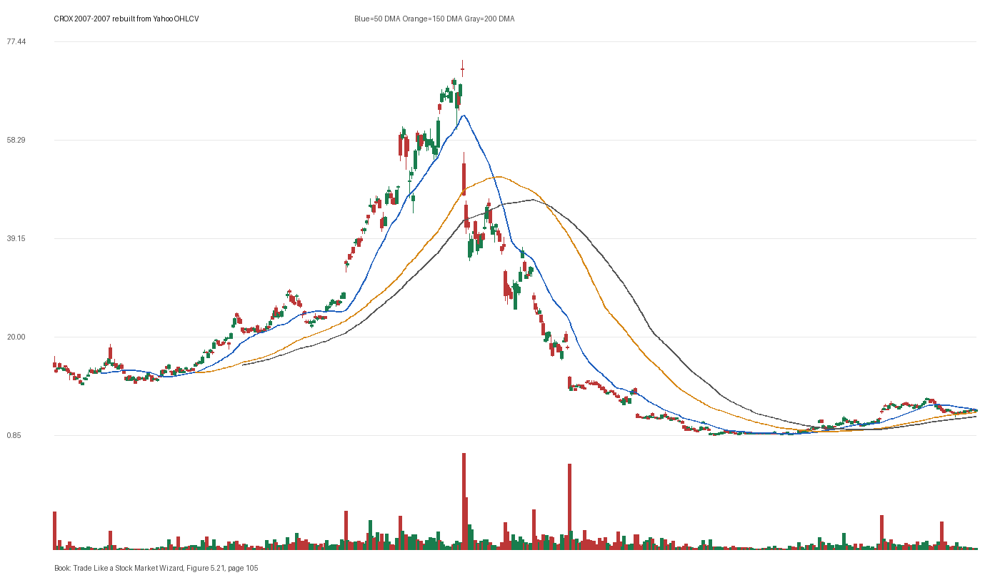

# Figure 5.21 - CROX - Page 105

## Source Image

Book: [[Trade Like a Stock Market Wizard]]

Caption: Crocs (CROX) 2007 Crocs’ (CROX) stock price sold off an overwhelming volume after a “better than expected” earnings report. This was just the beginning of what turned out to be a 99 percent decline in the stock price over the next 12 months

## Yahoo OHLCV Rebuild

Download status: `OK`

CSV: `data/book_stock_images/trade-like-a-stock-market-wizard-figure-5-21-crox-page-105_ohlcv.csv`

## Pattern Read

Tags: failed-breakout-or-stage-4

Concepts: [[Risk First]], [[Sell Rules and Failure Signals]], [[Trend Template]]

The sell lesson dominates: when price breaks character, the chart can warn before fundamentals are obvious.

## Reconciliation Metrics

| Metric | Value |
|---|---:|
| first_close | 14.275 |
| last_close | 5.76 |
| max_gain_pct | 426.87 |
| max_drawdown_from_period_high_pct | -98.95 |
| first_half_depth_pct | 640.26 |
| second_half_depth_pct | 4679.75 |
| tightening | False |
| volume_dryup | False |
| best_trend_template_score | 5/5 |
| latest_trend_template_score | 4/5 |

## Trend Template Checks

- close > 150 DMA
- close > 200 DMA
- 50 DMA > 150 DMA
- 150 DMA > 200 DMA

## Study Questions

- Does the rebuilt OHLCV chart confirm the same structure shown in the book image?
- Was the stock close to a definable pivot, or already extended?
- Did volume dry up before the move, or was supply still obvious?
- Was this a buy lesson, a sell lesson, or a failure-avoidance lesson?
- What would invalidate the setup if this were being traded live?

<!-- STAGE_LIFECYCLE_START -->
## Stage Lifecycle & Base Concept Analysis
> This section analyzes the FULL LIFECYCLE of the stock around the inferred entry — Stage 1 (Accumulation), Stage 2 (Advance), Stage 3 (Distribution), Stage 4 (Decline) — plus deep base concept analysis, VCP footprint, tight footprint, supply dynamics, and contraction timeline.
- Status: `ok`
- Entry date: `2007-07-26`
- Entry price: `50.5900`
### Stage Lifecycle Overview
| Stage | Present | Start Date | End Date | Duration | Key Signal |
|---|---|---|---:|---|---|
| Stage 1 — Accumulation | ✅ | `2006-05-26` | `2007-03-15` | 200 days | Base: deep-chaotic |
| Stage 2 — Advance | ✅ | `2007-03-15` | `2007-10-31` | 160 days | Max gain: 228.4% |
| Stage 3 — Distribution | ✅ | `2007-11-01` | `2007-11-02` | 1 days | no climax |
| Stage 4 — Decline | ✅ | `2007-11-05` | — | 162 days | Below 200 DMA: False |
### Stage 1 — Accumulation / Base Building
- Base type: `deep-chaotic`
- Lowest price in base: `10.7800`
- Volume pattern: `late-supply`
### Stage 2 — Advance / Trend Pivots

- Number of significant pivots during advance: `2`

| Pivot Date | Price |
|---|---:|
| `2007-06-20` | `47.4000` |
| `2007-07-31` | `60.8300` |

#### Trend Template Evolution During Stage 2

| % Through Stage 2 | Date | Score |
|---|---|---:|
| 0% | `2007-03-15` | 6/7 |
| 25% | `2007-05-11` | 7/7 |
| 50% | `2007-07-10` | 7/7 |
| 75% | `2007-09-05` | 7/7 |
| 100% | `2007-10-31` | 7/7 |

### Base Concept Deep-Dive

- Base type: `deep-chaotic`
- Base duration: `94 sessions`
- Base depth: `139.0%`
- Base high: `51.8100`
- Base low: `21.6700`
- Resistance touches at base high: `1`
- Support touches at base low: `1`
- Contraction count: `5`
- Contraction quality: `mixed-or-loose`
- Pivot clarity: `near-pivot`
- Pivot distance at entry: `-2.4%`
- Volume dry-up in base: `moderate-dry-up`
- Volume dry-up ratio: `0.72`
- Tightness at pivot (10d): `11.9%`
- Weekly tightness: `11.9%`

### VCP Footprint

- VCP present: `False`
- No clear VCP pattern detected in the base.

### Tight Footprint

- 10-session tightness at entry: `9.0%`
- 20-session tightness at entry: `19.4%`
- Weekly tightness: `9.0%`
- ATR20 %: `4.15`
- Tightness progression: `worsening`

### Supply Analysis

- Supply label: `diminishing`
- Volume dry-up ratio: `0.72`
- Distribution volume detected: `False`
- Accumulation volume detected: `True`
- Climax volume dates: `2007-06-07, 2007-06-08, 2007-06-11`

### Contraction Timeline

| Phase | Start Date | Depth | Volume | Tightness |
|---|---|---:|---:|---:|
| C1 | `2007-03-14` | 21.5% | 3146500.0 | 10.0% |
| C2 | `2007-04-10` | 14.3% | 3038500.0 | 9.0% |
| C3 | `2007-05-04` | 24.1% | 5497100.0 | 10.8% |
| C4 | `2007-05-31` | 18.5% | 7506600.0 | 5.8% |
| C5 | `2007-06-26` | 23.1% | 4738650.0 | 7.5% |

### Concept Tie-Back

- Related concepts: [[Base Concept]], [[Stage 2 Uptrend]], [[Trend Template]], [[Stage 3 Distribution]], [[Stage 4 Decline]], [[Volume Dry-Up and Accumulation]], [[Supply and Demand]]
- Lesson: Stage 1 base was deep-chaotic with 171.7% depth. Stage 2 advance lasted 161 sessions with 2 significant pivots. Supply was diminishing before entry.

<!-- STAGE_LIFECYCLE_END -->
<!-- PRE_ENTRY_SENSE_CHECK_START -->

## Pre-Entry Sense Check

> This section analyzes the chart structure PRIOR to the inferred entry. It answers: What did the setup look like in the weeks and months before the trade? Which Minervini concepts were already visible?

- Status: `ok`
- Entry date: `2007-07-26`
- Pre-entry history available: `292 sessions`

### Trend Template Evolution

| Lookback | Date | Score | Assessment |
|---|---|---:|:---|
| 60 days before | 2007-05-01 | 7/7 | ✅ Stage 2 confirmed |
| 40 days before | 2007-05-30 | 7/7 | ✅ Stage 2 confirmed |
| 20 days before | 2007-06-27 | 7/7 | ✅ Stage 2 confirmed |

### Pre-Entry Context Window

- Context window (last sessions before entry): `150 sessions`
- Range high: `49.7000`
- Range low: `20.6800`
- Total range depth: `140.3%`
- Contraction phases (rolling 21-bar segments): `25.7% -> 24.2% -> 33.8% -> 17.7% -> 49.8% -> 26.0% -> 23.1%`

### Stage 2 Onset

- First sustained Stage 2 date: `2007-03-15`
- Days in Stage 2 before entry: `92`

### Volume Behavior Before Entry

- Volume dry-up label: `moderate-dry-up`
- Recent/base volume ratio: `0.72`
- Volume spike dates (2.5x avg) in last 40 days: `2007-06-07, 2007-06-12, 2007-06-13`

### Tightness Progression

| Lookback | 10-Session Close Tightness |
|---|---:|
| 40 days before | `7.0%` |
| 20 days before | `5.8%` |
| Final 10 sessions before | `9.0%` |
| Final 3 weekly closes | `9.0%` |

### Moving Average Alignment

- 50/150/200 DMA first aligned (50>150>200): `2007-03-15`

### Shakeouts / Tests Before Entry

- No shakeouts or undercut-recover patterns detected in last 40 sessions before entry.

### 52-Week High Context

| Timing | Distance from 52W High |
|---|---:|
| 60 days before | `N/A` |
| 20 days before | `-9.2%` |
| At entry | `-2.4%` |

### Concept Tie-Back

- Related concepts: [[Stage 2 Uptrend]], [[Trend Template]], [[Relative Strength Leadership]], [[Volume Dry-Up and Accumulation]], [[Sell Rules and Failure Signals]]
- Lesson: Stage 2 was established 92 days before entry, confirming leadership context. Total pre-entry range was 140.3% — wide range indicating significant prior movement. Volume dried up before entry, suggesting supply absorption.

<!-- PRE_ENTRY_SENSE_CHECK_END -->
<!-- SEPA_REPLICATION_START -->

## SEPA Trade Replication

> Study note: this reconstructs a likely Minervini-style setup area from the real OHLCV window shown by the book timing. It does not claim to know Minervini's private fill, sizing, or unpublished execution.

- Status: `reconstructed-from-real-ohlcv`
- Setup type: `failure/sell-rule-study`
- Confidence: `high`
- Timing source: `2007-2007` from the figure caption and rebuilt OHLCV where available.
- Inferred study entry date: `2007-07-26`
- Inferred study entry price: `50.5900`
- Inferred pivot: `49.7000`
- Inferred stop / invalidation: `41.5500`
- Pivot extension at entry: `1.8%`
- Stop distance / risk: `21.8%`
- Trend Template score at entry: `7/7`

### Tightness And Supply
- 3-part pre-entry contraction depth: `51.2% -> 24.9% -> 23.1%`
- Contraction quality: `clear-tightening`
- 10-session close tightness: `9.0%`
- 3-week close tightness: `9.0%`
- Volume dry-up: `moderate-dry-up`
- Recent/base median volume ratio: `0.72`
- Leadership proxy: 65-day return 92.1% and 126-day return 111.5%

### Post-Entry Reality Check
- Max gain after 20 sessions: `21.3%`
- Max gain after 60 sessions: `43.1%`
- Max gain after 120 sessions: `48.7%`
- Worst drawdown after 20 sessions: `-12.8%`
- Inferred stop failed within 20 sessions: `False`
- Pivot broadly respected within 20 sessions: `False`

### Concept Tie-Back

- Related concepts: [[Risk First]], [[Volatility Contraction Pattern]], [[Volume Dry-Up and Accumulation]], [[Pivot and Entry]], [[Sell Rules and Failure Signals]], [[Trend Template]], [[Stage 2 Uptrend]], [[Relative Strength Leadership]]
- Lesson: Treat this as a sell-rule and failure-recognition study. The important lesson is whether the stock could hold the pivot/base after demand supposedly appeared; a quick loss of the pivot changes the case from entry to defense.

<!-- SEPA_REPLICATION_END -->
