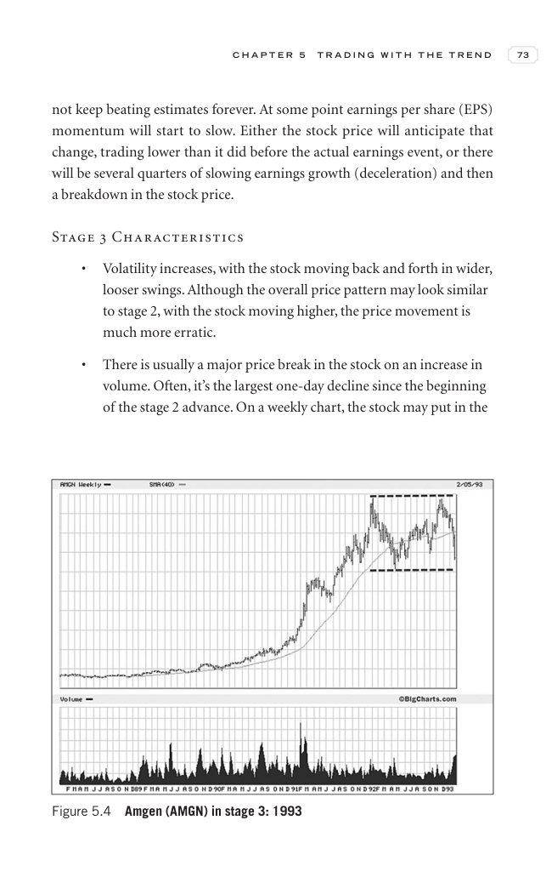
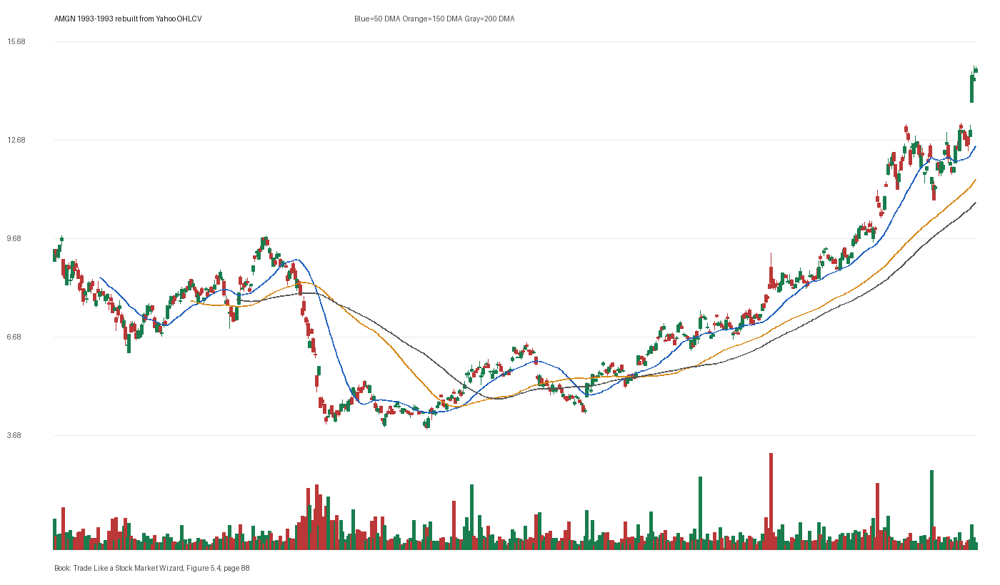

# Figure 5.4 - AMGN - Page 88

## Source Image

Book: [[Trade Like a Stock Market Wizard]]

Caption: Amgen (AMGN) in stage 3: 1993

## Yahoo OHLCV Rebuild

Download status: `OK`

CSV: `data/book_stock_images/trade-like-a-stock-market-wizard-figure-5-4-amgn-page-88_ohlcv.csv`

## Pattern Read

Tags: volume-dry-up, stage-2-leadership

Concepts: [[Relative Strength Leadership]], [[Stage 2 Uptrend]], [[Trend Template]], [[Volume Dry-Up and Accumulation]]

Volume contraction supports the idea that supply was drying up near the tight area.

## Reconciliation Metrics

| Metric | Value |
|---|---:|
| first_close | 9.3438 |
| last_close | 14.8438 |
| max_gain_pct | 59.87 |
| max_drawdown_from_period_high_pct | -60.38 |
| first_half_depth_pct | 152.42 |
| second_half_depth_pct | 243.88 |
| tightening | False |
| volume_dryup | True |
| best_trend_template_score | 5/5 |
| latest_trend_template_score | 5/5 |

## Trend Template Checks

- close > 50 DMA
- close > 150 DMA
- close > 200 DMA
- 50 DMA > 150 DMA
- 150 DMA > 200 DMA

## Study Questions

- Does the rebuilt OHLCV chart confirm the same structure shown in the book image?
- Was the stock close to a definable pivot, or already extended?
- Did volume dry up before the move, or was supply still obvious?
- Was this a buy lesson, a sell lesson, or a failure-avoidance lesson?
- What would invalidate the setup if this were being traded live?

<!-- STAGE_LIFECYCLE_START -->
## Stage Lifecycle & Base Concept Analysis
> This section analyzes the FULL LIFECYCLE of the stock around the inferred entry — Stage 1 (Accumulation), Stage 2 (Advance), Stage 3 (Distribution), Stage 4 (Decline) — plus deep base concept analysis, VCP footprint, tight footprint, supply dynamics, and contraction timeline.
- Status: `ok`
- Entry date: `1993-12-27`
- Entry price: `6.0312`
### Stage Lifecycle Overview
| Stage | Present | Start Date | End Date | Duration | Key Signal |
|---|---|---|---:|---|---|
| Stage 1 — Accumulation | ✅ | `1992-12-22` | `1993-12-21` | 252 days | Base: cup-shaped |
| Stage 2 — Advance | ✅ | `1993-12-21` | `1994-02-03` | 31 days | Max gain: 14.9% |
| Stage 3 — Distribution | ✅ | `1994-06-22` | `1994-06-21` | -1 days | no climax |
| Stage 4 — Decline | ✅ | `1994-06-22` | — | 5 days | Below 200 DMA: False |
### Stage 1 — Accumulation / Base Building
- Base type: `cup-shaped`
- Lowest price in base: `3.8800`
- Volume pattern: `accumulation-dryup`
### Base Concept Deep-Dive

- Base type: `N/A`
- Base duration: `0 sessions`
- Base depth: `N/A`
- Base high: `N/A`
- Base low: `N/A`
- Resistance touches at base high: `0`
- Support touches at base low: `0`
- Contraction count: `0`
- Contraction quality: `N/A`
- Pivot clarity: `N/A`
- Pivot distance at entry: `N/A`
- Volume dry-up in base: `N/A`
- Volume dry-up ratio: `N/A`
- Tightness at pivot (10d): `N/A`
- Weekly tightness: `N/A`

### VCP Footprint

- VCP present: `False`
- No clear VCP pattern detected in the base.

### Tight Footprint

- 10-session tightness at entry: `5.7%`
- 20-session tightness at entry: `7.4%`
- Weekly tightness: `5.7%`
- ATR20 %: `2.36`
- Tightness progression: `stable`

### Supply Analysis

- Supply label: `diminishing`
- Volume dry-up ratio: `0.68`
- Distribution volume detected: `False`
- Accumulation volume detected: `False`
- Climax volume dates: `1993-11-03`

### Concept Tie-Back

- Related concepts: [[Base Concept]], [[Stage 2 Uptrend]], [[Trend Template]], [[Stage 3 Distribution]], [[Stage 4 Decline]], [[Volume Dry-Up and Accumulation]], [[Supply and Demand]]
- Lesson: Stage 1 base was cup-shaped with 137.9% depth. Stage 2 advance lasted 32 sessions with 0 significant pivots. Supply was diminishing before entry.

<!-- STAGE_LIFECYCLE_END -->
<!-- PRE_ENTRY_SENSE_CHECK_START -->

## Pre-Entry Sense Check

> This section analyzes the chart structure PRIOR to the inferred entry. It answers: What did the setup look like in the weeks and months before the trade? Which Minervini concepts were already visible?

- Status: `ok`
- Entry date: `1993-12-27`
- Pre-entry history available: `402 sessions`

### Trend Template Evolution

| Lookback | Date | Score | Assessment |
|---|---|---:|:---|
| 60 days before | 1993-09-30 | 2/7 | 🔴 Not yet Stage 2 |
| 40 days before | 1993-10-28 | 4/7 | 🟡 Transitioning |
| 20 days before | 1993-11-26 | 5/7 | 🟡 Transitioning |

### Pre-Entry Context Window

- Context window (last sessions before entry): `150 sessions`
- Range high: `6.0000`
- Range low: `3.8800`
- Total range depth: `54.8%`
- Contraction phases (rolling 21-bar segments): `19.8% -> 11.9% -> 19.4% -> 16.1% -> 21.8% -> 15.0% -> 9.2%`

### Stage 2 Onset

- First sustained Stage 2 date: `1993-12-17`
- Days in Stage 2 before entry: `5`

### Volume Behavior Before Entry

- Volume dry-up label: `moderate-dry-up`
- Recent/base volume ratio: `0.68`
- Volume spike dates (2.5x avg) in last 40 days: `1993-11-03`

### Tightness Progression

| Lookback | 10-Session Close Tightness |
|---|---:|
| 40 days before | `6.7%` |
| 20 days before | `8.0%` |
| Final 10 sessions before | `5.7%` |
| Final 3 weekly closes | `5.7%` |

### Moving Average Alignment

- 50/150/200 DMA first aligned (50>150>200): `1993-11-24`

### Shakeouts / Tests Before Entry

- No shakeouts or undercut-recover patterns detected in last 40 sessions before entry.

### 52-Week High Context

| Timing | Distance from 52W High |
|---|---:|
| 60 days before | `-50.5%` |
| 20 days before | `-42.0%` |
| At entry | `-33.9%` |

### Concept Tie-Back

- Related concepts: [[Stage 2 Uptrend]], [[Trend Template]], [[Relative Strength Leadership]], [[Volatility Contraction Pattern]], [[Pivot and Entry]], [[Volume Dry-Up and Accumulation]]
- Lesson: Stage 2 had only 5 days of history before entry — relatively fresh trend. Total pre-entry range was 54.8% — wide range indicating significant prior movement. Volume dried up before entry, suggesting supply absorption.

<!-- PRE_ENTRY_SENSE_CHECK_END -->
<!-- SEPA_REPLICATION_START -->

## SEPA Trade Replication

> Study note: this reconstructs a likely Minervini-style setup area from the real OHLCV window shown by the book timing. It does not claim to know Minervini's private fill, sizing, or unpublished execution.

- Status: `reconstructed-from-real-ohlcv`
- Setup type: `vcp/contraction-study`
- Confidence: `high`
- Timing source: `1993-1993` from the figure caption and rebuilt OHLCV where available.
- Inferred study entry date: `1993-12-27`
- Inferred study entry price: `6.0312`
- Inferred pivot: `6.0000`
- Inferred stop / invalidation: `5.4688`
- Pivot extension at entry: `0.5%`
- Stop distance / risk: `10.3%`
- Trend Template score at entry: `6/7`

### Tightness And Supply
- 3-part pre-entry contraction depth: `24.8% -> 15.0% -> 8.0%`
- Contraction quality: `clear-tightening`
- 10-session close tightness: `5.7%`
- 3-week close tightness: `5.7%`
- Volume dry-up: `moderate-dry-up`
- Recent/base median volume ratio: `0.68`
- Leadership proxy: 65-day return 15.9% and 126-day return 27.8%

### Post-Entry Reality Check
- Max gain after 20 sessions: `7.8%`
- Max gain after 60 sessions: `7.8%`
- Max gain after 120 sessions: `7.8%`
- Worst drawdown after 20 sessions: `-0.5%`
- Inferred stop failed within 20 sessions: `False`
- Pivot broadly respected within 20 sessions: `True`

### Concept Tie-Back

- Related concepts: [[Risk First]], [[Volatility Contraction Pattern]], [[Volume Dry-Up and Accumulation]], [[Pivot and Entry]], [[Trend Template]], [[Stage 2 Uptrend]], [[Relative Strength Leadership]]
- Lesson: The reconstructed data suggests price was becoming more controllable before the inferred entry; volume supported the supply-dry-up idea; risk was acceptable but not ideal; the pivot was broadly respected after entry.

<!-- SEPA_REPLICATION_END -->
