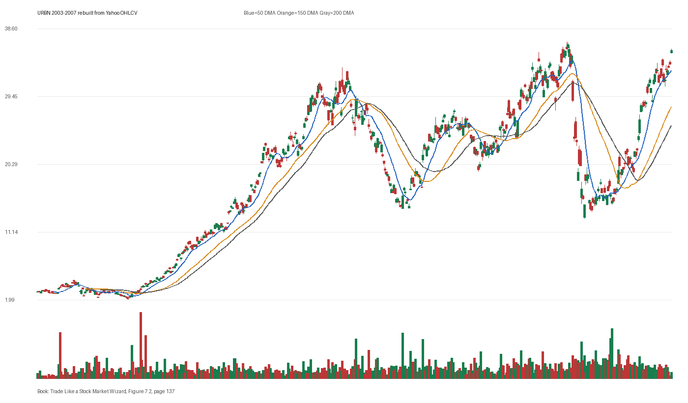

# Figure 7.2 - URBN - Page 137

## Source Image

Book: [[Trade Like a Stock Market Wizard]]

Caption: Urban Outfitter (URBN) 2003-2007 Fueled by persistent positive earnings surprises, the price of Urban Outfitter rose dramatically from 2003-2005. In contrast, from 2006-2007, a period dominated by negative surprises, the stock was essentially unchanged. Chart courtesy of Zacks Research Wizard

## Yahoo OHLCV Rebuild

Download status: `OK`

CSV: `data/book_stock_images/trade-like-a-stock-market-wizard-figure-7-2-urbn-page-137_ohlcv.csv`

## Pattern Read

Tags: vcp-or-tightening, stage-2-leadership

Concepts: [[Pivot and Entry]], [[Relative Strength Leadership]], [[Stage 2 Uptrend]], [[Trend Template]], [[Volatility Contraction Pattern]], [[Volume Dry-Up and Accumulation]]

The useful clue is contraction: the later portion of the window became tighter than the earlier portion.

## Reconciliation Metrics

| Metric | Value |
|---|---:|
| first_close | 3.0687 |
| last_close | 35.51 |
| max_gain_pct | 1151.32 |
| max_drawdown_from_period_high_pct | -67.89 |
| first_half_depth_pct | 1512.9 |
| second_half_depth_pct | 211.44 |
| tightening | True |
| volume_dryup | False |
| best_trend_template_score | 5/5 |
| latest_trend_template_score | 5/5 |

## Trend Template Checks

- close > 50 DMA
- close > 150 DMA
- close > 200 DMA
- 50 DMA > 150 DMA
- 150 DMA > 200 DMA

## Study Questions

- Does the rebuilt OHLCV chart confirm the same structure shown in the book image?
- Was the stock close to a definable pivot, or already extended?
- Did volume dry up before the move, or was supply still obvious?
- Was this a buy lesson, a sell lesson, or a failure-avoidance lesson?
- What would invalidate the setup if this were being traded live?

<!-- STAGE_LIFECYCLE_START -->
## Stage Lifecycle & Base Concept Analysis
> This section analyzes the FULL LIFECYCLE of the stock around the inferred entry — Stage 1 (Accumulation), Stage 2 (Advance), Stage 3 (Distribution), Stage 4 (Decline) — plus deep base concept analysis, VCP footprint, tight footprint, supply dynamics, and contraction timeline.
- Status: `ok`
- Entry date: `2003-07-03`
- Entry price: `4.6188`
### Stage Lifecycle Overview
| Stage | Present | Start Date | End Date | Duration | Key Signal |
|---|---|---|---:|---|---|
| Stage 1 — Accumulation | ✅ | `2002-05-28` | `2003-05-13` | 242 days | Base: cup-shaped |
| Stage 2 — Advance | ✅ | `2003-05-13` | `2005-09-19` | 593 days | Max gain: 691.9% |
| Stage 3 — Distribution | ✅ | `2005-10-25` | `2005-12-14` | 35 days | climax vol |
| Stage 4 — Decline | ✅ | `2005-12-15` | — | 636 days | Below 200 DMA: False |
### Stage 1 — Accumulation / Base Building
- Base type: `cup-shaped`
- Lowest price in base: `2.0900`
- Volume pattern: `neutral`
### Stage 2 — Advance / Trend Pivots

- Number of significant pivots during advance: `5`

| Pivot Date | Price |
|---|---:|
| `2003-07-08` | `5.0700` |
| `2003-09-02` | `6.3000` |
| `2003-10-20` | `8.5400` |
| `2003-12-02` | `10.3200` |
| `2004-02-12` | `11.3700` |

#### Trend Template Evolution During Stage 2

| % Through Stage 2 | Date | Score |
|---|---|---:|
| 0% | `2003-05-13` | 6/7 |
| 25% | `2003-12-11` | 7/7 |
| 50% | `2004-07-16` | 6/7 |
| 75% | `2005-02-15` | 7/7 |
| 100% | `2005-09-19` | 6/7 |

### Base Concept Deep-Dive

- Base type: `deep-vcp`
- Base duration: `38 sessions`
- Base depth: `27.8%`
- Base high: `4.7500`
- Base low: `3.7200`
- Resistance touches at base high: `4`
- Support touches at base low: `2`
- Contraction count: `2`
- Contraction quality: `clear-tightening`
- Pivot clarity: `near-pivot`
- Pivot distance at entry: `-2.8%`
- Volume dry-up in base: `neutral`
- Volume dry-up ratio: `0.78`
- Tightness at pivot (10d): `3.8%`
- Weekly tightness: `1.9%`

### VCP Footprint

- VCP present: `False`
- No clear VCP pattern detected in the base.

### Tight Footprint

- 10-session tightness at entry: `3.8%`
- 20-session tightness at entry: `7.9%`
- Weekly tightness: `2.7%`
- ATR20 %: `3.5`
- Tightness progression: `improving`

### Supply Analysis

- Supply label: `diminishing`
- Volume dry-up ratio: `0.7`
- Distribution volume detected: `False`
- Accumulation volume detected: `False`
- Climax volume dates: `2003-05-08, 2003-05-15, 2003-05-16`

### Contraction Timeline

| Phase | Start Date | Depth | Volume | Tightness |
|---|---|---:|---:|---:|
| C1 | `2003-05-12` | 14.7% | 2454400.0 | 12.2% |
| C2 | `2003-06-03` | 12.9% | 2426400.0 | 4.4% |

### Concept Tie-Back

- Related concepts: [[Base Concept]], [[Stage 2 Uptrend]], [[Trend Template]], [[Stage 3 Distribution]], [[Stage 4 Decline]], [[Volume Dry-Up and Accumulation]], [[Supply and Demand]], [[Volatility Contraction Pattern]]
- Lesson: Stage 1 base was cup-shaped with 122.3% depth. Stage 2 advance lasted 594 sessions with 5 significant pivots. Supply was diminishing before entry.

<!-- STAGE_LIFECYCLE_END -->
<!-- PRE_ENTRY_SENSE_CHECK_START -->

## Pre-Entry Sense Check

> This section analyzes the chart structure PRIOR to the inferred entry. It answers: What did the setup look like in the weeks and months before the trade? Which Minervini concepts were already visible?

- Status: `ok`
- Entry date: `2003-07-03`
- Pre-entry history available: `278 sessions`

### Trend Template Evolution

| Lookback | Date | Score | Assessment |
|---|---|---:|:---|
| 60 days before | 2003-04-08 | 4/7 | 🟡 Transitioning |
| 40 days before | 2003-05-07 | 5/7 | 🟡 Transitioning |
| 20 days before | 2003-06-05 | 6/7 | ✅ Stage 2 confirmed |

### Pre-Entry Context Window

- Context window (last sessions before entry): `150 sessions`
- Range high: `4.7100`
- Range low: `2.0900`
- Total range depth: `125.1%`
- Contraction phases (rolling 21-bar segments): `35.9% -> 21.6% -> 25.3% -> 38.6% -> 37.3% -> 18.1% -> 15.4%`

### Stage 2 Onset

- First sustained Stage 2 date: `2003-05-13`
- Days in Stage 2 before entry: `36`

### Volume Behavior Before Entry

- Volume dry-up label: `moderate-dry-up`
- Recent/base volume ratio: `0.7`
- Volume spike dates (2.5x avg) in last 40 days: `2003-05-07, 2003-05-08, 2003-05-15`

### Tightness Progression

| Lookback | 10-Session Close Tightness |
|---|---:|
| 40 days before | `12.4%` |
| 20 days before | `12.0%` |
| Final 10 sessions before | `3.8%` |
| Final 3 weekly closes | `2.7%` |

### Moving Average Alignment

- 50/150/200 DMA first aligned (50>150>200): `2003-06-06`

### Shakeouts / Tests Before Entry

- No shakeouts or undercut-recover patterns detected in last 40 sessions before entry.

### 52-Week High Context

| Timing | Distance from 52W High |
|---|---:|
| 60 days before | `N/A` |
| 20 days before | `-2.0%` |
| At entry | `-2.8%` |

### Concept Tie-Back

- Related concepts: [[Stage 2 Uptrend]], [[Trend Template]], [[Relative Strength Leadership]], [[Volatility Contraction Pattern]], [[Pivot and Entry]], [[Volume Dry-Up and Accumulation]]
- Lesson: Stage 2 was established 36 days before entry, confirming leadership context. Total pre-entry range was 125.1% — wide range indicating significant prior movement. Volume dried up before entry, suggesting supply absorption.

<!-- PRE_ENTRY_SENSE_CHECK_END -->
<!-- SEPA_REPLICATION_START -->

## SEPA Trade Replication

> Study note: this reconstructs a likely Minervini-style setup area from the real OHLCV window shown by the book timing. It does not claim to know Minervini's private fill, sizing, or unpublished execution.

- Status: `reconstructed-from-real-ohlcv`
- Setup type: `vcp/contraction-study`
- Confidence: `high`
- Timing source: `2003-2007` from the figure caption and rebuilt OHLCV where available.
- Inferred study entry date: `2003-07-03`
- Inferred study entry price: `4.6188`
- Inferred pivot: `4.7125`
- Inferred stop / invalidation: `4.2825`
- Pivot extension at entry: `-2.0%`
- Stop distance / risk: `7.9%`
- Trend Template score at entry: `7/7`

### Tightness And Supply
- 3-part pre-entry contraction depth: `27.1% -> 16.7% -> 11.2%`
- Contraction quality: `clear-tightening`
- 10-session close tightness: `3.8%`
- 3-week close tightness: `2.7%`
- Volume dry-up: `moderate-dry-up`
- Recent/base median volume ratio: `0.7`
- Leadership proxy: 65-day return 60.7% and 126-day return 53.4%

### Post-Entry Reality Check
- Max gain after 20 sessions: `10.6%`
- Max gain after 60 sessions: `45.8%`
- Max gain after 120 sessions: `123.5%`
- Worst drawdown after 20 sessions: `-1.4%`
- Inferred stop failed within 20 sessions: `False`
- Pivot broadly respected within 20 sessions: `True`

### Concept Tie-Back

- Related concepts: [[Risk First]], [[Volatility Contraction Pattern]], [[Volume Dry-Up and Accumulation]], [[Pivot and Entry]], [[Trend Template]], [[Stage 2 Uptrend]], [[Relative Strength Leadership]]
- Lesson: The reconstructed data suggests price was becoming more controllable before the inferred entry; volume supported the supply-dry-up idea; risk was close enough for a clean SEPA-style test; the pivot was broadly respected after entry.

<!-- SEPA_REPLICATION_END -->
