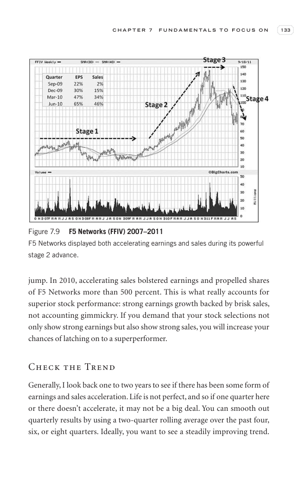
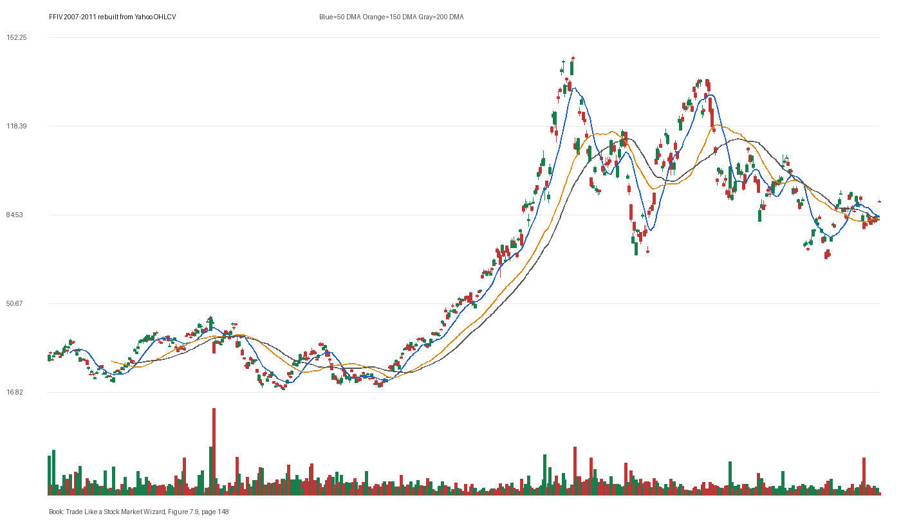

# Figure 7.9 - FFIV - Page 148

## Source Image

Book: [[Trade Like a Stock Market Wizard]]

Caption: F5 Networks (FFIV) 2007-2011 F5 Networks displayed both accelerating earnings and sales during its powerful stage 2 advance

## Yahoo OHLCV Rebuild

Download status: `OK`

CSV: `data/book_stock_images/trade-like-a-stock-market-wizard-figure-7-9-ffiv-page-148_ohlcv.csv`

## Pattern Read

Tags: volume-dry-up, stage-2-leadership

Concepts: [[Relative Strength Leadership]], [[Stage 2 Uptrend]], [[Trend Template]], [[Volume Dry-Up and Accumulation]]

Volume contraction supports the idea that supply was drying up near the tight area.

## Reconciliation Metrics

| Metric | Value |
|---|---:|
| first_close | 30.895 |
| last_close | 89.89 |
| max_gain_pct | 371.79 |
| max_drawdown_from_period_high_pct | -62.29 |
| first_half_depth_pct | 199.83 |
| second_half_depth_pct | 209.4 |
| tightening | False |
| volume_dryup | True |
| best_trend_template_score | 5/5 |
| latest_trend_template_score | 5/5 |

## Trend Template Checks

- close > 50 DMA
- close > 150 DMA
- close > 200 DMA
- 50 DMA > 150 DMA
- 150 DMA > 200 DMA

## Study Questions

- Does the rebuilt OHLCV chart confirm the same structure shown in the book image?
- Was the stock close to a definable pivot, or already extended?
- Did volume dry up before the move, or was supply still obvious?
- Was this a buy lesson, a sell lesson, or a failure-avoidance lesson?
- What would invalidate the setup if this were being traded live?

<!-- STAGE_LIFECYCLE_START -->
## Stage Lifecycle & Base Concept Analysis
> This section analyzes the FULL LIFECYCLE of the stock around the inferred entry — Stage 1 (Accumulation), Stage 2 (Advance), Stage 3 (Distribution), Stage 4 (Decline) — plus deep base concept analysis, VCP footprint, tight footprint, supply dynamics, and contraction timeline.
- Status: `ok`
- Entry date: `2009-12-31`
- Entry price: `52.9700`
### Stage Lifecycle Overview
| Stage | Present | Start Date | End Date | Duration | Key Signal |
|---|---|---|---:|---|---|
| Stage 1 — Accumulation | ✅ | `2008-06-18` | `2009-06-18` | 252 days | Base: cup-shaped |
| Stage 2 — Advance | ✅ | `2009-06-18` | `2011-01-19` | 400 days | Max gain: 327.4% |
| Stage 3 — Distribution | ✅ | `2011-01-20` | `2011-03-16` | 38 days | climax vol |
| Stage 4 — Decline | ✅ | `2011-03-17` | — | 324 days | Below 200 DMA: False |
### Stage 1 — Accumulation / Base Building
- Base type: `cup-shaped`
- Lowest price in base: `17.7500`
- Volume pattern: `neutral`
### Stage 2 — Advance / Trend Pivots

- Number of significant pivots during advance: `5`

| Pivot Date | Price |
|---|---:|
| `2009-07-23` | `38.8000` |
| `2009-10-23` | `48.7300` |
| `2009-12-10` | `53.0700` |
| `2010-01-21` | `56.1900` |
| `2010-03-17` | `64.8900` |

#### Trend Template Evolution During Stage 2

| % Through Stage 2 | Date | Score |
|---|---|---:|
| 0% | `2009-06-18` | 6/7 |
| 25% | `2009-11-09` | 7/7 |
| 50% | `2010-04-06` | 7/7 |
| 75% | `2010-08-26` | 7/7 |
| 100% | `2011-01-19` | 7/7 |

### Base Concept Deep-Dive

- Base type: `deep-chaotic`
- Base duration: `138 sessions`
- Base depth: `65.0%`
- Base high: `53.5900`
- Base low: `32.4700`
- Resistance touches at base high: `7`
- Support touches at base low: `9`
- Contraction count: `5`
- Contraction quality: `mixed-or-loose`
- Pivot clarity: `clear-pivot-at-high`
- Pivot distance at entry: `-1.2%`
- Volume dry-up in base: `strong-dry-up`
- Volume dry-up ratio: `0.5`
- Tightness at pivot (10d): `6.0%`
- Weekly tightness: `6.0%`

### VCP Footprint

- VCP present: `True`
- VCP quality: `mixed`
- Total contraction depth: `23.2%`
- Final contraction depth: `15.1%`
- Number of contractions: `5`

| Phase | Date | Depth | Volume | Tightness |
|---|---|---:|---:|---:|
| C? | `2009-06-17` | 19.5% | 1721600.0 | 9.8% |
| C? | `2009-07-27` | 15.4% | 1374200.0 | 4.7% |
| C? | `2009-09-02` | 23.2% | 1169000.0 | 7.3% |
| C? | `2009-10-12` | 23.2% | 1489800.0 | 10.0% |
| C? | `2009-11-18` | 15.1% | 1146600.0 | 5.3% |

### Tight Footprint

- 10-session tightness at entry: `6.0%`
- 20-session tightness at entry: `7.7%`
- Weekly tightness: `6.0%`
- ATR20 %: `2.41`
- Tightness progression: `stable`

### Supply Analysis

- Supply label: `exhausted`
- Volume dry-up ratio: `0.51`
- Distribution volume detected: `False`
- Accumulation volume detected: `True`

### Contraction Timeline

| Phase | Start Date | Depth | Volume | Tightness |
|---|---|---:|---:|---:|
| C1 | `2009-06-17` | 19.5% | 1721600.0 | 9.8% |
| C2 | `2009-07-27` | 15.4% | 1374200.0 | 4.7% |
| C3 | `2009-09-02` | 23.2% | 1169000.0 | 7.3% |
| C4 | `2009-10-12` | 23.2% | 1489800.0 | 10.0% |
| C5 | `2009-11-18` | 15.1% | 1146600.0 | 5.3% |

### Concept Tie-Back

- Related concepts: [[Base Concept]], [[Stage 2 Uptrend]], [[Trend Template]], [[Stage 3 Distribution]], [[Stage 4 Decline]], [[Volatility Contraction Pattern]], [[Pivot and Entry]], [[Volume Dry-Up and Accumulation]], [[Supply and Demand]]
- Lesson: Stage 1 base was cup-shaped with 104.4% depth. Stage 2 advance lasted 401 sessions with 5 significant pivots. VCP footprint shows 5 contractions with mixed quality. Supply was exhausted before entry with strong volume dry-up.

<!-- STAGE_LIFECYCLE_END -->
<!-- PRE_ENTRY_SENSE_CHECK_START -->

## Pre-Entry Sense Check

> This section analyzes the chart structure PRIOR to the inferred entry. It answers: What did the setup look like in the weeks and months before the trade? Which Minervini concepts were already visible?

- Status: `ok`
- Entry date: `2009-12-31`
- Pre-entry history available: `906 sessions`

### Trend Template Evolution

| Lookback | Date | Score | Assessment |
|---|---|---:|:---|
| 60 days before | 2009-10-06 | 7/7 | ✅ Stage 2 confirmed |
| 40 days before | 2009-11-03 | 7/7 | ✅ Stage 2 confirmed |
| 20 days before | 2009-12-02 | 7/7 | ✅ Stage 2 confirmed |

### Pre-Entry Context Window

- Context window (last sessions before entry): `150 sessions`
- Range high: `53.0700`
- Range low: `30.8000`
- Total range depth: `72.3%`
- Contraction phases (rolling 21-bar segments): `17.8% -> 19.5% -> 14.5% -> 19.4% -> 30.2% -> 16.3% -> 13.7%`

### Stage 2 Onset

- First sustained Stage 2 date: `2007-04-12`
- Days in Stage 2 before entry: `687`

### Volume Behavior Before Entry

- Volume dry-up label: `strong-dry-up`
- Recent/base volume ratio: `0.51`
- No significant volume spikes in last 40 days before entry.

### Tightness Progression

| Lookback | 10-Session Close Tightness |
|---|---:|
| 40 days before | `16.1%` |
| 20 days before | `6.1%` |
| Final 10 sessions before | `6.0%` |
| Final 3 weekly closes | `6.0%` |

### Moving Average Alignment

- 50/150/200 DMA first aligned (50>150>200): `2007-03-15`

### Shakeouts / Tests Before Entry

- No shakeouts or undercut-recover patterns detected in last 40 sessions before entry.

### 52-Week High Context

| Timing | Distance from 52W High |
|---|---:|
| 60 days before | `-0.4%` |
| 20 days before | `-2.8%` |
| At entry | `-1.2%` |

### Concept Tie-Back

- Related concepts: [[Stage 2 Uptrend]], [[Trend Template]], [[Relative Strength Leadership]], [[Volatility Contraction Pattern]], [[Pivot and Entry]], [[Volume Dry-Up and Accumulation]]
- Lesson: Stage 2 was established 687 days before entry, confirming leadership context. Total pre-entry range was 72.3% — wide range indicating significant prior movement. Volume dried up before entry, suggesting supply absorption.

<!-- PRE_ENTRY_SENSE_CHECK_END -->
<!-- SEPA_REPLICATION_START -->

## SEPA Trade Replication

> Study note: this reconstructs a likely Minervini-style setup area from the real OHLCV window shown by the book timing. It does not claim to know Minervini's private fill, sizing, or unpublished execution.

- Status: `reconstructed-from-real-ohlcv`
- Setup type: `vcp/contraction-study`
- Confidence: `high`
- Timing source: `2007-2011` from the figure caption and rebuilt OHLCV where available.
- Inferred study entry date: `2009-12-31`
- Inferred study entry price: `52.9700`
- Inferred pivot: `53.0700`
- Inferred stop / invalidation: `49.2200`
- Pivot extension at entry: `-0.2%`
- Stop distance / risk: `7.6%`
- Trend Template score at entry: `7/7`

### Tightness And Supply
- 3-part pre-entry contraction depth: `29.2% -> 16.3% -> 12.0%`
- Contraction quality: `clear-tightening`
- 10-session close tightness: `6.0%`
- 3-week close tightness: `6.0%`
- Volume dry-up: `strong-dry-up`
- Recent/base median volume ratio: `0.51`
- Leadership proxy: 65-day return 37.6% and 126-day return 56.3%

### Post-Entry Reality Check
- Max gain after 20 sessions: `6.1%`
- Max gain after 60 sessions: `22.9%`
- Max gain after 120 sessions: `45.6%`
- Worst drawdown after 20 sessions: `-7.0%`
- Inferred stop failed within 20 sessions: `False`
- Pivot broadly respected within 20 sessions: `False`

### Concept Tie-Back

- Related concepts: [[Risk First]], [[Volatility Contraction Pattern]], [[Volume Dry-Up and Accumulation]], [[Pivot and Entry]], [[Trend Template]], [[Stage 2 Uptrend]], [[Relative Strength Leadership]]
- Lesson: The reconstructed data suggests price was becoming more controllable before the inferred entry; volume supported the supply-dry-up idea; risk was close enough for a clean SEPA-style test.

<!-- SEPA_REPLICATION_END -->
