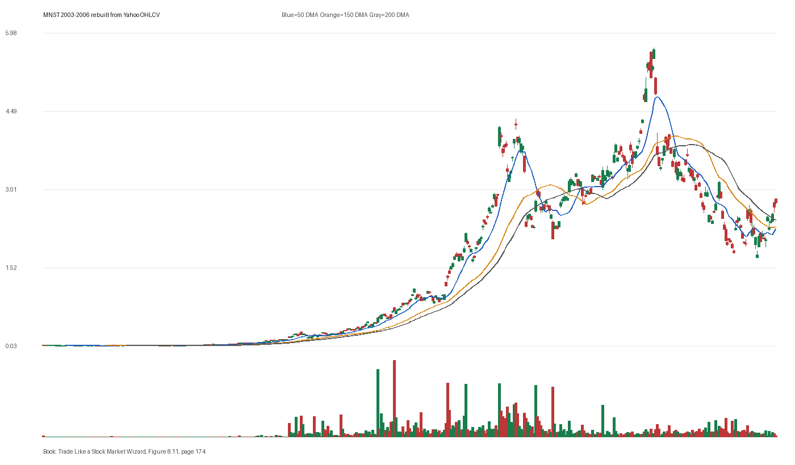

# Figure 8.11 - MNST - Page 174

## Source Image

Book: [[Trade Like a Stock Market Wizard]]

Caption: Monster Beverage (MNST) 2003-2006 Monster Beverage (MNST) (previously Hansen Natural Beverage) displayed classic Code 33 annual acceleration. From 2003 to 2005, earnings, sales, and margins accelerated dramatically, creating the condition necessary for superperformance

## Yahoo OHLCV Rebuild

Download status: `OK`

CSV: `data/book_stock_images/trade-like-a-stock-market-wizard-figure-8-11-mnst-page-174_ohlcv.csv`

## Pattern Read

Tags: vcp-or-tightening, stage-2-leadership

Concepts: [[Pivot and Entry]], [[Relative Strength Leadership]], [[Stage 2 Uptrend]], [[Trend Template]], [[Volatility Contraction Pattern]], [[Volume Dry-Up and Accumulation]]

The useful clue is contraction: the later portion of the window became tighter than the earlier portion.

## Reconciliation Metrics

| Metric | Value |
|---|---:|
| first_close | 0.0427 |
| last_close | 2.8625 |
| max_gain_pct | 13246.45 |
| max_drawdown_from_period_high_pct | -70.0 |
| first_half_depth_pct | 2846.33 |
| second_half_depth_pct | 591.43 |
| tightening | True |
| volume_dryup | False |
| best_trend_template_score | 5/5 |
| latest_trend_template_score | 3/5 |

## Trend Template Checks

- close > 50 DMA
- close > 150 DMA
- close > 200 DMA

## Study Questions

- Does the rebuilt OHLCV chart confirm the same structure shown in the book image?
- Was the stock close to a definable pivot, or already extended?
- Did volume dry up before the move, or was supply still obvious?
- Was this a buy lesson, a sell lesson, or a failure-avoidance lesson?
- What would invalidate the setup if this were being traded live?

<!-- STAGE_LIFECYCLE_START -->
## Stage Lifecycle & Base Concept Analysis
> This section analyzes the FULL LIFECYCLE of the stock around the inferred entry — Stage 1 (Accumulation), Stage 2 (Advance), Stage 3 (Distribution), Stage 4 (Decline) — plus deep base concept analysis, VCP footprint, tight footprint, supply dynamics, and contraction timeline.
- Status: `ok`
- Entry date: `2005-06-07`
- Entry price: `0.8382`
### Stage Lifecycle Overview
| Stage | Present | Start Date | End Date | Duration | Key Signal |
|---|---|---|---:|---|---|
| Stage 1 — Accumulation | ✅ | `2003-08-20` | `2004-08-20` | 252 days | Base: deep-chaotic |
| Stage 2 — Advance | ✅ | `2004-08-20` | `2005-09-21` | 274 days | Max gain: 388.5% |
| Stage 3 — Distribution | ✅ | `2005-10-04` | `2006-08-04` | 210 days | climax vol |
| Stage 4 — Decline | ✅ | `2006-08-07` | — | 225 days | Below 200 DMA: False |
### Stage 1 — Accumulation / Base Building
- Base type: `deep-chaotic`
- Lowest price in base: `0.0600`
- Volume pattern: `late-supply`
### Stage 2 — Advance / Trend Pivots

- Number of significant pivots during advance: `5`

| Pivot Date | Price |
|---|---:|
| `2004-10-04` | `0.2800` |
| `2004-12-03` | `0.3700` |
| `2005-01-03` | `0.3900` |
| `2005-02-07` | `0.4900` |
| `2005-04-01` | `0.6400` |

#### Trend Template Evolution During Stage 2

| % Through Stage 2 | Date | Score |
|---|---|---:|
| 0% | `2004-08-20` | 7/7 |
| 25% | `2004-11-26` | 7/7 |
| 50% | `2005-03-08` | 7/7 |
| 75% | `2005-06-14` | 7/7 |
| 100% | `2005-09-21` | 6/7 |

### Base Concept Deep-Dive

- Base type: `deep-chaotic`
- Base duration: `202 sessions`
- Base depth: `290.7%`
- Base high: `0.8400`
- Base low: `0.2200`
- Resistance touches at base high: `1`
- Support touches at base low: `2`
- Contraction count: `5`
- Contraction quality: `mixed-or-loose`
- Pivot clarity: `clear-pivot-at-high`
- Pivot distance at entry: `-0.3%`
- Volume dry-up in base: `moderate-dry-up`
- Volume dry-up ratio: `0.7`
- Tightness at pivot (10d): `16.4%`
- Weekly tightness: `13.2%`

### VCP Footprint

- VCP present: `True`
- VCP quality: `widening-risk`
- Total contraction depth: `66.0%`
- Final contraction depth: `46.9%`
- Number of contractions: `5`

| Phase | Date | Depth | Volume | Tightness |
|---|---|---:|---:|---:|
| C? | `2004-08-19` | 46.6% | 15595200.0 | 12.5% |
| C? | `2004-10-15` | 55.8% | 13070400.0 | 8.4% |
| C? | `2004-12-13` | 54.3% | 15964800.0 | 24.1% |
| C? | `2005-02-09` | 66.0% | 31766400.0 | 8.3% |
| C? | `2005-04-08` | 46.9% | 47452800.0 | 8.9% |

### Tight Footprint

- 10-session tightness at entry: `13.4%`
- 20-session tightness at entry: `25.8%`
- Weekly tightness: `10.2%`
- ATR20 %: `4.23`
- Tightness progression: `improving`

### Supply Analysis

- Supply label: `diminishing`
- Volume dry-up ratio: `0.7`
- Distribution volume detected: `False`
- Accumulation volume detected: `False`
- Climax volume dates: `2005-04-11, 2005-04-12, 2005-04-13`

### Contraction Timeline

| Phase | Start Date | Depth | Volume | Tightness |
|---|---|---:|---:|---:|
| C1 | `2004-08-19` | 46.6% | 15595200.0 | 12.5% |
| C2 | `2004-10-15` | 55.8% | 13070400.0 | 8.4% |
| C3 | `2004-12-13` | 54.3% | 15964800.0 | 24.1% |
| C4 | `2005-02-09` | 66.0% | 31766400.0 | 8.3% |
| C5 | `2005-04-08` | 46.9% | 47452800.0 | 8.9% |

### Concept Tie-Back

- Related concepts: [[Base Concept]], [[Stage 2 Uptrend]], [[Trend Template]], [[Stage 3 Distribution]], [[Stage 4 Decline]], [[Volatility Contraction Pattern]], [[Pivot and Entry]], [[Volume Dry-Up and Accumulation]], [[Supply and Demand]]
- Lesson: Stage 1 base was deep-chaotic with 439.9% depth. Stage 2 advance lasted 275 sessions with 5 significant pivots. VCP footprint shows 5 contractions with widening-risk quality. Supply was diminishing before entry.

<!-- STAGE_LIFECYCLE_END -->
<!-- PRE_ENTRY_SENSE_CHECK_START -->

## Pre-Entry Sense Check

> This section analyzes the chart structure PRIOR to the inferred entry. It answers: What did the setup look like in the weeks and months before the trade? Which Minervini concepts were already visible?

- Status: `ok`
- Entry date: `2005-06-07`
- Pre-entry history available: `763 sessions`

### Trend Template Evolution

| Lookback | Date | Score | Assessment |
|---|---|---:|:---|
| 60 days before | 2005-03-11 | 7/7 | ✅ Stage 2 confirmed |
| 40 days before | 2005-04-11 | 7/7 | ✅ Stage 2 confirmed |
| 20 days before | 2005-05-09 | 7/7 | ✅ Stage 2 confirmed |

### Pre-Entry Context Window

- Context window (last sessions before entry): `150 sessions`
- Range high: `0.8200`
- Range low: `0.2600`
- Total range depth: `214.5%`
- Contraction phases (rolling 21-bar segments): `39.3% -> 18.6% -> 30.5% -> 27.4% -> 52.4% -> 21.3% -> 26.1%`

### Stage 2 Onset

- First sustained Stage 2 date: `2003-05-12`
- Days in Stage 2 before entry: `522`

### Volume Behavior Before Entry

- Volume dry-up label: `moderate-dry-up`
- Recent/base volume ratio: `0.7`
- Volume spike dates (2.5x avg) in last 40 days: `2005-05-03, 2005-05-10, 2005-05-11`

### Tightness Progression

| Lookback | 10-Session Close Tightness |
|---|---:|
| 40 days before | `8.3%` |
| 20 days before | `19.9%` |
| Final 10 sessions before | `13.4%` |
| Final 3 weekly closes | `10.2%` |

### Moving Average Alignment

- 50/150/200 DMA first aligned (50>150>200): `2003-08-04`

### Shakeouts / Tests Before Entry

- `2005-04-21` — undercut-and-recover of SMA50 (low 0.56, close 0.58)

### 52-Week High Context

| Timing | Distance from 52W High |
|---|---:|
| 60 days before | `-8.9%` |
| 20 days before | `-0.7%` |
| At entry | `-0.3%` |

### Concept Tie-Back

- Related concepts: [[Stage 2 Uptrend]], [[Trend Template]], [[Relative Strength Leadership]], [[Volatility Contraction Pattern]], [[Pivot and Entry]], [[Volume Dry-Up and Accumulation]]
- Lesson: Stage 2 was established 522 days before entry, confirming leadership context. Total pre-entry range was 214.5% — wide range indicating significant prior movement. Volume dried up before entry, suggesting supply absorption. Found 1 shakeout(s) before entry — test of conviction.

<!-- PRE_ENTRY_SENSE_CHECK_END -->
<!-- SEPA_REPLICATION_START -->

## SEPA Trade Replication

> Study note: this reconstructs a likely Minervini-style setup area from the real OHLCV window shown by the book timing. It does not claim to know Minervini's private fill, sizing, or unpublished execution.

- Status: `reconstructed-from-real-ohlcv`
- Setup type: `vcp/contraction-study`
- Confidence: `high`
- Timing source: `2003-2006` from the figure caption and rebuilt OHLCV where available.
- Inferred study entry date: `2005-06-07`
- Inferred study entry price: `0.8382`
- Inferred pivot: `0.8203`
- Inferred stop / invalidation: `0.6474`
- Pivot extension at entry: `2.2%`
- Stop distance / risk: `29.5%`
- Trend Template score at entry: `7/7`

### Tightness And Supply
- 3-part pre-entry contraction depth: `53.1% -> 30.1% -> 28.4%`
- Contraction quality: `clear-tightening`
- 10-session close tightness: `13.4%`
- 3-week close tightness: `10.2%`
- Volume dry-up: `moderate-dry-up`
- Recent/base median volume ratio: `0.7`
- Leadership proxy: 65-day return 73.0% and 126-day return 128.4%

### Post-Entry Reality Check
- Max gain after 20 sessions: `11.7%`
- Max gain after 60 sessions: `34.2%`
- Max gain after 120 sessions: `86.4%`
- Worst drawdown after 20 sessions: `-5.5%`
- Inferred stop failed within 20 sessions: `False`
- Pivot broadly respected within 20 sessions: `True`

### Concept Tie-Back

- Related concepts: [[Risk First]], [[Volatility Contraction Pattern]], [[Volume Dry-Up and Accumulation]], [[Pivot and Entry]], [[Trend Template]], [[Stage 2 Uptrend]], [[Relative Strength Leadership]]
- Lesson: The reconstructed data suggests price was becoming more controllable before the inferred entry; volume supported the supply-dry-up idea; risk was wide, so the entry would need smaller size or a better cheat point; the pivot was broadly respected after entry.

<!-- SEPA_REPLICATION_END -->
