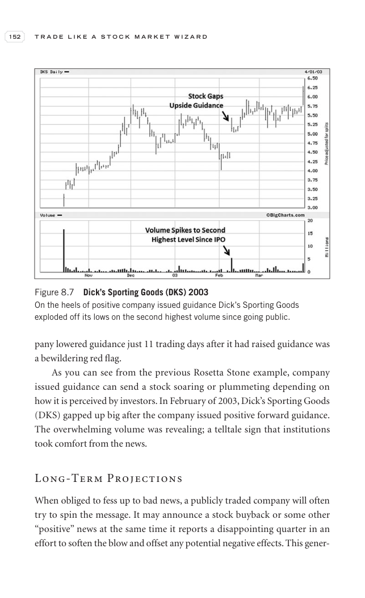
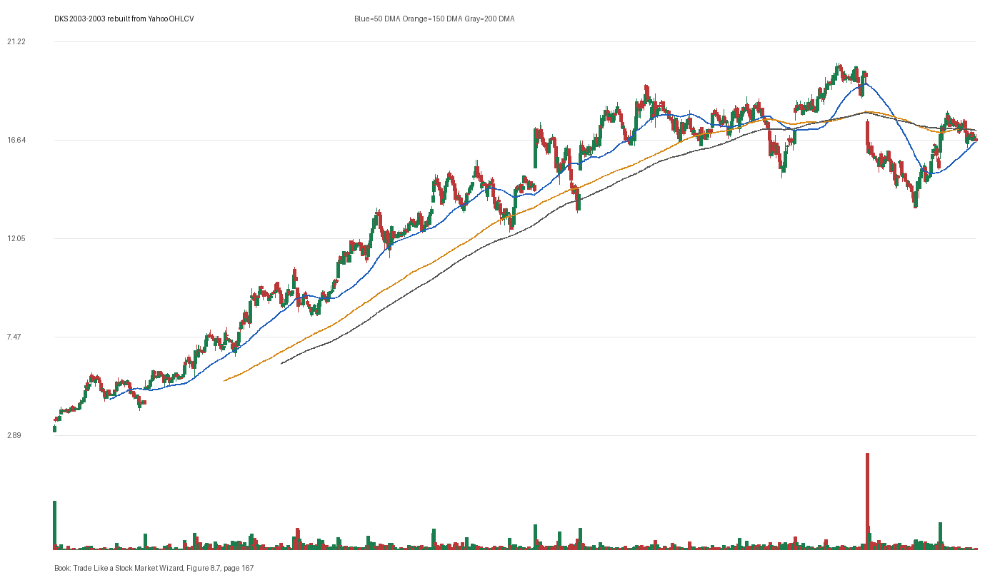

# Figure 8.7 - DKS - Page 167

## Source Image

Book: [[Trade Like a Stock Market Wizard]]

Caption: Dick’s Sporting Goods (DKS) 2003 On the heels of positive company issued guidance Dick’s Sporting Goods exploded off its lows on the second highest volume since going public

## Yahoo OHLCV Rebuild

Download status: `OK`

CSV: `data/book_stock_images/trade-like-a-stock-market-wizard-figure-8-7-dks-page-167_ohlcv.csv`

## Pattern Read

Tags: vcp-or-tightening, stage-2-leadership

Concepts: [[Pivot and Entry]], [[Relative Strength Leadership]], [[Stage 2 Uptrend]], [[Trend Template]], [[Volatility Contraction Pattern]], [[Volume Dry-Up and Accumulation]]

The useful clue is contraction: the later portion of the window became tighter than the earlier portion.

## Reconciliation Metrics

| Metric | Value |
|---|---:|
| first_close | 3.29 |
| last_close | 16.62 |
| max_gain_pct | 514.29 |
| max_drawdown_from_period_high_pct | -33.33 |
| first_half_depth_pct | 416.61 |
| second_half_depth_pct | 52.82 |
| tightening | True |
| volume_dryup | False |
| best_trend_template_score | 5/5 |
| latest_trend_template_score | 1/5 |

## Trend Template Checks

- close > 50 DMA

## Study Questions

- Does the rebuilt OHLCV chart confirm the same structure shown in the book image?
- Was the stock close to a definable pivot, or already extended?
- Did volume dry up before the move, or was supply still obvious?
- Was this a buy lesson, a sell lesson, or a failure-avoidance lesson?
- What would invalidate the setup if this were being traded live?

<!-- STAGE_LIFECYCLE_START -->
## Stage Lifecycle & Base Concept Analysis
> This section analyzes the FULL LIFECYCLE of the stock around the inferred entry — Stage 1 (Accumulation), Stage 2 (Advance), Stage 3 (Distribution), Stage 4 (Decline) — plus deep base concept analysis, VCP footprint, tight footprint, supply dynamics, and contraction timeline.
- Status: `ok`
- Entry date: `2003-11-20`
- Entry price: `11.9375`
### Stage Lifecycle Overview
| Stage | Present | Start Date | End Date | Duration | Key Signal |
|---|---|---|---:|---|---|
| Stage 1 — Accumulation | ✅ | `2002-10-16` | `2003-08-29` | 219 days | Base: deep-chaotic |
| Stage 2 — Advance | ✅ | `2003-08-29` | `2004-05-07` | 173 days | Max gain: 66.1% |
| Stage 3 — Distribution | ❌ | — | — | — | Not detected |
| Stage 4 — Decline | ❌ | — | — | — | Not detected |
### Stage 1 — Accumulation / Base Building
- Base type: `deep-chaotic`
- Lowest price in base: `3.0400`
- Volume pattern: `late-supply`
### Stage 2 — Advance / Trend Pivots

- Number of significant pivots during advance: `3`

| Pivot Date | Price |
|---|---:|
| `2003-10-28` | `11.9300` |
| `2003-12-01` | `13.4500` |
| `2004-02-13` | `15.0100` |

#### Trend Template Evolution During Stage 2

| % Through Stage 2 | Date | Score |
|---|---|---:|
| 0% | `2003-08-29` | 7/7 |
| 25% | `2003-10-30` | 7/7 |
| 50% | `2004-01-02` | 7/7 |
| 75% | `2004-03-05` | 7/7 |
| 100% | `2004-05-07` | 6/7 |

### Base Concept Deep-Dive

- Base type: `deep-chaotic`
- Base duration: `60 sessions`
- Base depth: `44.7%`
- Base high: `12.1800`
- Base low: `8.4100`
- Resistance touches at base high: `3`
- Support touches at base low: `5`
- Contraction count: `3`
- Contraction quality: `mixed-or-loose`
- Pivot clarity: `clear-pivot-at-high`
- Pivot distance at entry: `-2.0%`
- Volume dry-up in base: `neutral`
- Volume dry-up ratio: `0.76`
- Tightness at pivot (10d): `7.9%`
- Weekly tightness: `5.7%`

### VCP Footprint

- VCP present: `False`
- No clear VCP pattern detected in the base.

### Tight Footprint

- 10-session tightness at entry: `7.1%`
- 20-session tightness at entry: `8.7%`
- Weekly tightness: `4.4%`
- ATR20 %: `3.08`
- Tightness progression: `improving`

### Supply Analysis

- Supply label: `diminishing`
- Volume dry-up ratio: `0.71`
- Distribution volume detected: `False`
- Accumulation volume detected: `False`
- Climax volume dates: `2003-10-13, 2003-10-14, 2003-11-18`

### Contraction Timeline

| Phase | Start Date | Depth | Volume | Tightness |
|---|---|---:|---:|---:|
| C1 | `2003-08-28` | 13.7% | 1622800.0 | 5.2% |
| C2 | `2003-09-19` | 14.7% | 1420800.0 | 10.8% |
| C3 | `2003-10-10` | 20.0% | 1012000.0 | 9.3% |

### Concept Tie-Back

- Related concepts: [[Base Concept]], [[Stage 2 Uptrend]], [[Trend Template]], [[Volume Dry-Up and Accumulation]], [[Supply and Demand]]
- Lesson: Stage 1 base was deep-chaotic with 252.1% depth. Stage 2 advance lasted 174 sessions with 3 significant pivots. Supply was diminishing before entry.

<!-- STAGE_LIFECYCLE_END -->
<!-- PRE_ENTRY_SENSE_CHECK_START -->

## Pre-Entry Sense Check

> This section analyzes the chart structure PRIOR to the inferred entry. It answers: What did the setup look like in the weeks and months before the trade? Which Minervini concepts were already visible?

- Status: `ok`
- Entry date: `2003-11-20`
- Pre-entry history available: `277 sessions`

### Trend Template Evolution

| Lookback | Date | Score | Assessment |
|---|---|---:|:---|
| 60 days before | 2003-08-27 | 5/7 | 🟡 Transitioning |
| 40 days before | 2003-09-25 | 7/7 | ✅ Stage 2 confirmed |
| 20 days before | 2003-10-23 | 7/7 | ✅ Stage 2 confirmed |

### Pre-Entry Context Window

- Context window (last sessions before entry): `150 sessions`
- Range high: `12.0000`
- Range low: `6.5700`
- Total range depth: `82.6%`
- Contraction phases (rolling 21-bar segments): `16.9% -> 32.6% -> 24.8% -> 17.9% -> 27.2% -> 32.6% -> 10.6%`

### Stage 2 Onset

- First sustained Stage 2 date: `2003-08-04`
- Days in Stage 2 before entry: `77`

### Volume Behavior Before Entry

- Volume dry-up label: `moderate-dry-up`
- Recent/base volume ratio: `0.71`
- Volume spike dates (2.5x avg) in last 40 days: `2003-10-13, 2003-10-14, 2003-11-18`

### Tightness Progression

| Lookback | 10-Session Close Tightness |
|---|---:|
| 40 days before | `10.7%` |
| 20 days before | `13.6%` |
| Final 10 sessions before | `7.1%` |
| Final 3 weekly closes | `4.4%` |

### Moving Average Alignment

- 50/150/200 DMA first aligned (50>150>200): `2003-08-04`

### Shakeouts / Tests Before Entry

- No shakeouts or undercut-recover patterns detected in last 40 sessions before entry.

### 52-Week High Context

| Timing | Distance from 52W High |
|---|---:|
| 60 days before | `N/A` |
| 20 days before | `-0.3%` |
| At entry | `-2.0%` |

### Concept Tie-Back

- Related concepts: [[Stage 2 Uptrend]], [[Trend Template]], [[Relative Strength Leadership]], [[Volatility Contraction Pattern]], [[Pivot and Entry]], [[Volume Dry-Up and Accumulation]]
- Lesson: Stage 2 was established 77 days before entry, confirming leadership context. Total pre-entry range was 82.6% — wide range indicating significant prior movement. Volume dried up before entry, suggesting supply absorption.

<!-- PRE_ENTRY_SENSE_CHECK_END -->
<!-- SEPA_REPLICATION_START -->

## SEPA Trade Replication

> Study note: this reconstructs a likely Minervini-style setup area from the real OHLCV window shown by the book timing. It does not claim to know Minervini's private fill, sizing, or unpublished execution.

- Status: `reconstructed-from-real-ohlcv`
- Setup type: `vcp/contraction-study`
- Confidence: `high`
- Timing source: `2003-2003` from the figure caption and rebuilt OHLCV where available.
- Inferred study entry date: `2003-11-20`
- Inferred study entry price: `11.9375`
- Inferred pivot: `12.0000`
- Inferred stop / invalidation: `10.9125`
- Pivot extension at entry: `-0.5%`
- Stop distance / risk: `9.4%`
- Trend Template score at entry: `7/7`

### Tightness And Supply
- 3-part pre-entry contraction depth: `13.7% -> 27.2% -> 10.0%`
- Contraction quality: `constructive-tightening`
- 10-session close tightness: `7.1%`
- 3-week close tightness: `4.4%`
- Volume dry-up: `moderate-dry-up`
- Recent/base median volume ratio: `0.71`
- Leadership proxy: 65-day return 17.9% and 126-day return 58.1%

### Post-Entry Reality Check
- Max gain after 20 sessions: `12.7%`
- Max gain after 60 sessions: `25.8%`
- Max gain after 120 sessions: `31.6%`
- Worst drawdown after 20 sessions: `-6.8%`
- Inferred stop failed within 20 sessions: `False`
- Pivot broadly respected within 20 sessions: `False`

### Concept Tie-Back

- Related concepts: [[Risk First]], [[Volatility Contraction Pattern]], [[Volume Dry-Up and Accumulation]], [[Pivot and Entry]], [[Trend Template]], [[Stage 2 Uptrend]], [[Relative Strength Leadership]]
- Lesson: The reconstructed data suggests price was becoming more controllable before the inferred entry; volume supported the supply-dry-up idea; risk was acceptable but not ideal.

<!-- SEPA_REPLICATION_END -->
