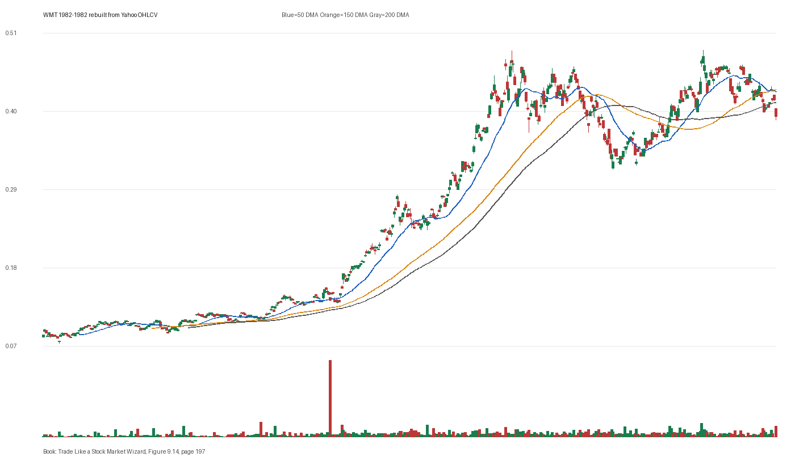

# Figure 9.14 - WMT - Page 197

## Source Image

Book: [[Trade Like a Stock Market Wizard]]

Caption: Wal-Mart (WMT) vs. the Dow Jones Industrial Average, 1982 Walmart gave investors two spots to buy before the 1982 market bottom. It rose 360 percent in 21 months

## Yahoo OHLCV Rebuild

Download status: `OK`

CSV: `data/book_stock_images/trade-like-a-stock-market-wizard-figure-9-14-wmt-page-197_ohlcv.csv`

## Pattern Read

Tags: vcp-or-tightening, stage-2-leadership

Concepts: [[Pivot and Entry]], [[Relative Strength Leadership]], [[Stage 2 Uptrend]], [[Trend Template]], [[Volatility Contraction Pattern]], [[Volume Dry-Up and Accumulation]]

The useful clue is contraction: the later portion of the window became tighter than the earlier portion.

## Reconciliation Metrics

| Metric | Value |
|---|---:|
| first_close | 0.0824 |
| last_close | 0.3932 |
| max_gain_pct | 494.46 |
| max_drawdown_from_period_high_pct | -35.12 |
| first_half_depth_pct | 300.0 |
| second_half_depth_pct | 114.86 |
| tightening | True |
| volume_dryup | False |
| best_trend_template_score | 5/5 |
| latest_trend_template_score | 1/5 |

## Trend Template Checks

- 150 DMA > 200 DMA

## Study Questions

- Does the rebuilt OHLCV chart confirm the same structure shown in the book image?
- Was the stock close to a definable pivot, or already extended?
- Did volume dry up before the move, or was supply still obvious?
- Was this a buy lesson, a sell lesson, or a failure-avoidance lesson?
- What would invalidate the setup if this were being traded live?

<!-- STAGE_LIFECYCLE_START -->
## Stage Lifecycle & Base Concept Analysis
> This section analyzes the FULL LIFECYCLE of the stock around the inferred entry — Stage 1 (Accumulation), Stage 2 (Advance), Stage 3 (Distribution), Stage 4 (Decline) — plus deep base concept analysis, VCP footprint, tight footprint, supply dynamics, and contraction timeline.
- Status: `ok`
- Entry date: `1982-11-02`
- Entry price: `0.2109`
### Stage Lifecycle Overview
| Stage | Present | Start Date | End Date | Duration | Key Signal |
|---|---|---|---:|---|---|
| Stage 1 — Accumulation | ✅ | `1981-05-26` | `1982-03-19` | 207 days | Base: deep-chaotic |
| Stage 2 — Advance | ✅ | `1982-03-19` | `1983-06-29` | 324 days | Max gain: 319.4% |
| Stage 3 — Distribution | ❌ | — | — | — | Not detected |
| Stage 4 — Decline | ❌ | — | — | — | Not detected |
### Stage 1 — Accumulation / Base Building
- Base type: `deep-chaotic`
- Lowest price in base: `0.0900`
- Volume pattern: `neutral`
### Stage 2 — Advance / Trend Pivots

- Number of significant pivots during advance: `5`

| Pivot Date | Price |
|---|---:|
| `1982-04-26` | `0.1400` |
| `1982-06-03` | `0.1300` |
| `1982-06-28` | `0.1400` |
| `1982-07-19` | `0.1500` |
| `1982-09-03` | `0.1800` |

#### Trend Template Evolution During Stage 2

| % Through Stage 2 | Date | Score |
|---|---|---:|
| 0% | `1982-03-19` | 6/7 |
| 25% | `1982-07-15` | 7/7 |
| 50% | `1982-11-08` | 7/7 |
| 75% | `1983-03-04` | 7/7 |
| 100% | `1983-06-29` | 7/7 |

### Base Concept Deep-Dive

- Base type: `deep-chaotic`
- Base duration: `160 sessions`
- Base depth: `101.2%`
- Base high: `0.2100`
- Base low: `0.1100`
- Resistance touches at base high: `5`
- Support touches at base low: `3`
- Contraction count: `4`
- Contraction quality: `mixed-or-loose`
- Pivot clarity: `clear-pivot-at-high`
- Pivot distance at entry: `-1.2%`
- Volume dry-up in base: `neutral`
- Volume dry-up ratio: `0.91`
- Tightness at pivot (10d): `5.2%`
- Weekly tightness: `3.2%`

### VCP Footprint

- VCP present: `False`
- No clear VCP pattern detected in the base.

### Tight Footprint

- 10-session tightness at entry: `4.2%`
- 20-session tightness at entry: `7.0%`
- Weekly tightness: `2.2%`
- ATR20 %: `2.93`
- Tightness progression: `improving`

### Supply Analysis

- Supply label: `diminishing`
- Volume dry-up ratio: `0.75`
- Distribution volume detected: `False`
- Accumulation volume detected: `True`
- Climax volume dates: `1982-09-10, 1982-09-30, 1982-10-04`

### Contraction Timeline

| Phase | Start Date | Depth | Volume | Tightness |
|---|---|---:|---:|---:|
| C1 | `1982-03-18` | 31.3% | 11846400.0 | 6.8% |
| C2 | `1982-05-04` | 10.7% | 5222400.0 | 3.9% |
| C3 | `1982-06-18` | 19.0% | 12739200.0 | 11.3% |
| C4 | `1982-08-04` | 42.9% | 17481600.0 | 6.9% |

### Concept Tie-Back

- Related concepts: [[Base Concept]], [[Stage 2 Uptrend]], [[Trend Template]], [[Volume Dry-Up and Accumulation]], [[Supply and Demand]]
- Lesson: Stage 1 base was deep-chaotic with 35.4% depth. Stage 2 advance lasted 325 sessions with 5 significant pivots. Supply was diminishing before entry.

<!-- STAGE_LIFECYCLE_END -->
<!-- PRE_ENTRY_SENSE_CHECK_START -->

## Pre-Entry Sense Check

> This section analyzes the chart structure PRIOR to the inferred entry. It answers: What did the setup look like in the weeks and months before the trade? Which Minervini concepts were already visible?

- Status: `ok`
- Entry date: `1982-11-02`
- Pre-entry history available: `365 sessions`

### Trend Template Evolution

| Lookback | Date | Score | Assessment |
|---|---|---:|:---|
| 60 days before | 1982-08-09 | 6/7 | ✅ Stage 2 confirmed |
| 40 days before | 1982-09-07 | 7/7 | ✅ Stage 2 confirmed |
| 20 days before | 1982-10-05 | 7/7 | ✅ Stage 2 confirmed |

### Pre-Entry Context Window

- Context window (last sessions before entry): `150 sessions`
- Range high: `0.2100`
- Range low: `0.1200`
- Total range depth: `82.1%`
- Contraction phases (rolling 21-bar segments): `19.6% -> 10.7% -> 12.5% -> 18.7% -> 33.7% -> 22.3% -> 15.2%`

### Stage 2 Onset

- First sustained Stage 2 date: `1982-03-19`
- Days in Stage 2 before entry: `158`

### Volume Behavior Before Entry

- Volume dry-up label: `moderate-dry-up`
- Recent/base volume ratio: `0.75`
- Volume spike dates (2.5x avg) in last 40 days: `1982-09-30`

### Tightness Progression

| Lookback | 10-Session Close Tightness |
|---|---:|
| 40 days before | `10.7%` |
| 20 days before | `9.5%` |
| Final 10 sessions before | `4.2%` |
| Final 3 weekly closes | `2.2%` |

### Moving Average Alignment

- 50/150/200 DMA first aligned (50>150>200): `1982-03-10`

### Shakeouts / Tests Before Entry

- No shakeouts or undercut-recover patterns detected in last 40 sessions before entry.

### 52-Week High Context

| Timing | Distance from 52W High |
|---|---:|
| 60 days before | `-14.9%` |
| 20 days before | `-0.7%` |
| At entry | `-1.2%` |

### Concept Tie-Back

- Related concepts: [[Stage 2 Uptrend]], [[Trend Template]], [[Relative Strength Leadership]], [[Volatility Contraction Pattern]], [[Pivot and Entry]], [[Volume Dry-Up and Accumulation]]
- Lesson: Stage 2 was established 158 days before entry, confirming leadership context. Total pre-entry range was 82.1% — wide range indicating significant prior movement. Volume dried up before entry, suggesting supply absorption.

<!-- PRE_ENTRY_SENSE_CHECK_END -->
<!-- SEPA_REPLICATION_START -->

## SEPA Trade Replication

> Study note: this reconstructs a likely Minervini-style setup area from the real OHLCV window shown by the book timing. It does not claim to know Minervini's private fill, sizing, or unpublished execution.

- Status: `reconstructed-from-real-ohlcv`
- Setup type: `vcp/contraction-study`
- Confidence: `high`
- Timing source: `1982-1982` from the figure caption and rebuilt OHLCV where available.
- Inferred study entry date: `1982-11-02`
- Inferred study entry price: `0.2109`
- Inferred pivot: `0.2122`
- Inferred stop / invalidation: `0.1875`
- Pivot extension at entry: `-0.6%`
- Stop distance / risk: `12.5%`
- Trend Template score at entry: `7/7`

### Tightness And Supply
- 3-part pre-entry contraction depth: `33.7% -> 15.5% -> 15.2%`
- Contraction quality: `clear-tightening`
- 10-session close tightness: `4.2%`
- 3-week close tightness: `2.2%`
- Volume dry-up: `moderate-dry-up`
- Recent/base median volume ratio: `0.75`
- Leadership proxy: 65-day return 48.6% and 126-day return 54.3%

### Post-Entry Reality Check
- Max gain after 20 sessions: `23.5%`
- Max gain after 60 sessions: `33.3%`
- Max gain after 120 sessions: `55.9%`
- Worst drawdown after 20 sessions: `0.6%`
- Inferred stop failed within 20 sessions: `False`
- Pivot broadly respected within 20 sessions: `True`

### Concept Tie-Back

- Related concepts: [[Risk First]], [[Volatility Contraction Pattern]], [[Volume Dry-Up and Accumulation]], [[Pivot and Entry]], [[Trend Template]], [[Stage 2 Uptrend]], [[Relative Strength Leadership]]
- Lesson: The reconstructed data suggests price was becoming more controllable before the inferred entry; volume supported the supply-dry-up idea; risk was wide, so the entry would need smaller size or a better cheat point; the pivot was broadly respected after entry.

<!-- SEPA_REPLICATION_END -->
