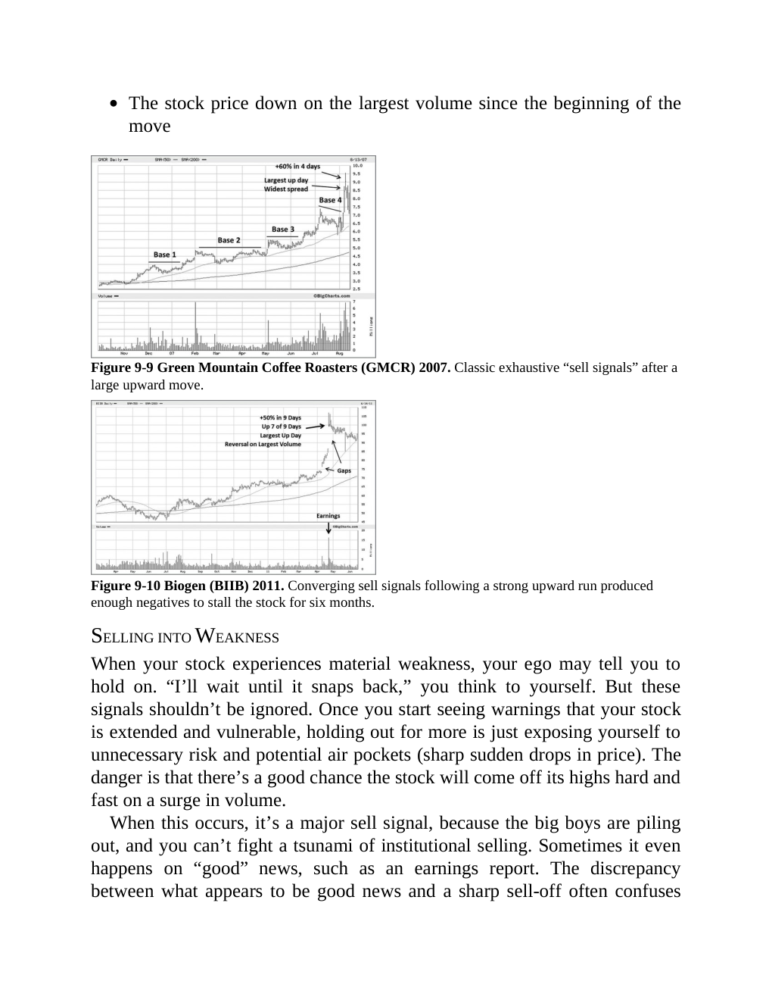
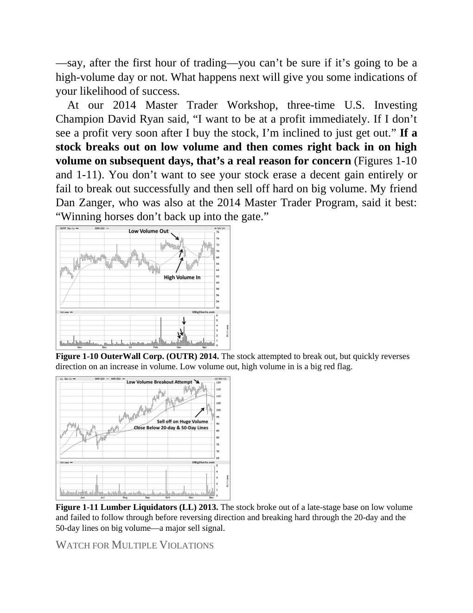
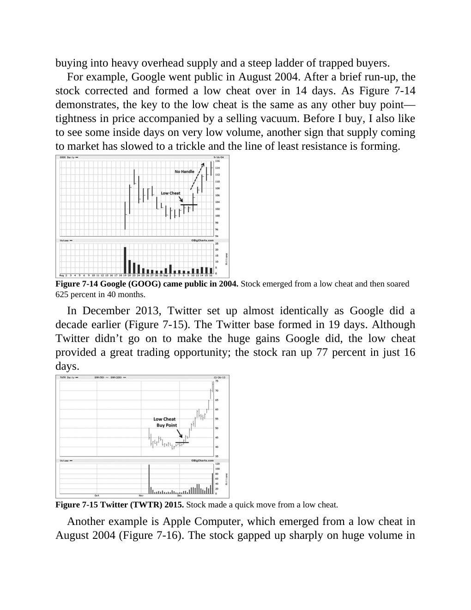
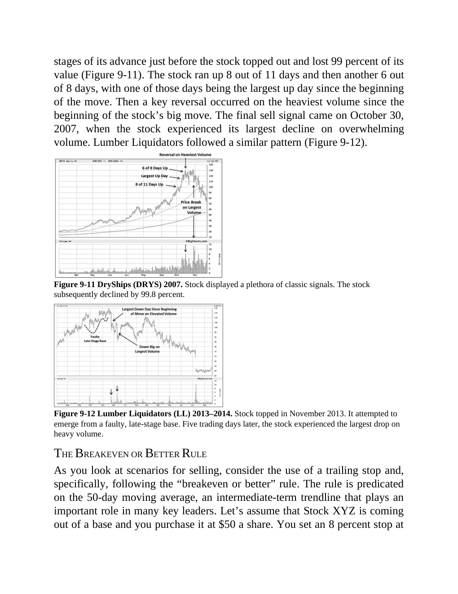
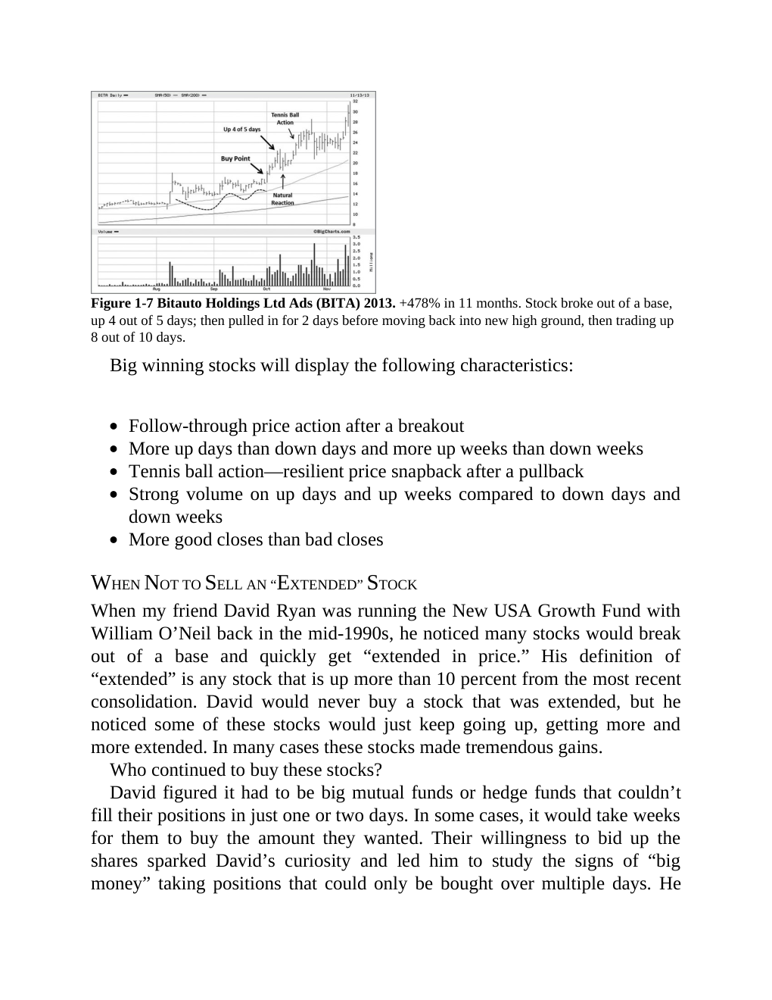
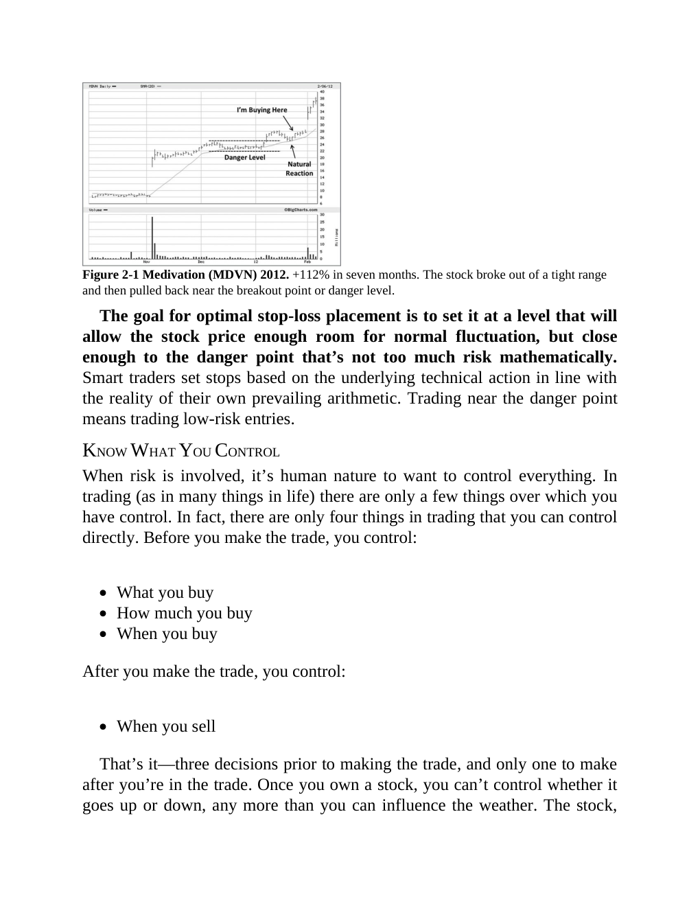
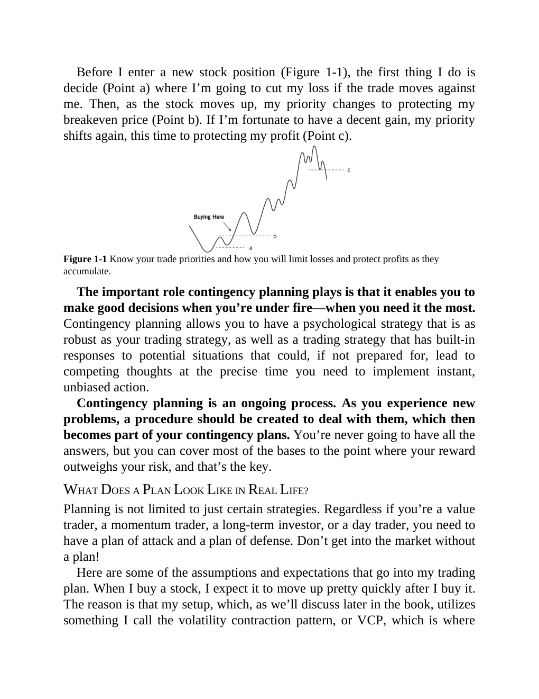

# Think and Trade Like a Champion

This note is built only from the local PDF named in `source_pdf`. It is for private study inside this vault.

## Concept Map

| Concept | Candidate Source Pages |
|---|---|
| [[Trend Template]] | 105, 104, 107, 120, 108, 122, 133, 138 |
| [[Stage 2 Uptrend]] | 103, 105, 104, 109, 120, 124, 132, 102 |
| [[Relative Strength Leadership]] | 124, 192, 14, 170, 122, 123, 131, 181 |
| [[Volatility Contraction Pattern]] | 110, 109, 116, 212, 211, 111, 170, 200 |
| [[Pivot and Entry]] | 116, 117, 39, 132, 205, 114, 26, 29 |
| [[Volume Dry-Up and Accumulation]] | 36, 37, 117, 161, 29, 38, 111, 137 |
| [[Risk First]] | 143, 26, 45, 43, 60, 164, 52, 59 |
| [[Sell Rules and Failure Signals]] | 149, 175, 75, 27, 76, 148, 150, 165 |
| [[Mental Discipline]] | 101, 180, 40, 44, 78, 99, 149, 187 |

## Chapter Study Notes

| Chapter | Pages |
|---|---:|
| [[Think and Trade Like a Champion - Introduction - First Steps to Thinking and Trading Like a Champion]] | 6-21 |
| [[Think and Trade Like a Champion - Section 1 - Always Go in with a Plan]] | 22-41 |
| [[Think and Trade Like a Champion - Section 2 - Approach Every Trade Risk-First]] | 42-51 |
| [[Think and Trade Like a Champion - Section 3 - Never Risk More Than You Expect to Gain]] | 52-64 |
| [[Think and Trade Like a Champion - Section 4 - Know the Truth About Your Trading]] | 65-81 |
| [[Think and Trade Like a Champion - Section 5 - Compound Money, Not Mistakes]] | 82-101 |
| [[Think and Trade Like a Champion - Section 6 - How and When to Buy Stocks - Part 1]] | 102-118 |
| [[Think and Trade Like a Champion - Section 7 - How and When to Buy Stocks - Part 2]] | 119-141 |
| [[Think and Trade Like a Champion - Section 8 - Position Sizing for Optimal Results]] | 142-147 |
| [[Think and Trade Like a Champion - Section 9 - When to Sell and Nail Down Profits]] | 148-167 |
| [[Think and Trade Like a Champion - Section 10 - Eight Keys to Unlocking Superperformance]] | 168-179 |
| [[Think and Trade Like a Champion - Section 11 - The Champion Trader Mindset]] | 180-217 |

## Image-Heavy Page Index

Use these page images as private visual anchors, then recreate the lesson with your own market charts in [[Market Example Index]].

| Page | Embedded Images | Vector Drawings | Private Page Image |
|---:|---:|---:|---|
| 31 | 3 | 0 |  |
| 154 | 3 | 0 |  |
| 160 | 2 | 1 |  |
| 37 | 2 | 0 |  |
| 39 | 2 | 0 |  |
| 60 | 2 | 0 |  |
| 92 | 2 | 0 |  |
| 135 | 2 | 0 |  |
| 136 | 2 | 0 |  |
| 139 | 2 | 0 |  |
| 157 | 2 | 0 |  |
| 162 | 2 | 0 |  |
| 166 | 2 | 0 |  |
| 33 | 1 | 5 |  |
| 48 | 1 | 4 |  |
| 34 | 1 | 3 |  |
| 70 | 1 | 3 |  |
| 158 | 1 | 2 |  |
| 56 | 1 | 1 |  |
| 1 | 1 | 0 |  |
| 3 | 1 | 0 |  |
| 28 | 1 | 0 |  |
| 29 | 1 | 0 |  |
| 32 | 1 | 0 |  |
| 36 | 1 | 0 |  |
| 61 | 1 | 0 |  |
| 62 | 1 | 0 |  |
| 71 | 1 | 0 |  |
| 73 | 1 | 0 |  |
| 77 | 1 | 0 |  |

## Study Rule

Do not stop at the page image. For every important book visual, add one Indian-market example, one borderline example, and one failed example.
