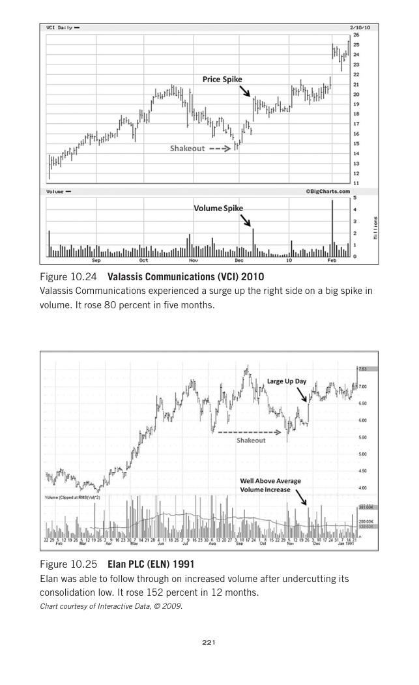
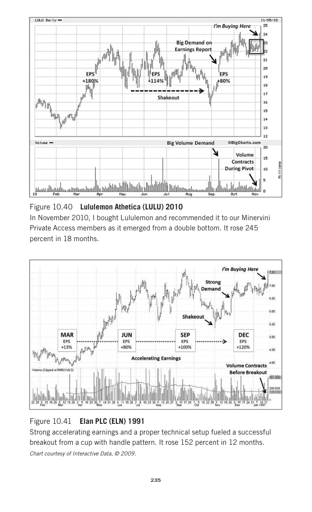
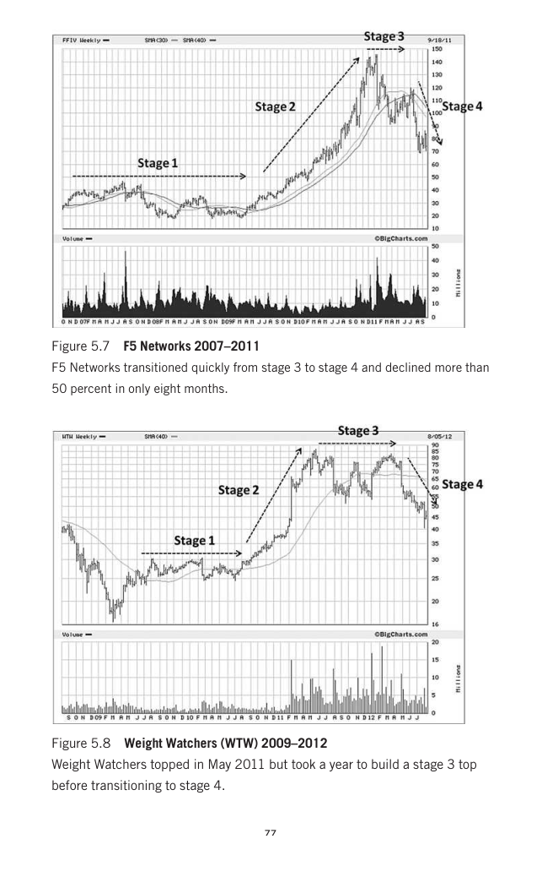
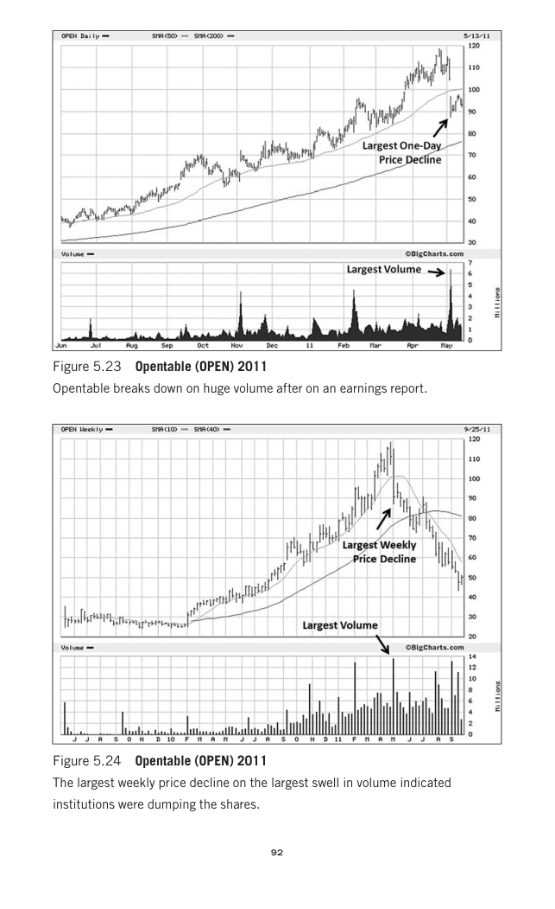
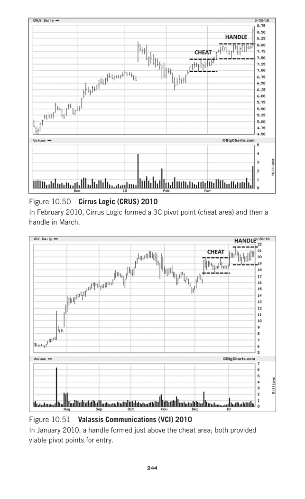

# Trade Like a Stock Market Wizard

This note is built only from the local PDF named in `source_pdf`. It is for private study inside this vault.

## Concept Map

| Concept | Candidate Source Pages |
|---|---|
| [[Trend Template]] | 94, 83, 84, 89, 49, 87, 86, 90 |
| [[Stage 2 Uptrend]] | 95, 83, 81, 94, 211, 85, 86, 96 |
| [[Relative Strength Leadership]] | 199, 177, 72, 200, 125, 20, 111, 198 |
| [[Volatility Contraction Pattern]] | 213, 345, 214, 216, 218, 215, 220, 233 |
| [[Pivot and Entry]] | 244, 238, 218, 239, 242, 245, 253, 264 |
| [[Volume Dry-Up and Accumulation]] | 232, 218, 87, 241, 244, 83, 234, 85 |
| [[Risk First]] | 310, 323, 317, 293, 314, 316, 311, 315 |
| [[Sell Rules and Failure Signals]] | 311, 265, 316, 31, 225, 317, 58, 135 |

## Chapter Study Notes

| Chapter | Pages |
|---|---:|
| [[Trade Like a Stock Market Wizard - Chapter 1 An Introduction Worth Reading]] | 16-25 |
| [[Trade Like a Stock Market Wizard - Chapter 2 What You Need to Know First]] | 26-41 |
| [[Trade Like a Stock Market Wizard - Chapter 3 Specific Entry Point Analysis - The SEPA Strategy]] | 42-55 |
| [[Trade Like a Stock Market Wizard - Chapter 4 Value Comes at a Price]] | 56-77 |
| [[Trade Like a Stock Market Wizard - Chapter 5 Trading With the Trend]] | 78-109 |
| [[Trade Like a Stock Market Wizard - Chapter 6 Categories, Industry Groups, and Catalysts]] | 110-131 |
| [[Trade Like a Stock Market Wizard - Chapter 7 Fundamentals to Focus on]] | 132-155 |
| [[Trade Like a Stock Market Wizard - Chapter 8 Assessing Earnings Quality]] | 156-175 |
| [[Trade Like a Stock Market Wizard - Chapter 9 Follow the Leaders]] | 176-203 |
| [[Trade Like a Stock Market Wizard - Chapter 10 A Picture is Worth a Million Dollars]] | 204-273 |
| [[Trade Like a Stock Market Wizard - Chapter 11 Don’t Just Buy What you Know]] | 274-283 |
| [[Trade Like a Stock Market Wizard - Chapter 12 Risk Management Part 1 - The Nature of Risk]] | 284-305 |
| [[Trade Like a Stock Market Wizard - Chapter 13 Risk Management Part 2 - How to Deal With and Control Risk]] | 306-331 |

## Image-Heavy Page Index

Use these page images as private visual anchors, then recreate the lesson with your own market charts in [[Market Example Index]].

| Page | Embedded Images | Vector Drawings | Private Page Image |
|---:|---:|---:|---|
| 63 | 2 | 20 |  |
| 224 | 2 | 20 |  |
| 236 | 2 | 20 |  |
| 240 | 2 | 20 |  |
| 246 | 2 | 20 |  |
| 250 | 2 | 20 |  |
| 256 | 2 | 20 |  |
| 266 | 2 | 20 |  |
| 280 | 2 | 20 |  |
| 92 | 2 | 18 |  |
| 93 | 2 | 18 |  |
| 97 | 2 | 18 |  |
| 107 | 2 | 18 |  |
| 161 | 2 | 18 |  |
| 235 | 2 | 18 |  |
| 243 | 2 | 18 |  |
| 259 | 2 | 18 |  |
| 267 | 2 | 18 |  |
| 103 | 2 | 17 |  |
| 353 | 2 | 17 |  |
| 215 | 1 | 24 |  |
| 228 | 1 | 20 |  |
| 57 | 1 | 19 |  |
| 60 | 1 | 19 |  |
| 61 | 1 | 19 |  |
| 62 | 1 | 19 |  |
| 65 | 1 | 19 |  |
| 66 | 1 | 19 |  |
| 70 | 1 | 19 |  |
| 73 | 1 | 19 |  |

## Study Rule

Do not stop at the page image. For every important book visual, add one Indian-market example, one borderline example, and one failed example.
